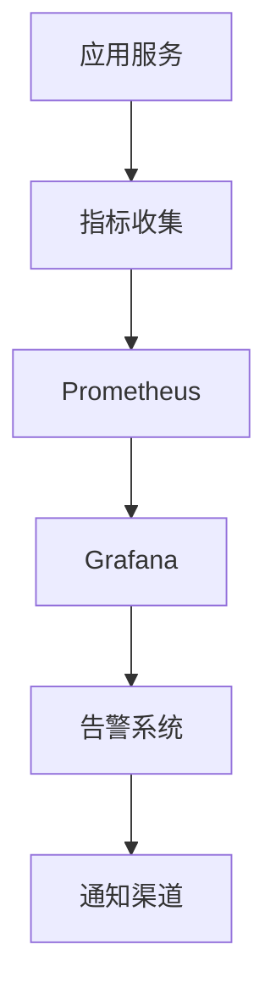
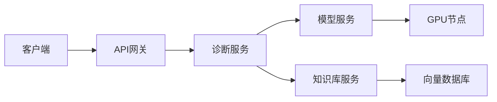

# 9. 监控与可观测

## 9.1 业务指标

### 核心业务指标

智能医疗系统的核心业务指标用于评估诊断质量和业务效果：

#### 诊断质量指标

**1. 诊断准确率（Diagnosis Accuracy）**
- **定义**：AI诊断结果与医生诊断一致的比例
- **计算公式**：准确率 = (正确诊断数 / 总诊断数) × 100%
- **目标值**：≥95%
- **监控频率**：实时监控，每小时统计

**2. 早期病变检出率（Early Lesion Detection Rate）**
- **定义**：AI检出早期病变的比例
- **计算公式**：检出率 = (检出早期病变数 / 实际早期病变数) × 100%
- **目标值**：≥90%
- **监控频率**：每天统计

**3. 诊断一致性（Diagnosis Consistency）**
- **定义**：不同医生对AI诊断结果的一致性
- **计算公式**：一致性 = (一致诊断数 / 总诊断数) × 100%
- **目标值**：≥90%
- **监控频率**：每周统计

**4. 漏诊率（Missed Diagnosis Rate）**
- **定义**：AI未检出但实际存在的病变比例
- **计算公式**：漏诊率 = (漏诊数 / 实际病变数) × 100%
- **目标值**：≤2%
- **监控频率**：每天统计

#### 效率指标

**5. 平均诊断时间（Average Diagnosis Time）**
- **定义**：从影像上传到诊断报告生成的平均时间
- **计算公式**：平均时间 = 总诊断时间 / 诊断数
- **目标值**：≤30秒/张
- **监控频率**：实时监控，每分钟统计

**6. 报告出具时间（Report Generation Time）**
- **定义**：从诊断完成到报告出具的时间
- **计算公式**：平均时间 = 总报告时间 / 报告数
- **目标值**：≤4小时
- **监控频率**：实时监控，每小时统计

**7. 系统吞吐量（System Throughput）**
- **定义**：系统每秒处理的诊断数量
- **计算公式**：吞吐量 = 诊断数 / 时间（秒）
- **目标值**：≥10诊断/秒
- **监控频率**：实时监控

### 指标监控

#### 监控架构



#### 监控实现

**Prometheus配置**：
```yaml
global:
  scrape_interval: 15s
  evaluation_interval: 15s

scrape_configs:
  - job_name: 'medical-ai-service'
    static_configs:
      - targets: ['localhost:8000']
    metrics_path: '/metrics'
```

**指标收集代码**：
```python
from prometheus_client import Counter, Histogram, Gauge
import time

# 定义指标
diagnosis_accuracy = Gauge('diagnosis_accuracy', 'Diagnosis accuracy rate')
diagnosis_time = Histogram('diagnosis_time_seconds', 'Diagnosis time in seconds')
diagnosis_total = Counter('diagnosis_total', 'Total number of diagnoses', ['status'])
early_detection_rate = Gauge('early_detection_rate', 'Early lesion detection rate')

# 记录指标
def handle_diagnosis(image_path: str):
    start_time = time.time()
    
    # 执行诊断
    result = diagnose_image(image_path)
    
    # 记录诊断时间
    diagnosis_time.observe(time.time() - start_time)
    
    # 记录诊断总数
    diagnosis_total.labels(status=result['status']).inc()
    
    # 更新准确率
    if result['verified']:
        accuracy = calculate_accuracy(result)
        diagnosis_accuracy.set(accuracy)
    
    # 更新早期检出率
    if result['early_lesion']:
        detection_rate = calculate_detection_rate()
        early_detection_rate.set(detection_rate)
```

## 9.2 模型指标

### 模型性能指标

#### 分类模型指标

**1. 准确率（Accuracy）**
- **定义**：分类正确的比例
- **计算公式**：准确率 = (TP + TN) / (TP + TN + FP + FN)
- **目标值**：≥95%

**2. 精确率（Precision）**
- **定义**：预测为正例中真正例的比例
- **计算公式**：精确率 = TP / (TP + FP)
- **目标值**：≥90%

**3. 召回率（Recall）**
- **定义**：真正例中被正确预测的比例
- **计算公式**：召回率 = TP / (TP + FN)
- **目标值**：≥90%

**4. F1分数（F1 Score）**
- **定义**：精确率和召回率的调和平均
- **计算公式**：F1 = 2 × (精确率 × 召回率) / (精确率 + 召回率)
- **目标值**：≥90%

**5. AUC-ROC**
- **定义**：ROC曲线下面积
- **目标值**：≥0.95

#### 分割模型指标

**1. Dice系数（Dice Coefficient）**
- **定义**：分割重叠度
- **计算公式**：Dice = 2 × |A ∩ B| / (|A| + |B|)
- **目标值**：≥0.85

**2. IoU（Intersection over Union）**
- **定义**：交并比
- **计算公式**：IoU = |A ∩ B| / |A ∪ B|
- **目标值**：≥0.80

### 模型监控

#### 模型性能监控

**监控内容**：
- 模型准确率趋势
- 模型响应时间
- 模型资源使用情况
- 模型错误率

**实现示例**：
```python
class ModelMonitor:
    """模型监控器"""
    
    def __init__(self):
        self.metrics = {
            'accuracy_history': [],
            'response_time_history': [],
            'error_rate_history': []
        }
    
    def record_prediction(self, model_name: str, prediction: dict, 
                         ground_truth: dict, response_time: float):
        """记录预测结果"""
        # 计算准确率
        accuracy = self.calculate_accuracy(prediction, ground_truth)
        self.metrics['accuracy_history'].append({
            'model': model_name,
            'accuracy': accuracy,
            'timestamp': datetime.now()
        })
        
        # 记录响应时间
        self.metrics['response_time_history'].append({
            'model': model_name,
            'response_time': response_time,
            'timestamp': datetime.now()
        })
        
        # 检查性能下降
        if self.detect_performance_degradation(model_name):
            self.alert_performance_degradation(model_name)
    
    def detect_performance_degradation(self, model_name: str) -> bool:
        """检测性能下降"""
        # 获取最近100个预测的准确率
        recent_accuracies = [
            m['accuracy'] for m in self.metrics['accuracy_history'][-100:]
            if m['model'] == model_name
        ]
        
        if len(recent_accuracies) < 50:
            return False
        
        # 计算平均准确率
        recent_avg = sum(recent_accuracies) / len(recent_accuracies)
        
        # 与基线对比
        baseline_avg = 0.95  # 基线准确率
        
        # 如果下降超过5%，认为性能下降
        if recent_avg < baseline_avg * 0.95:
            return True
        
        return False
```

### 模型退化检测

#### 退化检测方法

**1. 准确率监控**
- 监控模型准确率趋势
- 检测准确率下降

**2. 分布偏移检测**
- 检测输入数据分布变化
- 检测模型输出分布变化

**3. 异常检测**
- 检测异常预测结果
- 检测异常响应时间

**实现示例**：
```python
class ModelDegradationDetector:
    """模型退化检测器"""
    
    def detect_distribution_shift(self, model_name: str, 
                                 current_data: np.ndarray) -> bool:
        """检测分布偏移"""
        # 获取历史数据分布
        historical_distribution = self.get_historical_distribution(model_name)
        
        # 计算当前数据分布
        current_distribution = self.calculate_distribution(current_data)
        
        # 使用KL散度检测分布偏移
        kl_divergence = self.calculate_kl_divergence(
            historical_distribution,
            current_distribution
        )
        
        # 如果KL散度超过阈值，认为发生分布偏移
        threshold = 0.1
        return kl_divergence > threshold
    
    def detect_anomalies(self, model_name: str, predictions: List[dict]) -> List[dict]:
        """检测异常预测"""
        anomalies = []
        
        for pred in predictions:
            # 检查置信度异常
            if pred['confidence'] < 0.5:
                anomalies.append({
                    'type': 'low_confidence',
                    'prediction': pred
                })
            
            # 检查响应时间异常
            if pred['response_time'] > 10.0:  # 10秒
                anomalies.append({
                    'type': 'slow_response',
                    'prediction': pred
                })
        
        return anomalies
```

## 9.3 链路追踪

### 追踪系统

#### 分布式追踪架构



#### 追踪实现

**OpenTelemetry配置**：
```python
from opentelemetry import trace
from opentelemetry.exporter.jaeger import JaegerExporter
from opentelemetry.sdk.trace import TracerProvider
from opentelemetry.sdk.trace.export import BatchSpanProcessor

# 配置追踪
trace.set_tracer_provider(TracerProvider())
tracer = trace.get_tracer(__name__)

# 配置Jaeger导出器
jaeger_exporter = JaegerExporter(
    agent_host_name="jaeger",
    agent_port=6831,
)

# 添加处理器
span_processor = BatchSpanProcessor(jaeger_exporter)
trace.get_tracer_provider().add_span_processor(span_processor)

# 使用追踪
@tracer.start_as_current_span("diagnose_image")
def diagnose_image(image_path: str):
    with tracer.start_as_current_span("preprocess_image"):
        preprocessed = preprocess_image(image_path)
    
    with tracer.start_as_current_span("model_inference"):
        result = model.predict(preprocessed)
    
    with tracer.start_as_current_span("postprocess_result"):
        final_result = postprocess_result(result)
    
    return final_result
```

### 日志管理

#### 日志架构

**日志级别**：
- **DEBUG**：详细调试信息
- **INFO**：一般信息
- **WARNING**：警告信息
- **ERROR**：错误信息
- **CRITICAL**：严重错误

**日志格式**：
```json
{
    "timestamp": "2024-01-01T10:00:00Z",
    "level": "INFO",
    "service": "medical-ai-service",
    "trace_id": "abc123",
    "span_id": "def456",
    "message": "Diagnosis completed",
    "metadata": {
        "diagnosis_id": "D123456",
        "patient_id": "P789012",
        "duration": 2.5
    }
}
```

#### 日志收集

**ELK Stack配置**：
```yaml
# filebeat.yml
filebeat.inputs:
- type: log
  paths:
    - /var/log/medical-ai/*.log
  json.keys_under_root: true
  json.add_error_key: true

output.elasticsearch:
  hosts: ["elasticsearch:9200"]
```

### 问题定位

#### 问题定位流程

**1. 告警触发**
- 系统异常告警
- 性能下降告警
- 错误率上升告警

**2. 日志查询**
- 根据时间范围查询日志
- 根据Trace ID查询完整链路
- 根据错误类型筛选

**3. 根因分析**
- 分析错误堆栈
- 分析性能瓶颈
- 分析依赖服务状态

**实现示例**：
```python
class ProblemLocator:
    """问题定位器"""
    
    def locate_problem(self, error_id: str) -> Dict:
        """定位问题"""
        # 1. 获取错误信息
        error_info = self.get_error_info(error_id)
        
        # 2. 获取Trace信息
        trace_id = error_info['trace_id']
        trace = self.get_trace(trace_id)
        
        # 3. 分析问题根因
        root_cause = self.analyze_root_cause(trace, error_info)
        
        return {
            'error_id': error_id,
            'error_info': error_info,
            'trace': trace,
            'root_cause': root_cause,
            'suggested_fix': self.suggest_fix(root_cause)
        }
    
    def analyze_root_cause(self, trace: Dict, error_info: Dict) -> str:
        """分析根因"""
        # 分析Trace中的异常
        spans = trace.get('spans', [])
        
        for span in spans:
            if span.get('status') == 'error':
                # 检查是否是依赖服务问题
                if self.is_dependency_error(span):
                    return f"Dependency service error: {span['service']}"
                
                # 检查是否是资源问题
                if self.is_resource_error(span):
                    return f"Resource error: {span['error']}"
        
        return "Unknown root cause"
```
