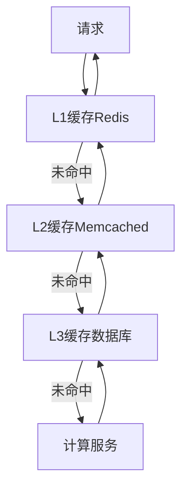

# 8. 性能与成本

## 8.1 弹性伸缩

### 伸缩策略

智能医疗系统需要根据负载自动伸缩，确保服务稳定和成本优化：

#### 水平伸缩（Horizontal Scaling）

**自动伸缩规则**：
- **GPU使用率**：&gt;80%时扩容，&lt;30%时缩容
- **请求队列长度**：&gt;50时扩容，&lt;5时缩容
- **响应时间**：P95&gt;5秒时扩容
- **错误率**：&gt;1%时扩容

**Kubernetes HPA配置**：
```yaml
apiVersion: autoscaling/v2
kind: HorizontalPodAutoscaler
metadata:
  name: medical-ai-hpa
spec:
  scaleTargetRef:
    apiVersion: apps/v1
    kind: Deployment
    name: medical-ai-service
  minReplicas: 2
  maxReplicas: 20
  metrics:
  - type: Resource
    resource:
      name: nvidia.com/gpu
      target:
        type: Utilization
        averageUtilization: 80
  - type: Pods
    pods:
      metric:
        name: request_queue_length
      target:
        type: AverageValue
        averageValue: "10"
  behavior:
    scaleDown:
      stabilizationWindowSeconds: 300
      policies:
      - type: Percent
        value: 50
        periodSeconds: 60
    scaleUp:
      stabilizationWindowSeconds: 0
      policies:
      - type: Percent
        value: 100
        periodSeconds: 15
      - type: Pods
        value: 2
        periodSeconds: 15
      selectPolicy: Max
```

#### 垂直伸缩（Vertical Scaling）

**资源调整规则**：
- 根据历史负载预测资源需求
- 在业务高峰期前提前扩容
- 在业务低峰期自动缩容

**VPA配置**：
```yaml
apiVersion: autoscaling.k8s.io/v1
kind: VerticalPodAutoscaler
metadata:
  name: medical-ai-vpa
spec:
  targetRef:
    apiVersion: apps/v1
    kind: Deployment
    name: medical-ai-service
  updatePolicy:
    updateMode: "Auto"
  resourcePolicy:
    containerPolicies:
    - containerName: medical-ai-service
      minAllowed:
        cpu: 2
        memory: 8Gi
        nvidia.com/gpu: 1
      maxAllowed:
        cpu: 16
        memory: 64Gi
        nvidia.com/gpu: 4
```

### 资源调度

#### 调度策略

**节点选择**：
- GPU节点：用于AI模型推理（A100、V100等）
- CPU节点：用于业务逻辑处理
- 内存优化节点：用于缓存和数据库

**优先级调度**：
- 急诊请求：最高优先级
- 普通门诊：中等优先级
- 批量处理：低优先级

**实现示例**：
```python
from kubernetes import client, config

class ResourceScheduler:
    """资源调度器"""
    
    def __init__(self):
        config.load_incluster_config()
        self.v1 = client.CoreV1Api()
        self.scheduler = client.SchedulingV1Api()
    
    def schedule_pod(self, pod_spec: dict, priority: str = "normal"):
        """调度Pod"""
        # 设置优先级
        priority_class = self.get_priority_class(priority)
        
        # 设置节点选择器
        node_selector = self.get_node_selector(pod_spec)
        
        # 设置资源请求
        resources = self.calculate_resources(pod_spec)
        
        pod = client.V1Pod(
            metadata=client.V1ObjectMeta(name=pod_spec['name']),
            spec=client.V1PodSpec(
                priority_class_name=priority_class,
                node_selector=node_selector,
                containers=[client.V1Container(
                    name=pod_spec['name'],
                    resources=resources
                )]
            )
        )
        
        return pod
    
    def get_priority_class(self, priority: str) -> str:
        """获取优先级类"""
        priority_map = {
            'emergency': 'emergency-priority',
            'normal': 'normal-priority',
            'batch': 'batch-priority'
        }
        return priority_map.get(priority, 'normal-priority')
    
    def get_node_selector(self, pod_spec: dict) -> dict:
        """获取节点选择器"""
        if pod_spec.get('requires_gpu'):
            return {'accelerator': 'nvidia-gpu'}
        elif pod_spec.get('memory_intensive'):
            return {'node-type': 'memory-optimized'}
        else:
            return {'node-type': 'compute-optimized'}
```

### 成本优化

#### 成本优化策略

**1. 使用Spot实例**
- 对于非关键任务，使用Spot实例降低成本
- 成本可降低60-90%

**2. 模型量化**
- 使用INT8量化减少模型大小
- 降低GPU内存使用，支持更多并发

**3. 模型蒸馏**
- 使用小模型替代大模型
- 在准确率和成本之间平衡

**4. 缓存策略**
- 缓存常见诊断结果
- 减少重复计算

**实现示例**：
```python
class CostOptimizer:
    """成本优化器"""
    
    def optimize_model(self, model, target_accuracy: float = 0.90):
        """优化模型成本"""
        # 1. 模型量化
        quantized_model = self.quantize_model(model)
        
        # 2. 模型蒸馏
        if quantized_model.accuracy < target_accuracy:
            distilled_model = self.distill_model(model, target_accuracy)
            return distilled_model
        
        return quantized_model
    
    def quantize_model(self, model):
        """量化模型"""
        import torch.quantization as quantization
        
        model.eval()
        model.qconfig = quantization.get_default_qconfig('fbgemm')
        quantized_model = quantization.prepare(model)
        quantized_model = quantization.convert(quantized_model)
        
        return quantized_model
    
    def use_spot_instances(self, task_type: str) -> bool:
        """判断是否使用Spot实例"""
        # 非关键任务使用Spot实例
        non_critical_tasks = ['batch_processing', 'model_training']
        return task_type in non_critical_tasks
```

## 8.2 缓存策略

### 缓存设计

#### 多级缓存架构



#### 缓存策略

**1. 诊断结果缓存**
- 缓存相同影像的诊断结果
- TTL：7天
- 键：影像哈希值

**2. 知识库缓存**
- 缓存常用知识检索结果
- TTL：1天
- 键：查询文本哈希值

**3. 模型输出缓存**
- 缓存模型推理结果
- TTL：根据数据更新频率动态调整

**实现示例**：
```python
import redis
import hashlib
import json
from typing import Optional, Any
from datetime import timedelta

class MedicalCache:
    """医疗系统缓存"""
    
    def __init__(self, redis_client: redis.Redis):
        self.redis = redis_client
    
    def cache_diagnosis_result(self, image_hash: str, result: dict, ttl: int = 604800):
        """缓存诊断结果"""
        key = f"diagnosis:{image_hash}"
        self.redis.setex(
            key,
            ttl,
            json.dumps(result, ensure_ascii=False, default=str)
        )
    
    def get_diagnosis_result(self, image_hash: str) -> Optional[dict]:
        """获取诊断结果"""
        key = f"diagnosis:{image_hash}"
        data = self.redis.get(key)
        if data:
            return json.loads(data)
        return None
    
    def cache_knowledge_result(self, query: str, result: list, ttl: int = 86400):
        """缓存知识检索结果"""
        query_hash = hashlib.md5(query.encode()).hexdigest()
        key = f"knowledge:{query_hash}"
        self.redis.setex(
            key,
            ttl,
            json.dumps(result, ensure_ascii=False, default=str)
        )
    
    def get_knowledge_result(self, query: str) -> Optional[list]:
        """获取知识检索结果"""
        query_hash = hashlib.md5(query.encode()).hexdigest()
        key = f"knowledge:{query_hash}"
        data = self.redis.get(key)
        if data:
            return json.loads(data)
        return None
```

### 缓存更新

#### 缓存失效策略

**1. 时间过期（TTL）**
- 设置合理的过期时间
- 根据数据更新频率调整

**2. 主动失效**
- 数据更新时主动清除缓存
- 使用消息队列通知缓存更新

**3. 版本控制**
- 使用版本号控制缓存
- 版本更新时清除旧缓存

**实现示例**：
```python
class CacheInvalidation:
    """缓存失效管理"""
    
    def __init__(self, cache: MedicalCache, message_queue):
        self.cache = cache
        self.queue = message_queue
    
    def invalidate_on_update(self, data_type: str, data_id: str):
        """数据更新时失效缓存"""
        # 清除相关缓存
        if data_type == "diagnosis":
            self.cache.redis.delete(f"diagnosis:{data_id}")
        elif data_type == "knowledge":
            # 清除所有知识缓存（或使用更精确的键）
            pattern = "knowledge:*"
            for key in self.cache.redis.scan_iter(match=pattern):
                self.cache.redis.delete(key)
        
        # 通知其他节点
        self.queue.publish("cache_invalidation", {
            "data_type": data_type,
            "data_id": data_id
        })
```

### 缓存命中率优化

#### 优化策略

**1. 预热缓存**
- 系统启动时预加载常用数据
- 定期预热热点数据

**2. 缓存分层**
- L1：热点数据，内存缓存
- L2：常用数据，Redis缓存
- L3：冷数据，数据库

**3. 智能预取**
- 基于用户行为预测
- 提前加载可能访问的数据

**实现示例**：
```python
class CacheOptimizer:
    """缓存优化器"""
    
    def warm_up_cache(self, hot_data: list):
        """预热缓存"""
        for data in hot_data:
            if data['type'] == 'diagnosis':
                self.cache.cache_diagnosis_result(
                    data['image_hash'],
                    data['result']
                )
            elif data['type'] == 'knowledge':
                self.cache.cache_knowledge_result(
                    data['query'],
                    data['result']
                )
    
    def predict_and_prefetch(self, user_id: str, current_context: dict):
        """预测并预取"""
        # 基于用户历史行为预测
        predicted_queries = self.predict_user_queries(user_id, current_context)
        
        # 预取数据
        for query in predicted_queries:
            if not self.cache.get_knowledge_result(query):
                result = self.fetch_knowledge(query)
                self.cache.cache_knowledge_result(query, result)
```

## 8.3 成本仪表盘

### 成本监控

#### 成本指标

**1. 基础设施成本**
- GPU实例成本
- CPU实例成本
- 存储成本
- 网络成本

**2. 模型推理成本**
- API调用成本
- 模型推理时间成本
- 数据存储成本

**3. 人力成本**
- 开发成本
- 运维成本
- 审核成本

**实现示例**：
```python
from datetime import datetime, timedelta
from typing import Dict, List

class CostMonitor:
    """成本监控"""
    
    def __init__(self, db_client):
        self.db = db_client
    
    def calculate_daily_cost(self, date: datetime) -> Dict:
        """计算每日成本"""
        # 基础设施成本
        infra_cost = self.calculate_infrastructure_cost(date)
        
        # 模型推理成本
        inference_cost = self.calculate_inference_cost(date)
        
        # 存储成本
        storage_cost = self.calculate_storage_cost(date)
        
        total_cost = infra_cost + inference_cost + storage_cost
        
        return {
            'date': date.isoformat(),
            'infrastructure_cost': infra_cost,
            'inference_cost': inference_cost,
            'storage_cost': storage_cost,
            'total_cost': total_cost
        }
    
    def calculate_infrastructure_cost(self, date: datetime) -> float:
        """计算基础设施成本"""
        # 查询GPU实例使用情况
        gpu_instances = self.db.get_gpu_instances(date)
        
        cost = 0
        for instance in gpu_instances:
            hours = instance['usage_hours']
            hourly_rate = instance['hourly_rate']
            cost += hours * hourly_rate
        
        return cost
    
    def calculate_inference_cost(self, date: datetime) -> float:
        """计算推理成本"""
        # 查询API调用情况
        api_calls = self.db.get_api_calls(date)
        
        cost = 0
        for call in api_calls:
            model = call['model']
            tokens = call['tokens']
            cost_per_token = self.get_model_cost_per_token(model)
            cost += tokens * cost_per_token
        
        return cost
```

### 成本分析

#### 成本分析维度

**1. 按服务分析**
- 影像诊断服务成本
- 病历分析服务成本
- 知识检索服务成本

**2. 按模型分析**
- 不同模型的推理成本
- 模型使用效率

**3. 按时间分析**
- 每日成本趋势
- 月度成本对比
- 年度成本预测

**实现示例**：
```python
class CostAnalyzer:
    """成本分析器"""
    
    def analyze_by_service(self, start_date: datetime, end_date: datetime) -> Dict:
        """按服务分析成本"""
        services = ['image_diagnosis', 'record_analysis', 'knowledge_retrieval']
        analysis = {}
        
        for service in services:
            cost = self.calculate_service_cost(service, start_date, end_date)
            calls = self.count_service_calls(service, start_date, end_date)
            
            analysis[service] = {
                'total_cost': cost,
                'total_calls': calls,
                'avg_cost_per_call': cost / calls if calls > 0 else 0
            }
        
        return analysis
    
    def analyze_by_model(self, start_date: datetime, end_date: datetime) -> Dict:
        """按模型分析成本"""
        models = ['resnet50', 'unet', 'vit', 'gpt-4']
        analysis = {}
        
        for model in models:
            cost = self.calculate_model_cost(model, start_date, end_date)
            usage_hours = self.calculate_model_usage_hours(model, start_date, end_date)
            
            analysis[model] = {
                'total_cost': cost,
                'usage_hours': usage_hours,
                'cost_per_hour': cost / usage_hours if usage_hours > 0 else 0
            }
        
        return analysis
```

### 成本优化建议

#### 优化建议生成

**1. 资源优化建议**
- 识别未充分利用的资源
- 建议缩容或下线

**2. 模型优化建议**
- 识别高成本低效率的模型
- 建议替换为更经济的模型

**3. 缓存优化建议**
- 识别缓存命中率低的数据
- 建议调整缓存策略

**实现示例**：
```python
class CostOptimizationAdvisor:
    """成本优化建议器"""
    
    def generate_recommendations(self) -> List[Dict]:
        """生成优化建议"""
        recommendations = []
        
        # 1. 资源优化建议
        resource_recs = self.analyze_resource_usage()
        recommendations.extend(resource_recs)
        
        # 2. 模型优化建议
        model_recs = self.analyze_model_efficiency()
        recommendations.extend(model_recs)
        
        # 3. 缓存优化建议
        cache_recs = self.analyze_cache_efficiency()
        recommendations.extend(cache_recs)
        
        return recommendations
    
    def analyze_resource_usage(self) -> List[Dict]:
        """分析资源使用情况"""
        recommendations = []
        
        # 查询低利用率资源
        low_utilization_resources = self.db.get_low_utilization_resources()
        
        for resource in low_utilization_resources:
            if resource['utilization'] < 0.3:
                recommendations.append({
                    'type': 'resource_optimization',
                    'resource_id': resource['id'],
                    'current_utilization': resource['utilization'],
                    'recommendation': '考虑缩容或下线',
                    'estimated_savings': resource['monthly_cost'] * 0.5
                })
        
        return recommendations
```
