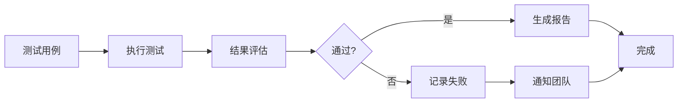

# 7. 质量与测试

## 7.1 提示词单元测试

### 测试框架

医疗AI系统的提示词测试是确保诊断准确性的关键环节：

#### 测试框架选择

**LangChain Evaluators**：
- LangChain提供的评估框架
- 支持医疗场景的评估指标
- 易于集成到现有系统

**自定义医疗测试框架**：
- 基于医疗领域特点定制
- 支持医疗专业评估标准
- 完全可控

#### 测试框架实现

**医疗诊断测试框架**：
```python
import unittest
from typing import List, Dict
import json

class MedicalPromptTestCase(unittest.TestCase):
    """医疗Prompt测试用例"""
    
    def setUp(self):
        self.test_cases = [
            {
                "id": "test_001",
                "category": "image_diagnosis",
                "input": {
                    "image_path": "test_data/ct_lung_nodule.dcm",
                    "modality": "CT",
                    "clinical_history": "患者，男，55岁，体检发现肺部结节"
                },
                "expected_output": {
                    "findings": ["右肺上叶结节"],
                    "diagnosis": "右肺上叶结节，建议进一步检查",
                    "confidence": 0.9
                },
                "min_accuracy": 0.85
            },
            {
                "id": "test_002",
                "category": "record_analysis",
                "input": {
                    "record_text": "患者，女，35岁，主诉发热、咳嗽3天..."
                },
                "expected_output": {
                    "diagnosis_suggestions": ["肺炎", "支气管炎"],
                    "key_symptoms": ["发热", "咳嗽"]
                },
                "min_accuracy": 0.80
            }
        ]
    
    def test_image_diagnosis_accuracy(self):
        """测试影像诊断准确率"""
        for case in self.test_cases:
            if case["category"] != "image_diagnosis":
                continue
            
            # 执行诊断
            result = self.diagnose_image(case["input"])
            
            # 评估结果
            accuracy = self.evaluate_diagnosis(
                result,
                case["expected_output"]
            )
            
            self.assertGreaterEqual(
                accuracy,
                case["min_accuracy"],
                f"Test {case['id']} failed: accuracy {accuracy} < {case['min_accuracy']}"
            )
    
    def evaluate_diagnosis(self, result: Dict, expected: Dict) -> float:
        """评估诊断结果"""
        # 计算诊断准确率
        # 1. 检查关键发现是否匹配
        findings_match = self._match_findings(
            result.get("findings", []),
            expected.get("findings", [])
        )
        
        # 2. 检查诊断是否匹配
        diagnosis_match = self._match_diagnosis(
            result.get("diagnosis", ""),
            expected.get("diagnosis", "")
        )
        
        # 3. 综合准确率
        accuracy = (findings_match + diagnosis_match) / 2
        
        return accuracy
    
    def _match_findings(self, actual: List[str], expected: List[str]) -> float:
        """匹配发现"""
        if not expected:
            return 1.0
        
        matched = sum(1 for f in expected if f in actual)
        return matched / len(expected)
    
    def _match_diagnosis(self, actual: str, expected: str) -> float:
        """匹配诊断"""
        # 使用语义相似度计算
        similarity = self.calculate_semantic_similarity(actual, expected)
        return similarity
```

### 测试用例设计

#### 测试用例类型

**1. 功能测试用例**
- **目标**：验证Prompt能否正确进行医疗诊断
- **示例**：
  - 输入：CT影像（肺部结节）
  - 期望：识别结节位置，给出诊断建议
  - 验证：诊断准确率≥85%

**2. 边界测试用例**
- **目标**：验证Prompt在边界情况下的表现
- **示例**：
  - 输入：低质量影像、罕见疾病、复杂病例
  - 期望：正确处理，给出合理建议
  - 验证：不崩溃，返回合理结果

**3. 安全性测试用例**
- **目标**：验证Prompt的安全性
- **示例**：
  - 输入：恶意输入、异常数据
  - 期望：拒绝处理或返回错误提示
  - 验证：不返回不当内容，保护患者隐私

**4. 多模态测试用例**
- **目标**：验证多模态输入的处理能力
- **示例**：
  - 输入：影像+病历文本+检验结果
  - 期望：综合多模态信息给出诊断
  - 验证：诊断准确率提升

#### 测试用例管理

**测试用例格式**：
```json
{
    "id": "test_medical_001",
    "category": "image_diagnosis",
    "modality": "CT",
    "disease_type": "lung_nodule",
    "input": {
        "image_path": "test_data/ct_nodule.dcm",
        "patient_info": {
            "age": 55,
            "gender": "male"
        },
        "clinical_history": "体检发现"
    },
    "expected_output": {
        "findings": ["右肺上叶结节，大小约1.5cm"],
        "diagnosis": "右肺上叶结节，建议进一步检查",
        "confidence": 0.9,
        "recommendations": ["CT增强扫描", "3个月后复查"]
    },
    "evaluation_criteria": {
        "min_accuracy": 0.85,
        "min_confidence": 0.8,
        "required_keywords": ["结节", "右肺"]
    },
    "tags": ["CT", "lung", "nodule"]
}
```

### 自动化测试

#### 自动化测试流程



#### 自动化测试实现

```python
import pytest
from typing import List, Dict
import asyncio

class AutomatedMedicalTest:
    """自动化医疗测试"""
    
    def __init__(self, test_cases: List[Dict]):
        self.test_cases = test_cases
        self.results = []
    
    async def run_all_tests(self):
        """运行所有测试"""
        tasks = [self.run_test(case) for case in self.test_cases]
        results = await asyncio.gather(*tasks)
        
        # 生成测试报告
        self.generate_report(results)
        
        return results
    
    async def run_test(self, test_case: Dict):
        """运行单个测试"""
        try:
            # 执行测试
            result = await self.execute_test(test_case)
            
            # 评估结果
            evaluation = self.evaluate_result(result, test_case)
            
            return {
                'test_id': test_case['id'],
                'status': 'passed' if evaluation['passed'] else 'failed',
                'accuracy': evaluation['accuracy'],
                'details': evaluation['details']
            }
        except Exception as e:
            return {
                'test_id': test_case['id'],
                'status': 'error',
                'error': str(e)
            }
    
    def evaluate_result(self, result: Dict, test_case: Dict) -> Dict:
        """评估测试结果"""
        expected = test_case['expected_output']
        criteria = test_case['evaluation_criteria']
        
        # 计算准确率
        accuracy = self.calculate_accuracy(result, expected)
        
        # 检查置信度
        confidence_ok = result.get('confidence', 0) >= criteria.get('min_confidence', 0.8)
        
        # 检查关键词
        keywords_ok = self.check_keywords(result, criteria.get('required_keywords', []))
        
        passed = (
            accuracy >= criteria.get('min_accuracy', 0.8) and
            confidence_ok and
            keywords_ok
        )
        
        return {
            'passed': passed,
            'accuracy': accuracy,
            'confidence_ok': confidence_ok,
            'keywords_ok': keywords_ok,
            'details': {
                'expected': expected,
                'actual': result
            }
        }
```

## 7.2 端到端自动化

### E2E测试流程

#### 完整诊断流程测试

**测试场景**：
1. 患者挂号
2. 影像上传
3. AI诊断
4. 医生审核
5. 报告生成
6. 报告发布

**实现示例**：
```python
import pytest
from selenium import webdriver
from selenium.webdriver.common.by import By
import time

class MedicalE2ETest:
    """医疗系统E2E测试"""
    
    def setup_method(self):
        """测试准备"""
        self.driver = webdriver.Chrome()
        self.driver.get("https://medical-ai.com")
    
    def teardown_method(self):
        """测试清理"""
        self.driver.quit()
    
    def test_complete_diagnosis_flow(self):
        """完整诊断流程测试"""
        # 1. 登录
        self.login("doctor@hospital.com", "password")
        
        # 2. 上传影像
        self.upload_image("test_data/ct_image.dcm")
        
        # 3. 等待AI诊断
        diagnosis_result = self.wait_for_diagnosis()
        
        # 4. 验证诊断结果
        assert diagnosis_result['status'] == 'completed'
        assert diagnosis_result['confidence'] >= 0.8
        
        # 5. 医生审核
        self.review_diagnosis(diagnosis_result['diagnosis_id'])
        
        # 6. 生成报告
        report = self.generate_report(diagnosis_result['diagnosis_id'])
        
        # 7. 验证报告
        assert report['status'] == 'generated'
        assert 'findings' in report
        
        # 8. 发布报告
        self.publish_report(report['report_id'])
        
        # 9. 验证报告已发布
        assert self.is_report_published(report['report_id'])
```

### 测试覆盖

#### 测试覆盖范围

**功能覆盖**：
- 影像诊断功能：100%
- 病历分析功能：100%
- 知识检索功能：100%
- 报告生成功能：100%

**场景覆盖**：
- 常见疾病诊断：≥80%
- 罕见疾病诊断：≥60%
- 紧急情况处理：100%
- 异常情况处理：100%

**数据覆盖**：
- 不同影像类型：CT、MRI、X光、超声
- 不同疾病类型：常见病、罕见病
- 不同患者群体：不同年龄、性别

### 持续集成

#### CI/CD流程

**GitHub Actions配置**：
```yaml
name: Medical AI Tests

on:
  push:
    branches: [ main, develop ]
  pull_request:
    branches: [ main ]

jobs:
  test:
    runs-on: ubuntu-latest
    
    steps:
    - uses: actions/checkout@v2
    
    - name: Set up Python
      uses: actions/setup-python@v2
      with:
        python-version: '3.11'
    
    - name: Install dependencies
      run: |
        pip install -r requirements.txt
        pip install pytest pytest-asyncio
    
    - name: Run unit tests
      run: pytest tests/unit/
    
    - name: Run integration tests
      run: pytest tests/integration/
    
    - name: Run E2E tests
      run: pytest tests/e2e/
      env:
        TEST_ENV: staging
```

## 7.3 红蓝对抗

### 对抗测试方法

#### 对抗样本测试

**目标**：测试AI模型对对抗样本的鲁棒性

**方法**：
- 生成对抗样本（添加噪声、旋转、缩放等）
- 测试模型在对抗样本下的表现
- 评估模型鲁棒性

**实现示例**：
```python
import numpy as np
from PIL import Image
import torch

class AdversarialTest:
    """对抗测试"""
    
    def __init__(self, model):
        self.model = model
    
    def generate_adversarial_samples(self, image: np.ndarray, 
                                    attack_type: str = "noise"):
        """生成对抗样本"""
        if attack_type == "noise":
            # 添加高斯噪声
            noise = np.random.normal(0, 0.1, image.shape)
            adversarial = image + noise
        elif attack_type == "rotation":
            # 旋转
            pil_image = Image.fromarray(image)
            adversarial = np.array(pil_image.rotate(5))
        elif attack_type == "brightness":
            # 亮度调整
            adversarial = np.clip(image * 1.2, 0, 255)
        
        return adversarial
    
    def test_robustness(self, test_images: List[np.ndarray]):
        """测试鲁棒性"""
        results = []
        
        for image in test_images:
            # 原始预测
            original_pred = self.model.predict(image)
            
            # 对抗样本预测
            adversarial_samples = [
                self.generate_adversarial_samples(image, attack_type)
                for attack_type in ["noise", "rotation", "brightness"]
            ]
            
            adversarial_preds = [
                self.model.predict(adv_sample)
                for adv_sample in adversarial_samples
            ]
            
            # 计算鲁棒性
            robustness = self.calculate_robustness(
                original_pred,
                adversarial_preds
            )
            
            results.append({
                'original_pred': original_pred,
                'adversarial_preds': adversarial_preds,
                'robustness': robustness
            })
        
        return results
    
    def calculate_robustness(self, original_pred, adversarial_preds):
        """计算鲁棒性"""
        # 计算预测一致性
        consistent = sum(
            1 for pred in adversarial_preds
            if pred == original_pred
        )
        
        robustness = consistent / len(adversarial_preds)
        return robustness
```

### 安全测试

#### 数据安全测试

**测试内容**：
- 数据加密测试
- 数据访问控制测试
- 数据泄露测试
- 隐私保护测试

**实现示例**：
```python
class SecurityTest:
    """安全测试"""
    
    def test_data_encryption(self):
        """测试数据加密"""
        # 测试传输加密
        assert self.check_tls_encryption()
        
        # 测试存储加密
        assert self.check_storage_encryption()
    
    def test_access_control(self):
        """测试访问控制"""
        # 测试未授权访问
        response = self.unauthorized_request()
        assert response.status_code == 401
        
        # 测试权限控制
        response = self.insufficient_permission_request()
        assert response.status_code == 403
    
    def test_data_leakage(self):
        """测试数据泄露"""
        # 测试日志中是否包含敏感信息
        logs = self.get_recent_logs()
        sensitive_patterns = ['patient_id', '身份证号', '手机号']
        
        for pattern in sensitive_patterns:
            assert pattern not in logs
```

### 性能测试

#### 负载测试

**测试场景**：
- 正常负载：100并发请求
- 高负载：500并发请求
- 峰值负载：1000并发请求

**实现示例**：
```python
import asyncio
import aiohttp
import time

class PerformanceTest:
    """性能测试"""
    
    async def load_test(self, url: str, concurrent: int = 100):
        """负载测试"""
        async def make_request(session):
            start_time = time.time()
            async with session.post(url, json={"test": "data"}) as response:
                await response.json()
                return time.time() - start_time
        
        async with aiohttp.ClientSession() as session:
            tasks = [make_request(session) for _ in range(concurrent)]
            response_times = await asyncio.gather(*tasks)
        
        return {
            'avg_response_time': sum(response_times) / len(response_times),
            'p95_response_time': sorted(response_times)[int(len(response_times) * 0.95)],
            'p99_response_time': sorted(response_times)[int(len(response_times) * 0.99)],
            'max_response_time': max(response_times),
            'min_response_time': min(response_times)
        }
```
