# 5. 智能体与业务编排

## 5.1 Agent技能链

### 技能定义

智能人力资源Agent需要具备多种HR专业技能，通过技能链组合完成复杂HR任务：

#### 核心技能

**1. 简历解析技能（Resume Parsing）**
- **功能**：解析简历文本，提取结构化信息（姓名、学历、工作经历、技能等）
- **输入**：简历文件（PDF、Word、图片等）
- **输出**：结构化简历数据
- **实现**：基于NLP的文本解析模型（BERT、RoBERTa等）

**2. 技能提取技能（Skill Extraction）**
- **功能**：从简历中提取技能信息，标准化技能名称
- **输入**：简历文本或结构化简历数据
- **输出**：技能列表（技能名称、熟练程度等）
- **实现**：基于NER的技能提取模型

**3. 能力评估技能（Capability Assessment）**
- **功能**：评估候选人的能力水平（技术能力、沟通能力、领导力等）
- **输入**：简历数据、面试记录、绩效数据等
- **输出**：能力评估结果（能力维度、能力评分等）
- **实现**：基于机器学习的评估模型

**4. 人才匹配技能（Talent Matching）**
- **功能**：基于岗位要求和候选人简历，计算匹配度
- **输入**：岗位要求、候选人简历
- **输出**：匹配度分数、匹配理由
- **实现**：基于向量检索、协同过滤、知识图谱的匹配模型

**5. 面试问题生成技能（Interview Question Generation）**
- **功能**：基于候选人信息和岗位要求，生成面试问题
- **输入**：候选人简历、岗位要求
- **输出**：面试问题列表（技术问题、行为问题、情景问题等）
- **实现**：基于大语言模型的问题生成系统

**6. 面试评估技能（Interview Assessment）**
- **功能**：基于面试记录，评估候选人能力
- **输入**：面试记录、面试问题、候选人回答
- **输出**：能力评估结果、面试反馈
- **实现**：基于NLP的文本分析和评估模型

**7. 培训推荐技能（Training Recommendation）**
- **功能**：基于员工能力和岗位要求，推荐个性化培训课程
- **输入**：员工能力、岗位要求、培训课程库
- **输出**：培训课程推荐、学习路径
- **实现**：基于推荐算法和知识图谱的推荐系统

**8. 绩效分析技能（Performance Analysis）**
- **功能**：分析员工绩效数据，识别优势和不足
- **输入**：绩效数据（工作成果、360度反馈、目标完成情况等）
- **输出**：绩效分析报告、改进建议
- **实现**：基于数据分析和机器学习的分析模型

**9. 知识检索技能（Knowledge Retrieval）**
- **功能**：从HR知识库检索相关信息（行业知识、面试题库、培训资源等）
- **输入**：查询文本、上下文信息
- **输出**：相关知识、案例、最佳实践
- **实现**：基于RAG的检索系统

**10. 报告生成技能（Report Generation）**
- **功能**：生成各类HR报告（简历分析报告、面试报告、绩效报告等）
- **输入**：分析结果、模板
- **输出**：格式化报告
- **实现**：基于模板和LLM的报告生成系统

### 技能链设计

技能链按照HR业务流程组织，形成完整的HR工作流程：

```mermaid
graph LR
    A[简历输入] --> B[简历解析]
    B --> C[技能提取]
    C --> D[能力评估]
    D --> E[人才匹配]
    E --> F[匹配结果]
    F --> G[面试问题生成]
    G --> H[面试进行]
    H --> I[面试评估]
    I --> J[录用决策]
    J --> K[员工入职]
    K --> L[能力评估]
    L --> M[培训推荐]
    M --> N[培训学习]
    N --> O[绩效评估]
    O --> P[绩效分析]
    P --> Q[改进计划]
```



#### 标准技能链

**简历筛选链**：
1. 简历解析 → 2. 技能提取 → 3. 能力评估 → 4. 人才匹配 → 5. 生成筛选报告

**面试流程链**：
1. 简历分析 → 2. 面试问题生成 → 3. 面试进行 → 4. 面试评估 → 5. 生成面试报告

**培训推荐链**：
1. 能力评估 → 2. 知识检索 → 3. 培训推荐 → 4. 学习路径规划 → 5. 生成培训计划

**绩效分析链**：
1. 数据收集 → 2. 绩效分析 → 3. 知识检索 → 4. 改进建议生成 → 5. 生成绩效报告

### 技能链实现

#### 技能链配置

**YAML配置示例**：
```yaml
skill_chains:
  resume_screening:
    name: "简历筛选链"
    skills:
      - name: "resume_parsing"
        type: "nlp"
        model: "chinese-bert-resume"
      - name: "skill_extraction"
        type: "ner"
        model: "skill-ner-model"
      - name: "capability_assessment"
        type: "ml"
        model: "capability-assessment-model"
      - name: "talent_matching"
        type: "matching"
        model: "vector-search-model"
    workflow:
      - step: 1
        skill: "resume_parsing"
        input: "resume_file"
        output: "resume_data"
      - step: 2
        skill: "skill_extraction"
        input: "resume_data"
        output: "skills"
      - step: 3
        skill: "capability_assessment"
        input: ["resume_data", "skills"]
        output: "capabilities"
      - step: 4
        skill: "talent_matching"
        input: ["capabilities", "job_requirements"]
        output: "matching_result"
```

#### 技能链执行

**Python实现示例**：
```python
class SkillChainExecutor:
    """技能链执行器"""
    
    def __init__(self, chain_config: Dict):
        self.chain_config = chain_config
        self.skills = self._load_skills(chain_config)
    
    def execute(self, input_data: Dict) -> Dict:
        """执行技能链"""
        current_data = input_data
        
        for step in self.chain_config['workflow']:
            skill_name = step['skill']
            skill = self.skills[skill_name]
            
            # 准备输入数据
            step_input = self._prepare_input(step['input'], current_data)
            
            # 执行技能
            step_output = skill.execute(step_input)
            
            # 更新数据
            current_data[step['output']] = step_output
        
        return current_data
```

## 5.2 业务流程编排

### 招聘流程编排

#### 流程定义

**标准招聘流程**：
1. **发布招聘需求**：HR发布招聘需求，系统自动匹配候选人
2. **简历筛选**：AI自动筛选简历，HR审核筛选结果
3. **面试安排**：系统自动安排面试，发送面试通知
4. **面试进行**：面试官进行面试，AI提供面试辅助
5. **面试评估**：AI评估面试结果，生成面试报告
6. **录用决策**：HR基于评估结果做出录用决策
7. **入职办理**：系统自动办理入职手续

#### 流程编排实现

**n8n工作流配置**：
```json
{
  "name": "招聘流程",
  "nodes": [
    {
      "name": "发布招聘需求",
      "type": "n8n-nodes-base.webhook",
      "parameters": {
        "path": "job_post",
        "method": "POST"
      }
    },
    {
      "name": "简历筛选",
      "type": "n8n-nodes-base.function",
      "parameters": {
        "functionCode": "resume_screening_chain.execute(inputData)"
      }
    },
    {
      "name": "HR审核",
      "type": "n8n-nodes-base.if",
      "parameters": {
        "conditions": {
          "number": [
            {
              "value1": "={{$json.matching_score}}",
              "operation": "largerEqual",
              "value2": 80
            }
          ]
        }
      }
    },
    {
      "name": "面试安排",
      "type": "n8n-nodes-base.function",
      "parameters": {
        "functionCode": "schedule_interview(inputData)"
      }
    },
    {
      "name": "面试进行",
      "type": "n8n-nodes-base.function",
      "parameters": {
        "functionCode": "conduct_interview(inputData)"
      }
    },
    {
      "name": "面试评估",
      "type": "n8n-nodes-base.function",
      "parameters": {
        "functionCode": "interview_assessment_chain.execute(inputData)"
      }
    },
    {
      "name": "录用决策",
      "type": "n8n-nodes-base.function",
      "parameters": {
        "functionCode": "make_decision(inputData)"
      }
    }
  ],
  "connections": {
    "发布招聘需求": {
      "main": [[{"node": "简历筛选"}]]
    },
    "简历筛选": {
      "main": [[{"node": "HR审核"}]]
    },
    "HR审核": {
      "main": [
        [{"node": "面试安排"}],
        [{"node": "结束"}]
      ]
    },
    "面试安排": {
      "main": [[{"node": "面试进行"}]]
    },
    "面试进行": {
      "main": [[{"node": "面试评估"}]]
    },
    "面试评估": {
      "main": [[{"node": "录用决策"}]]
    }
  }
}
```

### 培训流程编排

#### 流程定义

**标准培训流程**：
1. **能力评估**：评估员工当前能力水平
2. **培训需求分析**：分析员工培训需求
3. **培训推荐**：AI推荐个性化培训课程
4. **培训计划制定**：制定培训计划和学习路径
5. **培训学习**：员工进行培训学习
6. **学习跟踪**：跟踪学习进度和效果
7. **培训评估**：评估培训效果，更新能力

#### 流程编排实现

**n8n工作流配置**：
```json
{
  "name": "培训流程",
  "nodes": [
    {
      "name": "能力评估",
      "type": "n8n-nodes-base.function",
      "parameters": {
        "functionCode": "capability_assessment_chain.execute(inputData)"
      }
    },
    {
      "name": "培训需求分析",
      "type": "n8n-nodes-base.function",
      "parameters": {
        "functionCode": "analyze_training_needs(inputData)"
      }
    },
    {
      "name": "培训推荐",
      "type": "n8n-nodes-base.function",
      "parameters": {
        "functionCode": "training_recommendation_chain.execute(inputData)"
      }
    },
    {
      "name": "培训计划制定",
      "type": "n8n-nodes-base.function",
      "parameters": {
        "functionCode": "create_training_plan(inputData)"
      }
    },
    {
      "name": "培训学习",
      "type": "n8n-nodes-base.function",
      "parameters": {
        "functionCode": "track_learning(inputData)"
      }
    },
    {
      "name": "培训评估",
      "type": "n8n-nodes-base.function",
      "parameters": {
        "functionCode": "evaluate_training(inputData)"
      }
    }
  ],
  "connections": {
    "能力评估": {
      "main": [[{"node": "培训需求分析"}]]
    },
    "培训需求分析": {
      "main": [[{"node": "培训推荐"}]]
    },
    "培训推荐": {
      "main": [[{"node": "培训计划制定"}]]
    },
    "培训计划制定": {
      "main": [[{"node": "培训学习"}]]
    },
    "培训学习": {
      "main": [[{"node": "培训评估"}]]
    }
  }
}
```

### 绩效流程编排

#### 流程定义

**标准绩效流程**：
1. **数据收集**：收集员工绩效数据（工作成果、360度反馈、目标完成情况等）
2. **绩效分析**：AI分析绩效数据，识别优势和不足
3. **知识检索**：检索相关知识和最佳实践
4. **改进建议生成**：生成改进建议和行动计划
5. **绩效报告生成**：生成绩效分析报告
6. **绩效沟通**：HR与员工进行绩效沟通
7. **改进计划执行**：执行改进计划，跟踪改进效果

#### 流程编排实现

**n8n工作流配置**：
```json
{
  "name": "绩效流程",
  "nodes": [
    {
      "name": "数据收集",
      "type": "n8n-nodes-base.function",
      "parameters": {
        "functionCode": "collect_performance_data(inputData)"
      }
    },
    {
      "name": "绩效分析",
      "type": "n8n-nodes-base.function",
      "parameters": {
        "functionCode": "performance_analysis_chain.execute(inputData)"
      }
    },
    {
      "name": "知识检索",
      "type": "n8n-nodes-base.function",
      "parameters": {
        "functionCode": "knowledge_retrieval_chain.execute(inputData)"
      }
    },
    {
      "name": "改进建议生成",
      "type": "n8n-nodes-base.function",
      "parameters": {
        "functionCode": "generate_improvement_suggestions(inputData)"
      }
    },
    {
      "name": "绩效报告生成",
      "type": "n8n-nodes-base.function",
      "parameters": {
        "functionCode": "generate_performance_report(inputData)"
      }
    },
    {
      "name": "绩效沟通",
      "type": "n8n-nodes-base.function",
      "parameters": {
        "functionCode": "performance_communication(inputData)"
      }
    },
    {
      "name": "改进计划执行",
      "type": "n8n-nodes-base.function",
      "parameters": {
        "functionCode": "execute_improvement_plan(inputData)"
      }
    }
  ],
  "connections": {
    "数据收集": {
      "main": [[{"node": "绩效分析"}]]
    },
    "绩效分析": {
      "main": [[{"node": "知识检索"}]]
    },
    "知识检索": {
      "main": [[{"node": "改进建议生成"}]]
    },
    "改进建议生成": {
      "main": [[{"node": "绩效报告生成"}]]
    },
    "绩效报告生成": {
      "main": [[{"node": "绩效沟通"}]]
    },
    "绩效沟通": {
      "main": [[{"node": "改进计划执行"}]]
    }
  }
}
```

## 5.3 异常处理与重试

### 异常处理策略

#### 技能执行异常

**异常类型**：
- **模型调用失败**：模型API调用失败
- **数据格式错误**：输入数据格式不符合要求
- **超时异常**：技能执行超时
- **资源不足**：计算资源不足

**处理策略**：
- **重试机制**：自动重试失败的技能
- **降级策略**：使用备用模型或简化流程
- **错误记录**：记录错误信息，便于排查
- **告警通知**：异常时发送告警通知

#### 流程编排异常

**异常类型**：
- **节点执行失败**：工作流节点执行失败
- **数据传递错误**：节点间数据传递错误
- **流程中断**：流程执行中断

**处理策略**：
- **回滚机制**：回滚到上一个检查点
- **补偿机制**：执行补偿操作
- **人工介入**：异常时通知人工介入
- **流程恢复**：支持流程恢复和继续执行

### 重试机制

#### 重试策略

**指数退避重试**：
```python
def retry_with_exponential_backoff(func, max_retries=3, initial_delay=1):
    """指数退避重试"""
    delay = initial_delay
    
    for attempt in range(max_retries):
        try:
            return func()
        except Exception as e:
            if attempt == max_retries - 1:
                raise
            
            time.sleep(delay)
            delay *= 2
    
    return None
```

**固定间隔重试**：
```python
def retry_with_fixed_interval(func, max_retries=3, interval=1):
    """固定间隔重试"""
    for attempt in range(max_retries):
        try:
            return func()
        except Exception as e:
            if attempt == max_retries - 1:
                raise
            
            time.sleep(interval)
    
    return None
```

