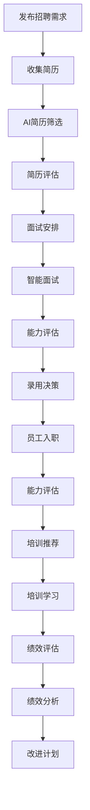
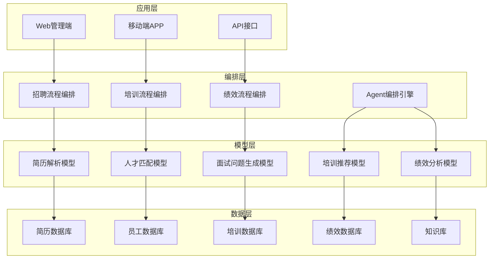
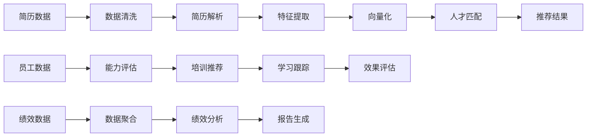

# 2. 总体架构

## 2.1 业务架构

### 角色定义

#### HR招聘专员（Recruiter）
- **职责**：使用AI智能招聘系统进行简历筛选、人才匹配、面试安排，审核AI推荐结果
- **权限**：简历查看、AI推荐调用、面试安排、候选人管理、招聘数据分析
- **典型场景**：简历筛选、人才匹配、面试安排、候选人评估、招聘数据分析

#### 面试官（Interviewer）
- **职责**：使用智能面试系统进行面试，获得AI面试辅助建议，评估候选人能力
- **权限**：面试安排、面试问题查看、候选人信息查看、面试评估、面试报告查看
- **典型场景**：面试安排、面试进行、能力评估、面试报告撰写

#### 培训管理员（Training Admin）
- **职责**：使用智能培训系统管理培训课程，获得AI培训推荐建议，评估培训效果
- **权限**：培训课程管理、培训推荐、培训效果评估、员工学习路径管理
- **典型场景**：培训课程管理、培训推荐、培训效果评估、学习路径规划

#### 绩效管理员（Performance Admin）
- **职责**：使用智能绩效系统进行绩效评估，获得AI绩效分析建议，制定改进计划
- **权限**：绩效评估、绩效分析、绩效报告查看、改进计划制定
- **典型场景**：绩效评估、绩效分析、绩效报告、改进计划制定

#### 系统管理员（System Admin）
- **职责**：系统运维、性能监控、安全管理、数据备份、用户权限管理
- **权限**：系统配置、用户管理、安全审计、数据管理、模型管理
- **典型场景**：系统部署、性能优化、安全加固、故障处理、数据备份

### 用例分析

#### 用例1：AI智能简历筛选
- **参与者**：HR招聘专员、AI简历分析系统、招聘系统
- **前置条件**：HR已登录系统，简历已上传，AI模型已部署
- **主流程**：
  1. HR在招聘系统中选择待筛选简历
  2. 系统调用AI简历分析接口，进行简历解析和能力评估
  3. AI返回分析结果（技能匹配度、能力评估、推荐理由）
  4. HR审核AI分析结果，结合岗位需求进行综合判断
  5. HR标记简历状态（通过/不通过/待定）
  6. 系统保存筛选结果，更新候选人状态
- **后置条件**：简历筛选结果已保存，候选人状态已更新
- **扩展流程**：如果AI匹配度低，系统提示HR重点关注；如果发现优秀人才，系统自动推荐

#### 用例2：智能面试辅助
- **参与者**：面试官、智能面试系统、知识库系统
- **前置条件**：面试官已登录系统，面试已安排，候选人信息已录入
- **主流程**：
  1. 面试官在系统中查看候选人信息和简历
  2. 系统基于候选人简历和岗位要求，推荐面试问题
  3. 面试官选择面试问题，进行面试
  4. 系统记录面试过程，进行实时分析
  5. 系统提供能力评估建议和面试反馈
  6. 面试官确认评估结果，撰写面试报告
  7. 系统保存面试报告，更新候选人状态
- **后置条件**：面试报告已保存，候选人状态已更新
- **扩展流程**：如果发现能力不足，系统建议进一步评估；如果发现优秀人才，系统自动推荐

#### 用例3：个性化培训推荐
- **参与者**：员工、培训管理员、智能培训系统、知识库系统
- **前置条件**：员工已登录系统，员工信息已录入，培训课程库已构建
- **主流程**：
  1. 员工查看个人能力评估和学习需求
  2. 系统基于员工能力、岗位要求、职业发展路径，推荐培训课程
  3. 员工选择培训课程，开始学习
  4. 系统跟踪学习进度，提供学习建议
  5. 系统评估学习效果，更新员工能力
  6. 培训管理员查看培训效果，优化培训计划
- **后置条件**：培训记录已保存，员工能力已更新
- **扩展流程**：如果学习效果不佳，系统建议调整学习路径；如果发现新的培训需求，系统自动推荐

#### 用例4：智能绩效分析
- **参与者**：绩效管理员、员工、智能绩效系统、数据分析系统
- **前置条件**：绩效管理员已登录系统，绩效数据已收集，分析模型已部署
- **主流程**：
  1. 绩效管理员启动绩效评估流程
  2. 系统收集员工绩效数据（工作成果、360度反馈、目标完成情况）
  3. 系统进行AI绩效分析，识别优势和不足
  4. 系统生成绩效报告和改进建议
  5. 绩效管理员审核报告，与员工沟通
  6. 系统保存绩效报告，制定改进计划
- **后置条件**：绩效报告已保存，改进计划已制定
- **扩展流程**：如果发现绩效问题，系统建议及时干预；如果发现优秀表现，系统自动推荐奖励

### 故事地图

## 2.2 技术架构

### 系统分层架构

智能人力资源系统采用AI-Native四层架构：

### 核心组件

#### 1. 简历解析服务（Resume Parser）
- **功能**：解析简历文本，提取结构化信息（姓名、学历、工作经历、技能等）
- **技术**：基于NLP的文本解析，支持PDF、Word、图片等多种格式
- **输出**：结构化简历数据

#### 2. 人才匹配服务（Talent Matching）
- **功能**：基于岗位要求和候选人简历，计算匹配度
- **技术**：向量检索、协同过滤、知识图谱
- **输出**：匹配度分数、匹配理由

#### 3. 面试辅助服务（Interview Assistant）
- **功能**：基于候选人信息生成面试问题，提供能力评估建议
- **技术**：大语言模型、知识图谱
- **输出**：面试问题、能力评估、面试反馈

#### 4. 培训推荐服务（Training Recommender）
- **功能**：基于员工能力和岗位要求，推荐个性化培训课程
- **技术**：推荐算法、知识图谱、学习路径规划
- **输出**：培训课程推荐、学习路径

#### 5. 绩效分析服务（Performance Analyzer）
- **功能**：分析员工绩效数据，识别优势和不足，生成改进建议
- **技术**：数据分析、机器学习、知识图谱
- **输出**：绩效报告、改进建议

### 数据流架构

## 2.3 集成架构

### 外部系统集成

#### HR系统集成
- **ATS系统**（Applicant Tracking System）：集成招聘管理系统，同步招聘需求和候选人信息
- **HCM系统**（Human Capital Management）：集成人力资本管理系统，同步员工信息和组织架构
- **LMS系统**（Learning Management System）：集成学习管理系统，同步培训课程和学习记录

#### 第三方服务集成
- **招聘网站**：集成智联招聘、BOSS直聘等招聘网站，自动获取简历
- **背景调查服务**：集成第三方背景调查服务，验证候选人信息
- **视频面试平台**：集成腾讯会议、Zoom等视频面试平台，支持远程面试

### 集成方式

#### API集成
- **RESTful API**：标准REST API接口，支持JSON格式数据交换
- **Webhook**：支持Webhook回调，实时同步数据变更
- **OAuth认证**：支持OAuth 2.0认证，确保数据安全

#### 数据同步
- **实时同步**：关键数据实时同步，确保数据一致性
- **批量同步**：非关键数据批量同步，减少系统负载
- **增量同步**：只同步变更数据，提高同步效率

## 2.4 部署架构

### 部署模式

#### 云原生部署
- **容器化**：基于Docker容器化部署，支持快速扩展
- **Kubernetes编排**：基于Kubernetes进行容器编排，支持自动扩缩容
- **微服务架构**：采用微服务架构，服务独立部署和扩展

#### 高可用设计
- **多可用区部署**：跨多个可用区部署，确保高可用性
- **负载均衡**：使用负载均衡器分发请求，提高系统性能
- **数据备份**：定期备份数据，支持快速恢复

### 扩展性设计

#### 水平扩展
- **无状态服务**：服务设计为无状态，支持水平扩展
- **数据库分片**：大数据量场景下支持数据库分片
- **缓存层**：使用Redis缓存，提高系统性能

#### 垂直扩展
- **资源优化**：优化资源使用，提高单机性能
- **模型优化**：优化AI模型，减少计算资源消耗

