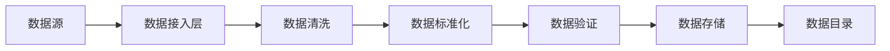

# 3. 数据与知识治理

## 3.1 私有数据接入

### 数据源类型

智能人力资源系统需要接入多种类型的人力资源数据，主要包括：

#### 简历数据
- **简历文件**：PDF、Word、图片等格式的简历文件，通常从招聘网站、ATS系统获取
- **数据特点**：数据格式多样（PDF、Word、图片），包含非结构化文本，需要解析和提取
- **接入方式**：通过API接口从招聘网站获取，或通过文件上传方式导入
- **数据量**：大型企业年收到简历数据可达10-50万份

#### 员工数据
- **基本信息**：员工姓名、性别、年龄、学历、联系方式等基本信息
- **工作经历**：员工工作经历、项目经验、技能等
- **绩效数据**：员工绩效评估、360度反馈、目标完成情况等
- **数据特点**：数据格式相对标准，多为结构化数据，包含敏感信息
- **接入方式**：通过API接口从HCM系统获取，或通过数据库直连方式获取
- **数据量**：大型企业员工数据可达几万到几十万条

#### 培训数据
- **培训课程**：培训课程信息、课程内容、学习资源等
- **学习记录**：员工学习记录、学习进度、考试成绩等
- **数据特点**：数据格式相对标准，多为结构化数据
- **接入方式**：通过API接口从LMS系统获取，或通过数据库接口获取
- **数据量**：大型企业培训数据可达几万到几十万条

#### 岗位数据
- **岗位信息**：岗位名称、岗位描述、岗位要求、薪资范围等
- **组织架构**：部门信息、岗位层级、汇报关系等
- **数据特点**：数据格式相对标准，多为结构化数据
- **接入方式**：通过API接口从HCM系统获取，或通过数据库接口获取
- **数据量**：大型企业岗位数据可达几千到几万条

#### 知识库数据
- **行业知识**：行业知识、技能要求、职业发展路径等
- **面试题库**：面试问题、评估标准、最佳实践等
- **培训资源**：培训课程、学习资料、案例库等
- **数据特点**：数据来源多样，格式不统一，需要清洗和标准化
- **接入方式**：通过API接口获取，或通过文件导入方式
- **数据量**：知识库数据可达几GB到几十GB

### 数据接入流程

#### 数据接入架构

#### 详细流程

1. **数据源发现和注册**
   - 识别和注册各类数据源，建立数据源目录
   - 配置数据源连接信息（地址、端口、认证信息等）
   - 设置数据接入策略（全量/增量、频率、优先级等）

2. **数据抽取**
   - **批量抽取**：定时批量抽取数据，适用于历史数据导入
   - **实时抽取**：实时抽取数据，适用于实时性要求高的场景
   - **增量抽取**：只抽取变更数据，减少数据传输量

3. **数据清洗**
   - **格式转换**：将不同格式的数据转换为统一格式
   - **数据去重**：识别和去除重复数据
   - **异常值处理**：识别和处理异常值、缺失值
   - **数据补全**：对缺失数据进行补全或标记

4. **数据标准化**
   - **术语标准化**：将非标准术语转换为标准术语（如技能名称、岗位名称等）
   - **格式标准化**：统一数据格式（如日期格式、数值格式等）
   - **编码标准化**：统一数据编码（如学历编码、技能编码等）

5. **数据验证**
   - **完整性验证**：验证数据是否完整
   - **准确性验证**：验证数据是否准确
   - **一致性验证**：验证数据是否一致
   - **合规性验证**：验证数据是否符合合规要求

6. **数据存储**
   - **结构化数据存储**：存储在关系型数据库中（MySQL、PostgreSQL等）
   - **非结构化数据存储**：存储在对象存储中（OSS、S3等）
   - **向量数据存储**：存储在向量数据库中（Milvus、Pinecone等）

### 数据质量保障

#### 数据质量指标
- **完整性**：数据完整率≥95%
- **准确性**：数据准确率≥98%
- **一致性**：数据一致率≥95%
- **及时性**：数据更新延迟≤1小时

#### 数据质量监控
- **实时监控**：实时监控数据质量指标
- **异常告警**：数据质量异常时自动告警
- **质量报告**：定期生成数据质量报告

## 3.2 知识库构建

### 知识库类型

#### 行业知识库
- **行业信息**：各行业特点、发展趋势、人才需求等
- **技能知识**：技能定义、技能要求、技能评估标准等
- **职业发展**：职业发展路径、晋升要求、能力要求等

#### 面试知识库
- **面试问题**：各类岗位的面试问题、评估标准、最佳实践等
- **评估标准**：能力评估标准、评分标准、评估方法等
- **案例库**：面试案例、成功案例、失败案例等

#### 培训知识库
- **培训课程**：培训课程信息、课程内容、学习资源等
- **学习路径**：不同岗位的学习路径、能力提升路径等
- **培训资源**：培训资料、视频、案例等

### 知识库构建流程

#### 知识抽取
- **结构化知识抽取**：从结构化数据中抽取知识（如岗位要求、技能要求等）
- **非结构化知识抽取**：从非结构化文本中抽取知识（如简历、岗位描述等）
- **知识融合**：融合多源知识，消除冲突和重复

#### 知识建模
- **实体识别**：识别知识实体（如技能、岗位、员工等）
- **关系抽取**：抽取实体之间的关系（如技能关联、岗位关联等）
- **知识图谱构建**：构建知识图谱，表示知识结构

#### 知识存储
- **图数据库存储**：存储在Neo4j、ArangoDB等图数据库中
- **向量数据库存储**：存储在Milvus、Pinecone等向量数据库中
- **关系数据库存储**：存储在MySQL、PostgreSQL等关系数据库中

### 知识库更新

#### 自动更新
- **增量更新**：定期增量更新知识库，保持知识新鲜度
- **实时更新**：关键知识实时更新，确保知识及时性

#### 人工审核
- **知识审核**：人工审核新增知识，确保知识质量
- **知识修正**：发现错误知识时及时修正

## 3.3 数据安全与隐私保护

### 数据分类分级

#### 数据分类
- **公开数据**：可以公开的数据（如岗位信息、培训课程等）
- **内部数据**：仅内部使用的数据（如员工基本信息、绩效数据等）
- **敏感数据**：需要特别保护的数据（如身份证号、薪资信息等）
- **机密数据**：高度机密的数据（如高管信息、商业机密等）

#### 数据分级
- **一级数据**：公开数据，可以自由使用
- **二级数据**：内部数据，需要授权使用
- **三级数据**：敏感数据，需要严格授权和加密
- **四级数据**：机密数据，需要最高级别保护

### 数据安全措施

#### 数据加密
- **传输加密**：使用TLS/SSL加密数据传输
- **存储加密**：使用AES-256加密存储敏感数据
- **字段加密**：对敏感字段进行加密存储

#### 访问控制
- **身份认证**：使用OAuth 2.0、JWT等身份认证机制
- **权限控制**：基于角色的访问控制（RBAC），严格控制数据访问权限
- **审计日志**：记录所有数据访问操作，支持审计追踪

#### 数据脱敏
- **静态脱敏**：对存储的敏感数据进行脱敏处理
- **动态脱敏**：对查询结果进行动态脱敏处理
- **脱敏规则**：定义脱敏规则，确保脱敏效果

### 隐私保护

#### 个人信息保护
- **最小化原则**：只收集必要的个人信息
- **目的限制**：个人信息仅用于明确的目的
- **同意机制**：获得个人明确同意后使用个人信息

#### 数据匿名化
- **匿名化处理**：对个人信息进行匿名化处理
- **去标识化**：去除个人标识信息，保护隐私

#### 数据删除
- **定期删除**：定期删除过期数据
- **请求删除**：支持个人请求删除数据
- **删除验证**：验证数据已完全删除

## 3.4 数据治理流程

### 数据治理组织

#### 数据治理委员会
- **职责**：制定数据治理策略，监督数据治理执行
- **成员**：数据管理员、业务负责人、技术负责人、合规负责人

#### 数据管理员
- **职责**：执行数据治理策略，管理数据资产
- **权限**：数据访问、数据修改、数据删除

### 数据治理流程

#### 数据申请
- **申请流程**：用户申请数据访问权限
- **审批流程**：数据管理员审批数据访问申请
- **授权流程**：授予数据访问权限

#### 数据使用
- **使用监控**：监控数据使用情况
- **使用审计**：审计数据使用记录
- **违规处理**：处理数据使用违规行为

#### 数据维护
- **数据更新**：定期更新数据，保持数据新鲜度
- **数据清理**：清理过期和无效数据
- **数据备份**：定期备份数据，支持数据恢复

