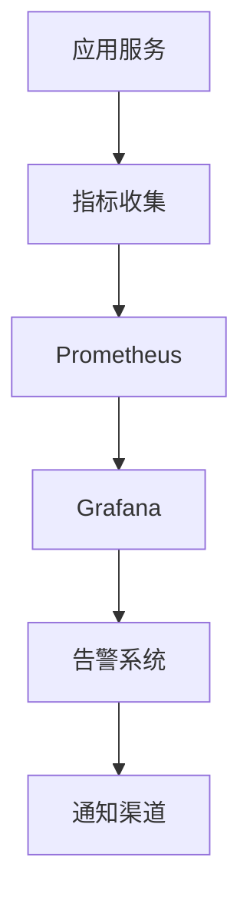

# 9. 监控与可观测

## 9.1 业务指标

### 核心业务指标

智能人力资源系统的核心业务指标用于评估招聘质量和业务效果：

#### 招聘质量指标

**1. 招聘匹配度（Recruitment Match Rate）**
- **定义**：AI推荐候选人与岗位的匹配程度
- **计算公式**：匹配度 = (匹配候选人数 / 推荐候选人总数) × 100%
- **目标值**：≥85%
- **监控频率**：实时监控，每小时统计

**2. 员工留存率（Employee Retention Rate）**
- **定义**：入职员工在一年内的留存比例
- **计算公式**：留存率 = (留存员工数 / 入职员工总数) × 100%
- **目标值**：≥90%
- **监控频率**：每月统计

**3. 面试通过率（Interview Pass Rate）**
- **定义**：通过AI筛选的候选人进入面试的比例
- **计算公式**：通过率 = (面试通过数 / 面试总数) × 100%
- **目标值**：≥40%
- **监控频率**：每天统计

**4. 招聘周期（Recruitment Cycle）**
- **定义**：从发布招聘需求到员工入职的平均时间
- **计算公式**：平均周期 = 总招聘时间 / 招聘数
- **目标值**：≤20天
- **监控频率**：每天统计

#### 效率指标

**5. 简历筛选时间（Resume Screening Time）**
- **定义**：从简历上传到筛选完成的时间
- **计算公式**：平均时间 = 总筛选时间 / 筛选数
- **目标值**：≤30秒/份
- **监控频率**：实时监控，每分钟统计

**6. 日均处理简历量（Daily Resume Processing Volume）**
- **定义**：每个HR每天处理的简历数量
- **计算公式**：日均量 = 总处理数 / (HR数 × 天数)
- **目标值**：≥400份/HR
- **监控频率**：每天统计

**7. 系统吞吐量（System Throughput）**
- **定义**：系统每秒处理的请求数量
- **计算公式**：吞吐量 = 请求数 / 时间（秒）
- **目标值**：≥100请求/秒
- **监控频率**：实时监控

#### 培训效果指标

**8. 培训转化率（Training Conversion Rate）**
- **定义**：完成培训并应用到工作中的员工比例
- **计算公式**：转化率 = (应用培训内容的员工数 / 完成培训的员工总数) × 100%
- **目标值**：≥40%
- **监控频率**：每月统计

**9. 培训满意度（Training Satisfaction）**
- **定义**：员工对培训的满意度评分
- **计算公式**：平均满意度 = 总满意度评分 / 评分人数
- **目标值**：≥4.0/5.0
- **监控频率**：每期培训后统计

#### 绩效管理指标

**10. 绩效评估周期（Performance Evaluation Cycle）**
- **定义**：从启动绩效评估到完成评估的时间
- **计算公式**：平均周期 = 总评估时间 / 评估数
- **目标值**：≤1个月
- **监控频率**：每次评估后统计

**11. 绩效改进率（Performance Improvement Rate）**
- **定义**：绩效改进计划执行后绩效提升的员工比例
- **计算公式**：改进率 = (绩效提升的员工数 / 执行改进计划的员工总数) × 100%
- **目标值**：≥60%
- **监控频率**：每季度统计

### 指标监控

#### 监控架构



#### 监控实现

**Prometheus配置**：
```yaml
global:
  scrape_interval: 15s
  evaluation_interval: 15s

scrape_configs:
  - job_name: 'hr-ai-service'
    static_configs:
      - targets: ['localhost:8000']
    metrics_path: '/metrics'
```

**Grafana仪表板配置**：
```json
{
  "dashboard": {
    "title": "HR AI系统监控",
    "panels": [
      {
        "title": "招聘匹配度",
        "targets": [
          {
            "expr": "recruitment_match_rate",
            "legendFormat": "匹配度"
          }
        ]
      },
      {
        "title": "简历筛选时间",
        "targets": [
          {
            "expr": "resume_screening_time",
            "legendFormat": "筛选时间"
          }
        ]
      }
    ]
  }
}
```

## 9.2 技术指标

### 系统性能指标

#### 响应时间指标

**API响应时间**：
- **简历解析API**：P95 ≤ 2s
- **人才匹配API**：P95 ≤ 1s
- **面试问题生成API**：P95 ≤ 3s
- **培训推荐API**：P95 ≤ 2s
- **绩效分析API**：P95 ≤ 5s

#### 可用性指标

**系统可用性**：
- **目标值**：≥99.9%
- **计算公式**：可用性 = (总时间 - 故障时间) / 总时间 × 100%

**服务可用性**：
- **简历解析服务**：≥99.9%
- **人才匹配服务**：≥99.9%
- **面试辅助服务**：≥99.5%
- **培训推荐服务**：≥99.5%
- **绩效分析服务**：≥99.5%

#### 错误率指标

**API错误率**：
- **目标值**：≤1%
- **计算公式**：错误率 = 错误请求数 / 总请求数 × 100%

**系统错误率**：
- **目标值**：≤0.1%
- **计算公式**：错误率 = 系统错误数 / 总请求数 × 100%

### 资源使用指标

#### CPU使用率

**目标值**：
- **平均CPU使用率**：≤70%
- **峰值CPU使用率**：≤90%

#### 内存使用率

**目标值**：
- **平均内存使用率**：≤70%
- **峰值内存使用率**：≤85%

#### 存储使用率

**目标值**：
- **数据库存储使用率**：≤80%
- **文件存储使用率**：≤80%

## 9.3 日志与追踪

### 日志管理

#### 日志级别

**日志级别定义**：
- **DEBUG**：调试信息，用于开发调试
- **INFO**：一般信息，记录正常操作
- **WARN**：警告信息，记录潜在问题
- **ERROR**：错误信息，记录错误情况
- **FATAL**：严重错误，记录系统故障

#### 日志格式

**结构化日志格式**：
```json
{
  "timestamp": "2024-01-01T10:00:00Z",
  "level": "INFO",
  "service": "hr-ai-service",
  "module": "resume_parser",
  "message": "简历解析完成",
  "context": {
    "resume_id": "R123456",
    "processing_time": 1.5,
    "status": "success"
  }
}
```

#### 日志收集

**ELK Stack**：
- **Elasticsearch**：日志存储和检索
- **Logstash**：日志收集和处理
- **Kibana**：日志可视化和分析

### 分布式追踪

#### 追踪实现

**OpenTelemetry**：
- 分布式追踪标准
- 支持多种语言和框架
- 支持多种后端存储

**追踪配置**：
```python
from opentelemetry import trace
from opentelemetry.sdk.trace import TracerProvider
from opentelemetry.sdk.trace.export import BatchSpanProcessor
from opentelemetry.exporter.jaeger import JaegerExporter

# 配置追踪
trace.set_tracer_provider(TracerProvider())
tracer = trace.get_tracer(__name__)

# 配置导出器
jaeger_exporter = JaegerExporter(
    agent_host_name="localhost",
    agent_port=6831,
)
span_processor = BatchSpanProcessor(jaeger_exporter)
trace.get_tracer_provider().add_span_processor(span_processor)
```

## 9.4 告警与通知

### 告警规则

#### 业务告警

**招聘匹配度告警**：
- **规则**：匹配度 < 80% 持续1小时
- **级别**：警告
- **通知**：邮件 + 短信

**员工留存率告警**：
- **规则**：留存率 < 85% 持续1个月
- **级别**：严重
- **通知**：邮件 + 短信 + 电话

#### 技术告警

**系统可用性告警**：
- **规则**：可用性 < 99.9% 持续5分钟
- **级别**：严重
- **通知**：邮件 + 短信 + 电话

**响应时间告警**：
- **规则**：P95响应时间 > 2s 持续10分钟
- **级别**：警告
- **通知**：邮件 + 短信

**错误率告警**：
- **规则**：错误率 > 1% 持续5分钟
- **级别**：严重
- **通知**：邮件 + 短信 + 电话

### 通知渠道

#### 通知方式

**邮件通知**：
- 用于一般告警
- 包含详细告警信息
- 支持HTML格式

**短信通知**：
- 用于重要告警
- 包含简要告警信息
- 支持紧急告警

**电话通知**：
- 用于严重告警
- 自动拨打电话
- 支持语音播报

**企业微信/钉钉通知**：
- 用于团队协作
- 支持@提醒
- 支持机器人通知

### 告警处理

#### 告警处理流程

1. **告警触发**：系统检测到异常，触发告警
2. **告警通知**：发送告警通知到相关人员
3. **问题排查**：相关人员排查问题
4. **问题处理**：处理问题，恢复服务
5. **告警关闭**：确认问题已解决，关闭告警
6. **问题复盘**：复盘问题原因，制定改进措施

