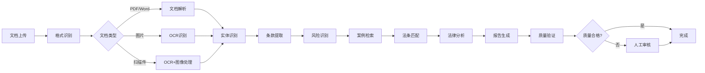
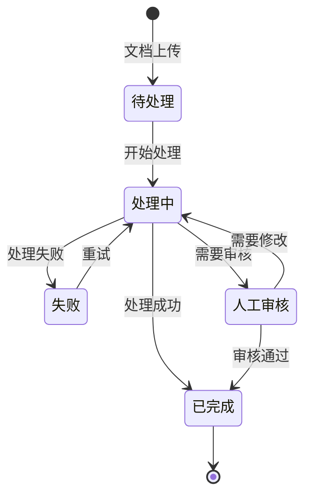

# 5. 智能体与业务编排

## 5.1 Agent技能链

### 技能定义

智能法律Agent需要具备多种技能，通过技能链组合完成复杂任务：

#### 核心技能

**1. 文档解析技能（Document Parsing）**
- **功能**：解析各种格式的法律文档（PDF、Word、Excel、图片等）
- **输入**：文档文件
- **输出**：解析后的文本内容和结构信息
- **实现**：基于PyPDF、python-docx、pandas等工具
- **应用场景**：合同上传、法律文件处理

**2. OCR识别技能（OCR Recognition）**
- **功能**：识别图片和扫描件中的文字
- **输入**：图片文件或扫描件
- **输出**：识别出的文字内容
- **实现**：基于PaddleOCR、Tesseract等OCR引擎
- **应用场景**：扫描合同识别、手写文档识别

**3. 法律实体识别技能（Legal Entity Recognition）**
- **功能**：识别法律文档中的关键实体（当事人、法条、案例等）
- **输入**：法律文本
- **输出**：识别的实体列表（JSON格式）
- **实现**：基于BERT+CRF的NER模型
- **应用场景**：合同主体识别、法条引用识别

**4. 条款提取技能（Clause Extraction）**
- **功能**：从合同中提取关键条款
- **输入**：合同文本
- **输出**：提取的条款列表（JSON格式）
- **实现**：基于大语言模型（GPT-4等）
- **应用场景**：合同审查、条款分析

**5. 风险识别技能（Risk Identification）**
- **功能**：识别合同和法律文档中的风险点
- **输入**：文档内容、风险规则库
- **输出**：风险识别结果（风险类型、风险等级、风险位置）
- **实现**：基于大语言模型和规则引擎
- **应用场景**：合同风险识别、合规检查

**6. 案例检索技能（Case Retrieval）**
- **功能**：从案例库中检索相似案例
- **输入**：案情描述、检索条件
- **输出**：相似案例列表
- **实现**：基于RAG检索系统
- **应用场景**：案例检索、判例查找

**7. 法条匹配技能（Law Matching）**
- **功能**：匹配相关的法律法规
- **输入**：法律问题、案件描述
- **输出**：匹配的法条列表
- **实现**：基于RAG检索系统和知识图谱
- **应用场景**：法条匹配、法律依据查找

**8. 法律分析技能（Legal Analysis）**
- **功能**：基于案例和法条进行法律分析
- **输入**：案例、法条、分析需求
- **输出**：法律分析报告
- **实现**：基于大语言模型
- **应用场景**：法律分析、报告生成

**9. 报告生成技能（Report Generation）**
- **功能**：生成法律审查报告、分析报告等
- **输入**：分析结果、报告模板
- **输出**：格式化的报告文档
- **实现**：基于模板引擎和大语言模型
- **应用场景**：审查报告生成、分析报告生成

### 技能链设计

技能链按照业务流程组织，形成完整的处理流程：



#### 标准技能链

**合同审查链**：
1. 文档上传 → 2. 格式识别 → 3. 文档解析/OCR → 4. 实体识别 → 5. 条款提取 → 6. 风险识别 → 7. 案例检索 → 8. 法条匹配 → 9. 法律分析 → 10. 报告生成

**案例检索链**：
1. 案情输入 → 2. 语义理解 → 3. 案例检索 → 4. 相关性排序 → 5. 法条匹配 → 6. 法律分析 → 7. 报告生成

**法条匹配链**：
1. 法律问题输入 → 2. 问题理解 → 3. 法条检索 → 4. 适用性分析 → 5. 冲突检查 → 6. 优先级排序 → 7. 报告生成

**实现示例**：
```python
from langchain.agents import AgentExecutor, create_react_agent
from langchain.tools import Tool

# 定义工具
tools = [
    Tool(
        name="document_parsing",
        func=document_parsing_skill,
        description="解析法律文档，提取文本内容"
    ),
    Tool(
        name="legal_entity_recognition",
        func=legal_entity_recognition_skill,
        description="识别法律文档中的关键实体"
    ),
    Tool(
        name="clause_extraction",
        func=clause_extraction_skill,
        description="从合同中提取关键条款"
    ),
    Tool(
        name="risk_identification",
        func=risk_identification_skill,
        description="识别合同和法律文档中的风险点"
    ),
    Tool(
        name="case_retrieval",
        func=case_retrieval_skill,
        description="从案例库中检索相似案例"
    ),
    Tool(
        name="law_matching",
        func=law_matching_skill,
        description="匹配相关的法律法规"
    ),
]

# 创建Agent
agent = create_react_agent(llm, tools, prompt)
agent_executor = AgentExecutor(agent=agent, tools=tools)
```

### 执行流程

#### 流程控制

**顺序执行**：
- 技能按顺序执行，前一个技能的输出作为下一个技能的输入
- 适用于有依赖关系的技能链（如文档解析 → 实体识别 → 条款提取）

**并行执行**：
- 多个独立技能并行执行，提升处理速度
- 适用于无依赖关系的技能（如案例检索和法条匹配可并行）

**条件分支**：
- 根据中间结果选择不同的执行路径
- 适用于需要动态调整的场景（如高风险合同转人工审查）

**循环执行**：
- 对列表数据循环处理（如多个条款逐一审查）
- 适用于批量处理场景

#### 错误处理

**重试机制**：
- 失败后自动重试，最多重试3次
- 适用于临时性错误（如网络超时）

**降级处理**：
- 主技能失败时使用备用技能
- 适用于技能不可用场景

**人工介入**：
- 复杂错误或低置信度结果转人工处理
- 确保结果质量

## 5.2 工具注册中心

### 工具类型

智能法律系统需要集成多种外部工具，扩展Agent能力：

#### 文档处理工具

**1. PDF解析工具（PDF Parser）**
- **功能**：解析PDF文档，提取文本和结构
- **输入**：PDF文件路径
- **输出**：文本内容和结构信息
- **实现**：PyPDF、pdfplumber
- **MCP注册**：通过MCP服务器注册

**2. Word解析工具（Word Parser）**
- **功能**：解析Word文档，提取文本和格式
- **输入**：Word文件路径
- **输出**：文本内容和格式信息
- **实现**：python-docx
- **MCP注册**：通过MCP服务器注册

**3. OCR工具（OCR Tool）**
- **功能**：识别图片中的文字
- **输入**：图片文件路径
- **输出**：识别出的文字内容
- **实现**：PaddleOCR、Tesseract
- **MCP注册**：通过MCP服务器注册

#### 法律知识工具

**4. 案例检索工具（Case Retrieval Tool）**
- **功能**：从案例库检索相似案例
- **输入**：案情描述、检索条件
- **输出**：相似案例列表
- **实现**：基于向量数据库（Milvus）的RAG检索
- **MCP注册**：通过MCP服务器注册

**5. 法条检索工具（Law Retrieval Tool）**
- **功能**：从法律知识库检索相关法条
- **输入**：法律问题、检索条件
- **输出**：相关法条列表
- **实现**：基于向量数据库和知识图谱
- **MCP注册**：通过MCP服务器注册

**6. 法律知识图谱工具（Legal Knowledge Graph Tool）**
- **功能**：查询法律知识图谱，获取法律概念关系
- **输入**：法律概念、关系类型
- **输出**：相关法律概念和关系
- **实现**：基于Neo4j图数据库
- **MCP注册**：通过MCP服务器注册

#### AI工具

**7. 法律实体识别工具（Legal NER Tool）**
- **功能**：识别法律文档中的实体
- **输入**：法律文本
- **输出**：识别的实体列表
- **实现**：基于BERT+CRF的NER模型
- **MCP注册**：通过MCP服务器注册

**8. 风险识别工具（Risk Identification Tool）**
- **功能**：识别合同和法律文档中的风险
- **输入**：文档内容、风险规则
- **输出**：风险识别结果
- **实现**：基于大语言模型和规则引擎
- **MCP注册**：通过MCP服务器注册

**9. 法律分析工具（Legal Analysis Tool）**
- **功能**：进行法律分析
- **输入**：案例、法条、分析需求
- **输出**：法律分析结果
- **实现**：基于大语言模型
- **MCP注册**：通过MCP服务器注册

### 工具注册流程

#### 注册步骤

**步骤1：工具开发**
- 开发工具功能，实现标准接口
- 编写工具文档和测试用例
- 确保工具的安全性和性能

**步骤2：工具注册**
- 在MCP服务器注册工具
- 提供工具名称、描述、参数、返回值等信息
- 配置工具权限和访问控制

**步骤3：工具测试**
- 在测试环境测试工具功能
- 验证工具的安全性和性能
- 确保工具符合质量标准

**步骤4：工具发布**
- 工具审核通过后发布
- 配置工具版本和更新策略
- 通知相关用户

#### MCP工具注册示例

```python
from mcp import MCPServer, Tool

# 创建MCP服务器
server = MCPServer("legal-tools-server")

# 注册案例检索工具
@server.tool(
    name="case_retrieval",
    description="从案例库检索相似案例",
    parameters={
        "case_description": {
            "type": "string",
            "description": "案情描述"
        },
        "case_type": {
            "type": "string",
            "description": "案件类型",
            "enum": ["民事", "刑事", "行政", "商事"]
        },
        "top_k": {
            "type": "integer",
            "description": "返回案例数量",
            "default": 10
        }
    }
)
def case_retrieval_tool(case_description: str, case_type: str, top_k: int = 10):
    """案例检索工具实现"""
    # 实现案例检索逻辑
    results = vector_db.search(case_description, case_type, top_k)
    return results

# 注册法条检索工具
@server.tool(
    name="law_retrieval",
    description="从法律知识库检索相关法条",
    parameters={
        "legal_question": {
            "type": "string",
            "description": "法律问题"
        },
        "law_type": {
            "type": "string",
            "description": "法律类型",
            "enum": ["法律", "法规", "规章", "司法解释"]
        }
    }
)
def law_retrieval_tool(legal_question: str, law_type: str = None):
    """法条检索工具实现"""
    # 实现法条检索逻辑
    results = law_knowledge_base.search(legal_question, law_type)
    return results
```

### 工具调用机制

#### 调用流程


#### 安全机制

**参数验证**：
- 验证工具参数类型和范围
- 防止路径遍历、命令注入等攻击
- 对敏感参数进行加密处理

**权限控制**：
- 基于角色的访问控制（RBAC）
- 限制工具调用权限
- 记录工具调用日志

**执行隔离**：
- 在沙箱环境中执行工具
- 限制资源使用（CPU、内存、网络）
- 防止工具之间的相互影响

**错误处理**：
- 捕获工具执行错误
- 返回友好的错误信息
- 记录错误日志用于排查

## 5.3 长记忆与状态管理

### 记忆机制

智能法律Agent需要记忆处理历史和文档信息：

#### 记忆类型

**短期记忆（Short-term Memory）**：
- **内容**：当前处理任务的上下文信息
- **存储**：内存中，任务结束后清除
- **用途**：理解当前处理任务的上下文
- **示例**：当前审查的合同内容、检索的案例列表

**长期记忆（Long-term Memory）**：
- **内容**：文档处理历史、审查结果、用户偏好
- **存储**：数据库中，持久化存储
- **用途**：提供历史参考和质量改进
- **示例**：历史审查记录、用户反馈、优化建议

**工作记忆（Working Memory）**：
- **内容**：当前任务的状态和中间结果
- **存储**：内存中，任务完成后清除
- **用途**：管理复杂任务的执行状态
- **示例**：多步骤审查的中间结果、技能链的执行状态

#### 记忆实现

**使用向量数据库存储长期记忆**：
```python
from langchain.memory import VectorStoreRetrieverMemory
from langchain.vectorstores import Milvus

# 创建向量数据库
vector_store = Milvus.from_documents(documents, embedding)

# 创建记忆检索器
memory = VectorStoreRetrieverMemory(
    retriever=vector_store.as_retriever(search_kwargs={"k": 5})
)

# 保存记忆
memory.save_context(
    {"input": "审查了XX合同"},
    {"output": "识别出3个高风险点"}
)

# 检索记忆
relevant_memories = memory.load_memory_variables({"input": "审查类似合同"})
```

### 状态管理

#### 处理状态

**状态定义**：
- **待处理**：文档已上传，等待处理
- **处理中**：正在处理文档
- **已完成**：文档处理完成
- **失败**：文档处理失败
- **人工审核**：需要人工审核
- **已审核**：人工审核完成

**状态转换**：


#### 状态管理实现

**使用Redis存储任务状态**：
```python
import redis
import json

class TaskStateManager:
    def __init__(self):
        self.redis_client = redis.Redis(host='localhost', port=6379, db=0)
    
    def set_state(self, task_id: str, state: str, metadata: dict = None):
        """设置任务状态"""
        state_data = {
            "state": state,
            "timestamp": datetime.now().isoformat(),
            "metadata": metadata or {}
        }
        self.redis_client.set(
            f"task:{task_id}:state",
            json.dumps(state_data),
            ex=3600  # 1小时过期
        )
    
    def get_state(self, task_id: str):
        """获取任务状态"""
        state_data = self.redis_client.get(f"task:{task_id}:state")
        if state_data:
            return json.loads(state_data)
        return None
    
    def update_state(self, task_id: str, new_state: str, metadata: dict = None):
        """更新任务状态"""
        current_state = self.get_state(task_id)
        if current_state:
            current_state["state"] = new_state
            current_state["timestamp"] = datetime.now().isoformat()
            if metadata:
                current_state["metadata"].update(metadata)
            self.set_state(task_id, new_state, current_state["metadata"])
```

### 上下文维护

#### 上下文结构

**文档上下文**：
- 文档基本信息（名称、类型、大小等）
- 文档处理历史
- 审查结果和评估结果
- 相关案例和法条

**任务上下文**：
- 当前处理任务
- 任务状态和进度
- 中间结果
- 错误信息

**业务上下文**：
- 业务规则和配置
- 质量标准和要求
- 历史处理经验
- 用户偏好

#### 上下文管理

**上下文窗口**：
- 限制上下文长度，避免超出模型限制
- 使用滑动窗口，保留最近的上下文
- 使用摘要技术，压缩历史信息

**上下文更新**：
- 每次处理后更新上下文
- 定期持久化上下文到数据库
- 清理过期上下文

**上下文检索**：
- 使用向量检索相关历史上下文
- 提升上下文相关性
- 减少上下文长度

**实现示例**：
```python
class ContextManager:
    def __init__(self, max_context_length: int = 4000):
        self.max_context_length = max_context_length
        self.contexts = {}
    
    def add_context(self, task_id: str, context: str):
        """添加上下文"""
        if task_id not in self.contexts:
            self.contexts[task_id] = []
        self.contexts[task_id].append(context)
        
        # 限制上下文长度
        total_length = sum(len(c) for c in self.contexts[task_id])
        if total_length > self.max_context_length:
            # 保留最近的上下文
            self.contexts[task_id] = self.contexts[task_id][-10:]
    
    def get_context(self, task_id: str) -> str:
        """获取上下文"""
        if task_id in self.contexts:
            return "\n".join(self.contexts[task_id])
        return ""
    
    def clear_context(self, task_id: str):
        """清除上下文"""
        if task_id in self.contexts:
            del self.contexts[task_id]
```
