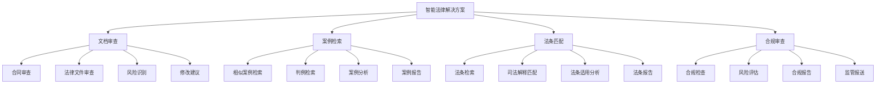
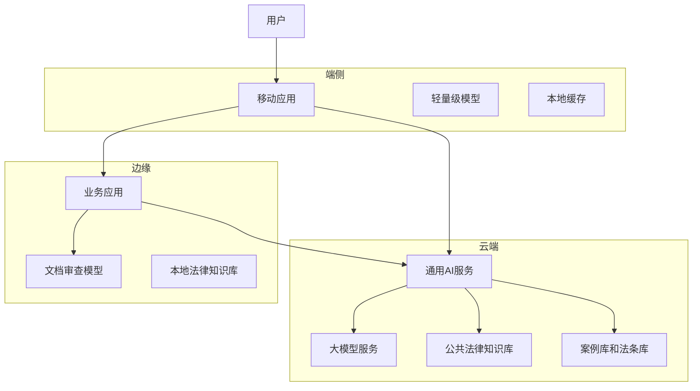
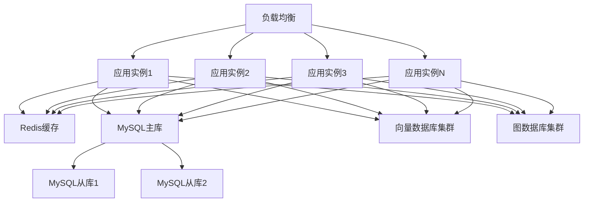

# 2. 总体架构

## 2.1 业务架构

### 角色定义

智能法律解决方案涉及多个角色，每个角色有不同的职责和权限：

- **律师**：
  - 职责：使用智能法律工具进行文档审查、案例检索、法条匹配，提供法律建议
  - 权限：访问法律知识库，使用AI审查工具，生成法律报告
  - 使用场景：合同审查，案件准备，法律研究，客户咨询

- **法务专员**：
  - 职责：使用智能法律工具进行合同审查、合规审查、风险评估
  - 权限：访问企业法律知识库，使用审查工具，生成合规报告
  - 使用场景：合同审查，合规审查，风险评估，法律咨询

- **法官/书记员**：
  - 职责：使用智能法律工具进行案例检索、法条匹配、判决辅助
  - 权限：访问法院案例库，使用检索工具，生成判决辅助报告
  - 使用场景：案例检索，法条匹配，判决辅助，法律研究

- **法律研究员**：
  - 职责：使用智能法律工具进行法律研究、知识库构建、法律分析
  - 权限：访问法律知识库，使用研究工具，构建知识库
  - 使用场景：法律研究，知识库构建，法律分析，学术研究

- **系统管理员**：
  - 职责：管理系统配置，监控系统运行，处理系统故障
  - 权限：系统配置，用户管理，监控告警
  - 使用场景：系统维护，用户管理，故障处理

### 用例分析

#### 用例1：智能合同审查

**参与者**：法务专员、合同审查系统、AI审查引擎

**前置条件**：
- 法务专员已登录系统
- 合同文档已上传
- 审查规则和标准模板已配置

**主流程**：
1. 法务专员上传合同文档
2. 系统识别合同类型和关键条款
3. AI模型分析合同内容，识别风险条款
4. 系统对照标准模板，识别差异和风险点
5. 生成审查报告（包括风险识别、合规检查、修改建议）
6. 法务专员审核报告，确认风险等级
7. 如需修改，生成修改建议和优化方案

**异常流程**：
- 如果合同格式不支持，提示用户转换格式
- 如果AI识别置信度低，转人工审查
- 如果发现高风险条款，立即告警

**后置条件**：
- 审查报告已生成
- 风险已识别和评估
- 修改建议已提供

#### 用例2：智能案例检索

**参与者**：律师、案例检索系统、向量数据库

**前置条件**：
- 律师已登录系统
- 需要检索的案件信息已确定
- 案例库已构建

**主流程**：
1. 律师输入案情描述（案件类型、争议焦点、关键事实等）
2. 系统对案情描述进行语义理解
3. 向量数据库检索相似案例（基于语义相似度）
4. AI模型分析案例相关性，排序检索结果
5. 匹配相关法条和司法解释
6. 生成案例检索报告（包括相似案例、法条匹配、法律分析）
7. 律师审核报告，选择相关案例和法条

**异常流程**：
- 如果检索结果不足，提示用户调整检索条件
- 如果案例库未覆盖相关领域，提示补充案例
- 如果法条匹配不准确，律师可以手动调整

**后置条件**：
- 相似案例已检索
- 相关法条已匹配
- 检索报告已生成

#### 用例3：智能法条匹配

**参与者**：律师、法条匹配系统、法律知识库

**前置条件**：
- 律师已登录系统
- 需要匹配的法律问题已确定
- 法律知识库已构建

**主流程**：
1. 律师输入法律问题或案件描述
2. 系统理解法律问题，提取关键要素
3. AI模型从法律知识库中检索相关法条
4. 匹配司法解释、部门规章、地方性法规
5. 分析法条适用性和相关性
6. 生成法条匹配报告（包括相关法条、适用分析、法律依据）
7. 律师审核报告，确认法条匹配准确性

**异常流程**：
- 如果法条更新，系统自动更新知识库
- 如果法条冲突，提示律师注意
- 如果匹配不准确，律师可以手动调整

**后置条件**：
- 相关法条已匹配
- 法条适用性已分析
- 匹配报告已生成

### 故事地图

智能法律解决方案的用户故事地图如下：



## 2.2 技术架构

### AI-Native四层架构

智能法律解决方案采用AI-Native四层架构，从下到上包括基础设施层、模型层、编排层和应用层。

#### 应用层

应用层提供面向业务用户的应用界面和API接口：

**核心应用**：

- **法律文档审查平台**：
  - 文档上传和解析界面
  - 智能审查界面
  - 风险识别和评估界面
  - 审查报告生成和导出

- **案例检索平台**：
  - 案情描述输入界面
  - 案例检索和筛选界面
  - 案例详情查看界面
  - 案例报告生成工具

- **法条匹配平台**：
  - 法律问题输入界面
  - 法条检索和匹配界面
  - 法条适用性分析界面
  - 法条报告生成工具

- **合规审查平台**：
  - 合规检查界面
  - 风险评估界面
  - 合规报告生成工具
  - 监管报送工具

**技术栈**：
- 前端：Vue 3 + TypeScript + Vite + TailwindCSS
- 后端API：FastAPI + Python 3.11
- 状态管理：Pinia
- UI组件库：Element Plus

#### 编排层

编排层负责业务流程编排和智能体协调：

**核心组件**：

- **工作流引擎（n8n）**：
  - 业务流程编排
  - 任务调度和执行
  - 异常处理和重试
  - 工作流监控

- **智能体编排（Dify）**：
  - 多智能体协调
  - 工具调用管理
  - 上下文管理
  - 对话管理

- **MCP服务器**：
  - 工具注册中心
  - 工具调用接口
  - 数据源接入
  - 外部系统集成

**编排示例**：

```yaml
# 合同审查工作流
workflow:
  name: 智能合同审查
  triggers:
    - type: webhook
      path: /api/contract-review
  nodes:
    - id: receive-contract
      type: webhook
    - id: parse-document
      type: document-parser
      format: ${contract.format}
    - id: identify-clauses
      type: ai-agent
      agent: clause-identification-agent
      tools:
        - document-parsing-tool
        - clause-extraction-tool
    - id: risk-analysis
      type: ai-agent
      agent: risk-analysis-agent
      tools:
        - risk-pattern-tool
        - template-comparison-tool
        - legal-knowledge-tool
    - id: generate-report
      type: ai-agent
      agent: report-generation-agent
      tools:
        - report-template-tool
        - formatting-tool
    - id: return-result
      type: response
      data: ${report}
```

#### 模型层

模型层提供AI模型服务和推理能力：

**核心模型**：

- **NLP模型**：
  - 法律文本分类模型（BERT + 法律领域微调）
  - 命名实体识别模型（BERT + CRF，识别法律实体）
  - 法律文本摘要模型（T5 + 法律领域微调）
  - 法律文本相似度模型（Sentence-BERT + 法律领域微调）

- **大语言模型**：
  - 通用大模型（GPT-4、Claude、通义千问）
  - 法律领域微调模型
  - RAG增强模型（结合法律知识库）

- **法律知识图谱**：
  - 法条关系图谱
  - 案例关系图谱
  - 法律概念图谱

**模型服务**：

- **模型推理服务**：
  - 实时推理API
  - 批量推理服务
  - 模型版本管理
  - A/B测试支持

- **模型训练服务**：
  - 数据预处理
  - 模型训练
  - 模型评估
  - 模型部署

**技术栈**：
- 模型框架：PyTorch、TensorFlow、Transformers
- 模型服务：TorchServe、TensorFlow Serving、Triton
- 大模型：OpenAI API、Anthropic API、本地部署模型
- 知识图谱：Neo4j、ArangoDB

#### 基础设施层

基础设施层提供计算、存储、网络等基础能力：

**核心组件**：

- **计算资源**：
  - Kubernetes集群（GPU节点 + CPU节点）
  - 容器编排和管理
  - 自动扩缩容
  - 资源调度

- **存储系统**：
  - 关系数据库（MySQL 8.0）：业务数据存储
  - 向量数据库（Milvus、Qdrant）：法律知识库和相似度搜索
  - 图数据库（Neo4j）：法律知识图谱存储
  - 对象存储（MinIO、阿里云OSS）：文档存储
  - 缓存系统（Redis）：热点数据缓存
  - 消息队列（RabbitMQ、Kafka）：异步消息处理

- **网络和安全**：
  - 负载均衡（Nginx、HAProxy）
  - API网关（Kong、Traefik）
  - 防火墙和安全组
  - VPN和专线

- **监控和日志**：
  - 监控系统（Prometheus + Grafana）
  - 日志系统（ELK Stack）
  - 链路追踪（Jaeger）
  - 告警系统（AlertManager）

**技术栈**：
- 容器化：Docker、Kubernetes
- 数据库：MySQL 8.0、Redis、Milvus、Neo4j
- 消息队列：RabbitMQ、Kafka
- 监控：Prometheus、Grafana、ELK

### 技术栈

#### 前端技术栈

- **Vue 3**：渐进式JavaScript框架，用于构建用户界面
- **TypeScript**：类型安全的JavaScript超集，提高代码质量
- **Vite**：快速的前端构建工具，提供极速的开发体验
- **TailwindCSS**：实用优先的CSS框架，快速构建美观界面
- **Pinia**：Vue的状态管理库，管理应用状态
- **Element Plus**：基于Vue 3的组件库，提供丰富的UI组件
- **Axios**：HTTP客户端，用于API调用
- **ECharts**：数据可视化库，用于图表展示

#### 后端技术栈

- **FastAPI**：现代、快速的Python Web框架，用于构建API
- **Python 3.11**：编程语言，提供丰富的AI库支持
- **SQLAlchemy**：Python ORM框架，用于数据库操作
- **Pydantic**：数据验证库，用于API数据验证
- **Celery**：分布式任务队列，用于异步任务处理
- **Redis**：内存数据库，用于缓存和消息队列
- **MySQL 8.0**：关系数据库，用于业务数据存储

#### AI技术栈

- **PyTorch**：深度学习框架，用于模型训练和推理
- **Transformers**：Hugging Face的Transformer模型库
- **LangChain**：LLM应用开发框架，用于构建AI应用
- **RAG技术**：检索增强生成，提升AI回答准确性
- **向量数据库**：Milvus、Qdrant，用于知识库存储和检索
- **图数据库**：Neo4j，用于法律知识图谱存储
- **模型服务**：TorchServe、Triton，用于模型部署和推理

#### 基础设施技术栈

- **Docker**：容器化技术，用于应用打包和部署
- **Kubernetes**：容器编排平台，用于容器管理和调度
- **Nginx**：Web服务器和反向代理
- **Prometheus**：监控系统，用于指标收集
- **Grafana**：可视化平台，用于监控数据展示
- **ELK Stack**：日志系统，用于日志收集和分析

## 2.3 部署架构

### 云/边/端混合部署

智能法律解决方案采用云/边/端混合部署架构，根据业务需求和数据敏感性，灵活选择部署位置：

**云端部署**：

- **适用场景**：
  - 非敏感数据的处理和分析
  - 大规模模型训练和推理
  - 公共法律知识库和通用服务
  - 开发测试环境

- **部署内容**：
  - 大语言模型服务
  - 通用AI模型服务
  - 公共法律知识库
  - 案例库和法条库

- **优势**：
  - 弹性扩展，按需付费
  - 无需维护基础设施
  - 全球部署，低延迟

**边缘部署**：

- **适用场景**：
  - 敏感法律文档处理
  - 数据不出域的合规要求
  - 低延迟要求的业务
  - 企业内部法律系统

- **部署内容**：
  - 文档审查模型
  - 本地法律知识库
  - 业务应用服务

- **优势**：
  - 低延迟，快速响应
  - 数据不出域，满足合规要求
  - 降低网络带宽成本

**端侧部署**：

- **适用场景**：
  - 移动端应用
  - 离线场景
  - 隐私保护要求高的场景

- **部署内容**：
  - 轻量级模型
  - 本地缓存
  - 离线功能

- **优势**：
  - 完全离线，保护隐私
  - 快速响应，无需网络
  - 降低服务器负载

**部署架构图**：



### 高可用设计

**多机房部署**：

- **主备机房**：
  - 主机房：承担主要业务流量
  - 备机房：实时同步数据，主备切换时间&lt;5分钟

- **异地容灾**：
  - 同城双活：两个机房同时提供服务，负载均衡
  - 异地灾备：异地机房作为灾备，定期同步数据

**服务高可用**：

- **多实例部署**：
  - 每个服务至少部署3个实例
  - 使用负载均衡分发请求
  - 自动故障检测和切换

- **数据库高可用**：
  - MySQL主从复制
  - Redis Sentinel集群
  - 向量数据库多副本
  - 图数据库集群

**故障恢复**：

- **自动故障检测**：
  - 健康检查：每30秒检查一次服务健康状态
  - 故障告警：故障时立即告警
  - 自动切换：检测到故障后自动切换到备用实例

- **数据备份**：
  - 数据库每日全量备份
  - 增量备份每6小时一次
  - 备份保留30天

### 扩展性设计

**水平扩展**：

- **无状态服务**：
  - 应用服务设计为无状态，可以水平扩展
  - 使用负载均衡分发请求
  - 支持动态扩缩容

- **数据库扩展**：
  - 读写分离：读请求分发到从库
  - 分库分表：按业务维度分库分表
  - 缓存层：热点数据缓存到Redis

**垂直扩展**：

- **资源升级**：
  - CPU和内存可以根据负载动态调整
  - GPU资源可以根据模型推理需求调整
  - 存储容量可以动态扩容

**弹性伸缩**：

- **自动扩缩容**：
  - 基于CPU、内存、请求量等指标自动扩缩容
  - 扩容阈值：CPU使用率&gt;70%或请求量&gt;80%
  - 缩容阈值：CPU使用率&lt;30%且请求量&lt;40%

- **预测性扩缩容**：
  - 基于历史数据预测未来负载
  - 提前扩容，避免突发流量导致服务不可用

**扩展性架构图**：


