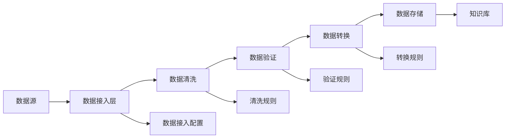

# 3. 数据与知识治理

## 3.1 私有数据接入

### 数据源类型

智能法律解决方案需要接入多种类型的法律数据源：

#### 法律条文数据

**1. 法律法规库**
- **数据来源**：全国人大、国务院、各部委发布的法律法规
- **数据格式**：结构化文本（XML、JSON）
- **更新频率**：实时更新（法律发布后24小时内）
- **数据量**：超过10万条法律法规
- **关键字段**：法律名称、发布机构、生效日期、修订历史、条文内容

**2. 司法解释库**
- **数据来源**：最高人民法院、最高人民检察院发布的司法解释
- **数据格式**：结构化文本
- **更新频率**：实时更新
- **数据量**：超过5000条司法解释
- **关键字段**：解释名称、发布机构、生效日期、适用范围、解释内容

**3. 部门规章库**
- **数据来源**：各部委发布的部门规章
- **数据格式**：结构化文本
- **更新频率**：每日更新
- **数据量**：超过5万条部门规章
- **关键字段**：规章名称、发布机构、生效日期、适用范围、规章内容

**4. 地方性法规库**
- **数据来源**：各省、市人大和政府发布的地方性法规
- **数据格式**：结构化文本
- **更新频率**：每日更新
- **数据量**：超过20万条地方性法规
- **关键字段**：法规名称、发布机构、生效日期、适用范围、法规内容

#### 案例数据

**5. 裁判文书库**
- **数据来源**：中国裁判文书网、各级法院
- **数据格式**：结构化文本（JSON）
- **更新频率**：每日更新
- **数据量**：超过5000万份裁判文书
- **关键字段**：案件名称、审理法院、审理日期、案件类型、争议焦点、判决结果、法律依据

**6. 典型案例库**
- **数据来源**：最高人民法院、各级法院发布的典型案例
- **数据格式**：结构化文本
- **更新频率**：每周更新
- **数据量**：超过10万份典型案例
- **关键字段**：案例名称、发布机构、案例类型、案情摘要、裁判要点、法律适用

**7. 指导案例库**
- **数据来源**：最高人民法院发布的指导案例
- **数据格式**：结构化文本
- **更新频率**：每月更新
- **数据量**：超过200个指导案例
- **关键字段**：案例编号、案例名称、关键词、裁判要点、相关法条、基本案情、裁判结果

#### 合同模板数据

**8. 标准合同模板库**
- **数据来源**：律师事务所、企业法务部门提供的标准合同模板
- **数据格式**：Word文档、PDF文档
- **更新频率**：按需更新
- **数据量**：超过1000个标准合同模板
- **关键字段**：合同类型、适用场景、标准条款、风险提示、修改建议

**9. 合同审查规则库**
- **数据来源**：法律专家制定的审查规则
- **数据格式**：结构化规则（JSON、YAML）
- **更新频率**：按需更新
- **数据量**：超过5000条审查规则
- **关键字段**：规则名称、适用合同类型、风险等级、检查项、处理建议

#### 企业私有数据

**10. 企业合同库**
- **数据来源**：企业内部合同管理系统
- **数据格式**：Word文档、PDF文档、结构化数据
- **更新频率**：实时同步
- **数据量**：根据企业规模，从数千到数万份合同
- **关键字段**：合同编号、合同类型、签约方、签约日期、合同金额、合同状态

**11. 企业案例库**
- **数据来源**：企业内部法律案例库
- **数据格式**：结构化文本、文档
- **更新频率**：按需更新
- **数据量**：根据企业规模，从数百到数千个案例
- **关键字段**：案例名称、案例类型、处理结果、经验总结、相关文档

### 数据接入流程

#### 数据接入步骤

**步骤1：数据源识别和评估**
- 识别数据源类型和格式
- 评估数据质量和完整性
- 确定数据接入方式（API、文件导入、数据库同步等）

**步骤2：数据接入配置**
- 配置数据源连接信息（API密钥、数据库连接等）
- 设置数据同步频率和策略
- 配置数据过滤和清洗规则

**步骤3：数据接入测试**
- 在测试环境测试数据接入
- 验证数据格式和内容
- 检查数据质量

**步骤4：数据接入上线**
- 在生产环境配置数据接入
- 启动数据同步任务
- 监控数据接入状态

**步骤5：数据质量监控**
- 监控数据更新频率
- 检查数据质量指标
- 及时发现和处理数据问题

#### 数据接入架构

### 数据质量保证

#### 数据质量指标

**完整性**：
- 数据字段完整率≥95%
- 关键字段缺失率&lt;1%
- 数据记录完整率≥98%

**准确性**：
- 数据准确率≥99%
- 法律条文引用准确率100%
- 案例信息准确率≥98%

**及时性**：
- 法律条文更新延迟&lt;24小时
- 案例数据更新延迟&lt;48小时
- 企业数据同步延迟&lt;1小时

**一致性**：
- 数据格式一致性100%
- 数据编码一致性100%
- 数据命名一致性≥95%

#### 数据质量保证措施

**数据清洗**：
- 去除重复数据
- 修正错误数据
- 补充缺失数据
- 标准化数据格式

**数据验证**：
- 格式验证：验证数据格式是否符合规范
- 内容验证：验证数据内容是否合理
- 关联验证：验证数据关联关系是否正确

**数据监控**：
- 实时监控数据质量指标
- 及时发现数据质量问题
- 自动告警数据异常

**数据修复**：
- 自动修复常见数据问题
- 人工审核和修复复杂问题
- 记录数据修复历史

## 3.2 向量知识库

### 知识库构建

#### 法律知识库结构

智能法律解决方案构建多层次的向量知识库：

**1. 法条知识库**
- **内容**：法律法规、司法解释、部门规章、地方性法规
- **向量化粒度**：按条文级别向量化
- **索引结构**：法律类型、发布机构、生效日期、适用范围
- **向量维度**：768维（基于BERT）或1536维（基于OpenAI Embedding）

**2. 案例知识库**
- **内容**：裁判文书、典型案例、指导案例
- **向量化粒度**：按案例级别和关键段落级别向量化
- **索引结构**：案件类型、审理法院、审理日期、争议焦点
- **向量维度**：768维或1536维

**3. 合同知识库**
- **内容**：标准合同模板、合同审查规则、风险条款库
- **向量化粒度**：按条款级别向量化
- **索引结构**：合同类型、适用场景、风险等级
- **向量维度**：768维或1536维

**4. 法律概念知识库**
- **内容**：法律概念、法律术语、法律关系
- **向量化粒度**：按概念级别向量化
- **索引结构**：概念类型、所属领域、相关概念
- **向量维度**：768维或1536维

#### 知识库构建流程

**步骤1：数据收集和预处理**
- 收集法律数据源
- 数据清洗和格式化
- 数据分类和标注

**步骤2：文本分块**
- 按照语义单元分块（法条、案例段落、合同条款等）
- 设置合理的块大小（通常256-512 tokens）
- 保留上下文信息

**步骤3：向量化**
- 使用法律领域微调的Embedding模型
- 生成文本向量
- 存储向量和元数据

**步骤4：索引构建**
- 构建向量索引（使用Milvus、Qdrant等）
- 构建元数据索引（使用Elasticsearch等）
- 优化索引性能

**步骤5：质量验证**
- 验证向量质量
- 测试检索效果
- 优化检索策略

### 向量化策略

#### Embedding模型选择

**1. 通用Embedding模型**
- **OpenAI text-embedding-ada-002**：1536维，通用性强
- **OpenAI text-embedding-3-large**：3072维，性能更好
- **优势**：通用性好，易于使用
- **劣势**：对法律领域理解可能不够深入

**2. 法律领域微调模型**
- **基于BERT的法律领域微调模型**：768维
- **基于RoBERTa的法律领域微调模型**：768维
- **优势**：对法律领域理解深入，检索准确率高
- **劣势**：需要训练和维护

**3. 多模型融合**
- 结合通用模型和法律领域模型
- 使用加权平均或学习融合策略
- 提升检索准确率和召回率

#### 向量化优化策略

**1. 文本预处理**
- 去除无关字符和格式
- 标准化法律术语
- 保留关键信息（法条编号、案例名称等）

**2. 分块策略**
- **固定长度分块**：按固定token数分块，简单高效
- **语义分块**：按语义单元分块，保留完整语义
- **重叠分块**：相邻块之间重叠，避免边界信息丢失

**3. 元数据增强**
- 添加法律类型、发布机构、生效日期等元数据
- 使用元数据进行过滤和排序
- 提升检索准确率

### 检索优化

#### 检索策略

**1. 混合检索（Hybrid Search）**
- **向量检索**：基于语义相似度检索
- **关键词检索**：基于BM25等传统检索方法
- **融合策略**：使用RRF（Reciprocal Rank Fusion）等方法融合结果

**2. 多阶段检索**
- **第一阶段**：粗检索，使用向量检索获取候选结果
- **第二阶段**：精检索，使用重排序模型对候选结果排序
- **优势**：平衡检索速度和准确率

**3. 查询扩展**
- **同义词扩展**：扩展法律术语的同义词
- **相关概念扩展**：扩展相关法律概念
- **提升召回率**

#### 检索优化技术

**1. 重排序（Reranking）**
- 使用Cross-Encoder模型对检索结果重排序
- 提升Top-K结果的准确率
- 常用模型：BGE-Reranker、Cohere Rerank

**2. 查询理解**
- 理解用户查询意图
- 提取关键法律要素
- 优化查询向量

**3. 结果过滤**
- 基于元数据过滤（法律类型、时间范围等）
- 基于置信度过滤
- 提升结果相关性

#### 检索性能优化

**1. 索引优化**
- 使用HNSW索引算法（Milvus）
- 优化索引参数（M、ef_construction等）
- 定期重建索引

**2. 缓存策略**
- 缓存热门查询结果
- 缓存向量计算结果
- 提升响应速度

**3. 并行检索**
- 并行检索多个知识库
- 并行计算多个查询
- 提升检索速度

## 3.3 数据版本与血缘

### 版本管理

#### 法律数据版本管理

法律数据具有时效性，需要严格的版本管理：

**1. 法条版本管理**
- **版本标识**：使用法律发布版本号和时间戳
- **版本历史**：记录法条的修订历史
- **版本对比**：支持不同版本法条的对比
- **版本查询**：支持按时间点查询特定版本的法条

**2. 案例版本管理**
- **版本标识**：使用案例ID和时间戳
- **版本历史**：记录案例的更新历史（如二审、再审等）
- **版本关联**：关联同一案例的不同版本

**3. 合同模板版本管理**
- **版本标识**：使用模板ID和版本号
- **版本历史**：记录模板的修订历史
- **版本对比**：支持不同版本模板的对比

#### 版本管理策略

**1. 时间点版本**
- 为每个数据版本记录时间点
- 支持按时间点查询历史版本
- 适用于法条、案例等有时间属性的数据

**2. 语义版本**
- 使用语义版本号（如1.0.0、1.1.0等）
- 主版本号：重大修订
- 次版本号：功能增加
- 修订版本号：错误修复

**3. 快照版本**
- 定期创建数据快照
- 支持快速回滚到历史快照
- 适用于大规模数据版本管理

### 血缘追踪

#### 数据血缘关系

法律数据之间存在复杂的血缘关系：

**1. 法条血缘关系**
- **修订关系**：法条的修订版本关系
- **引用关系**：法条之间的引用关系
- **层级关系**：法律、法规、规章之间的层级关系

**2. 案例血缘关系**
- **审理关系**：一审、二审、再审之间的关系
- **引用关系**：案例之间的引用关系
- **相似关系**：相似案例之间的关系

**3. 合同血缘关系**
- **模板关系**：合同与模板之间的关系
- **修订关系**：合同修订版本之间的关系
- **关联关系**：相关合同之间的关系

#### 血缘追踪实现

**1. 血缘图构建**
- 使用图数据库（Neo4j）存储血缘关系
- 构建血缘关系图
- 支持血缘关系查询和可视化

**2. 血缘追踪查询**
- 查询数据的上游来源
- 查询数据的下游影响
- 查询数据的完整血缘链

**3. 血缘影响分析**
- 分析数据变更的影响范围
- 识别受影响的数据和系统
- 支持影响分析报告生成

### 数据治理流程

#### 数据治理组织

**1. 数据治理委员会**
- 制定数据治理政策和标准
- 审批数据治理重大决策
- 监督数据治理执行

**2. 数据管理团队**
- 负责数据质量管理
- 负责数据版本管理
- 负责数据血缘管理

**3. 数据使用团队**
- 负责数据使用规范
- 负责数据质量反馈
- 负责数据需求提出

#### 数据治理流程

**1. 数据接入流程**
- 数据源评估 → 数据接入申请 → 数据接入审批 → 数据接入实施 → 数据质量验证

**2. 数据更新流程**
- 数据更新申请 → 数据更新审批 → 数据更新实施 → 数据质量验证 → 版本发布

**3. 数据质量监控流程**
- 数据质量监控 → 质量问题发现 → 问题分析 → 问题修复 → 质量验证

**4. 数据版本管理流程**
- 版本创建申请 → 版本审批 → 版本创建 → 版本发布 → 版本归档

#### 数据治理工具

**1. 数据质量监控工具**
- 实时监控数据质量指标
- 自动发现数据质量问题
- 生成数据质量报告

**2. 数据版本管理工具**
- 管理数据版本
- 支持版本对比和回滚
- 生成版本变更报告

**3. 数据血缘追踪工具**
- 可视化数据血缘关系
- 支持血缘查询和分析
- 生成血缘影响分析报告
