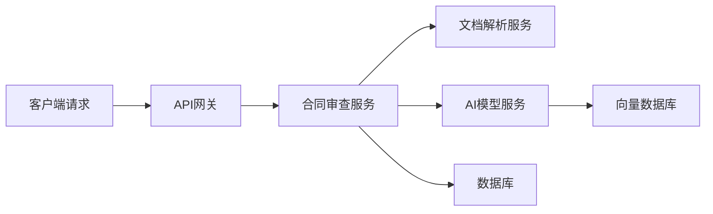

# 9. 监控与可观测

## 9.1 业务指标

### 核心业务指标

智能法律解决方案的核心业务指标包括：

#### 1. 合同审查指标

**审查数量**：
- **定义**：每日/每周/每月审查的合同数量
- **计算方法**：`count(contract_review_requests)`
- **目标值**：日均1000份，月均30000份
- **监控频率**：实时监控

**审查准确率**：
- **定义**：审查结果准确的合同占比
- **计算方法**：`accurate_reviews / total_reviews`
- **目标值**：≥95%
- **监控频率**：每日统计

**审查效率**：
- **定义**：平均每份合同审查耗时
- **计算方法**：`avg(review_duration)`
- **目标值**：≤15分钟/份
- **监控频率**：实时监控

**风险识别率**：
- **定义**：识别出风险的合同占比
- **计算方法**：`contracts_with_risks / total_contracts`
- **目标值**：根据合同类型不同，20-40%
- **监控频率**：每日统计

#### 2. 案例检索指标

**检索数量**：
- **定义**：每日/每周/每月检索案例的次数
- **计算方法**：`count(case_retrieval_requests)`
- **目标值**：日均500次，月均15000次
- **监控频率**：实时监控

**检索准确率**：
- **定义**：检索结果相关的案例占比
- **计算方法**：`relevant_cases / total_retrieved_cases`
- **目标值**：≥85%
- **监控频率**：每日统计

**检索效率**：
- **定义**：平均每次检索耗时
- **计算方法**：`avg(retrieval_duration)`
- **目标值**：≤10秒/次
- **监控频率**：实时监控

**案例相关性**：
- **定义**：检索结果的平均相关性分数
- **计算方法**：`avg(relevance_score)`
- **目标值**：≥0.8
- **监控频率**：实时监控

#### 3. 法条匹配指标

**匹配数量**：
- **定义**：每日/每周/每月匹配法条的次数
- **计算方法**：`count(law_matching_requests)`
- **目标值**：日均300次，月均9000次
- **监控频率**：实时监控

**匹配准确率**：
- **定义**：匹配结果准确的法条占比
- **计算方法**：`accurate_matches / total_matches`
- **目标值**：≥95%
- **监控频率**：每日统计

**匹配效率**：
- **定义**：平均每次匹配耗时
- **计算方法**：`avg(matching_duration)`
- **目标值**：≤5秒/次
- **监控频率**：实时监控

#### 4. 用户指标

**活跃用户数**：
- **定义**：每日/每周/每月活跃用户数
- **计算方法**：`count(distinct user_id)`
- **目标值**：日均500，月均10000
- **监控频率**：每日统计

**用户满意度**：
- **定义**：用户对服务的平均评分
- **计算方法**：`avg(user_rating)`
- **目标值**：≥4.5/5.0
- **监控频率**：每日统计

**用户留存率**：
- **定义**：用户继续使用服务的比例
- **计算方法**：`retained_users / total_users`
- **目标值**：月留存率≥60%
- **监控频率**：每月统计

### 指标监控

#### 监控系统架构

**Prometheus + Grafana**：
- **数据采集**：Prometheus采集指标数据
- **数据存储**：Prometheus时序数据库
- **数据可视化**：Grafana展示监控面板
- **告警**：AlertManager发送告警

**监控指标采集**：
```python
from prometheus_client import Counter, Histogram, Gauge

# 定义指标
contract_review_total = Counter(
    'contract_review_total',
    'Total number of contract reviews',
    ['contract_type', 'status']
)

contract_review_duration = Histogram(
    'contract_review_duration_seconds',
    'Contract review duration',
    ['contract_type']
)

active_users = Gauge(
    'active_users_total',
    'Total number of active users'
)

# 记录指标
contract_review_total.labels(contract_type='买卖合同', status='success').inc()
contract_review_duration.labels(contract_type='买卖合同').observe(duration)
active_users.set(user_count)
```

#### 监控面板

**业务概览面板**：
- 今日审查合同数量
- 今日检索案例数量
- 今日匹配法条数量
- 活跃用户数
- 系统使用率

**合同审查面板**：
- 审查数量趋势
- 审查准确率趋势
- 审查效率趋势
- 风险识别率趋势

**案例检索面板**：
- 检索数量趋势
- 检索准确率趋势
- 检索效率趋势
- 案例相关性趋势

### 告警机制

#### 告警规则

**1. 业务告警**
- **审查准确率下降**：准确率 &lt; 90%，持续10分钟
- **检索准确率下降**：准确率 &lt; 80%，持续10分钟
- **匹配准确率下降**：准确率 &lt; 90%，持续10分钟
- **用户满意度下降**：满意度 &lt; 4.0，持续1小时

**2. 性能告警**
- **响应时间过长**：P95响应时间 &gt; 30秒，持续5分钟
- **错误率过高**：错误率 &gt; 5%，持续5分钟
- **吞吐量下降**：QPS下降50%，持续10分钟

**3. 系统告警**
- **服务不可用**：服务健康检查失败，持续1分钟
- **资源使用率过高**：CPU > 90%或内存 > 90%，持续5分钟
- **数据库连接失败**：数据库连接失败率 > 10%，持续5分钟

#### 告警配置

**Prometheus告警规则**：
```yaml
groups:
  - name: legal_business_alerts
    rules:
      - alert: ContractReviewAccuracyLow
        expr: contract_review_accuracy < 0.9
        for: 10m
        labels:
          severity: warning
        annotations:
          summary: "合同审查准确率下降"
          description: "合同审查准确率低于90%，当前值：{{ $value }}"
      
      - alert: CaseRetrievalAccuracyLow
        expr: case_retrieval_accuracy < 0.8
        for: 10m
        labels:
          severity: warning
        annotations:
          summary: "案例检索准确率下降"
          description: "案例检索准确率低于80%，当前值：{{ $value }}"
      
      - alert: APIResponseTimeHigh
        expr: histogram_quantile(0.95, api_request_duration_seconds_bucket) > 30
        for: 5m
        labels:
          severity: critical
        annotations:
          summary: "API响应时间过长"
          description: "P95响应时间超过30秒，当前值：{{ $value }}秒"
```

## 9.2 模型指标

### 模型性能指标

#### 1. 准确率指标

**合同审查准确率**：
- **定义**：审查结果准确的合同占比
- **计算方法**：基于人工标注的测试集评估
- **目标值**：≥95%
- **监控频率**：每周评估

**案例检索准确率**：
- **定义**：检索结果相关的案例占比
- **计算方法**：基于相关性标注评估
- **目标值**：≥85%
- **监控频率**：每周评估

**法条匹配准确率**：
- **定义**：匹配结果准确的法条占比
- **计算方法**：基于法律专家标注评估
- **目标值**：≥95%
- **监控频率**：每周评估

#### 2. 性能指标

**推理延迟**：
- **定义**：模型推理的平均延迟
- **计算方法**：`avg(inference_latency)`
- **目标值**：≤2秒
- **监控频率**：实时监控

**吞吐量**：
- **定义**：每秒处理的请求数
- **计算方法**：`requests_per_second`
- **目标值**：≥100 QPS
- **监控频率**：实时监控

**资源使用率**：
- **定义**：GPU/CPU/内存使用率
- **计算方法**：`resource_usage / resource_total`
- **目标值**：70-80%（避免过高或过低）
- **监控频率**：实时监控

### 模型监控

#### 模型性能监控

**实时监控**：
- 推理延迟
- 吞吐量
- 资源使用率
- 错误率

**定期评估**：
- 准确率评估（每周）
- 模型对比（每月）
- A/B测试结果分析

#### 模型退化检测

**检测方法**：
- **准确率下降**：准确率持续下降超过阈值
- **延迟增加**：推理延迟持续增加
- **错误率上升**：错误率持续上升

**检测实现**：
```python
class ModelDegradationDetector:
    def __init__(self, threshold=0.05):
        self.threshold = threshold
        self.baseline_accuracy = None
    
    def detect_degradation(self, current_accuracy):
        """检测模型退化"""
        if self.baseline_accuracy is None:
            self.baseline_accuracy = current_accuracy
            return False
        
        degradation = self.baseline_accuracy - current_accuracy
        if degradation > self.threshold:
            return True
        return False
```

### 模型退化检测

#### 检测策略

**1. 统计过程控制（SPC）**
- 使用控制图监控模型性能
- 检测异常波动
- 识别性能趋势

**2. 时间序列分析**
- 分析性能指标的时间序列
- 检测趋势变化
- 预测性能退化

**3. 对比分析**
- 对比不同版本模型性能
- 对比不同时间段性能
- 识别性能差异

#### 退化处理

**1. 告警通知**
- 检测到退化时立即告警
- 通知相关团队
- 记录退化事件

**2. 自动降级**
- 切换到备用模型
- 使用规则引擎作为备用
- 保证服务可用性

**3. 模型重训练**
- 收集新数据
- 重新训练模型
- 部署新模型

## 9.3 链路追踪

### 追踪系统

#### 分布式追踪架构

**Jaeger**：
- **功能**：分布式追踪系统
- **数据采集**：OpenTracing标准
- **数据存储**：Elasticsearch
- **数据可视化**：Jaeger UI

**追踪流程**：


#### 追踪实现

**使用OpenTelemetry实现追踪**：
```python
from opentelemetry import trace
from opentelemetry.sdk.trace import TracerProvider
from opentelemetry.sdk.trace.export import BatchSpanProcessor
from opentelemetry.exporter.jaeger import JaegerExporter

# 配置追踪
trace.set_tracer_provider(TracerProvider())
jaeger_exporter = JaegerExporter(
    agent_host_name="jaeger",
    agent_port=6831
)
trace.get_tracer_provider().add_span_processor(
    BatchSpanProcessor(jaeger_exporter)
)

# 创建追踪器
tracer = trace.get_tracer(__name__)

# 使用追踪
def contract_review(contract_id):
    with tracer.start_as_current_span("contract_review") as span:
        span.set_attribute("contract_id", contract_id)
        # 处理逻辑
        result = process_contract(contract_id)
        span.set_attribute("result.status", "success")
        return result
```

### 日志管理

#### 日志架构

**ELK Stack**：
- **Logstash**：日志采集和处理
- **Elasticsearch**：日志存储和检索
- **Kibana**：日志可视化和分析

**日志级别**：
- **DEBUG**：调试信息
- **INFO**：一般信息
- **WARNING**：警告信息
- **ERROR**：错误信息
- **CRITICAL**：严重错误

#### 日志格式

**结构化日志**：
```json
{
  "timestamp": "2024-01-01T00:00:00Z",
  "level": "INFO",
  "service": "legal-api",
  "trace_id": "abc123",
  "span_id": "def456",
  "message": "Contract review completed",
  "context": {
    "contract_id": "contract_123",
    "duration": 15.5,
    "status": "success"
  }
}
```

**日志采集**：
```python
import logging
import json
from pythonjsonlogger import jsonlogger

# 配置日志
logHandler = logging.StreamHandler()
formatter = jsonlogger.JsonFormatter()
logHandler.setFormatter(formatter)
logger = logging.getLogger()
logger.addHandler(logHandler)
logger.setLevel(logging.INFO)

# 记录日志
logger.info("Contract review completed", extra={
    "contract_id": "contract_123",
    "duration": 15.5,
    "status": "success"
})
```

### 问题定位

#### 问题定位流程

**1. 告警触发**
- 系统告警或用户反馈
- 记录告警信息
- 分配处理人员

**2. 日志分析**
- 查看相关日志
- 分析错误信息
- 定位问题范围

**3. 链路追踪**
- 查看请求链路
- 定位问题服务
- 分析调用关系

**4. 性能分析**
- 分析性能指标
- 识别性能瓶颈
- 定位性能问题

**5. 问题修复**
- 修复问题
- 验证修复效果
- 更新监控规则

#### 问题定位工具

**1. 日志查询**
- 使用Kibana查询日志
- 过滤和搜索日志
- 分析日志模式

**2. 链路追踪**
- 使用Jaeger查看链路
- 分析调用关系
- 识别性能瓶颈

**3. 性能分析**
- 使用Grafana查看性能指标
- 分析性能趋势
- 识别异常模式
