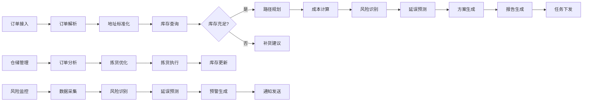
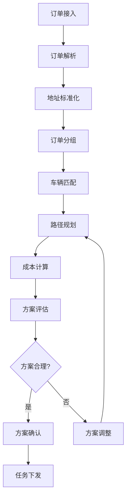
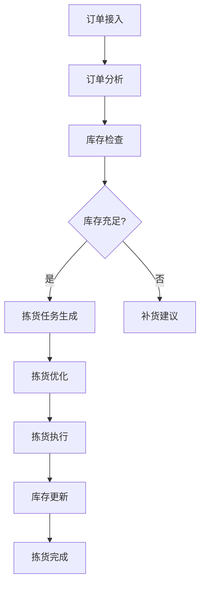
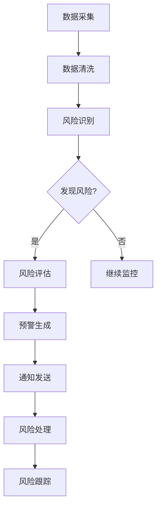

# 5. 智能体与业务编排

## 5.1 Agent技能链

### 技能定义

智能物流Agent需要具备多种技能，通过技能链组合完成复杂任务：

#### 核心技能

**1. 订单解析技能（Order Parsing）**
- **功能**：解析订单信息，提取关键字段
- **输入**：订单数据（JSON、XML、CSV等）
- **输出**：解析后的订单信息（地址、重量、体积、时效要求等）
- **实现**：基于Python数据处理库（pandas、json等）
- **应用场景**：订单接入、订单处理

**2. 地址标准化技能（Address Normalization）**
- **功能**：标准化地址格式，进行地理编码
- **输入**：地址文本
- **输出**：标准化地址和经纬度
- **实现**：基于地图API（高德地图、百度地图等）
- **应用场景**：地址处理、地理编码

**3. 路径规划技能（Route Planning）**
- **功能**：规划最优配送路径
- **输入**：订单信息、车辆信息、司机信息
- **输出**：路径规划方案（路径、车辆分配、时间窗口）
- **实现**：基于优化算法（TSP、VRP、遗传算法等）
- **应用场景**：路径规划、车辆调度

**4. 库存查询技能（Inventory Query）**
- **功能**：查询库存信息
- **输入**：仓库ID、SKU ID
- **输出**：库存信息（数量、位置、状态等）
- **实现**：基于数据库查询（MySQL、Redis等）
- **应用场景**：库存管理、订单处理

**5. 拣货优化技能（Picking Optimization）**
- **功能**：优化拣货路径和顺序
- **输入**：订单信息、库存信息、仓储布局
- **输出**：拣货方案（拣货顺序、路径、货位）
- **实现**：基于优化算法（TSP、贪心算法等）
- **应用场景**：拣货管理、仓储优化

**6. 风险识别技能（Risk Identification）**
- **功能**：识别物流过程中的风险
- **输入**：物流数据（GPS、订单、天气、交通等）
- **输出**：风险识别结果（风险类型、风险等级、影响范围）
- **实现**：基于预测模型（LSTM、XGBoost等）
- **应用场景**：风险预警、异常检测

**7. 延误预测技能（Delay Prediction）**
- **功能**：预测配送延误情况
- **输入**：订单信息、GPS数据、天气数据、交通数据
- **输出**：延误预测结果（延误概率、延误时间、原因分析）
- **实现**：基于时序预测模型（LSTM、Transformer等）
- **应用场景**：延误预警、时效管理

**8. 成本计算技能（Cost Calculation）**
- **功能**：计算配送成本
- **输入**：路径信息、车辆信息、订单信息
- **输出**：成本计算结果（距离成本、时间成本、总成本）
- **实现**：基于成本模型和规则引擎
- **应用场景**：成本分析、报价计算

**9. 报告生成技能（Report Generation）**
- **功能**：生成物流分析报告
- **输入**：分析结果、报告模板
- **输出**：格式化的报告文档
- **实现**：基于模板引擎和大语言模型
- **应用场景**：报告生成、数据分析

### 技能链设计

技能链按照业务流程组织，形成完整的处理流程：



## 5.2 业务流程编排

### 路径规划流程

#### 流程设计



#### n8n工作流配置

```yaml
workflow:
  name: 智能路径规划
  triggers:
    - type: webhook
      path: /api/route-planning
  nodes:
    - id: receive-orders
      type: webhook
      parameters:
        path: /api/route-planning
        method: POST
    
    - id: parse-orders
      type: function
      parameters:
        function: |
          function parseOrders(orders) {
            return orders.map(order => ({
              id: order.id,
              address: order.address,
              weight: order.weight,
              volume: order.volume,
              timeWindow: order.timeWindow
            }));
          }
    
    - id: normalize-addresses
      type: http-request
      parameters:
        method: POST
        url: http://map-api/normalize
        body: ${$json.orders}
    
    - id: group-orders
      type: function
      parameters:
        function: |
          function groupOrders(orders) {
            // 按区域、时效要求等分组
            return groupByRegionAndTime(orders);
          }
    
    - id: match-vehicles
      type: http-request
      parameters:
        method: POST
        url: http://vehicle-api/match
        body: ${$json.orderGroups}
    
    - id: plan-routes
      type: http-request
      parameters:
        method: POST
        url: http://route-api/plan
        body: ${$json.matchedVehicles}
    
    - id: calculate-costs
      type: function
      parameters:
        function: |
          function calculateCosts(routes) {
            return routes.map(route => ({
              ...route,
              cost: calculateRouteCost(route)
            }));
          }
    
    - id: evaluate-solutions
      type: if
      conditions:
        - value1: ${$json.cost}
          operation: lessThan
          value2: threshold
    
    - id: confirm-solution
      type: function
      parameters:
        function: |
          function confirmSolution(solution) {
            return {
              status: 'confirmed',
              solution: solution
            };
          }
    
    - id: dispatch-tasks
      type: http-request
      parameters:
        method: POST
        url: http://task-api/dispatch
        body: ${$json.solution}
    
    - id: return-result
      type: respond-to-webhook
      parameters:
        responseBody: ${$json}
```

### 仓储管理流程

#### 流程设计



#### n8n工作流配置

```yaml
workflow:
  name: 智能仓储管理
  triggers:
    - type: webhook
      path: /api/warehouse-management
  nodes:
    - id: receive-orders
      type: webhook
    
    - id: analyze-orders
      type: function
      parameters:
        function: |
          function analyzeOrders(orders) {
            return {
              skuList: extractSKUs(orders),
              totalQuantity: calculateTotalQuantity(orders),
              priority: calculatePriority(orders)
            };
          }
    
    - id: check-inventory
      type: http-request
      parameters:
        method: POST
        url: http://inventory-api/check
        body: ${$json.skuList}
    
    - id: generate-picking-tasks
      type: function
      parameters:
        function: |
          function generatePickingTasks(inventory, orders) {
            return orders.map(order => ({
              orderId: order.id,
              pickingItems: order.items.map(item => ({
                skuId: item.skuId,
                quantity: item.quantity,
                location: findLocation(item.skuId, inventory)
              }))
            }));
          }
    
    - id: optimize-picking
      type: http-request
      parameters:
        method: POST
        url: http://picking-api/optimize
        body: ${$json.pickingTasks}
    
    - id: execute-picking
      type: http-request
      parameters:
        method: POST
        url: http://picking-api/execute
        body: ${$json.optimizedTasks}
    
    - id: update-inventory
      type: http-request
      parameters:
        method: POST
        url: http://inventory-api/update
        body: ${$json.pickingResults}
```

### 风险预警流程

#### 流程设计



#### n8n工作流配置

```yaml
workflow:
  name: 智能风险预警
  triggers:
    - type: schedule
      cron: "*/5 * * * *"  # 每5分钟执行一次
  nodes:
    - id: collect-data
      type: http-request
      parameters:
        method: GET
        url: http://data-api/collect
        qs:
          type: gps,orders,weather,traffic
    
    - id: clean-data
      type: function
      parameters:
        function: |
          function cleanData(data) {
            return {
              gps: cleanGPSData(data.gps),
              orders: cleanOrderData(data.orders),
              weather: cleanWeatherData(data.weather),
              traffic: cleanTrafficData(data.traffic)
            };
          }
    
    - id: identify-risks
      type: http-request
      parameters:
        method: POST
        url: http://risk-api/identify
        body: ${$json.cleanedData}
    
    - id: evaluate-risks
      type: function
      parameters:
        function: |
          function evaluateRisks(risks) {
            return risks.map(risk => ({
              ...risk,
              level: calculateRiskLevel(risk),
              impact: calculateImpact(risk)
            }));
          }
    
    - id: generate-alerts
      type: function
      parameters:
        function: |
          function generateAlerts(evaluatedRisks) {
            return evaluatedRisks
              .filter(risk => risk.level >= 'medium')
              .map(risk => ({
                alertNo: generateAlertNo(),
                type: risk.type,
                level: risk.level,
                content: generateAlertContent(risk),
                recipients: getRecipients(risk)
              }));
          }
    
    - id: send-notifications
      type: http-request
      parameters:
        method: POST
        url: http://notification-api/send
        body: ${$json.alerts}
    
    - id: track-risks
      type: http-request
      parameters:
        method: POST
        url: http://risk-api/track
        body: ${$json.alerts}
```

## 5.3 MCP工具集成

### 地图服务工具

#### 地理编码工具

```python
@mcp_tool
def geocode_address(address: str) -> dict:
    """
    地理编码：将地址转换为经纬度
    
    Args:
        address: 地址文本
    
    Returns:
        {
            "lat": 纬度,
            "lng": 经度,
            "formatted_address": 格式化地址,
            "province": 省,
            "city": 市,
            "district": 区
        }
    """
    # 调用地图API进行地理编码
    result = map_api.geocode(address)
    return {
        "lat": result["lat"],
        "lng": result["lng"],
        "formatted_address": result["formatted_address"],
        "province": result["province"],
        "city": result["city"],
        "district": result["district"]
    }
```

#### 路径规划工具

```python
@mcp_tool
def plan_route(origin: dict, destination: dict, waypoints: list = None) -> dict:
    """
    路径规划：规划从起点到终点的路径
    
    Args:
        origin: 起点 {"lat": 纬度, "lng": 经度}
        destination: 终点 {"lat": 纬度, "lng": 经度}
        waypoints: 途经点列表（可选）
    
    Returns:
        {
            "distance": 距离(km),
            "duration": 时间(分钟),
            "route": 路径坐标列表,
            "steps": 路径步骤列表
        }
    """
    # 调用地图API进行路径规划
    result = map_api.route(origin, destination, waypoints)
    return {
        "distance": result["distance"],
        "duration": result["duration"],
        "route": result["route"],
        "steps": result["steps"]
    }
```

#### 距离计算工具

```python
@mcp_tool
def calculate_distance(point1: dict, point2: dict) -> float:
    """
    计算两点之间的距离
    
    Args:
        point1: 点1 {"lat": 纬度, "lng": 经度}
        point2: 点2 {"lat": 纬度, "lng": 经度}
    
    Returns:
        距离(km)
    """
    # 使用Haversine公式计算距离
    from math import radians, sin, cos, sqrt, atan2
    
    lat1, lng1 = radians(point1["lat"]), radians(point1["lng"])
    lat2, lng2 = radians(point2["lat"]), radians(point2["lng"])
    
    dlat = lat2 - lat1
    dlng = lng2 - lng1
    
    a = sin(dlat/2)**2 + cos(lat1) * cos(lat2) * sin(dlng/2)**2
    c = 2 * atan2(sqrt(a), sqrt(1-a))
    
    distance = 6371 * c  # 地球半径6371km
    return distance
```

### 天气服务工具

#### 天气查询工具

```python
@mcp_tool
def get_weather(location: dict, date: str = None) -> dict:
    """
    查询天气信息
    
    Args:
        location: 位置 {"lat": 纬度, "lng": 经度} 或 {"city": 城市名}
        date: 日期（可选，默认今天）
    
    Returns:
        {
            "date": 日期,
            "weather": 天气状况,
            "temperature": 温度,
            "wind_speed": 风速,
            "precipitation": 降雨量,
            "visibility": 能见度
        }
    """
    # 调用天气API查询天气
    result = weather_api.get_weather(location, date)
    return {
        "date": result["date"],
        "weather": result["weather"],
        "temperature": result["temperature"],
        "wind_speed": result["wind_speed"],
        "precipitation": result["precipitation"],
        "visibility": result["visibility"]
    }
```

### 交通服务工具

#### 路况查询工具

```python
@mcp_tool
def get_traffic(road: str, city: str) -> dict:
    """
    查询道路路况
    
    Args:
        road: 道路名称
        city: 城市名称
    
    Returns:
        {
            "road": 道路名称,
            "congestion_level": 拥堵程度(0-10),
            "speed": 速度(km/h),
            "status": 状态(畅通/缓行/拥堵/严重拥堵)
        }
    """
    # 调用交通API查询路况
    result = traffic_api.get_traffic(road, city)
    return {
        "road": result["road"],
        "congestion_level": result["congestion_level"],
        "speed": result["speed"],
        "status": result["status"]
    }
```

## 5.4 Dify智能体编排

### 路径规划智能体

#### 智能体配置

```yaml
agent:
  name: 路径规划智能体
  description: 智能路径规划，优化配送路径和成本
  
  tools:
    - geocode_address
    - plan_route
    - calculate_distance
    - get_weather
    - get_traffic
  
  prompt: |
    你是一个专业的物流路径规划专家。你的任务是为一组配送订单规划最优路径。
    
    你需要考虑以下因素：
    1. 订单的地址位置和时效要求
    2. 车辆的载重和体积限制
    3. 司机的工作时间和休息时间
    4. 道路拥堵情况和交通规则
    5. 天气情况对配送的影响
    6. 配送成本和时间
    
    请按照以下步骤进行规划：
    1. 使用geocode_address工具标准化订单地址
    2. 使用get_weather工具查询天气情况
    3. 使用get_traffic工具查询路况信息
    4. 使用plan_route工具规划路径
    5. 使用calculate_distance工具计算距离
    6. 生成最优路径方案
    
    输出格式：JSON格式，包含路径、车辆分配、时间窗口、成本等信息。
  
  model: gpt-4
  temperature: 0.3
  max_tokens: 2000
```

### 风险预警智能体

#### 智能体配置

```yaml
agent:
  name: 风险预警智能体
  description: 智能风险识别和预警
  
  tools:
    - get_weather
    - get_traffic
    - query_order_status
    - query_vehicle_status
  
  prompt: |
    你是一个专业的物流风险预警专家。你的任务是识别和预警物流过程中的风险。
    
    你需要识别以下风险：
    1. 配送延误风险（交通拥堵、天气影响、车辆故障等）
    2. 货物丢失损坏风险（包装问题、运输问题等）
    3. 库存风险（缺货、积压等）
    4. 成本风险（成本上升、效率下降等）
    
    请按照以下步骤进行预警：
    1. 使用query_order_status工具查询订单状态
    2. 使用query_vehicle_status工具查询车辆状态
    3. 使用get_weather工具查询天气情况
    4. 使用get_traffic工具查询路况信息
    5. 分析数据，识别潜在风险
    6. 评估风险等级（高、中、低）
    7. 生成预警信息（风险类型、风险等级、影响范围、应对建议）
    
    输出格式：JSON格式，包含风险类型、风险等级、影响范围、应对建议等信息。
  
  model: gpt-4
  temperature: 0.2
  max_tokens: 1500
```

