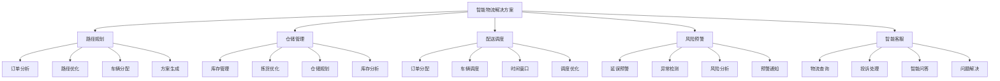
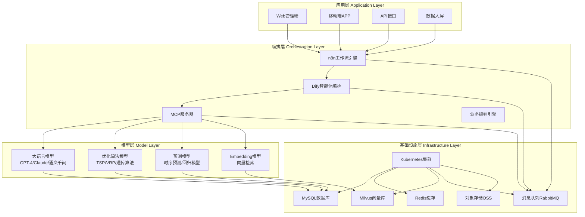
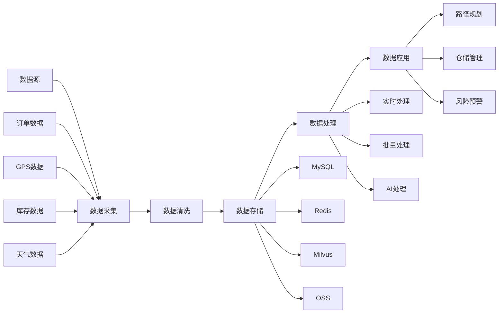
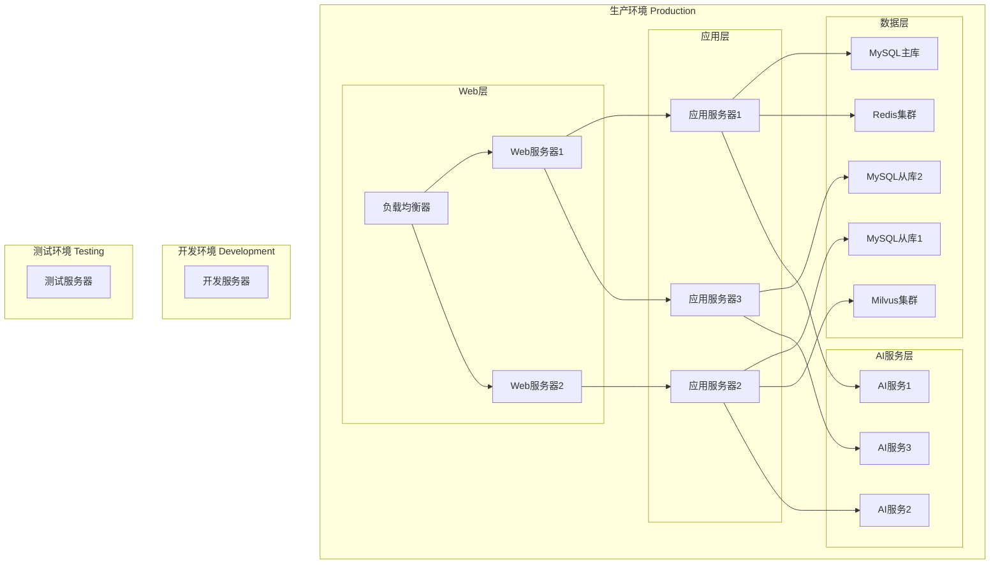
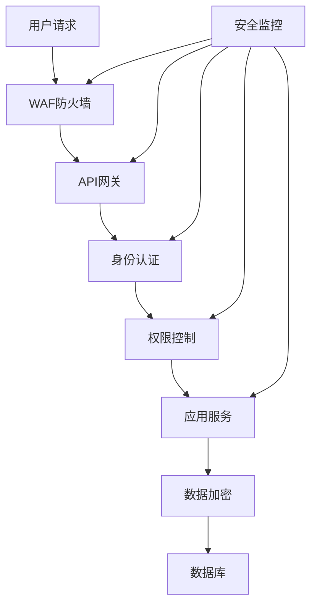

# 2. 总体架构

## 2.1 业务架构

### 角色定义

智能物流解决方案涉及多个角色，每个角色有不同的职责和权限：

- **物流调度员**：
  - 职责：使用智能调度系统进行路径规划、车辆调度、订单分配
  - 权限：访问调度系统，使用AI规划工具，生成调度方案
  - 使用场景：日常调度，路径规划，车辆分配，异常处理

- **仓储管理员**：
  - 职责：使用智能仓储系统进行库存管理、拣货优化、仓储规划
  - 权限：访问仓储系统，使用库存管理工具，生成仓储报告
  - 使用场景：库存管理，拣货优化，仓储规划，库存分析

- **配送员**：
  - 职责：使用移动端应用接收配送任务，导航，签收确认
  - 权限：查看配送任务，导航路线，签收确认
  - 使用场景：接收任务，导航配送，签收确认，异常上报

- **客服人员**：
  - 职责：使用智能客服系统处理客户咨询、投诉处理、物流查询
  - 权限：访问客服系统，使用AI客服工具，查询物流信息
  - 使用场景：客户咨询，投诉处理，物流查询，问题解决

- **系统管理员**：
  - 职责：管理系统配置，监控系统运行，处理系统故障
  - 权限：系统配置，用户管理，监控告警
  - 使用场景：系统维护，用户管理，故障处理

### 用例分析

#### 用例1：智能路径规划

**参与者**：物流调度员、路径规划系统、AI优化引擎

**前置条件**：
- 物流调度员已登录系统
- 配送订单已创建
- 车辆和司机信息已配置

**主流程**：
1. 物流调度员选择需要规划的订单批次
2. 系统获取订单信息（地址、重量、体积、时效要求等）
3. 系统获取车辆和司机信息（位置、载重、工作时间等）
4. AI优化引擎计算最优路径方案
5. 系统生成路径规划方案（包括路径、车辆分配、时间窗口）
6. 物流调度员审核方案，确认或调整
7. 系统下发配送任务到配送员移动端

**异常流程**：
- 如果订单数量过大，系统提示分批处理
- 如果AI规划时间过长，系统提示使用简化算法
- 如果规划方案不合理，调度员可以手动调整

**后置条件**：
- 路径规划方案已生成
- 配送任务已下发
- 车辆和司机已分配

#### 用例2：智能仓储管理

**参与者**：仓储管理员、仓储管理系统、AI优化引擎

**前置条件**：
- 仓储管理员已登录系统
- 仓储布局和库存信息已配置
- 订单信息已同步

**主流程**：
1. 仓储管理员查看待拣货订单列表
2. 系统分析订单信息，生成拣货任务
3. AI优化引擎计算最优拣货路径
4. 系统生成拣货方案（包括拣货顺序、路径、货位）
5. 拣货员使用移动设备执行拣货任务
6. 系统实时更新库存信息
7. 系统生成拣货报告和库存分析报告

**异常流程**：
- 如果库存不足，系统提示补货
- 如果拣货错误，系统提示重新拣货
- 如果货位错误，系统提示调整货位

**后置条件**：
- 拣货任务已完成
- 库存信息已更新
- 拣货报告已生成

#### 用例3：智能配送调度

**参与者**：物流调度员、配送调度系统、AI调度引擎

**前置条件**：
- 物流调度员已登录系统
- 配送订单已创建
- 车辆和司机信息已配置

**主流程**：
1. 物流调度员查看待调度订单
2. 系统分析订单信息（地址、时效、重量、体积等）
3. 系统分析车辆和司机状态（位置、载重、工作时间等）
4. AI调度引擎计算最优调度方案
5. 系统生成调度方案（包括车辆分配、订单分配、时间窗口）
6. 物流调度员审核方案，确认或调整
7. 系统下发调度任务到车辆和司机

**异常流程**：
- 如果车辆不足，系统提示增加车辆或调整订单
- 如果时效要求无法满足，系统提示调整时效或增加车辆
- 如果调度方案不合理，调度员可以手动调整

**后置条件**：
- 调度方案已生成
- 车辆和司机已分配
- 配送任务已下发

#### 用例4：智能风险预警

**参与者**：系统监控员、风险预警系统、AI预警引擎

**前置条件**：
- 系统监控员已登录系统
- 物流数据已接入（GPS、订单、天气等）
- 预警规则已配置

**主流程**：
1. 系统实时监控物流数据（GPS位置、订单状态、天气等）
2. AI预警引擎分析数据，识别潜在风险
3. 系统生成风险预警（包括风险类型、风险等级、影响范围）
4. 系统发送预警通知到相关人员
5. 相关人员查看预警信息，采取应对措施
6. 系统跟踪风险处理情况，更新风险状态

**异常流程**：
- 如果风险等级高，系统立即告警
- 如果风险处理不及时，系统升级告警
- 如果风险已消除，系统自动关闭预警

**后置条件**：
- 风险已识别和预警
- 应对措施已采取
- 风险状态已更新

### 故事地图

智能物流解决方案的用户故事地图如下：



## 2.2 技术架构

### AI-Native四层架构

智能物流解决方案采用AI-Native四层架构，确保系统的智能化、可扩展性和高性能：



### 应用层（Application Layer）

应用层提供多种终端和接口，满足不同用户的使用需求：

#### Web管理端

- **功能**：提供物流调度、仓储管理、数据分析等功能
- **技术栈**：Vue 3 + TypeScript + Vite + TailwindCSS
- **主要页面**：
  - 调度管理：路径规划、车辆调度、订单管理
  - 仓储管理：库存管理、拣货管理、仓储规划
  - 数据分析：运营分析、成本分析、效率分析
  - 系统管理：用户管理、权限管理、系统配置

#### 移动端APP

- **功能**：提供配送任务接收、导航、签收等功能
- **技术栈**：React Native + TypeScript
- **主要功能**：
  - 任务接收：接收配送任务，查看任务详情
  - 导航功能：路径导航，实时位置跟踪
  - 签收确认：签收确认，异常上报
  - 消息通知：接收系统通知，查看消息

#### API接口

- **功能**：提供RESTful API接口，支持第三方系统集成
- **技术栈**：FastAPI + Python 3.11
- **主要接口**：
  - 订单管理：创建订单、查询订单、更新订单
  - 路径规划：路径规划、路径查询、路径优化
  - 仓储管理：库存查询、拣货任务、库存更新
  - 配送调度：调度查询、车辆分配、任务下发

#### 数据大屏

- **功能**：提供实时数据展示和监控
- **技术栈**：Vue 3 + ECharts + WebSocket
- **主要展示**：
  - 实时监控：车辆位置、订单状态、配送进度
  - 数据分析：运营数据、成本数据、效率数据
  - 预警信息：风险预警、异常告警、系统告警

### 编排层（Orchestration Layer）

编排层负责业务流程编排和智能体管理：

#### n8n工作流引擎

- **功能**：业务流程自动化，集成各种系统和服务
- **主要工作流**：
  - 订单处理流程：订单创建 → 路径规划 → 车辆分配 → 任务下发
  - 仓储管理流程：订单分析 → 拣货任务生成 → 拣货执行 → 库存更新
  - 风险预警流程：数据采集 → 风险分析 → 预警生成 → 通知发送

#### Dify智能体编排

- **功能**：AI智能体编排，管理AI模型调用和工具集成
- **主要智能体**：
  - 路径规划智能体：分析订单，调用优化算法，生成路径方案
  - 仓储管理智能体：分析库存，生成拣货方案，优化仓储布局
  - 风险预警智能体：分析数据，识别风险，生成预警信息

#### MCP服务器

- **功能**：Model Context Protocol服务器，提供工具和服务集成
- **主要服务**：
  - 地图服务：路径规划、地理编码、距离计算
  - 天气服务：天气查询、天气预报、天气预警
  - 交通服务：路况查询、交通预测、路线推荐

#### 业务规则引擎

- **功能**：业务规则管理，支持规则配置和动态调整
- **主要规则**：
  - 路径规划规则：时效要求、车辆限制、区域限制
  - 仓储管理规则：库存阈值、补货规则、拣货规则
  - 调度规则：车辆分配规则、订单分配规则、时间窗口规则

### 模型层（Model Layer）

模型层提供各种AI模型和算法：

#### 大语言模型（LLM）

- **GPT-4**：
  - 适用场景：复杂业务分析、报告生成、智能问答
  - 使用场景：物流分析、客户服务、文档生成

- **Claude 3**：
  - 适用场景：长文本处理、复杂推理
  - 使用场景：合同分析、报告生成

- **通义千问**：
  - 适用场景：中文处理、成本敏感场景
  - 使用场景：客户服务、文档处理

#### 优化算法模型

- **TSP算法**（旅行商问题）：
  - 功能：单车辆路径规划
  - 应用场景：小规模订单路径规划

- **VRP算法**（车辆路径问题）：
  - 功能：多车辆路径规划
  - 应用场景：大规模订单路径规划

- **遗传算法**：
  - 功能：复杂优化问题求解
  - 应用场景：大规模路径规划、仓储优化

- **模拟退火算法**：
  - 功能：局部优化
  - 应用场景：路径优化、调度优化

#### 预测模型

- **时序预测模型**：
  - 功能：预测未来需求、延误时间等
  - 应用场景：需求预测、延误预测

- **回归模型**：
  - 功能：预测成本、时间等
  - 应用场景：成本预测、时间预测

#### Embedding模型

- **OpenAI text-embedding-3-large**：
  - 功能：文本向量化
  - 应用场景：订单相似度检索、地址匹配

- **领域微调模型**：
  - 功能：物流领域向量化
  - 应用场景：物流知识检索

### 基础设施层（Infrastructure Layer）

基础设施层提供计算、存储和网络资源：

#### Kubernetes集群

- **功能**：容器编排和管理
- **配置**：
  - 节点数量：10-20个节点
  - CPU：每节点16-32核
  - 内存：每节点64-128GB
  - 存储：每节点500GB-1TB

#### MySQL数据库

- **功能**：关系型数据存储
- **配置**：
  - 主从复制：1主2从
  - 存储容量：2TB
  - 备份策略：每日全量备份，每小时增量备份

#### Redis缓存

- **功能**：缓存和会话存储
  - 缓存：热点数据缓存，提升查询性能
  - 会话：用户会话存储
  - 消息队列：简单消息队列

#### Milvus向量库

- **功能**：向量数据存储和检索
- **配置**：
  - 向量维度：1536（OpenAI embedding）
  - 索引类型：IVF_FLAT
  - 存储容量：500GB

#### 消息队列RabbitMQ

- **功能**：异步消息处理
- **主要队列**：
  - 订单队列：订单处理消息
  - 路径规划队列：路径规划任务
  - 预警队列：风险预警消息

#### 对象存储OSS

- **功能**：文件存储
- **存储内容**：
  - 订单附件：订单相关文件
  - 报表文件：生成的报表文件
  - 日志文件：系统日志文件

## 2.3 数据架构

### 数据流架构



### 核心数据模型

#### 订单数据模型

```sql
-- 订单表
CREATE TABLE orders (
    id BIGINT PRIMARY KEY AUTO_INCREMENT,
    order_no VARCHAR(64) UNIQUE NOT NULL COMMENT '订单号',
    customer_id BIGINT NOT NULL COMMENT '客户ID',
    origin_address VARCHAR(255) NOT NULL COMMENT '起始地址',
    dest_address VARCHAR(255) NOT NULL COMMENT '目的地址',
    origin_lat DECIMAL(10, 7) NOT NULL COMMENT '起始纬度',
    origin_lng DECIMAL(10, 7) NOT NULL COMMENT '起始经度',
    dest_lat DECIMAL(10, 7) NOT NULL COMMENT '目的纬度',
    dest_lng DECIMAL(10, 7) NOT NULL COMMENT '目的经度',
    weight DECIMAL(10, 2) NOT NULL COMMENT '重量(kg)',
    volume DECIMAL(10, 2) NOT NULL COMMENT '体积(m³)',
    delivery_time_window_start DATETIME COMMENT '配送时间窗口开始',
    delivery_time_window_end DATETIME COMMENT '配送时间窗口结束',
    priority INT DEFAULT 0 COMMENT '优先级',
    status VARCHAR(32) NOT NULL COMMENT '订单状态',
    created_at DATETIME NOT NULL DEFAULT CURRENT_TIMESTAMP,
    updated_at DATETIME NOT NULL DEFAULT CURRENT_TIMESTAMP ON UPDATE CURRENT_TIMESTAMP,
    INDEX idx_customer_id (customer_id),
    INDEX idx_status (status),
    INDEX idx_delivery_time (delivery_time_window_start, delivery_time_window_end)
) COMMENT='订单表';

-- 路径规划表
CREATE TABLE route_plans (
    id BIGINT PRIMARY KEY AUTO_INCREMENT,
    plan_no VARCHAR(64) UNIQUE NOT NULL COMMENT '规划编号',
    vehicle_id BIGINT NOT NULL COMMENT '车辆ID',
    driver_id BIGINT NOT NULL COMMENT '司机ID',
    order_ids JSON NOT NULL COMMENT '订单ID列表',
    route_path JSON NOT NULL COMMENT '路径信息',
    total_distance DECIMAL(10, 2) NOT NULL COMMENT '总距离(km)',
    total_time INT NOT NULL COMMENT '总时间(分钟)',
    total_cost DECIMAL(10, 2) NOT NULL COMMENT '总成本(元)',
    status VARCHAR(32) NOT NULL COMMENT '状态',
    created_at DATETIME NOT NULL DEFAULT CURRENT_TIMESTAMP,
    updated_at DATETIME NOT NULL DEFAULT CURRENT_TIMESTAMP ON UPDATE CURRENT_TIMESTAMP,
    INDEX idx_vehicle_id (vehicle_id),
    INDEX idx_driver_id (driver_id),
    INDEX idx_status (status)
) COMMENT='路径规划表';

-- 车辆表
CREATE TABLE vehicles (
    id BIGINT PRIMARY KEY AUTO_INCREMENT,
    vehicle_no VARCHAR(32) UNIQUE NOT NULL COMMENT '车牌号',
    vehicle_type VARCHAR(32) NOT NULL COMMENT '车辆类型',
    max_weight DECIMAL(10, 2) NOT NULL COMMENT '最大载重(kg)',
    max_volume DECIMAL(10, 2) NOT NULL COMMENT '最大体积(m³)',
    current_lat DECIMAL(10, 7) COMMENT '当前位置纬度',
    current_lng DECIMAL(10, 7) COMMENT '当前位置经度',
    status VARCHAR(32) NOT NULL COMMENT '车辆状态',
    created_at DATETIME NOT NULL DEFAULT CURRENT_TIMESTAMP,
    updated_at DATETIME NOT NULL DEFAULT CURRENT_TIMESTAMP ON UPDATE CURRENT_TIMESTAMP,
    INDEX idx_status (status)
) COMMENT='车辆表';

-- 库存表
CREATE TABLE inventory (
    id BIGINT PRIMARY KEY AUTO_INCREMENT,
    warehouse_id BIGINT NOT NULL COMMENT '仓库ID',
    sku_id BIGINT NOT NULL COMMENT 'SKU ID',
    location_code VARCHAR(64) NOT NULL COMMENT '货位编码',
    quantity INT NOT NULL DEFAULT 0 COMMENT '库存数量',
    reserved_quantity INT NOT NULL DEFAULT 0 COMMENT '预留数量',
    available_quantity INT NOT NULL DEFAULT 0 COMMENT '可用数量',
    updated_at DATETIME NOT NULL DEFAULT CURRENT_TIMESTAMP ON UPDATE CURRENT_TIMESTAMP,
    UNIQUE KEY uk_warehouse_sku_location (warehouse_id, sku_id, location_code),
    INDEX idx_warehouse_id (warehouse_id),
    INDEX idx_sku_id (sku_id)
) COMMENT='库存表';

-- 风险预警表
CREATE TABLE risk_alerts (
    id BIGINT PRIMARY KEY AUTO_INCREMENT,
    alert_no VARCHAR(64) UNIQUE NOT NULL COMMENT '预警编号',
    alert_type VARCHAR(32) NOT NULL COMMENT '预警类型',
    alert_level VARCHAR(32) NOT NULL COMMENT '预警等级',
    related_order_id BIGINT COMMENT '关联订单ID',
    related_vehicle_id BIGINT COMMENT '关联车辆ID',
    alert_content TEXT NOT NULL COMMENT '预警内容',
    status VARCHAR(32) NOT NULL COMMENT '状态',
    created_at DATETIME NOT NULL DEFAULT CURRENT_TIMESTAMP,
    updated_at DATETIME NOT NULL DEFAULT CURRENT_TIMESTAMP ON UPDATE CURRENT_TIMESTAMP,
    INDEX idx_alert_type (alert_type),
    INDEX idx_alert_level (alert_level),
    INDEX idx_status (status)
) COMMENT='风险预警表';
```

## 2.4 部署架构

### 部署拓扑



### 容器化部署

#### Docker Compose配置

```yaml
version: '3.8'

services:
  # Web服务
  web:
    image: logistics-web:latest
    ports:
      - "80:80"
      - "443:443"
    environment:
      - API_URL=http://api:8000
    depends_on:
      - api
    networks:
      - logistics-network

  # API服务
  api:
    image: logistics-api:latest
    ports:
      - "8000:8000"
    environment:
      - DB_HOST=mysql
      - DB_PORT=3306
      - DB_NAME=logistics
      - REDIS_HOST=redis
      - MILVUS_HOST=milvus
    depends_on:
      - mysql
      - redis
      - milvus
    networks:
      - logistics-network

  # MySQL数据库
  mysql:
    image: mysql:8.0
    ports:
      - "3306:3306"
    environment:
      - MYSQL_ROOT_PASSWORD=rootpassword
      - MYSQL_DATABASE=logistics
    volumes:
      - mysql-data:/var/lib/mysql
    networks:
      - logistics-network

  # Redis缓存
  redis:
    image: redis:7-alpine
    ports:
      - "6379:6379"
    volumes:
      - redis-data:/data
    networks:
      - logistics-network

  # Milvus向量库
  milvus:
    image: milvusdb/milvus:latest
    ports:
      - "19530:19530"
    volumes:
      - milvus-data:/var/lib/milvus
    networks:
      - logistics-network

volumes:
  mysql-data:
  redis-data:
  milvus-data:

networks:
  logistics-network:
    driver: bridge
```

### Kubernetes部署

#### Deployment配置

```yaml
apiVersion: apps/v1
kind: Deployment
metadata:
  name: logistics-api
spec:
  replicas: 3
  selector:
    matchLabels:
      app: logistics-api
  template:
    metadata:
      labels:
        app: logistics-api
    spec:
      containers:
      - name: api
        image: logistics-api:latest
        ports:
        - containerPort: 8000
        env:
        - name: DB_HOST
          value: "mysql-service"
        - name: REDIS_HOST
          value: "redis-service"
        resources:
          requests:
            memory: "512Mi"
            cpu: "500m"
          limits:
            memory: "2Gi"
            cpu: "2000m"
---
apiVersion: v1
kind: Service
metadata:
  name: logistics-api-service
spec:
  selector:
    app: logistics-api
  ports:
  - protocol: TCP
    port: 8000
    targetPort: 8000
  type: LoadBalancer
```

## 2.5 安全架构

### 安全防护体系



### 安全措施

#### 身份认证

- **JWT Token认证**：使用JWT Token进行用户身份认证
- **OAuth 2.0**：支持第三方登录（微信、支付宝等）
- **多因素认证**：支持短信、邮箱等多因素认证

#### 权限控制

- **RBAC权限模型**：基于角色的访问控制
- **API权限控制**：API级别的权限控制
- **数据权限控制**：数据级别的权限控制

#### 数据加密

- **传输加密**：使用HTTPS/TLS加密传输
- **存储加密**：敏感数据加密存储
- **数据库加密**：数据库层面加密

#### 安全监控

- **入侵检测**：实时监控异常访问
- **日志审计**：记录所有操作日志
- **告警机制**：异常情况及时告警

