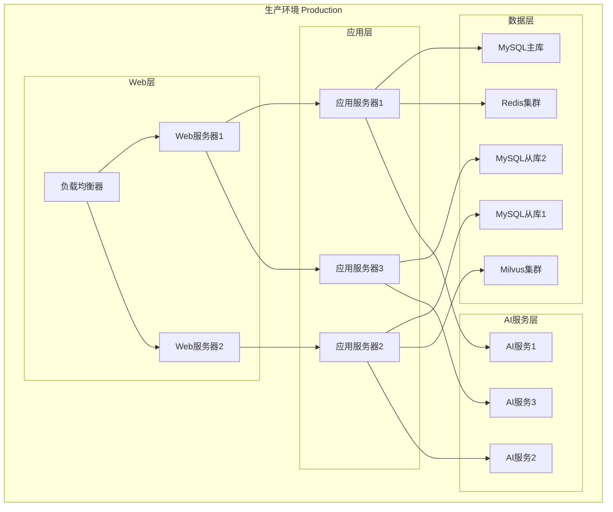
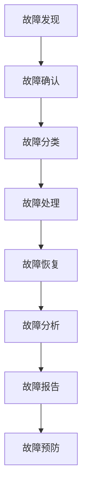

# 11. 交付与运维

## 11.1 部署方案

### 部署架构

智能物流解决方案采用容器化部署，基于Kubernetes集群：

#### 部署拓扑



### 容器化部署

#### Docker镜像构建

**1. 应用镜像构建**
```dockerfile
# Dockerfile
FROM python:3.11-slim

WORKDIR /app

# 安装依赖
COPY requirements.txt .
RUN pip install --no-cache-dir -r requirements.txt

# 复制应用代码
COPY . .

# 设置环境变量
ENV PYTHONUNBUFFERED=1

# 启动应用
CMD ["uvicorn", "main:app", "--host", "0.0.0.0", "--port", "8000"]
```

**2. 镜像构建命令**
```bash
docker build -t logistics-api:latest .
docker tag logistics-api:latest registry.example.com/logistics-api:v1.0.0
docker push registry.example.com/logistics-api:v1.0.0
```

#### Kubernetes部署

**1. Deployment配置**
```yaml
apiVersion: apps/v1
kind: Deployment
metadata:
  name: logistics-api
  namespace: logistics
spec:
  replicas: 3
  selector:
    matchLabels:
      app: logistics-api
  template:
    metadata:
      labels:
        app: logistics-api
    spec:
      containers:
      - name: api
        image: registry.example.com/logistics-api:v1.0.0
        ports:
        - containerPort: 8000
        env:
        - name: DB_HOST
          valueFrom:
            configMapKeyRef:
              name: logistics-config
              key: db_host
        - name: REDIS_HOST
          valueFrom:
            configMapKeyRef:
              name: logistics-config
              key: redis_host
        resources:
          requests:
            memory: "512Mi"
            cpu: "500m"
          limits:
            memory: "2Gi"
            cpu: "2000m"
        livenessProbe:
          httpGet:
            path: /health
            port: 8000
          initialDelaySeconds: 30
          periodSeconds: 10
        readinessProbe:
          httpGet:
            path: /ready
            port: 8000
          initialDelaySeconds: 10
          periodSeconds: 5
---
apiVersion: v1
kind: Service
metadata:
  name: logistics-api-service
  namespace: logistics
spec:
  selector:
    app: logistics-api
  ports:
  - protocol: TCP
    port: 8000
    targetPort: 8000
  type: LoadBalancer
```

**2. ConfigMap配置**
```yaml
apiVersion: v1
kind: ConfigMap
metadata:
  name: logistics-config
  namespace: logistics
data:
  db_host: "mysql-service"
  db_port: "3306"
  db_name: "logistics"
  redis_host: "redis-service"
  redis_port: "6379"
  milvus_host: "milvus-service"
  milvus_port: "19530"
```

**3. Secret配置**
```yaml
apiVersion: v1
kind: Secret
metadata:
  name: logistics-secret
  namespace: logistics
type: Opaque
data:
  db_password: <base64-encoded-password>
  api_key: <base64-encoded-api-key>
```

### 数据库部署

#### MySQL部署

**1. MySQL主从部署**
```yaml
apiVersion: apps/v1
kind: StatefulSet
metadata:
  name: mysql-master
  namespace: logistics
spec:
  serviceName: mysql-master
  replicas: 1
  selector:
    matchLabels:
      app: mysql-master
  template:
    metadata:
      labels:
        app: mysql-master
    spec:
      containers:
      - name: mysql
        image: mysql:8.0
        env:
        - name: MYSQL_ROOT_PASSWORD
          valueFrom:
            secretKeyRef:
              name: mysql-secret
              key: root-password
        ports:
        - containerPort: 3306
        volumeMounts:
        - name: mysql-data
          mountPath: /var/lib/mysql
  volumeClaimTemplates:
  - metadata:
      name: mysql-data
    spec:
      accessModes: [ "ReadWriteOnce" ]
      resources:
        requests:
          storage: 100Gi
```

#### Redis部署

**1. Redis集群部署**
```yaml
apiVersion: apps/v1
kind: StatefulSet
metadata:
  name: redis
  namespace: logistics
spec:
  serviceName: redis
  replicas: 3
  selector:
    matchLabels:
      app: redis
  template:
    metadata:
      labels:
        app: redis
    spec:
      containers:
      - name: redis
        image: redis:7-alpine
        ports:
        - containerPort: 6379
        volumeMounts:
        - name: redis-data
          mountPath: /data
  volumeClaimTemplates:
  - metadata:
      name: redis-data
    spec:
      accessModes: [ "ReadWriteOnce" ]
      resources:
        requests:
          storage: 50Gi
```

## 11.2 CI/CD流程

### 持续集成

#### GitHub Actions配置

```yaml
name: CI/CD Pipeline

on:
  push:
    branches: [ main, develop ]
  pull_request:
    branches: [ main, develop ]

jobs:
  test:
    runs-on: ubuntu-latest
    
    steps:
    - uses: actions/checkout@v2
    
    - name: Set up Python
      uses: actions/setup-python@v2
      with:
        python-version: '3.11'
    
    - name: Install dependencies
      run: |
        pip install -r requirements.txt
        pip install pytest pytest-cov
    
    - name: Run unit tests
      run: |
        pytest tests/unit --cov=src --cov-report=xml
    
    - name: Run integration tests
      run: |
        pytest tests/integration
    
    - name: Upload coverage
      uses: codecov/codecov-action@v2
      with:
        file: ./coverage.xml
  
  build:
    needs: test
    runs-on: ubuntu-latest
    
    steps:
    - uses: actions/checkout@v2
    
    - name: Set up Docker Buildx
      uses: docker/setup-buildx-action@v1
    
    - name: Login to Docker Registry
      uses: docker/login-action@v1
      with:
        registry: registry.example.com
        username: ${{ secrets.DOCKER_USERNAME }}
        password: ${{ secrets.DOCKER_PASSWORD }}
    
    - name: Build and push Docker image
      uses: docker/build-push-action@v2
      with:
        context: .
        push: true
        tags: |
          registry.example.com/logistics-api:${{ github.sha }}
          registry.example.com/logistics-api:latest
  
  deploy:
    needs: build
    runs-on: ubuntu-latest
    if: github.ref == 'refs/heads/main'
    
    steps:
    - uses: actions/checkout@v2
    
    - name: Set up kubectl
      uses: azure/setup-kubectl@v1
    
    - name: Configure kubectl
      run: |
        echo "${{ secrets.KUBECONFIG }}" | base64 -d > kubeconfig
        export KUBECONFIG=kubeconfig
    
    - name: Deploy to Kubernetes
      run: |
        kubectl set image deployment/logistics-api \
          api=registry.example.com/logistics-api:${{ github.sha }} \
          -n logistics
        kubectl rollout status deployment/logistics-api -n logistics
```

### 持续部署

#### 部署策略

**1. 蓝绿部署**
- **策略**：同时运行两个版本，切换流量
- **优势**：快速回滚，零停机时间
- **适用场景**：生产环境部署

**2. 滚动更新**
- **策略**：逐步替换旧版本
- **优势**：资源利用率高，部署平滑
- **适用场景**：开发、测试环境部署

**3. 金丝雀发布**
- **策略**：先发布到小部分用户，逐步扩大
- **优势**：风险可控，问题影响小
- **适用场景**：重要功能发布

## 11.3 运维管理

### 日常运维

#### 监控和告警

**1. 系统监控**
- **监控指标**：CPU、内存、磁盘、网络使用率
- **监控工具**：Prometheus + Grafana
- **告警规则**：资源使用率超过阈值时告警

**2. 应用监控**
- **监控指标**：API响应时间、错误率、吞吐量
- **监控工具**：Prometheus + Grafana
- **告警规则**：响应时间超过阈值或错误率过高时告警

**3. 业务监控**
- **监控指标**：订单处理量、路径规划量、风险预警量
- **监控工具**：Prometheus + Grafana
- **告警规则**：业务指标异常时告警

#### 日志管理

**1. 日志采集**
- **采集工具**：Filebeat、Fluentd
- **采集范围**：应用日志、系统日志、访问日志
- **日志格式**：JSON格式，结构化日志

**2. 日志存储**
- **存储工具**：Elasticsearch
- **存储策略**：实时日志存储7天，历史日志归档
- **日志查询**：Kibana查询界面

**3. 日志分析**
- **分析工具**：Kibana、ELK Stack
- **分析内容**：错误日志分析、性能日志分析、业务日志分析

### 故障处理

#### 故障分类

**1. 严重故障**
- **定义**：系统完全不可用，影响所有用户
- **响应时间**：15分钟内响应
- **处理时间**：1小时内恢复

**2. 重要故障**
- **定义**：系统部分功能不可用，影响部分用户
- **响应时间**：30分钟内响应
- **处理时间**：4小时内恢复

**3. 一般故障**
- **定义**：系统功能异常，影响较小
- **响应时间**：1小时内响应
- **处理时间**：8小时内恢复

#### 故障处理流程



### 容量规划

#### 容量评估

**1. 业务容量评估**
- **订单处理量**：评估每日订单处理量
- **路径规划量**：评估每日路径规划量
- **风险预测量**：评估每日风险预测量

**2. 系统容量评估**
- **计算资源**：评估CPU、内存需求
- **存储资源**：评估存储空间需求
- **网络资源**：评估网络带宽需求

#### 扩容策略

**1. 水平扩容**
- **策略**：增加服务器数量
- **优势**：扩容灵活，不影响现有服务
- **适用场景**：应用服务扩容

**2. 垂直扩容**
- **策略**：增加服务器配置
- **优势**：扩容简单，成本较低
- **适用场景**：数据库服务扩容

## 11.4 备份与恢复

### 备份策略

#### 数据备份

**1. 数据库备份**
- **备份方式**：每日全量备份，每小时增量备份
- **备份存储**：备份数据加密存储
- **备份保留期**：全量备份保留30天，增量备份保留7天

**2. 文件备份**
- **备份方式**：每日全量备份
- **备份存储**：备份数据加密存储
- **备份保留期**：备份保留30天

#### 备份验证

**1. 备份完整性验证**
- **验证方式**：定期验证备份文件完整性
- **验证频率**：每周验证一次
- **验证结果**：备份完整性100%

**2. 备份恢复测试**
- **测试方式**：定期测试备份恢复
- **测试频率**：每月测试一次
- **测试结果**：恢复成功率100%

### 恢复策略

#### 恢复方案

**1. 全量恢复**
- **恢复时间**：< 2小时
- **恢复步骤**：停止服务 → 恢复数据 → 启动服务 → 验证功能

**2. 增量恢复**
- **恢复时间**：< 1小时
- **恢复步骤**：停止服务 → 恢复增量数据 → 启动服务 → 验证功能

**3. 点对点恢复**
- **恢复时间**：< 30分钟
- **恢复步骤**：停止服务 → 恢复到指定时间点 → 启动服务 → 验证功能

## 11.5 文档管理

### 技术文档

#### 文档类型

**1. API文档**
- **文档内容**：API接口说明、参数说明、返回值说明
- **文档格式**：OpenAPI 3.0规范
- **文档更新**：API变更时同步更新

**2. 架构文档**
- **文档内容**：系统架构、技术选型、部署方案
- **文档格式**：Markdown格式
- **文档更新**：架构变更时同步更新

**3. 运维文档**
- **文档内容**：部署步骤、运维手册、故障处理
- **文档格式**：Markdown格式
- **文档更新**：运维流程变更时同步更新

### 用户文档

#### 文档类型

**1. 用户手册**
- **文档内容**：功能说明、操作指南、常见问题
- **文档格式**：在线文档、PDF文档
- **文档更新**：功能更新时同步更新

**2. 培训材料**
- **文档内容**：培训PPT、培训视频、操作演示
- **文档格式**：PPT、视频、在线演示
- **文档更新**：培训内容更新时同步更新

