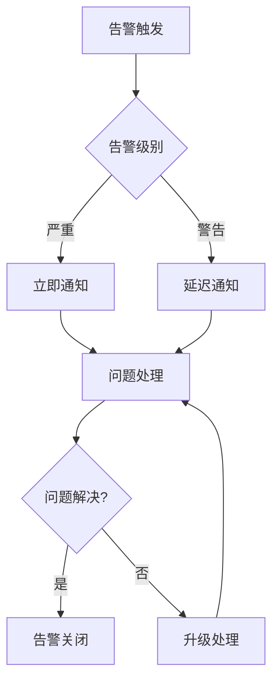

# 9. 监控与可观测

## 9.1 监控体系

### 监控层次

智能物流解决方案采用多层次监控体系，确保系统稳定运行：

#### 基础设施监控

- **服务器监控**：CPU、内存、磁盘、网络等资源监控
- **容器监控**：容器资源使用、容器状态监控
- **数据库监控**：数据库连接数、查询性能、存储空间监控
- **缓存监控**：Redis连接数、内存使用、命中率监控

#### 应用监控

- **API监控**：API响应时间、错误率、吞吐量监控
- **服务监控**：服务健康状态、服务依赖关系监控
- **业务监控**：订单处理量、路径规划量、风险预警量监控

#### 业务监控

- **订单监控**：订单创建量、订单状态、订单处理时间监控
- **路径规划监控**：路径规划量、规划时间、成本优化率监控
- **仓储监控**：库存量、拣货量、拣货效率监控
- **风险监控**：风险预警量、预警准确率、处理及时率监控

### 监控工具

#### Prometheus + Grafana

- **Prometheus**：指标采集和存储
- **Grafana**：指标可视化和告警
- **监控指标**：系统指标、应用指标、业务指标

#### ELK Stack

- **Elasticsearch**：日志存储和检索
- **Logstash**：日志采集和处理
- **Kibana**：日志可视化和分析

#### 链路追踪

- **Jaeger**：分布式链路追踪
- **追踪范围**：API调用链、服务调用链、数据库查询链

## 9.2 关键指标

### 系统指标

#### 性能指标

- **API响应时间**：P50 < 200ms，P95 < 500ms，P99 < 1000ms
- **系统吞吐量**：> 1000 QPS
- **系统并发数**：> 1000
- **系统可用性**：> 99.9%

#### 资源指标

- **CPU使用率**：< 70%
- **内存使用率**：< 80%
- **磁盘使用率**：< 80%
- **网络带宽使用率**：< 70%

### 业务指标

#### 路径规划指标

- **路径规划量**：每日路径规划数量
- **路径规划时间**：平均规划时间 < 60s
- **成本优化率**：成本优化率 ≥ 20%
- **路径规划成功率**：成功率 ≥ 99%

#### 仓储管理指标

- **库存准确率**：库存准确率 ≥ 98%
- **拣货效率**：拣货效率提升 ≥ 30%
- **拣货错误率**：拣货错误率 < 1%
- **库存周转率**：库存周转率 ≥ 5次/年

#### 风险预警指标

- **风险预警量**：每日风险预警数量
- **预警准确率**：预警准确率 ≥ 90%
- **预警及时率**：预警及时率 ≥ 95%
- **风险处理及时率**：处理及时率 ≥ 90%

### 质量指标

#### 数据质量指标

- **数据完整率**：≥ 95%
- **数据准确率**：≥ 98%
- **数据及时率**：≥ 99%

#### 服务质量指标

- **客户满意度**：≥ 4.5/5.0
- **客户投诉率**：< 1%
- **订单履约率**：≥ 95%

## 9.3 告警机制

### 告警规则

#### 系统告警

**1. 系统可用性告警**
- **告警条件**：系统可用性 < 99%
- **告警级别**：严重
- **告警方式**：邮件、短信、电话

**2. API响应时间告警**
- **告警条件**：API响应时间P95 > 1000ms
- **告警级别**：警告
- **告警方式**：邮件、短信

**3. 系统资源告警**
- **告警条件**：CPU使用率 > 80% 或 内存使用率 > 85%
- **告警级别**：警告
- **告警方式**：邮件、短信

#### 业务告警

**1. 路径规划失败告警**
- **告警条件**：路径规划失败率 > 5%
- **告警级别**：严重
- **告警方式**：邮件、短信、电话

**2. 库存异常告警**
- **告警条件**：库存准确率 < 95%
- **告警级别**：警告
- **告警方式**：邮件、短信

**3. 风险预警告警**
- **告警条件**：高风险预警数量 > 10个/小时
- **告警级别**：严重
- **告警方式**：邮件、短信、电话

### 告警处理流程



## 9.4 日志管理

### 日志分类

#### 系统日志

- **应用日志**：应用运行日志、错误日志
- **访问日志**：API访问日志、用户访问日志
- **系统日志**：系统运行日志、系统错误日志

#### 业务日志

- **订单日志**：订单创建、更新、状态变更日志
- **路径规划日志**：路径规划请求、结果日志
- **仓储日志**：库存变更、拣货操作日志
- **风险日志**：风险识别、预警、处理日志

### 日志格式

#### 标准日志格式

```json
{
  "timestamp": "2024-01-01T10:00:00Z",
  "level": "INFO",
  "service": "route-planning",
  "trace_id": "trace-123456",
  "message": "路径规划完成",
  "context": {
    "order_ids": ["ORD001", "ORD002"],
    "plan_id": "PLAN001",
    "duration": 45.6,
    "cost": 156.8
  }
}
```

### 日志存储

#### 日志存储策略

- **实时日志**：最近7天的日志存储在Elasticsearch
- **历史日志**：7天以上的日志归档到对象存储
- **日志保留期**：日志保留90天

#### 日志查询

- **查询工具**：Kibana日志查询界面
- **查询方式**：支持关键词搜索、时间范围查询、字段过滤
- **查询性能**：查询响应时间 < 5s

## 9.5 可观测性

### 分布式追踪

#### 追踪范围

- **API调用追踪**：追踪API调用链，包括请求参数、响应结果、调用时间
- **服务调用追踪**：追踪服务间调用链，包括服务依赖关系、调用时间
- **数据库查询追踪**：追踪数据库查询链，包括SQL语句、查询时间、结果

#### 追踪工具

- **Jaeger**：分布式追踪系统
- **追踪采样率**：100%（生产环境），10%（开发环境）
- **追踪数据保留期**：7天

### 指标监控

#### 指标类型

- **计数器（Counter）**：累计计数，如API调用次数、订单数量
- **仪表盘（Gauge）**：当前值，如CPU使用率、内存使用率
- **直方图（Histogram）**：分布统计，如API响应时间分布
- **摘要（Summary）**：分位数统计，如API响应时间P95、P99

#### 指标采集

- **采集频率**：每15秒采集一次
- **采集方式**：Prometheus主动拉取
- **指标存储**：Prometheus时序数据库

### 可视化Dashboard

#### 系统监控Dashboard

- **系统资源监控**：CPU、内存、磁盘、网络使用情况
- **系统性能监控**：API响应时间、吞吐量、错误率
- **系统可用性监控**：系统可用性、服务健康状态

#### 业务监控Dashboard

- **订单监控**：订单创建量、订单状态分布、订单处理时间
- **路径规划监控**：路径规划量、规划时间、成本优化率
- **仓储监控**：库存量、拣货量、拣货效率
- **风险监控**：风险预警量、预警准确率、处理及时率

#### 成本监控Dashboard

- **AI模型成本**：模型调用次数、调用成本、成本趋势
- **基础设施成本**：云资源使用量、资源成本、成本趋势
- **运营成本**：人工成本、运维成本、成本趋势

## 9.6 监控最佳实践

### 监控原则

- **全面监控**：监控系统、应用、业务各个层面
- **实时监控**：实时监控关键指标，及时发现问题
- **主动告警**：主动告警，减少人工干预
- **持续优化**：持续优化监控指标和告警规则

### 监控优化

- **指标优化**：定期评估监控指标，优化监控范围
- **告警优化**：优化告警规则，减少误报和漏报
- **性能优化**：优化监控系统性能，减少对业务系统的影响

