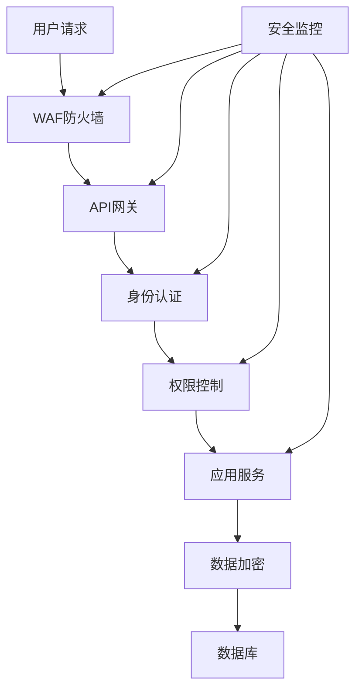
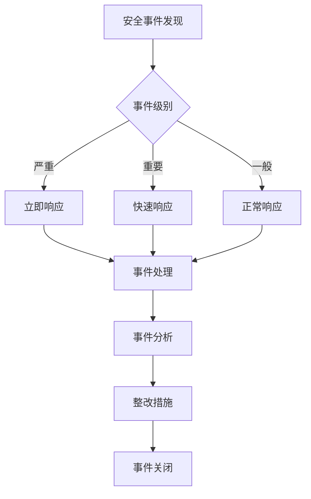

# 10. 安全与合规

## 10.1 安全架构

### 安全防护体系

智能物流解决方案采用多层次安全防护体系：



### 安全措施

#### 网络安全

**1. WAF防火墙**
- **功能**：Web应用防火墙，防护SQL注入、XSS攻击等
- **配置**：基于规则和AI的防护策略
- **效果**：防护99%以上的Web攻击

**2. DDoS防护**
- **功能**：分布式拒绝服务攻击防护
- **配置**：流量清洗、限流策略
- **效果**：防护10Gbps以上的DDoS攻击

**3. VPN专线**
- **功能**：VPN专线连接，保障数据传输安全
- **配置**：IPSec VPN、SSL VPN
- **效果**：数据传输加密，防止数据泄露

#### 应用安全

**1. 身份认证**
- **JWT Token认证**：使用JWT Token进行用户身份认证
- **多因素认证**：支持短信、邮箱等多因素认证
- **会话管理**：会话超时、会话劫持防护

**2. 权限控制**
- **RBAC权限模型**：基于角色的访问控制
- **API权限控制**：API级别的权限控制
- **数据权限控制**：数据级别的权限控制

**3. API安全**
- **API认证**：API Token认证
- **API限流**：API限流，防止API滥用
- **API参数验证**：API参数验证，防止注入攻击

#### 数据安全

**1. 数据加密**
- **传输加密**：使用HTTPS/TLS加密传输
- **存储加密**：敏感数据加密存储
- **数据库加密**：数据库层面加密

**2. 数据备份**
- **备份策略**：每日全量备份，每小时增量备份
- **备份存储**：备份数据加密存储
- **备份恢复**：定期测试备份恢复

**3. 数据脱敏**
- **敏感数据脱敏**：敏感数据脱敏处理
- **日志脱敏**：日志中敏感信息脱敏
- **测试数据脱敏**：测试数据脱敏处理

## 10.2 身份认证与授权

### 身份认证

#### JWT Token认证

**1. Token生成**
```python
import jwt
from datetime import datetime, timedelta

def generate_token(user_id: str, role: str) -> str:
    """生成JWT Token"""
    payload = {
        "user_id": user_id,
        "role": role,
        "exp": datetime.utcnow() + timedelta(hours=24),
        "iat": datetime.utcnow()
    }
    token = jwt.encode(payload, SECRET_KEY, algorithm="HS256")
    return token
```

**2. Token验证**
```python
def verify_token(token: str) -> dict:
    """验证JWT Token"""
    try:
        payload = jwt.decode(token, SECRET_KEY, algorithms=["HS256"])
        return payload
    except jwt.ExpiredSignatureError:
        raise Exception("Token已过期")
    except jwt.InvalidTokenError:
        raise Exception("Token无效")
```

#### 多因素认证

**1. 短信验证码**
- **功能**：登录时发送短信验证码
- **验证码有效期**：5分钟
- **验证码长度**：6位数字

**2. 邮箱验证码**
- **功能**：登录时发送邮箱验证码
- **验证码有效期**：10分钟
- **验证码长度**：6位数字

### 权限控制

#### RBAC权限模型

**1. 角色定义**
- **管理员**：系统管理员，拥有所有权限
- **调度员**：物流调度员，拥有调度相关权限
- **仓储管理员**：仓储管理员，拥有仓储相关权限
- **配送员**：配送员，拥有配送相关权限
- **客服人员**：客服人员，拥有客服相关权限

**2. 权限定义**
- **订单管理**：创建订单、查询订单、更新订单
- **路径规划**：路径规划、路径查询、路径优化
- **仓储管理**：库存查询、拣货管理、仓储规划
- **风险预警**：风险查询、预警处理、预警配置

#### API权限控制

**1. API权限配置**
```yaml
api_permissions:
  - path: "/v1/orders"
    methods: ["POST", "GET", "PUT"]
    roles: ["admin", "dispatcher"]
  
  - path: "/v1/route-planning"
    methods: ["POST", "GET"]
    roles: ["admin", "dispatcher"]
  
  - path: "/v1/inventory"
    methods: ["GET"]
    roles: ["admin", "warehouse_manager"]
```

**2. 权限验证中间件**
```python
def check_permission(required_role: str):
    """权限验证装饰器"""
    def decorator(func):
        def wrapper(*args, **kwargs):
            token = request.headers.get("Authorization")
            if not token:
                return {"error": "未授权"}, 401
            
            payload = verify_token(token)
            user_role = payload.get("role")
            
            if user_role != required_role and user_role != "admin":
                return {"error": "权限不足"}, 403
            
            return func(*args, **kwargs)
        return wrapper
    return decorator
```

## 10.3 数据安全

### 数据加密

#### 传输加密

**1. HTTPS/TLS**
- **协议版本**：TLS 1.2及以上
- **证书管理**：使用CA签发的SSL证书
- **加密算法**：AES-256-GCM

**2. API加密**
- **加密方式**：请求和响应数据加密
- **加密算法**：AES-256
- **密钥管理**：密钥存储在密钥管理系统

#### 存储加密

**1. 数据库加密**
- **加密方式**：数据库层面加密
- **加密算法**：AES-256
- **密钥管理**：密钥存储在密钥管理系统

**2. 文件加密**
- **加密方式**：文件存储加密
- **加密算法**：AES-256
- **密钥管理**：密钥存储在密钥管理系统

### 数据备份

#### 备份策略

**1. 全量备份**
- **备份频率**：每日凌晨2点全量备份
- **备份保留期**：30天
- **备份存储**：备份数据加密存储

**2. 增量备份**
- **备份频率**：每小时增量备份
- **备份保留期**：7天
- **备份存储**：备份数据加密存储

#### 备份恢复

**1. 恢复测试**
- **测试频率**：每月测试一次备份恢复
- **测试内容**：全量恢复、增量恢复、点对点恢复
- **测试结果**：恢复成功率100%

### 数据脱敏

#### 敏感数据识别

**1. 敏感数据类型**
- **个人信息**：姓名、身份证号、手机号、地址
- **订单信息**：订单号、客户信息、商品信息
- **财务信息**：金额、支付信息、发票信息

**2. 敏感数据脱敏规则**
```python
def mask_sensitive_data(data: dict) -> dict:
    """敏感数据脱敏"""
    masked_data = data.copy()
    
    # 手机号脱敏
    if "phone" in masked_data:
        masked_data["phone"] = mask_phone(masked_data["phone"])
    
    # 身份证号脱敏
    if "id_card" in masked_data:
        masked_data["id_card"] = mask_id_card(masked_data["id_card"])
    
    # 地址脱敏
    if "address" in masked_data:
        masked_data["address"] = mask_address(masked_data["address"])
    
    return masked_data
```

## 10.4 合规要求

### 数据保护法规

#### GDPR合规

**1. 数据主体权利**
- **访问权**：用户有权访问自己的数据
- **删除权**：用户有权删除自己的数据
- **更正权**：用户有权更正自己的数据
- **数据可携带权**：用户有权导出自己的数据

**2. 数据处理原则**
- **合法性**：数据处理必须合法
- **目的限制**：数据处理必须符合目的
- **数据最小化**：只处理必要的数据
- **准确性**：确保数据准确

#### 个人信息保护法合规

**1. 个人信息处理**
- **告知同意**：处理个人信息前告知用户并获得同意
- **目的明确**：明确个人信息处理目的
- **最小必要**：只处理必要的个人信息
- **安全保障**：采取安全措施保护个人信息

**2. 个人信息主体权利**
- **知情权**：了解个人信息处理情况
- **决定权**：决定个人信息处理方式
- **查阅权**：查阅自己的个人信息
- **删除权**：删除自己的个人信息

### 行业合规

#### 物流行业合规

**1. 物流数据安全**
- **数据加密**：物流数据加密存储和传输
- **访问控制**：严格控制数据访问权限
- **数据备份**：定期备份物流数据

**2. 物流信息保护**
- **信息保密**：保护客户物流信息
- **信息共享**：信息共享必须获得授权
- **信息删除**：信息删除必须彻底

## 10.5 安全审计

### 安全审计内容

#### 访问审计

**1. 用户访问审计**
- **登录记录**：记录用户登录时间、IP地址、设备信息
- **操作记录**：记录用户操作内容、操作时间、操作结果
- **权限变更记录**：记录用户权限变更情况

**2. API访问审计**
- **API调用记录**：记录API调用时间、调用者、调用参数、调用结果
- **异常访问记录**：记录异常访问情况
- **API限流记录**：记录API限流情况

#### 数据审计

**1. 数据访问审计**
- **数据查询记录**：记录数据查询时间、查询者、查询内容
- **数据修改记录**：记录数据修改时间、修改者、修改内容
- **数据导出记录**：记录数据导出时间、导出者、导出内容

**2. 数据安全审计**
- **数据泄露检测**：检测数据泄露情况
- **数据异常检测**：检测数据异常情况
- **数据合规检查**：检查数据合规情况

### 安全审计报告

#### 审计报告内容

- **审计时间**：审计时间段
- **审计范围**：审计的系统、功能、数据
- **审计发现**：发现的安全问题
- **整改建议**：安全整改建议
- **整改情况**：整改落实情况

#### 审计报告频率

- **日常审计**：每日生成审计报告
- **周度审计**：每周生成审计报告
- **月度审计**：每月生成审计报告
- **年度审计**：每年生成审计报告

## 10.6 安全事件响应

### 安全事件分类

#### 事件级别

- **严重事件**：系统被攻击、数据泄露等
- **重要事件**：API被滥用、权限异常等
- **一般事件**：异常访问、异常操作等

### 事件响应流程



### 事件响应措施

#### 严重事件响应

- **立即隔离**：立即隔离受影响的系统
- **通知相关人员**：立即通知安全团队和管理层
- **事件分析**：分析事件原因和影响范围
- **事件处理**：处理安全事件，恢复系统
- **事件报告**：生成事件报告，记录事件处理过程

#### 重要事件响应

- **快速处理**：快速处理安全事件
- **事件分析**：分析事件原因和影响范围
- **事件处理**：处理安全事件
- **事件报告**：生成事件报告

#### 一般事件响应

- **正常处理**：正常处理安全事件
- **事件记录**：记录事件处理过程
- **事件分析**：分析事件原因，预防类似事件

