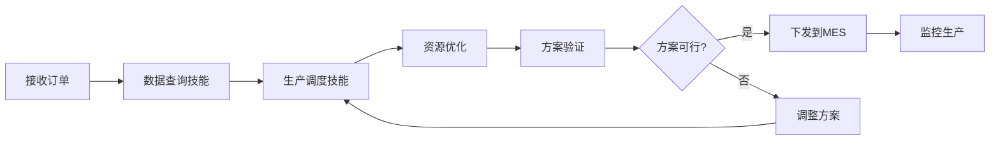
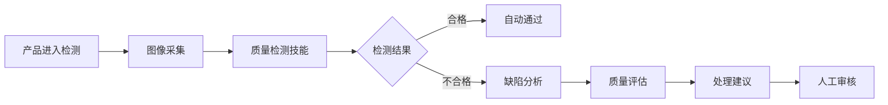
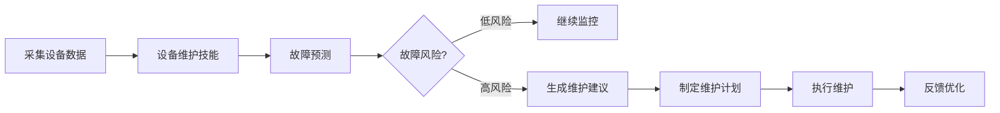
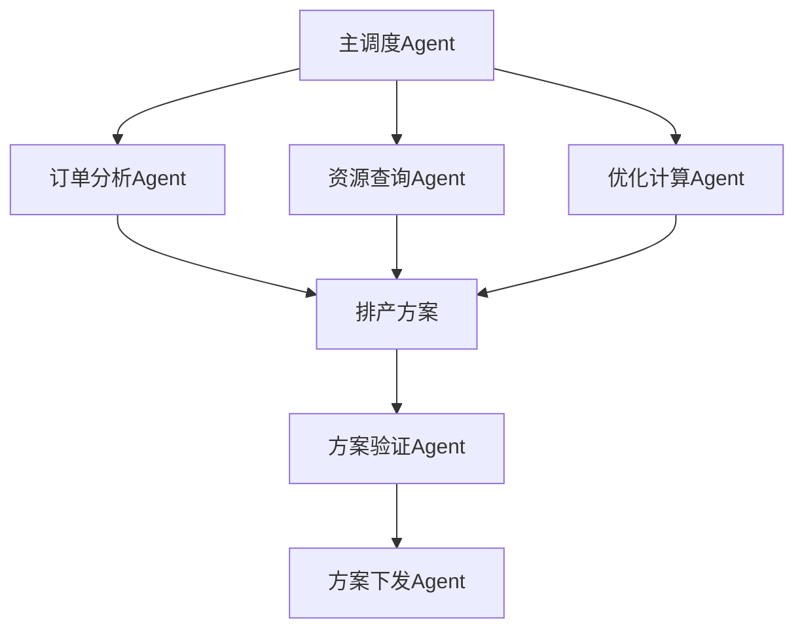

# 5. 智能体与业务编排

## 5.1 Agent技能链

### 技能定义

智能制造/工业4.0解决方案中的Agent具备多种技能，每个技能对应一个特定的业务能力：

#### 核心技能

- **生产调度技能（ProductionSchedulingSkill）**：
  - 功能：优化生产排产方案，分配资源，监控生产进度
  - 输入：订单信息、设备状态、物料库存、人员配置
  - 输出：排产方案、资源分配、生产计划
  - 使用模型：排产优化模型 + 大语言模型

- **质量检测技能（QualityInspectionSkill）**：
  - 功能：检测产品质量，识别缺陷，评估质量等级
  - 输入：产品图像、检测标准、历史数据
  - 输出：检测结果、缺陷信息、质量评估
  - 使用模型：视觉检测模型（YOLO、ResNet）

- **设备维护技能（EquipmentMaintenanceSkill）**：
  - 功能：预测设备故障，制定维护计划，监控设备状态
  - 输入：设备状态数据、历史故障记录、维护历史
  - 输出：故障预测、维护建议、健康评估
  - 使用模型：时序预测模型（LSTM、Transformer）

- **供应链优化技能（SupplyChainOptimizationSkill）**：
  - 功能：预测需求，优化采购，管理库存，评估供应商
  - 输入：历史销售数据、市场数据、库存数据
  - 输出：需求预测、采购建议、库存优化方案
  - 使用模型：需求预测模型（ARIMA、LSTM）

- **数据分析技能（DataAnalysisSkill）**：
  - 功能：分析生产数据，生成报表，提供决策支持
  - 输入：生产数据、设备数据、质量数据
  - 输出：分析报告、数据报表、决策建议
  - 使用模型：大语言模型（GPT-4）+ RAG知识库

- **知识检索技能（KnowledgeRetrievalSkill）**：
  - 功能：检索工业知识，回答技术问题，提供解决方案
  - 输入：查询文本、问题描述
  - 输出：相关知识、答案、解决方案
  - 使用工具：RAG检索系统、知识库

### 技能链设计

技能链是将多个技能组合起来，完成复杂业务流程：

#### 智能排产技能链



**技能链配置**：

```yaml
skill_chain:
  name: production_scheduling_chain
  skills:
    - name: data_query
      skill: DataQuerySkill
      inputs:
        - order_id
      outputs:
        - order_data
        - device_status
        - material_inventory
        - personnel_config
    
    - name: production_scheduling
      skill: ProductionSchedulingSkill
      inputs:
        - order_data
        - device_status
        - material_inventory
        - personnel_config
      outputs:
        - schedule_plan
        - resource_allocation
    
    - name: schedule_validation
      skill: ScheduleValidationSkill
      inputs:
        - schedule_plan
      outputs:
        - feasibility
        - validation_result
    
    - name: schedule_optimization
      skill: ScheduleOptimizationSkill
      condition: feasibility == false
      inputs:
        - schedule_plan
        - validation_result
      outputs:
        - optimized_schedule
    
    - name: send_to_mes
      skill: MESIntegrationSkill
      condition: feasibility == true
      inputs:
        - schedule_plan
      outputs:
        - mes_response
    
    - name: monitor_production
      skill: ProductionMonitoringSkill
      inputs:
        - schedule_plan
      outputs:
        - production_status
```

#### 质量检测技能链



**技能链配置**：

```yaml
skill_chain:
  name: quality_inspection_chain
  skills:
    - name: image_capture
      skill: ImageCaptureSkill
      inputs:
        - product_id
      outputs:
        - product_images
    
    - name: quality_inspection
      skill: QualityInspectionSkill
      inputs:
        - product_images
        - inspection_standard
      outputs:
        - inspection_result
        - defect_info
    
    - name: defect_analysis
      skill: DefectAnalysisSkill
      condition: inspection_result == "不合格"
      inputs:
        - defect_info
      outputs:
        - defect_analysis
        - quality_assessment
    
    - name: generate_recommendation
      skill: RecommendationGenerationSkill
      inputs:
        - defect_analysis
        - quality_assessment
      outputs:
        - handling_recommendation
    
    - name: manual_review
      skill: ManualReviewSkill
      condition: inspection_result == "不合格"
      inputs:
        - inspection_result
        - handling_recommendation
      outputs:
        - final_decision
```

#### 设备预测性维护技能链



**技能链配置**：

```yaml
skill_chain:
  name: predictive_maintenance_chain
  skills:
    - name: data_collection
      skill: DataCollectionSkill
      inputs:
        - device_id
      outputs:
        - device_data
    
    - name: equipment_maintenance
      skill: EquipmentMaintenanceSkill
      inputs:
        - device_data
        - failure_history
      outputs:
        - failure_prediction
        - health_score
    
    - name: risk_assessment
      skill: RiskAssessmentSkill
      inputs:
        - failure_prediction
        - health_score
      outputs:
        - risk_level
    
    - name: maintenance_planning
      skill: MaintenancePlanningSkill
      condition: risk_level == "high"
      inputs:
        - failure_prediction
        - risk_level
      outputs:
        - maintenance_plan
    
    - name: execute_maintenance
      skill: MaintenanceExecutionSkill
      inputs:
        - maintenance_plan
      outputs:
        - maintenance_result
    
    - name: model_optimization
      skill: ModelOptimizationSkill
      inputs:
        - maintenance_result
        - failure_prediction
      outputs:
        - optimization_result
```

## 5.2 工作流编排

### n8n工作流设计

#### 生产调度工作流

**工作流配置**：

```json
{
  "name": "智能生产调度工作流",
  "nodes": [
    {
      "id": "webhook",
      "type": "n8n-nodes-base.webhook",
      "parameters": {
        "path": "production-schedule",
        "httpMethod": "POST"
      }
    },
    {
      "id": "fetch-order",
      "type": "n8n-nodes-base.httpRequest",
      "parameters": {
        "url": "={{ $env.ERP_API }}/orders/{{ $json.order_id }}",
        "method": "GET"
      }
    },
    {
      "id": "fetch-device-status",
      "type": "n8n-nodes-base.httpRequest",
      "parameters": {
        "url": "={{ $env.MES_API }}/devices/status",
        "method": "GET"
      }
    },
    {
      "id": "ai-scheduling",
      "type": "n8n-nodes-base.httpRequest",
      "parameters": {
        "url": "={{ $env.AI_API }}/scheduling/optimize",
        "method": "POST",
        "body": {
          "order": "={{ $json.order }}",
          "devices": "={{ $json.devices }}",
          "materials": "={{ $json.materials }}"
        }
      }
    },
    {
      "id": "validate-schedule",
      "type": "n8n-nodes-base.if",
      "parameters": {
        "conditions": {
          "boolean": [
            {
              "value1": "={{ $json.feasibility }}",
              "operation": "equal",
              "value2": true
            }
          ]
        }
      }
    },
    {
      "id": "send-to-mes",
      "type": "n8n-nodes-base.httpRequest",
      "parameters": {
        "url": "={{ $env.MES_API }}/production/schedule",
        "method": "POST",
        "body": "={{ $json.schedule }}"
      }
    },
    {
      "id": "monitor-production",
      "type": "n8n-nodes-base.schedule",
      "parameters": {
        "triggerTimes": {
          "item": [
            {
              "mode": "everyMinute",
              "minute": 5
            }
          ]
        }
      }
    }
  ],
  "connections": {
    "webhook": {
      "main": [
        [
          {
            "node": "fetch-order",
            "type": "main",
            "index": 0
          }
        ]
      ]
    },
    "fetch-order": {
      "main": [
        [
          {
            "node": "fetch-device-status",
            "type": "main",
            "index": 0
          }
        ]
      ]
    },
    "fetch-device-status": {
      "main": [
        [
          {
            "node": "ai-scheduling",
            "type": "main",
            "index": 0
          }
        ]
      ]
    },
    "ai-scheduling": {
      "main": [
        [
          {
            "node": "validate-schedule",
            "type": "main",
            "index": 0
          }
        ]
      ]
    },
    "validate-schedule": {
      "main": [
        [
          {
            "node": "send-to-mes",
            "type": "main",
            "index": 0
          }
        ]
      ]
    }
  }
}
```

#### 质量检测工作流

**工作流配置**：

```json
{
  "name": "智能质量检测工作流",
  "nodes": [
    {
      "id": "image-capture",
      "type": "n8n-nodes-base.webhook",
      "parameters": {
        "path": "quality-inspection",
        "httpMethod": "POST"
      }
    },
    {
      "id": "ai-inspection",
      "type": "n8n-nodes-base.httpRequest",
      "parameters": {
        "url": "={{ $env.AI_API }}/quality/inspect",
        "method": "POST",
        "body": {
          "image": "={{ $json.image }}",
          "product_type": "={{ $json.product_type }}"
        }
      }
    },
    {
      "id": "check-result",
      "type": "n8n-nodes-base.if",
      "parameters": {
        "conditions": {
          "string": [
            {
              "value1": "={{ $json.result }}",
              "operation": "equal",
              "value2": "合格"
            }
          ]
        }
      }
    },
    {
      "id": "save-result",
      "type": "n8n-nodes-base.mysql",
      "parameters": {
        "operation": "insert",
        "table": "quality_inspection",
        "columns": {
          "mappingMode": "defineBelow",
          "value": {
            "product_id": "={{ $json.product_id }}",
            "result": "={{ $json.result }}",
            "defects": "={{ $json.defects }}"
          }
        }
      }
    },
    {
      "id": "notify-review",
      "type": "n8n-nodes-base.slack",
      "parameters": {
        "channel": "#quality-review",
        "text": "产品 {{ $json.product_id }} 检测不合格，需要人工审核"
      }
    }
  ]
}
```

## 5.3 多Agent协作

### Agent协作模式

#### 主从模式

- **主Agent**：负责整体协调和决策
- **从Agent**：负责具体任务执行
- **适用场景**：复杂业务流程，需要统一协调

#### 对等模式

- **多个Agent**：平等协作，共同完成任务
- **适用场景**：并行任务，独立执行

#### 管道模式

- **Agent链**：按顺序执行，前一个Agent的输出作为后一个Agent的输入
- **适用场景**：流水线式处理

### 协作示例

#### 生产调度协作



## 5.4 异常处理与重试

### 异常处理策略

#### 异常分类

- **数据异常**：
  - 数据缺失
  - 数据格式错误
  - 数据不一致

- **模型异常**：
  - 模型推理失败
  - 模型超时
  - 模型错误

- **系统异常**：
  - 服务不可用
  - 网络故障
  - 资源不足

#### 处理策略

- **自动重试**：
  - 临时故障自动重试
  - 重试次数：3次
  - 重试间隔：指数退避

- **降级处理**：
  - 模型不可用时使用规则引擎
  - 实时服务不可用时使用缓存数据

- **人工介入**：
  - 严重异常转人工处理
  - 发送告警通知
  - 记录异常日志

### 重试机制

#### 重试配置

```yaml
retry_policy:
  max_retries: 3
  retry_delay: 1s
  backoff_multiplier: 2
  retryable_errors:
    - timeout
    - connection_error
    - service_unavailable
  non_retryable_errors:
    - authentication_error
    - authorization_error
    - invalid_input
```

## 5.5 监控与日志

### 工作流监控

#### 监控指标

- **执行指标**：
  - 工作流执行次数
  - 执行成功率
  - 平均执行时间
  - 失败率

- **性能指标**：
  - 响应时间
  - 吞吐量
  - 资源利用率

#### 告警机制

- **告警规则**：
  - 执行失败率超过阈值
  - 执行时间超过阈值
  - 资源使用率超过阈值

- **告警通知**：
  - 邮件通知
  - 短信通知
  - 企业微信/钉钉通知

### 日志管理

#### 日志级别

- **DEBUG**：调试信息
- **INFO**：一般信息
- **WARN**：警告信息
- **ERROR**：错误信息

#### 日志内容

- **执行日志**：
  - 工作流执行记录
  - 节点执行记录
  - 数据流转记录

- **错误日志**：
  - 异常信息
  - 堆栈跟踪
  - 上下文信息

#### 日志存储

- **存储位置**：ELK Stack
- **保留期限**：30天
- **查询方式**：Kibana查询界面

