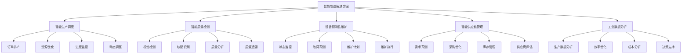
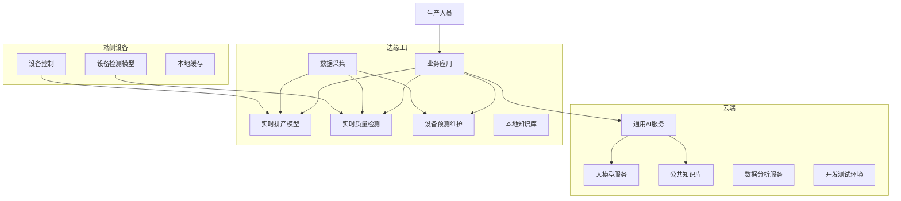
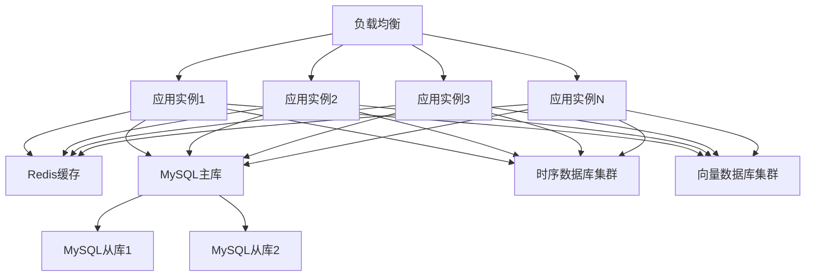

# 2. 总体架构

## 2.1 业务架构

### 角色定义

智能制造/工业4.0解决方案涉及多个角色，每个角色有不同的职责和权限：

- **生产调度员**：
  - 职责：使用智能排产系统进行生产计划制定，监控生产进度，优化生产调度
  - 权限：查看生产数据，配置排产规则，调整生产计划
  - 使用场景：日常生产调度，订单排产，生产计划优化

- **质量检测员**：
  - 职责：使用智能质量检测系统进行产品质量检测，审核检测结果，处理质量问题
  - 权限：查看质量数据，配置检测规则，审核检测结果
  - 使用场景：产品质量检测，质量数据分析，质量问题处理

- **设备维护工程师**：
  - 职责：使用预测性维护系统监控设备状态，制定维护计划，处理设备故障
  - 权限：查看设备数据，配置维护规则，处理设备故障
  - 使用场景：设备状态监控，维护计划制定，故障处理

- **供应链管理员**：
  - 职责：使用智能供应链系统进行需求预测，优化采购计划，管理供应商
  - 权限：查看供应链数据，配置预测模型，管理供应商信息
  - 使用场景：需求预测，采购优化，供应商管理

- **系统管理员**：
  - 职责：管理系统配置，监控系统运行，处理系统故障
  - 权限：系统配置，用户管理，监控告警
  - 使用场景：系统维护，用户管理，故障处理

### 用例分析

#### 用例1：智能生产调度

**参与者**：生产调度员、排产系统、MES系统

**前置条件**：
- 排产系统正常运行
- 排产模型已部署
- 订单数据已同步
- 设备状态数据已获取

**主流程**：
1. 生产调度员输入订单信息（产品类型、数量、交期等）
2. 系统获取设备状态、物料库存、人员配置等约束条件
3. AI模型分析约束条件，生成最优排产方案
4. 生产调度员审核排产方案，确认或调整
5. 排产方案下发到MES系统
6. MES系统执行生产计划
7. 系统实时监控生产进度，动态调整排产方案

**异常流程**：
- 如果设备故障，系统自动调整排产方案
- 如果物料短缺，系统提示并建议替代方案
- 如果AI模型不可用，使用规则引擎作为备用方案

**后置条件**：
- 排产方案已生成并下发
- 生产计划已执行
- 生产进度已监控

#### 用例2：智能质量检测

**参与者**：质量检测员、质量检测系统、视觉检测设备

**前置条件**：
- 质量检测系统正常运行
- 视觉检测模型已部署
- 检测设备已连接

**主流程**：
1. 产品进入检测工位
2. 视觉检测设备采集产品图像
3. AI模型分析图像，识别缺陷和异常
4. 系统生成检测报告（合格/不合格、缺陷类型、位置等）
5. 合格产品自动通过，不合格产品转人工审核
6. 质量检测员审核不合格产品，确认或修正检测结果
7. 检测结果记录到质量数据库

**异常流程**：
- 如果检测设备故障，启用备用检测设备
- 如果AI模型置信度低，转人工检测
- 如果检测结果异常，触发告警

**后置条件**：
- 检测完成
- 检测结果已记录
- 不合格产品已处理

#### 用例3：设备预测性维护

**参与者**：设备维护工程师、预测性维护系统、设备传感器

**前置条件**：
- 预测性维护系统正常运行
- 预测模型已部署
- 设备传感器数据已采集

**主流程**：
1. 设备传感器实时采集设备状态数据（温度、振动、电流等）
2. 系统实时分析设备状态数据，计算健康分数
3. AI模型预测设备故障概率和维护时间窗口
4. 如果预测到故障风险，系统生成维护建议
5. 设备维护工程师审核维护建议，制定维护计划
6. 执行维护计划，修复设备问题
7. 维护结果反馈到系统，优化预测模型

**异常流程**：
- 如果传感器故障，使用备用传感器或历史数据
- 如果预测到紧急故障，立即告警并启动应急维护
- 如果维护计划冲突，系统自动调整

**后置条件**：
- 设备状态已监控
- 维护计划已制定
- 设备问题已修复

#### 用例4：智能供应链优化

**参与者**：供应链管理员、供应链系统、供应商系统

**前置条件**：
- 供应链系统正常运行
- 需求预测模型已部署
- 供应商数据已同步

**主流程**：
1. 供应链管理员输入需求预测参数（历史销量、市场趋势等）
2. 系统收集历史销售数据、市场数据、库存数据等
3. AI模型分析数据，预测未来需求
4. 系统根据需求预测，生成采购建议和库存优化方案
5. 供应链管理员审核采购建议，确认或调整
6. 采购订单下发到供应商系统
7. 系统监控采购执行情况，动态调整采购计划

**异常流程**：
- 如果需求波动大，系统提示并建议安全库存
- 如果供应商无法供货，系统推荐替代供应商
- 如果预测不准确，人工调整并反馈优化模型

**后置条件**：
- 需求预测已完成
- 采购计划已制定
- 采购订单已下发

### 故事地图

智能制造/工业4.0解决方案的用户故事地图如下：



## 2.2 技术架构

### AI-Native四层架构

智能制造/工业4.0解决方案采用AI-Native四层架构，从下到上包括基础设施层、模型层、编排层和应用层。

#### 应用层

应用层提供面向业务用户的应用界面和API接口：

**核心应用**：

- **生产调度平台**：
  - 订单管理界面
  - 排产方案展示
  - 生产进度监控大屏
  - 资源利用率分析报表

- **质量检测平台**：
  - 实时检测界面
  - 检测结果展示
  - 质量数据分析报表
  - 质量追溯查询

- **设备维护平台**：
  - 设备状态监控大屏
  - 故障预警界面
  - 维护计划管理
  - 维护历史查询

- **供应链管理平台**：
  - 需求预测界面
  - 采购计划管理
  - 库存监控界面
  - 供应商评估报表

- **工业数据分析平台**：
  - 生产数据分析
  - 效率分析报表
  - 成本分析报表
  - 决策支持工具

**技术栈**：
- 前端：Vue 3 + TypeScript + Vite + TailwindCSS
- 后端API：FastAPI + Python 3.11
- 状态管理：Pinia
- UI组件库：Element Plus
- 数据可视化：ECharts、D3.js

#### 编排层

编排层负责业务流程编排和智能体协调：

**核心组件**：

- **工作流引擎（n8n）**：
  - 生产流程编排
  - 质量检测流程编排
  - 设备维护流程编排
  - 供应链流程编排
  - 任务调度和执行
  - 异常处理和重试
  - 工作流监控

- **智能体编排（Dify）**：
  - 多智能体协调
  - 工具调用管理
  - 上下文管理
  - 对话管理

- **MCP服务器**：
  - 工具注册中心
  - 工具调用接口
  - 数据源接入（MES、ERP、SCADA等）
  - 外部系统集成

**编排示例**：

```yaml
# 智能排产工作流
workflow:
  name: 智能生产调度
  triggers:
    - type: webhook
      path: /api/production-schedule
  nodes:
    - id: receive-order
      type: webhook
    - id: fetch-device-status
      type: http-request
      url: ${MES_API}/devices/status
    - id: fetch-material-inventory
      type: http-request
      url: ${ERP_API}/materials/inventory
    - id: ai-scheduling
      type: ai-agent
      agent: scheduling-agent
      tools:
        - device-status-tool
        - material-inventory-tool
        - production-capacity-tool
    - id: optimize-schedule
      type: optimization-engine
      algorithm: genetic-algorithm
    - id: validate-schedule
      type: rule-engine
      rules: ${SCHEDULING_RULES}
    - id: send-to-mes
      type: http-request
      url: ${MES_API}/production/schedule
    - id: monitor-progress
      type: schedule
      cron: "*/5 * * * *"
      action: monitor-production-progress
```

#### 模型层

模型层提供AI模型服务和推理能力：

**核心模型**：

- **生产调度模型**：
  - 排产优化模型（遗传算法、模拟退火、强化学习）
  - 资源分配模型（线性规划、整数规划）
  - 生产预测模型（时序预测、LSTM）

- **质量检测模型**：
  - 视觉检测模型（YOLO、ResNet、EfficientNet）
  - 缺陷识别模型（CNN、Transformer）
  - 质量分类模型（图像分类、多分类）

- **设备维护模型**：
  - 故障预测模型（LSTM、GRU、Transformer）
  - 健康评估模型（异常检测、孤立森林）
  - 维护优化模型（强化学习、优化算法）

- **供应链模型**：
  - 需求预测模型（ARIMA、Prophet、LSTM）
  - 库存优化模型（优化算法）
  - 供应商评估模型（机器学习、规则引擎）

- **大语言模型**：
  - 通用大模型（GPT-4、Claude、通义千问）
  - 工业领域微调模型
  - RAG增强模型（工业知识库）

**模型服务**：

- **模型推理服务**：
  - 实时推理API（生产调度、质量检测）
  - 批量推理服务（数据分析、报表生成）
  - 边缘推理服务（设备端、产线端）
  - 模型版本管理
  - A/B测试支持

- **模型训练服务**：
  - 数据预处理
  - 模型训练
  - 模型评估
  - 模型部署
  - 模型监控和优化

**技术栈**：
- 模型框架：PyTorch、TensorFlow、Scikit-learn
- 模型服务：TorchServe、TensorFlow Serving、Triton
- 大模型：OpenAI API、Anthropic API、本地部署模型
- 优化算法：OR-Tools、Gurobi、CPLEX

#### 基础设施层

基础设施层提供计算、存储、网络等基础能力：

**核心组件**：

- **计算资源**：
  - Kubernetes集群（GPU节点 + CPU节点）
  - 边缘计算节点（产线端、设备端）
  - 容器编排和管理
  - 自动扩缩容
  - 资源调度

- **存储系统**：
  - 关系数据库（MySQL 8.0、PostgreSQL）：业务数据存储
  - 时序数据库（InfluxDB、TimescaleDB）：设备数据、生产数据存储
  - 向量数据库（Milvus、Qdrant）：知识库和相似度搜索
  - 对象存储（MinIO、阿里云OSS）：图像、文件存储
  - 缓存系统（Redis）：热点数据缓存
  - 消息队列（RabbitMQ、Kafka）：异步消息处理

- **工业数据采集**：
  - OPC UA服务器：工业设备数据采集
  - Modbus网关：传统设备数据采集
  - 工业物联网平台：设备连接和管理
  - 数据采集网关：边缘数据采集和预处理

- **网络和安全**：
  - 负载均衡（Nginx、HAProxy）
  - API网关（Kong、Traefik）
  - 防火墙和安全组
  - VPN和专线
  - 工业网络隔离（OT网络与IT网络隔离）

- **监控和日志**：
  - 监控系统（Prometheus + Grafana）
  - 日志系统（ELK Stack）
  - 链路追踪（Jaeger）
  - 告警系统（AlertManager）
  - 工业设备监控（SCADA系统集成）

**技术栈**：
- 容器化：Docker、Kubernetes、K3s（边缘）
- 数据库：MySQL 8.0、PostgreSQL、InfluxDB、Redis、Milvus
- 消息队列：RabbitMQ、Kafka
- 工业协议：OPC UA、Modbus、MQTT
- 监控：Prometheus、Grafana、ELK

### 技术栈

#### 前端技术栈

- **Vue 3**：渐进式JavaScript框架，用于构建用户界面
- **TypeScript**：类型安全的JavaScript超集，提高代码质量
- **Vite**：快速的前端构建工具，提供极速的开发体验
- **TailwindCSS**：实用优先的CSS框架，快速构建美观界面
- **Pinia**：Vue的状态管理库，管理应用状态
- **Element Plus**：基于Vue 3的组件库，提供丰富的UI组件
- **Axios**：HTTP客户端，用于API调用
- **ECharts**：数据可视化库，用于图表展示
- **Three.js**：3D可视化库，用于数字孪生展示

#### 后端技术栈

- **FastAPI**：现代、快速的Python Web框架，用于构建API
- **Python 3.11**：编程语言，提供丰富的AI库支持
- **SQLAlchemy**：Python ORM框架，用于数据库操作
- **Pydantic**：数据验证库，用于API数据验证
- **Celery**：分布式任务队列，用于异步任务处理
- **Redis**：内存数据库，用于缓存和消息队列
- **MySQL 8.0**：关系数据库，用于业务数据存储
- **InfluxDB**：时序数据库，用于设备数据存储

#### AI技术栈

- **PyTorch**：深度学习框架，用于模型训练和推理
- **Transformers**：Hugging Face的Transformer模型库
- **LangChain**：LLM应用开发框架，用于构建AI应用
- **RAG技术**：检索增强生成，提升AI回答准确性
- **向量数据库**：Milvus、Qdrant，用于知识库存储和检索
- **模型服务**：TorchServe、Triton，用于模型部署和推理
- **计算机视觉**：OpenCV、Pillow，用于图像处理
- **优化算法**：OR-Tools、Gurobi，用于排产优化

#### 工业技术栈

- **OPC UA**：工业通信协议，用于设备数据采集
- **Modbus**：传统工业协议，用于传统设备接入
- **MQTT**：轻量级消息传输协议，用于IoT设备通信
- **SCADA系统**：数据采集与监视控制系统
- **MES系统**：制造执行系统集成
- **ERP系统**：企业资源规划系统集成

#### 基础设施技术栈

- **Docker**：容器化技术，用于应用打包和部署
- **Kubernetes**：容器编排平台，用于容器管理和调度
- **K3s**：轻量级Kubernetes，用于边缘计算
- **Nginx**：Web服务器和反向代理
- **Prometheus**：监控系统，用于指标收集
- **Grafana**：可视化平台，用于监控数据展示
- **ELK Stack**：日志系统，用于日志收集和分析

## 2.3 部署架构

### 云/边/端混合部署

智能制造/工业4.0解决方案采用云/边/端混合部署架构，根据业务需求和数据敏感性，灵活选择部署位置：

**云端部署**：

- **适用场景**：
  - 大规模模型训练和推理
  - 历史数据分析和报表生成
  - 跨工厂数据分析和决策支持
  - 公共知识库和通用服务

- **部署内容**：
  - 大语言模型服务
  - 通用AI模型服务
  - 公共知识库
  - 数据分析服务
  - 开发测试环境

- **优势**：
  - 弹性扩展，按需付费
  - 无需维护基础设施
  - 强大的计算能力

**边缘部署**：

- **适用场景**：
  - 实时生产调度
  - 实时质量检测
  - 设备状态实时监控
  - 低延迟要求的业务
  - 数据不出工厂的合规要求

- **部署内容**：
  - 实时排产模型
  - 实时质量检测模型
  - 设备预测性维护模型
  - 本地知识库
  - 业务应用服务
  - 数据采集和预处理

- **优势**：
  - 低延迟，快速响应
  - 数据不出工厂，满足合规要求
  - 降低网络带宽成本
  - 离线可用，提高可靠性

**端侧部署**：

- **适用场景**：
  - 设备端实时检测
  - 产线端实时控制
  - 移动端应用
  - 离线场景
  - 隐私保护要求高的场景

- **部署内容**：
  - 轻量级检测模型
  - 设备控制逻辑
  - 本地缓存
  - 离线功能

- **优势**：
  - 完全离线，保护隐私
  - 快速响应，无需网络
  - 降低服务器负载
  - 提高系统可靠性

**部署架构图**：



### 高可用设计

**多机房部署**：

- **主备机房**：
  - 主机房：承担主要业务流量
  - 备机房：实时同步数据，主备切换时间&lt;5分钟

- **异地容灾**：
  - 同城双活：两个机房同时提供服务，负载均衡
  - 异地灾备：异地机房作为灾备，定期同步数据

**服务高可用**：

- **多实例部署**：
  - 每个服务至少部署3个实例
  - 使用负载均衡分发请求
  - 自动故障检测和切换

- **数据库高可用**：
  - MySQL主从复制
  - Redis Sentinel集群
  - 时序数据库多副本
  - 向量数据库多副本

**边缘高可用**：

- **边缘节点冗余**：
  - 每个工厂部署2个边缘节点
  - 主备切换，故障时自动切换
  - 数据实时同步

- **离线可用**：
  - 边缘节点支持离线运行
  - 网络恢复后自动同步数据
  - 保证生产不中断

**故障恢复**：

- **自动故障检测**：
  - 健康检查：每30秒检查一次服务健康状态
  - 故障告警：故障时立即告警
  - 自动切换：检测到故障后自动切换到备用实例

- **数据备份**：
  - 数据库每日全量备份
  - 增量备份每6小时一次
  - 备份保留30天
  - 边缘数据定期同步到云端

### 扩展性设计

**水平扩展**：

- **无状态服务**：
  - 应用服务设计为无状态，可以水平扩展
  - 使用负载均衡分发请求
  - 支持动态扩缩容

- **数据库扩展**：
  - 读写分离：读请求分发到从库
  - 分库分表：按工厂、产线等维度分库分表
  - 缓存层：热点数据缓存到Redis
  - 时序数据分片：按时间范围分片存储

**垂直扩展**：

- **资源升级**：
  - CPU和内存可以根据负载动态调整
  - GPU资源可以根据模型推理需求调整
  - 存储容量可以动态扩容

**弹性伸缩**：

- **自动扩缩容**：
  - 基于CPU、内存、请求量等指标自动扩缩容
  - 扩容阈值：CPU使用率&gt;70%或请求量&gt;80%
  - 缩容阈值：CPU使用率&lt;30%且请求量&lt;40%

- **预测性扩缩容**：
  - 基于历史数据预测未来负载
  - 提前扩容，避免突发流量导致服务不可用
  - 考虑生产计划，提前准备资源

**扩展性架构图**：



