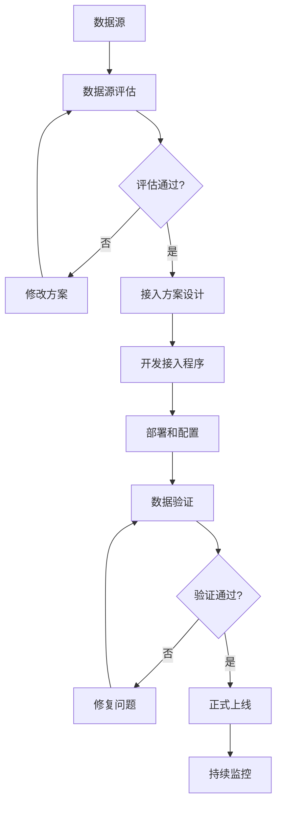
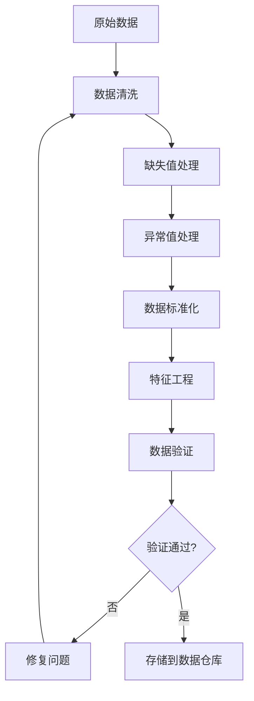
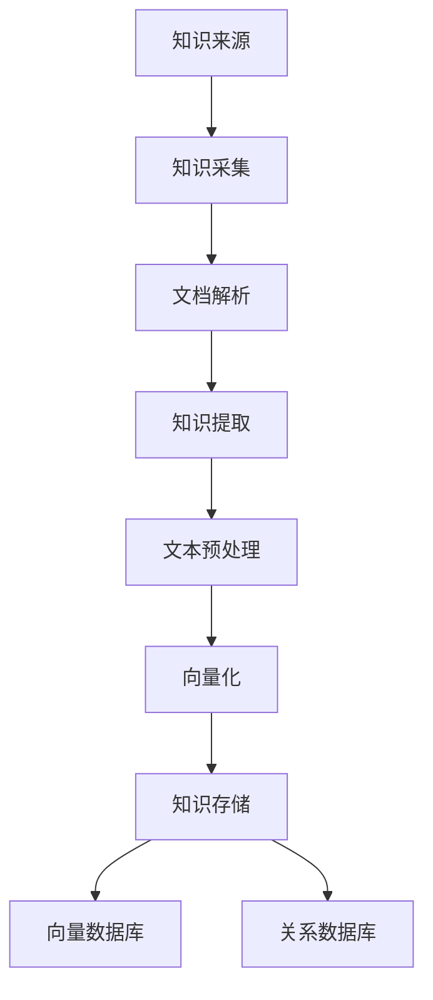

# 3. 数据与知识治理

## 3.1 私有数据接入

### 数据源类型

智能制造/工业4.0解决方案需要接入多种数据源，包括：

#### 内部数据源

- **生产数据**：
  - 数据描述：生产订单、生产计划、生产进度、产量等
  - 数据格式：JSON、CSV、数据库表
  - 数据量：日均百万级生产记录
  - 更新频率：实时/准实时
  - 接入方式：MES系统API、数据库直连、消息队列

- **设备数据**：
  - 数据描述：设备状态、运行参数、故障记录、维护记录等
  - 数据格式：时序数据、JSON、数据库表
  - 数据量：日均千万级设备数据点
  - 更新频率：实时（秒级）
  - 接入方式：SCADA系统、OPC UA、Modbus、IoT平台

- **质量数据**：
  - 数据描述：检测结果、缺陷记录、质量指标、不合格品处理等
  - 数据格式：JSON、数据库表、图像文件
  - 数据量：日均百万级检测记录
  - 更新频率：实时
  - 接入方式：质量检测系统API、数据库直连、文件上传

- **库存数据**：
  - 数据描述：原材料库存、半成品库存、成品库存、库存变动等
  - 数据格式：数据库表、JSON
  - 数据量：百万级库存记录
  - 更新频率：准实时（延迟&lt;1分钟）
  - 接入方式：ERP系统API、数据库直连

- **供应链数据**：
  - 数据描述：供应商信息、采购订单、交货记录、供应商评估等
  - 数据格式：数据库表、JSON、Excel
  - 数据量：百万级供应链记录
  - 更新频率：准实时
  - 接入方式：ERP系统API、数据库直连、文件导入

#### 外部数据源

- **市场数据**：
  - 数据描述：市场需求、价格趋势、竞争对手信息等
  - 数据来源：市场调研机构、行业报告、公开数据
  - 数据格式：API接口、CSV文件、PDF报告
  - 更新频率：每日/每周
  - 接入方式：API接口、文件下载、爬虫

- **天气数据**：
  - 数据描述：温度、湿度、天气状况等
  - 数据来源：气象局、第三方天气服务
  - 数据格式：API接口、JSON
  - 更新频率：实时/小时级
  - 接入方式：API接口

- **物流数据**：
  - 数据描述：运输状态、物流轨迹、配送时间等
  - 数据来源：物流公司、第三方物流平台
  - 数据格式：API接口、JSON
  - 更新频率：实时
  - 接入方式：API接口

### 数据接入流程

数据接入采用标准化的流程，确保数据质量和安全：

#### 1. 数据源评估

- **数据质量评估**：
  - 数据完整性：检查数据是否完整，缺失值比例
  - 数据准确性：抽样验证数据准确性
  - 数据一致性：检查数据格式和标准是否一致
  - 数据时效性：评估数据更新频率和延迟

- **数据安全评估**：
  - 数据敏感性：评估数据敏感级别
  - 数据合规性：检查是否符合数据保护法规
  - 数据来源可靠性：评估数据来源的可信度

#### 2. 接入方案设计

- **技术方案**：
  - 选择接入方式（API、数据库、OPC UA、文件等）
  - 设计数据同步机制（实时、准实时、批量）
  - 设计数据转换和清洗规则
  - 设计错误处理和重试机制

- **安全方案**：
  - 数据传输加密（TLS 1.3、OPC UA加密）
  - 数据存储加密（AES-256）
  - 访问控制（RBAC、IP白名单）
  - 数据脱敏规则

#### 3. 接入实施

- **开发接入程序**：
  - 编写数据接入脚本或服务
  - 实现数据转换和清洗逻辑
  - 实现错误处理和日志记录
  - 编写单元测试和集成测试

- **部署和配置**：
  - 部署接入服务到生产环境
  - 配置数据源连接信息
  - 配置数据同步规则
  - 配置监控和告警

#### 4. 验证和上线

- **数据验证**：
  - 验证数据完整性
  - 验证数据准确性
  - 验证数据时效性
  - 验证数据格式

- **性能测试**：
  - 测试数据接入性能
  - 测试系统负载能力
  - 测试错误处理能力

- **上线和监控**：
  - 正式上线数据接入
  - 持续监控数据质量
  - 持续监控系统性能

**数据接入流程图**：

## 3.2 数据清洗与预处理

### 数据清洗规则

#### 缺失值处理

- **设备数据缺失**：
  - 策略：前向填充、后向填充、线性插值
  - 规则：连续缺失超过5分钟，标记为异常
  - 实现：使用Pandas、NumPy进行数据处理

- **生产数据缺失**：
  - 策略：使用默认值、删除记录、人工补录
  - 规则：关键字段缺失，标记为异常
  - 实现：数据验证规则引擎

#### 异常值处理

- **设备数据异常**：
  - 检测方法：3σ原则、IQR方法、孤立森林
  - 处理策略：标记异常、删除异常、修正异常
  - 规则：异常值超过5%，触发告警

- **质量数据异常**：
  - 检测方法：统计方法、规则引擎
  - 处理策略：标记异常、转人工审核
  - 规则：异常检测结果转人工确认

#### 数据标准化

- **单位统一**：
  - 温度：统一为摄氏度
  - 压力：统一为MPa
  - 时间：统一为UTC时间

- **格式统一**：
  - 日期格式：统一为ISO 8601格式
  - 编码格式：统一为UTF-8
  - 数值精度：统一保留小数位数

### 数据预处理流程

**预处理流程图**：

## 3.3 知识库构建

### 知识来源

#### 内部知识

- **工艺知识**：
  - 生产工艺文档
  - 工艺参数标准
  - 工艺优化经验
  - 格式：PDF、Word、Excel、数据库

- **设备知识**：
  - 设备操作手册
  - 设备维护手册
  - 设备故障案例
  - 格式：PDF、Word、数据库

- **质量知识**：
  - 质量标准文档
  - 缺陷识别标准
  - 质量改进案例
  - 格式：PDF、Word、图像、数据库

- **管理知识**：
  - 管理制度文档
  - 流程规范文档
  - 最佳实践案例
  - 格式：PDF、Word、数据库

#### 外部知识

- **行业标准**：
  - ISO标准
  - 国家标准
  - 行业规范
  - 格式：PDF、网站

- **技术文献**：
  - 学术论文
  - 技术报告
  - 行业白皮书
  - 格式：PDF、网站

### 知识库构建流程

#### 1. 知识采集

- **文档解析**：
  - PDF解析：使用PyPDF、pdfplumber
  - Word解析：使用python-docx
  - Excel解析：使用pandas
  - 图像OCR：使用PaddleOCR、Tesseract

- **知识提取**：
  - 文本分块：按章节、段落分块
  - 关键信息提取：使用NER、关系抽取
  - 结构化处理：转换为结构化数据

#### 2. 知识处理

- **文本预处理**：
  - 去除无关内容
  - 标准化格式
  - 提取关键信息

- **向量化**：
  - 使用embedding模型（text-embedding-ada-002、BGE等）
  - 生成向量表示
  - 存储到向量数据库

#### 3. 知识存储

- **向量数据库**：
  - Milvus、Qdrant存储向量
  - 支持相似度搜索
  - 支持多模态检索

- **关系数据库**：
  - MySQL存储结构化知识
  - 支持关系查询
  - 支持全文检索

**知识库构建流程图**：

## 3.4 数据质量管理

### 数据质量指标

#### 完整性指标

- **数据完整率**：目标≥99%，当前95%
- **字段完整率**：目标≥98%，当前93%
- **记录完整率**：目标≥99%，当前96%

#### 准确性指标

- **数据准确率**：目标≥99%，当前96%
- **数据一致性**：目标≥98%，当前94%
- **数据有效性**：目标≥99%，当前97%

#### 时效性指标

- **数据延迟**：目标≤1分钟，当前5分钟
- **数据更新频率**：目标实时，当前准实时
- **数据时效性**：目标≥99%，当前95%

### 数据质量监控

#### 实时监控

- **数据接入监控**：
  - 监控数据接入量
  - 监控数据接入延迟
  - 监控数据接入错误率

- **数据质量监控**：
  - 监控数据完整性
  - 监控数据准确性
  - 监控数据时效性

#### 告警机制

- **数据质量告警**：
  - 数据完整率低于阈值，触发告警
  - 数据准确率低于阈值，触发告警
  - 数据延迟超过阈值，触发告警

- **告警处理**：
  - 自动修复：简单问题自动修复
  - 人工处理：复杂问题转人工处理
  - 问题跟踪：记录问题处理过程

## 3.5 数据安全与隐私保护

### 数据分类分级

#### 数据分类

- **生产数据**：
  - 级别：核心数据
  - 保护措施：加密存储、访问控制、审计日志

- **设备数据**：
  - 级别：重要数据
  - 保护措施：加密传输、访问控制

- **质量数据**：
  - 级别：重要数据
  - 保护措施：加密存储、访问控制

- **供应链数据**：
  - 级别：一般数据
  - 保护措施：访问控制

#### 数据分级保护

- **核心数据**：
  - 加密存储（AES-256）
  - 加密传输（TLS 1.3）
  - 严格访问控制（RBAC、MFA）
  - 完整审计日志

- **重要数据**：
  - 加密存储
  - 加密传输
  - 访问控制
  - 审计日志

- **一般数据**：
  - 访问控制
  - 基本审计

### 数据脱敏

#### 脱敏规则

- **设备编号**：部分脱敏，保留前3位和后2位
- **生产订单号**：部分脱敏，保留格式
- **供应商信息**：关键信息脱敏

#### 脱敏实现

- **静态脱敏**：数据存储时脱敏
- **动态脱敏**：数据查询时脱敏
- **脱敏验证**：验证脱敏效果

## 3.6 数据生命周期管理

### 数据保留策略

#### 生产数据

- **实时数据**：保留30天
- **历史数据**：保留3年
- **归档数据**：长期保留

#### 设备数据

- **实时数据**：保留90天
- **历史数据**：保留5年
- **归档数据**：长期保留

#### 质量数据

- **检测数据**：保留5年
- **缺陷数据**：保留10年
- **归档数据**：长期保留

### 数据归档

#### 归档策略

- **归档条件**：数据超过保留期限
- **归档方式**：压缩存储、冷存储
- **归档位置**：对象存储、磁带库

#### 归档恢复

- **恢复流程**：申请恢复、审核、恢复数据
- **恢复时间**：冷数据24小时内恢复
- **恢复验证**：验证数据完整性

