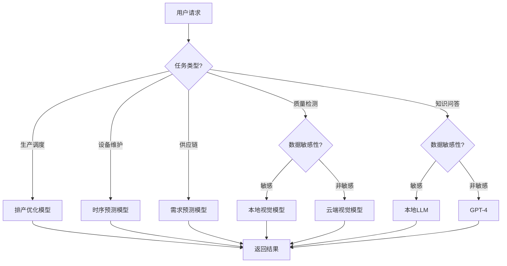
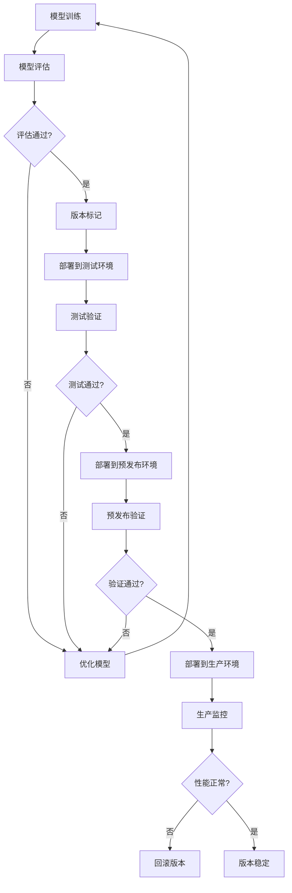

# 4. 模型与提示词管理

## 4.1 多模型路由

### 模型选择策略

智能制造/工业4.0解决方案使用多个AI模型，根据不同的业务场景和需求，智能选择最合适的模型：

#### 模型类型

- **大语言模型（LLM）**：
  - **GPT-4**：通用能力强，适合复杂推理任务
  - **Claude 3**：安全性高，适合合规审查
  - **通义千问**：中文优化，适合中文场景
  - **本地部署模型**：数据不出域，适合敏感场景

- **专用模型**：
  - **排产优化模型**：遗传算法、模拟退火、强化学习，用于生产调度
  - **视觉检测模型**：YOLO、ResNet、EfficientNet，用于质量检测
  - **时序预测模型**：LSTM、GRU、Transformer，用于设备故障预测
  - **需求预测模型**：ARIMA、Prophet、LSTM，用于供应链预测

#### 路由策略

- **基于任务类型路由**：
  - 生产调度任务 → 排产优化模型
  - 质量检测任务 → 视觉检测模型
  - 设备维护任务 → 时序预测模型
  - 供应链任务 → 需求预测模型
  - 知识问答 → 大语言模型（GPT-4）

- **基于数据敏感性路由**：
  - 敏感数据 → 本地部署模型
  - 非敏感数据 → 云端大模型

- **基于性能要求路由**：
  - 实时任务 → 轻量级模型或边缘模型
  - 批量任务 → 高性能模型

- **基于成本考虑路由**：
  - 简单任务 → 低成本模型
  - 复杂任务 → 高性能模型

**路由决策流程图**：



## 4.2 模型版本管理

### 版本控制策略

#### 版本命名规则

- **语义化版本号**：
  - 格式：主版本号.次版本号.修订号（如v1.2.3）
  - 主版本号：重大架构变更
  - 次版本号：新功能添加
  - 修订号：Bug修复

- **版本标签**：
  - production：生产版本
  - staging：预发布版本
  - testing：测试版本
  - development：开发版本

#### 版本管理流程

**版本管理流程图**：



### 模型部署策略

#### 蓝绿部署

- **部署方式**：
  - 蓝环境：当前生产环境
  - 绿环境：新版本环境
  - 切换：流量从蓝环境切换到绿环境

- **优势**：
  - 快速回滚
  - 零停机部署
  - 风险可控

#### 金丝雀部署

- **部署方式**：
  - 逐步切换流量
  - 先切换10%流量
  - 验证无问题后逐步增加

- **优势**：
  - 风险分散
  - 逐步验证
  - 快速发现问题

## 4.3 模型监控与优化

### 模型性能监控

#### 性能指标

- **准确率指标**：
  - 排产优化准确率：目标≥90%
  - 质量检测准确率：目标≥99%
  - 故障预测准确率：目标≥90%
  - 需求预测准确率：目标≥90%

- **性能指标**：
  - 推理延迟：目标≤100ms（实时任务）
  - 吞吐量：目标≥1000 QPS
  - 资源利用率：目标≥70%

#### 监控告警

- **性能告警**：
  - 准确率低于阈值，触发告警
  - 推理延迟超过阈值，触发告警
  - 资源利用率异常，触发告警

- **异常告警**：
  - 模型错误率异常，触发告警
  - 数据分布偏移，触发告警
  - 模型退化，触发告警

### 模型优化策略

#### 在线学习

- **增量学习**：
  - 使用新数据增量更新模型
  - 保持模型性能
  - 适应数据分布变化

- **持续优化**：
  - 定期评估模型性能
  - 发现性能下降及时优化
  - 持续改进模型

#### A/B测试

- **测试策略**：
  - 对比新旧模型性能
  - 评估业务指标影响
  - 选择最优模型版本

- **测试指标**：
  - 准确率对比
  - 业务指标对比
  - 用户体验对比

## 4.4 Prompt模板管理

### Prompt模板设计

#### 排产优化Prompt模板

```python
SCHEDULING_OPTIMIZATION_PROMPT = """
你是一位资深的生产调度专家，擅长优化生产计划和资源分配。

## 任务
根据订单需求和约束条件，生成最优的生产排产方案。

## 订单信息
- 订单编号：{order_id}
- 产品类型：{product_type}
- 订单数量：{quantity}
- 交期要求：{delivery_date}

## 约束条件
- 设备状态：{device_status}
- 物料库存：{material_inventory}
- 人员配置：{personnel_config}
- 产能限制：{capacity_limit}

## 优化目标
1. 最大化设备利用率
2. 最小化生产周期
3. 满足交期要求
4. 最小化生产成本

## 输出格式
请按照以下JSON格式输出：
{{
    "schedule_id": "排产方案ID",
    "start_time": "开始时间",
    "end_time": "结束时间",
    "device_allocation": [
        {{
            "device_id": "设备ID",
            "start_time": "开始时间",
            "end_time": "结束时间",
            "product": "产品类型",
            "quantity": 数量
        }}
    ],
    "utilization_rate": 0.0-1.0,
    "total_cost": 总成本,
    "feasibility": true/false
}}
"""
```

#### 质量检测Prompt模板

```python
QUALITY_INSPECTION_PROMPT = """
你是一位资深的质检专家，擅长识别产品缺陷和质量问题。

## 任务
分析产品图像，识别缺陷类型和位置，评估产品质量。

## 产品信息
- 产品类型：{product_type}
- 产品编号：{product_id}
- 检测标准：{inspection_standard}

## 图像信息
- 图像路径：{image_path}
- 图像尺寸：{image_size}
- 拍摄角度：{camera_angle}

## 检测要求
1. 识别缺陷类型（划痕、裂纹、变形、污渍等）
2. 定位缺陷位置（坐标、区域）
3. 评估缺陷严重程度（轻微/中等/严重）
4. 判断产品是否合格

## 输出格式
请按照以下JSON格式输出：
{{
    "product_id": "产品编号",
    "inspection_result": "合格/不合格",
    "defects": [
        {{
            "defect_type": "缺陷类型",
            "location": {{
                "x": x坐标,
                "y": y坐标,
                "width": 宽度,
                "height": 高度
            }},
            "severity": "轻微/中等/严重",
            "confidence": 0.0-1.0
        }}
    ],
    "overall_quality_score": 0.0-1.0
}}
"""
```

#### 设备维护Prompt模板

```python
MAINTENANCE_PREDICTION_PROMPT = """
你是一位资深的设备维护专家，擅长预测设备故障和制定维护计划。

## 任务
分析设备状态数据，预测设备故障概率，制定维护建议。

## 设备信息
- 设备编号：{device_id}
- 设备类型：{device_type}
- 设备状态：{device_status}

## 状态数据
- 温度：{temperature}
- 振动：{vibration}
- 电流：{current}
- 运行时间：{running_time}
- 历史故障记录：{failure_history}

## 分析要求
1. 评估设备健康状态
2. 预测故障概率
3. 预测故障时间窗口
4. 制定维护建议（维护类型、维护时间、维护内容）

## 输出格式
请按照以下JSON格式输出：
{{
    "device_id": "设备编号",
    "health_score": 0.0-1.0,
    "failure_probability": 0.0-1.0,
    "predicted_failure_time": "预测故障时间",
    "maintenance_recommendation": {{
        "maintenance_type": "预防性维护/紧急维护",
        "recommended_time": "建议维护时间",
        "maintenance_content": "维护内容",
        "urgency": "低/中/高"
    }}
}}
"""
```

### 版本管理

#### Prompt版本控制

- **版本标识**：
  - 使用语义化版本号（如v1.0.0）
  - 版本号格式：主版本号.次版本号.修订号

- **版本存储**：
  - Prompt模板存储在版本控制系统中（Git）
  - 每个版本都有完整的变更记录
  - 支持版本对比和回滚

- **版本标签**：
  - 生产版本：标记为production
  - 测试版本：标记为testing
  - 开发版本：标记为development

#### Prompt版本管理流程

1. **Prompt设计**：
   - 设计Prompt模板
   - 编写测试用例
   - 进行初步测试

2. **版本提交**：
   - 提交到版本控制系统
   - 标记版本号
   - 编写变更说明

3. **测试验证**：
   - 部署到测试环境
   - 运行测试用例
   - 验证效果

4. **生产部署**：
   - 部署到生产环境
   - 监控效果
   - 收集反馈

5. **持续优化**：
   - 根据反馈优化Prompt
   - 迭代改进
   - 版本升级

## 4.5 模型评估与测试

### 评估指标

#### 排产优化模型评估

- **准确率**：排产方案可行性准确率
- **效率**：设备利用率提升
- **成本**：生产成本降低
- **交期**：订单准时交付率

#### 质量检测模型评估

- **准确率**：缺陷识别准确率
- **召回率**：缺陷检出率
- **精确率**：误检率
- **F1分数**：综合评估指标

#### 设备维护模型评估

- **准确率**：故障预测准确率
- **召回率**：故障检出率
- **精确率**：误报率
- **提前期**：故障预测提前时间

### 测试策略

#### 单元测试

- **模型推理测试**：
  - 测试模型推理功能
  - 验证输出格式
  - 验证输出范围

#### 集成测试

- **端到端测试**：
  - 测试完整业务流程
  - 验证系统集成
  - 验证数据流转

#### 性能测试

- **负载测试**：
  - 测试系统负载能力
  - 测试并发处理能力
  - 测试响应时间

- **压力测试**：
  - 测试系统极限能力
  - 测试故障恢复能力
  - 测试资源利用率

## 4.6 模型安全与合规

### 模型安全

#### 模型保护

- **模型加密**：
  - 模型文件加密存储
  - 模型传输加密
  - 访问控制

- **模型水印**：
  - 添加模型水印
  - 防止模型盗用
  - 追踪模型使用

#### 对抗攻击防护

- **对抗样本检测**：
  - 检测对抗样本
  - 防御对抗攻击
  - 提高模型鲁棒性

### 合规要求

#### 算法备案

- **备案要求**：
  - 向监管部门备案算法
  - 提供算法说明文档
  - 提供风险评估报告

#### 可解释性

- **决策解释**：
  - 提供模型决策解释
  - 说明决策依据
  - 满足监管要求

