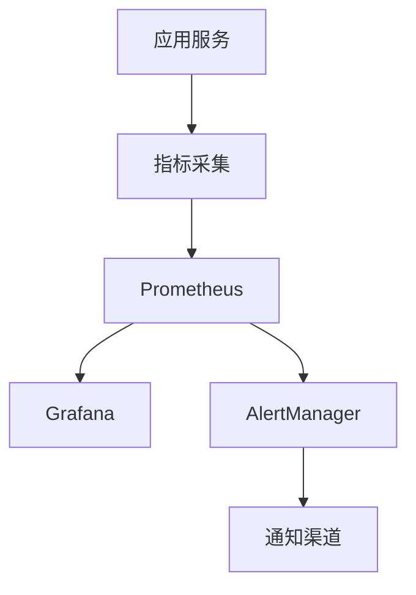

# 9. 监控与可观测

## 9.1 业务指标

### 核心业务指标

智能制造/工业4.0解决方案的核心业务指标包括：

#### 生产调度业务指标

- **排产任务数**：
  - 定义：每日/每小时创建的排产任务数量
  - 计算方法：统计排产API调用次数
  - 目标值：日均1000+个任务
  - 监控频率：实时

- **排产成功率**：
  - 定义：成功生成可行排产方案的比率
  - 计算方法：成功排产数 / 总排产数
  - 目标值：≥ 95%
  - 监控频率：实时

- **设备利用率**：
  - 定义：设备实际使用时间占计划时间的比率
  - 计算方法：实际使用时间 / 计划时间
  - 目标值：≥ 85%
  - 监控频率：实时

- **订单准时交付率**：
  - 定义：按时交付的订单占所有订单的比率
  - 计算方法：按时交付订单数 / 总订单数
  - 目标值：≥ 95%
  - 监控频率：每日

#### 质量检测业务指标

- **检测任务数**：
  - 定义：每日/每小时执行的检测任务数量
  - 计算方法：统计检测API调用次数
  - 目标值：日均10000+个任务
  - 监控频率：实时

- **检测准确率**：
  - 定义：检测结果正确的比率
  - 计算方法：正确检测数 / 总检测数
  - 目标值：≥ 99%
  - 监控频率：每日

- **检测漏检率**：
  - 定义：漏检的缺陷占所有缺陷的比率
  - 计算方法：漏检缺陷数 / 总缺陷数
  - 目标值：≤ 1%
  - 监控频率：每日

- **产品合格率**：
  - 定义：合格产品占所有产品的比率
  - 计算方法：合格产品数 / 总产品数
  - 目标值：≥ 99%
  - 监控频率：实时

#### 设备维护业务指标

- **故障预测准确率**：
  - 定义：故障预测正确的比率
  - 计算方法：正确预测数 / 总预测数
  - 目标值：≥ 90%
  - 监控频率：每日

- **非计划停机时间占比**：
  - 定义：非计划停机时间占总生产时间的比率
  - 计算方法：非计划停机时间 / 总生产时间
  - 目标值：≤ 2%
  - 监控频率：实时

- **设备可用率**：
  - 定义：设备可用时间占总时间的比率
  - 计算方法：可用时间 / 总时间
  - 目标值：≥ 98%
  - 监控频率：实时

- **维护成本降低率**：
  - 定义：维护成本降低的比率
  - 计算方法：（原维护成本 - 现维护成本）/ 原维护成本
  - 目标值：≥ 30%
  - 监控频率：每月

#### 供应链业务指标

- **需求预测准确率**：
  - 定义：需求预测准确的比率
  - 计算方法：需要人工评估或回测验证
  - 目标值：≥ 90%
  - 监控频率：每月

- **库存周转率**：
  - 定义：库存周转的次数
  - 计算方法：销售成本 / 平均库存
  - 目标值：≥ 12次/年
  - 监控频率：每月

- **缺料率**：
  - 定义：缺料次数占总需求的比率
  - 计算方法：缺料次数 / 总需求次数
  - 目标值：≤ 1%
  - 监控频率：实时

### 指标监控

#### 监控系统架构



#### Prometheus配置

```yaml
# prometheus.yml
global:
  scrape_interval: 15s
  evaluation_interval: 15s

scrape_configs:
  - job_name: 'manufacturing-ai-api'
    static_configs:
      - targets: ['api:8000']
    metrics_path: '/metrics'
  
  - job_name: 'production-scheduling'
    static_configs:
      - targets: ['scheduling-service:8001']
  
  - job_name: 'quality-inspection'
    static_configs:
      - targets: ['inspection-service:8002']
  
  - job_name: 'equipment-maintenance'
    static_configs:
      - targets: ['maintenance-service:8003']
```

## 9.2 系统指标

### 系统性能指标

#### API性能指标

- **响应时间**：
  - P50响应时间：目标 ≤ 50ms
  - P95响应时间：目标 ≤ 100ms
  - P99响应时间：目标 ≤ 200ms

- **吞吐量**：
  - QPS：目标 ≥ 1000
  - TPS：目标 ≥ 500
  - 并发用户数：目标 ≥ 500

#### 资源使用指标

- **CPU使用率**：
  - 平均使用率：目标 50-70%
  - 峰值使用率：目标 ≤ 80%

- **内存使用率**：
  - 平均使用率：目标 60-80%
  - 峰值使用率：目标 ≤ 90%

- **GPU使用率**：
  - 平均使用率：目标 ≥ 70%
  - 峰值使用率：目标 ≥ 90%

- **磁盘使用率**：
  - 使用率：目标 ≤ 80%
  - IOPS：监控读写IOPS

- **网络带宽使用率**：
  - 入站带宽：监控入站流量
  - 出站带宽：监控出站流量

### 数据库指标

#### MySQL指标

- **连接数**：
  - 当前连接数
  - 最大连接数
  - 连接池使用率

- **查询性能**：
  - 慢查询数量
  - 平均查询时间
  - 查询QPS

- **复制延迟**：
  - 主从复制延迟
  - 复制状态

#### 时序数据库指标

- **写入性能**：
  - 写入QPS
  - 写入延迟
  - 写入错误率

- **查询性能**：
  - 查询QPS
  - 查询延迟
  - 查询错误率

## 9.3 日志管理

### 日志分类

#### 应用日志

- **访问日志**：
  - API请求日志
  - 响应状态码
  - 响应时间

- **业务日志**：
  - 业务操作日志
  - 业务异常日志
  - 业务关键事件日志

- **错误日志**：
  - 系统错误日志
  - 异常堆栈信息
  - 错误上下文信息

#### 系统日志

- **系统日志**：
  - 操作系统日志
  - 容器日志
  - Kubernetes日志

### 日志收集

#### ELK Stack

- **Elasticsearch**：
  - 日志存储和检索
  - 索引管理
  - 数据保留策略

- **Logstash**：
  - 日志收集和解析
  - 日志过滤和转换
  - 日志路由

- **Kibana**：
  - 日志可视化
  - 日志查询界面
  - 日志分析仪表板

#### 日志配置

```yaml
# logstash.conf
input {
  file {
    path => "/var/log/app/*.log"
    type => "app_log"
  }
}

filter {
  if [type] == "app_log" {
    grok {
      match => { "message" => "%{TIMESTAMP_ISO8601:timestamp} %{LOGLEVEL:level} %{GREEDYDATA:message}" }
    }
  }
}

output {
  elasticsearch {
    hosts => ["elasticsearch:9200"]
    index => "manufacturing-logs-%{+YYYY.MM.dd}"
  }
}
```

## 9.4 告警机制

### 告警规则

#### 业务告警

- **排产失败告警**：
  - 条件：排产失败率 > 5%
  - 级别：高
  - 通知：立即通知

- **质量检测异常告警**：
  - 条件：检测准确率 < 99%
  - 级别：高
  - 通知：立即通知

- **设备故障告警**：
  - 条件：设备故障预测概率 > 0.8
  - 级别：高
  - 通知：立即通知

#### 系统告警

- **服务不可用告警**：
  - 条件：服务健康检查失败
  - 级别：高
  - 通知：立即通知

- **资源使用率告警**：
  - 条件：CPU使用率 > 80% 持续5分钟
  - 级别：中
  - 通知：5分钟内通知

- **数据库连接告警**：
  - 条件：数据库连接数 > 80%
  - 级别：中
  - 通知：5分钟内通知

### 告警通知

#### 通知渠道

- **邮件通知**：
  - 发送到运维团队邮箱
  - 包含告警详情和链接

- **短信通知**：
  - 紧急告警发送短信
  - 包含关键信息

- **企业微信/钉钉通知**：
  - 发送到工作群
  - 支持@相关人员

#### AlertManager配置

```yaml
# alertmanager.yml
route:
  group_by: ['alertname', 'cluster']
  group_wait: 10s
  group_interval: 10s
  repeat_interval: 12h
  receiver: 'default'
  routes:
  - match:
      severity: critical
    receiver: 'critical-alerts'
  - match:
      severity: warning
    receiver: 'warning-alerts'

receivers:
- name: 'default'
  email_configs:
  - to: 'ops@example.com'
    send_resolved: true

- name: 'critical-alerts'
  email_configs:
  - to: 'critical@example.com'
  sms_configs:
  - to: '+86-138-xxxx-xxxx'
  webhook_configs:
  - url: 'https://qyapi.weixin.qq.com/cgi-bin/webhook/send?key=xxx'

- name: 'warning-alerts'
  email_configs:
  - to: 'warning@example.com'
```

## 9.5 可观测性

### 分布式追踪

#### Jaeger配置

- **追踪采样**：
  - 采样率：10%
  - 采样策略：基于概率

- **追踪数据存储**：
  - 存储后端：Elasticsearch
  - 数据保留：7天

#### 追踪示例

```python
from opentelemetry import trace
from opentelemetry.sdk.trace import TracerProvider

# 初始化追踪
trace.set_tracer_provider(TracerProvider())

tracer = trace.get_tracer(__name__)

# 使用追踪
with tracer.start_as_current_span("production_scheduling"):
    # 排产逻辑
    pass
```

### 性能分析

#### APM工具

- **应用性能监控**：
  - 使用APM工具监控应用性能
  - 识别性能瓶颈
  - 优化性能问题

#### 性能分析

- **CPU分析**：
  - CPU使用率分析
  - CPU热点分析
  - CPU优化建议

- **内存分析**：
  - 内存使用分析
  - 内存泄漏检测
  - 内存优化建议

- **I/O分析**：
  - 磁盘I/O分析
  - 网络I/O分析
  - I/O优化建议

