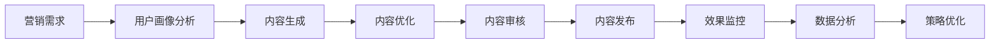

# 5. 智能体与业务编排

## 5.1 Agent技能链

### 技能定义

智能营销Agent需要具备多种技能，通过技能链组合完成复杂营销任务：

#### 核心技能

**1. 内容生成技能（Content Generation）**
- **功能**：生成营销文案、海报文案、视频脚本等内容
- **输入**：产品信息、目标受众、营销目标、平台要求
- **输出**：生成的营销内容
- **实现**：基于大语言模型的内容生成

**2. 用户画像分析技能（User Profile Analysis）**
- **功能**：分析用户行为数据，构建用户画像
- **输入**：用户行为数据、属性数据
- **输出**：用户画像、标签、分群结果
- **实现**：基于机器学习的用户画像模型

**3. 内容优化技能（Content Optimization）**
- **功能**：优化现有内容，提升内容质量
- **输入**：原始内容、优化目标
- **输出**：优化后的内容
- **实现**：基于大语言模型的内容优化

**4. 推荐技能（Recommendation）**
- **功能**：为用户推荐个性化产品和内容
- **输入**：用户画像、产品信息、历史行为
- **输出**：推荐列表
- **实现**：基于协同过滤和深度学习的推荐模型

**5. 广告优化技能（Ad Optimization）**
- **功能**：优化广告关键词、出价、创意等
- **输入**：广告数据、效果数据
- **输出**：优化建议
- **实现**：基于强化学习的广告优化模型

**6. 数据分析技能（Data Analysis）**
- **功能**：分析营销数据，提供数据洞察
- **输入**：营销数据、业务指标
- **输出**：分析报告、洞察建议
- **实现**：基于数据分析工具和AI模型

### 技能链设计

技能链按照营销业务流程组织，形成完整的处理流程：



#### 标准技能链

**内容创作链**：
1. 用户画像分析 → 2. 内容生成 → 3. 内容优化 → 4. 内容审核

**精准营销链**：
1. 用户画像分析 → 2. 用户分群 → 3. 个性化推荐 → 4. 内容生成 → 5. 精准触达

**广告优化链**：
1. 广告数据分析 → 2. 广告优化 → 3. 效果预测 → 4. 策略调整

**实现示例**：
```python
from langchain.agents import AgentExecutor, create_react_agent
from langchain.tools import Tool

# 定义工具
tools = [
    Tool(
        name="generate_content",
        func=generate_marketing_content,
        description="生成营销内容"
    ),
    Tool(
        name="analyze_user_profile",
        func=analyze_user_profile,
        description="分析用户画像"
    ),
    Tool(
        name="optimize_content",
        func=optimize_content,
        description="优化内容"
    ),
]

# 创建Agent
agent = create_react_agent(llm, tools, prompt)
agent_executor = AgentExecutor(agent=agent, tools=tools, verbose=True)

# 执行任务
result = agent_executor.invoke({
    "input": "为25-35岁女性用户生成一款护肤品的营销文案"
})
```

## 5.2 工具注册中心

### 工具类型

#### 内容生成工具
- **文案生成工具**：生成营销文案、产品描述等
- **海报生成工具**：生成营销海报文案和设计建议
- **视频脚本生成工具**：生成视频脚本和分镜建议

#### 数据分析工具
- **用户画像工具**：构建和分析用户画像
- **数据统计工具**：统计营销数据，生成报表
- **趋势分析工具**：分析数据趋势，预测未来

#### 广告优化工具
- **关键词工具**：优化广告关键词
- **出价工具**：优化广告出价策略
- **创意工具**：优化广告创意

#### 第三方集成工具
- **电商平台API**：调用电商平台API获取数据
- **社交媒体API**：调用社交媒体API发布内容
- **广告平台API**：调用广告平台API管理广告

### 工具注册流程

**1. 工具开发**：开发工具功能，实现工具接口
**2. 工具测试**：测试工具功能，确保稳定可靠
**3. 工具注册**：在工具注册中心注册工具
**4. 工具发布**：发布工具，供Agent使用

**实现示例**：
```python
class ToolRegistry:
    def __init__(self):
        self.tools = {}
    
    def register_tool(self, tool_name, tool_func, description, parameters):
        """
        注册工具
        """
        self.tools[tool_name] = {
            "func": tool_func,
            "description": description,
            "parameters": parameters
        }
    
    def get_tool(self, tool_name):
        """
        获取工具
        """
        return self.tools.get(tool_name)
    
    def list_tools(self):
        """
        列出所有工具
        """
        return list(self.tools.keys())
```

### 工具调用机制

**同步调用**：直接调用工具，等待结果返回
**异步调用**：异步调用工具，不阻塞主流程
**批量调用**：批量调用工具，提升效率

**实现示例**：
```python
import asyncio

async def call_tool_async(tool_name, *args, **kwargs):
    """
    异步调用工具
    """
    tool = tool_registry.get_tool(tool_name)
    if tool:
        return await tool["func"](*args, **kwargs)
    else:
        raise ValueError(f"Tool {tool_name} not found")

# 批量调用
async def batch_call_tools(tool_calls):
    """
    批量调用工具
    """
    tasks = [
        call_tool_async(call["tool"], *call.get("args", []), **call.get("kwargs", {}))
        for call in tool_calls
    ]
    return await asyncio.gather(*tasks)
```

## 5.3 长记忆与状态管理

### 记忆机制

#### 短期记忆
- **对话上下文**：保存当前对话的上下文信息
- **会话状态**：保存当前会话的状态信息
- **临时数据**：保存临时计算的数据

#### 长期记忆
- **用户画像**：保存用户画像信息，长期有效
- **历史行为**：保存用户历史行为数据
- **营销策略**：保存成功的营销策略和案例

**实现示例**：
```python
class MemoryManager:
    def __init__(self):
        self.short_term_memory = {}  # 短期记忆
        self.long_term_memory = {}   # 长期记忆
    
    def save_short_term(self, key, value, ttl=3600):
        """
        保存短期记忆
        """
        self.short_term_memory[key] = {
            "value": value,
            "expires_at": time.time() + ttl
        }
    
    def save_long_term(self, key, value):
        """
        保存长期记忆
        """
        self.long_term_memory[key] = value
    
    def get_memory(self, key):
        """
        获取记忆
        """
        # 先查短期记忆
        if key in self.short_term_memory:
            memory = self.short_term_memory[key]
            if time.time() < memory["expires_at"]:
                return memory["value"]
            else:
                del self.short_term_memory[key]
        
        # 再查长期记忆
        return self.long_term_memory.get(key)
```

### 状态管理

#### 任务状态
- **待处理**：任务已创建，等待处理
- **处理中**：任务正在处理
- **已完成**：任务处理完成
- **失败**：任务处理失败

#### 营销活动状态
- **草稿**：活动处于草稿状态
- **待审核**：活动等待审核
- **进行中**：活动正在进行
- **已结束**：活动已结束

**实现示例**：
```python
class StateManager:
    def __init__(self):
        self.states = {}
    
    def set_state(self, entity_id, state, metadata=None):
        """
        设置状态
        """
        self.states[entity_id] = {
            "state": state,
            "timestamp": time.time(),
            "metadata": metadata or {}
        }
    
    def get_state(self, entity_id):
        """
        获取状态
        """
        return self.states.get(entity_id)
    
    def transition_state(self, entity_id, new_state, metadata=None):
        """
        状态转换
        """
        current_state = self.get_state(entity_id)
        if self.can_transition(current_state["state"], new_state):
            self.set_state(entity_id, new_state, metadata)
        else:
            raise ValueError(f"Cannot transition from {current_state['state']} to {new_state}")
```

### 上下文维护

#### 对话上下文
- **历史消息**：保存对话历史消息
- **用户意图**：保存用户意图信息
- **实体信息**：保存提取的实体信息

#### 任务上下文
- **任务参数**：保存任务参数
- **中间结果**：保存任务中间结果
- **执行状态**：保存任务执行状态

**实现示例**：
```python
class ContextManager:
    def __init__(self):
        self.contexts = {}
    
    def create_context(self, context_id, initial_data=None):
        """
        创建上下文
        """
        self.contexts[context_id] = {
            "data": initial_data or {},
            "history": [],
            "created_at": time.time()
        }
    
    def update_context(self, context_id, key, value):
        """
        更新上下文
        """
        if context_id in self.contexts:
            self.contexts[context_id]["data"][key] = value
            self.contexts[context_id]["history"].append({
                "action": "update",
                "key": key,
                "value": value,
                "timestamp": time.time()
            })
    
    def get_context(self, context_id):
        """
        获取上下文
        """
        return self.contexts.get(context_id)
```
