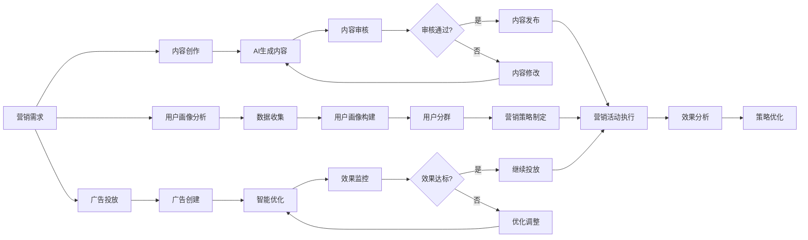
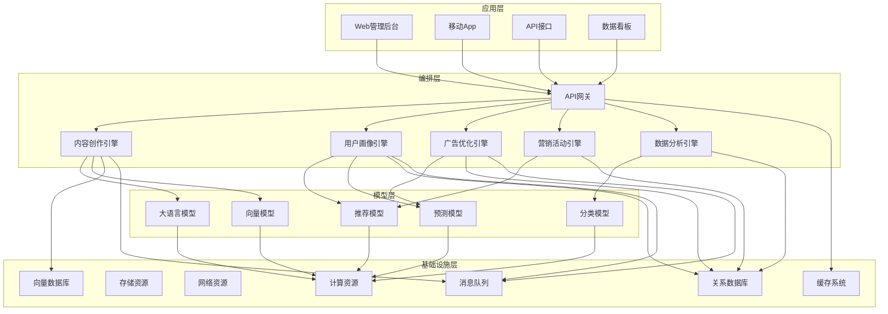
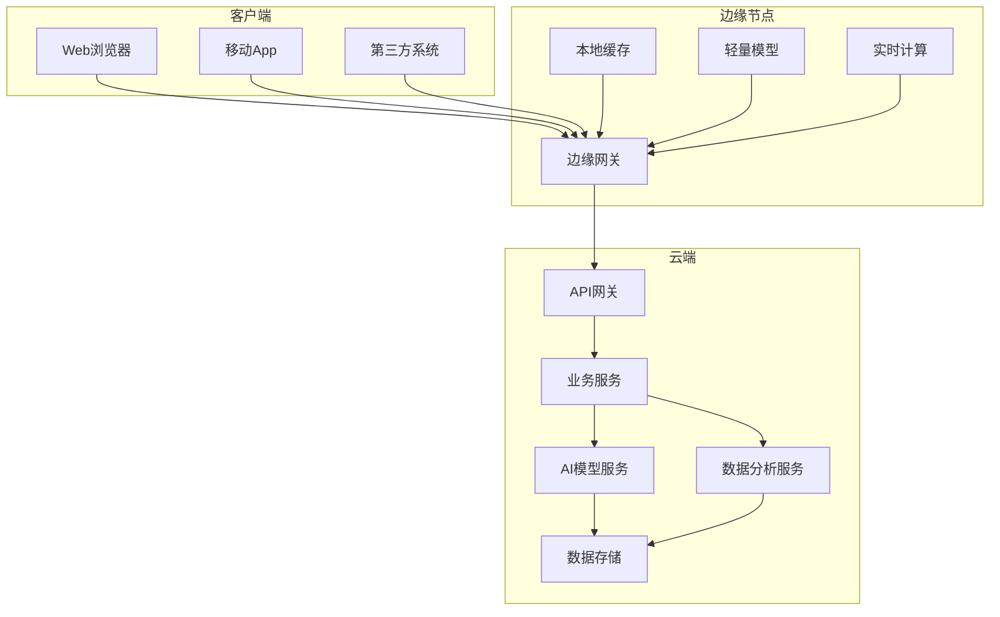

# 2. 总体架构

## 2.1 业务架构

### 角色定义

#### 营销人员（Marketer）
- **职责**：使用智能营销平台进行内容创作、用户画像分析、营销活动策划和执行
- **权限**：内容创作、用户画像查看、营销活动创建、数据查看
- **典型场景**：生成营销文案、分析用户画像、创建营销活动、查看营销效果

#### 内容审核员（Content Reviewer）
- **职责**：审核AI生成的内容，确保内容质量和合规性
- **权限**：内容审核、内容修改、内容发布、合规检查
- **典型场景**：审核AI生成文案、检查内容合规性、修改内容、发布内容

#### 数据分析师（Data Analyst）
- **职责**：分析营销数据，优化营销策略，提供数据洞察
- **权限**：数据查询、报表生成、数据分析、策略建议
- **典型场景**：用户行为分析、营销效果分析、ROI分析、策略优化建议

#### 系统管理员（System Admin）
- **职责**：系统运维、性能监控、安全管理、数据备份
- **权限**：系统配置、用户管理、安全审计、数据管理
- **典型场景**：系统部署、性能优化、安全加固、故障处理

#### 广告投放专员（Ad Specialist）
- **职责**：管理广告投放，优化广告效果，监控广告ROI
- **权限**：广告创建、广告优化、预算管理、效果查看
- **典型场景**：创建广告计划、优化关键词、调整出价、监控ROI

### 用例分析

#### 用例1：AI内容创作
- **参与者**：营销人员、智能营销系统
- **前置条件**：营销人员已登录系统，产品信息已录入
- **主流程**：
  1. 营销人员选择内容类型（文案、海报、视频脚本等）和目标平台
  2. 输入产品信息、目标受众、营销目标等参数
  3. 系统调用AI模型生成内容初稿
  4. 系统进行内容质量评分和合规检查
  5. 营销人员查看生成内容，可选择修改、重新生成或提交审核
  6. 内容审核员审核内容，通过后发布
- **后置条件**：内容保存到内容库，可用于营销活动
- **扩展流程**：如果内容质量不合格，系统自动拒绝或提示修改

#### 用例2：用户画像构建与分析
- **参与者**：数据分析师、智能营销系统
- **前置条件**：用户数据已接入系统，数据清洗完成
- **主流程**：
  1. 系统自动收集用户行为数据（浏览、点击、购买等）
  2. 系统进行数据清洗和特征提取
  3. 系统构建用户画像（基本信息、兴趣偏好、消费能力等）
  4. 系统进行用户分群（基于RFM模型、聚类算法等）
  5. 数据分析师查看用户画像和分群结果
  6. 数据分析师基于用户画像制定营销策略
- **后置条件**：用户画像更新，营销策略制定完成
- **扩展流程**：如果数据质量不合格，系统提示数据问题

#### 用例3：智能广告投放优化
- **参与者**：广告投放专员、智能营销系统
- **前置条件**：广告计划已创建，预算已分配
- **主流程**：
  1. 广告投放专员创建广告计划，设置目标、预算、出价等
  2. 系统基于历史数据和AI模型，推荐关键词和创意
  3. 系统自动调整出价策略，优化ROI
  4. 系统实时监控广告效果（点击率、转化率、ROI等）
  5. 系统自动优化广告（暂停低效广告、增加高效广告预算等）
  6. 广告投放专员查看优化结果和效果报告
- **后置条件**：广告效果优化，ROI提升
- **扩展流程**：如果广告效果异常，系统自动告警并暂停广告

### 故事地图

## 2.2 技术架构

### AI-Native四层架构

智能营销系统采用AI-Native四层架构，从下到上依次为基础设施层、模型层、编排层和应用层。

#### 应用层

应用层提供多种接入方式，满足不同用户的使用需求：

- **Web管理后台**：基于Vue 3 + TypeScript开发，提供内容创作、用户画像分析、广告管理、数据看板等功能
- **移动App**：原生iOS和Android应用，支持移动端内容创作、数据查看、营销活动管理
- **API接口**：RESTful API和GraphQL API，支持第三方系统集成
- **数据看板**：实时数据可视化，展示营销效果、用户画像、ROI等关键指标

**技术栈**：
- 前端框架：Vue 3、React 18
- UI组件库：Element Plus、Ant Design
- 状态管理：Pinia、Redux
- 构建工具：Vite、Webpack
- 数据可视化：ECharts、D3.js

#### 编排层

编排层是系统的核心，负责业务流程编排和AI能力调用：

- **API网关**：统一入口，负责路由、限流、认证、日志等
- **内容创作引擎**：基于大语言模型，生成营销文案、海报文案、视频脚本等内容
- **用户画像引擎**：基于用户行为数据，构建用户画像，进行用户分群和标签管理
- **广告优化引擎**：智能优化广告关键词、出价策略、创意等，提升广告ROI
- **营销活动引擎**：管理营销活动生命周期，支持A/B测试、个性化推荐等
- **数据分析引擎**：分析营销数据，提供数据洞察和策略建议

**技术栈**：
- 框架：FastAPI（Python）、Spring Boot（Java）
- 消息队列：RabbitMQ、Kafka
- 工作流引擎：n8n、LangChain、Airflow
- 缓存：Redis、Memcached
- 任务调度：Celery、Quartz

#### 模型层

模型层提供各种AI能力：

- **大语言模型**：支持GPT-4、Claude、通义千问、文心一言等，用于内容生成
- **向量模型**：支持text-embedding-ada-002、bge-large-zh等，用于内容相似度计算和推荐
- **推荐模型**：基于协同过滤、深度学习等算法，进行个性化推荐
- **预测模型**：基于时间序列、机器学习等算法，预测用户行为、营销效果等
- **分类模型**：BERT、RoBERTa等，用于内容分类、用户标签等

**技术栈**：
- 模型服务：OpenAI API、Azure OpenAI、本地部署模型
- 向量化：sentence-transformers、LangChain Embeddings
- 模型管理：ModelScope、Hugging Face
- 机器学习框架：Scikit-learn、XGBoost、PyTorch、TensorFlow

#### 基础设施层

基础设施层提供计算、存储、网络等基础资源：

- **计算资源**：Kubernetes集群，支持弹性伸缩，GPU节点用于模型推理
- **存储资源**：对象存储（OSS/S3）存储内容、图片、视频等媒体文件，块存储用于数据库
- **网络资源**：CDN加速、负载均衡、专线连接
- **向量数据库**：Milvus、Qdrant、Pinecone，存储向量化内容、用户特征等
- **关系数据库**：MySQL 8.0、PostgreSQL，存储结构化数据（用户信息、营销活动、广告数据等）
- **缓存系统**：Redis集群，提供高性能缓存服务
- **消息队列**：Kafka、RabbitMQ，处理异步任务和数据流

**技术栈**：
- 容器编排：Kubernetes、Docker
- 服务网格：Istio
- 监控：Prometheus、Grafana
- 日志：ELK Stack（Elasticsearch、Logstash、Kibana）
- 对象存储：阿里云OSS、AWS S3

### 技术栈

#### 前端技术
- **Vue 3 + TypeScript**：现代化前端框架，类型安全，开发效率高
- **Vite**：快速构建工具，开发体验好
- **TailwindCSS**：实用优先的CSS框架，快速构建UI
- **Pinia**：轻量级状态管理，替代Vuex
- **ECharts**：数据可视化库，支持丰富的图表类型

#### 后端技术
- **Python 3.11 + FastAPI**：高性能异步框架，API开发效率高
- **MySQL 8.0**：关系型数据库，存储结构化数据
- **Redis**：内存数据库，提供缓存和会话存储
- **RabbitMQ/Kafka**：消息队列，处理异步任务和数据流
- **Celery**：分布式任务队列，处理耗时任务

#### AI技术
- **RAG技术**：检索增强生成，提升内容生成质量
- **LangChain**：LLM应用开发框架，简化开发流程
- **向量数据库**：Milvus/Qdrant，存储和检索向量数据
- **大语言模型**：GPT-4、Claude、通义千问等
- **推荐算法**：协同过滤、深度学习推荐模型
- **预测模型**：时间序列预测、用户行为预测

#### DevOps技术
- **Docker**：容器化部署
- **Kubernetes**：容器编排，支持弹性伸缩
- **GitHub Actions**：CI/CD自动化
- **Prometheus + Grafana**：监控和可视化

## 2.3 部署架构

### 云/边/端混合部署

智能营销系统采用云边端混合部署架构，满足不同场景的需求：

#### 云端部署
- **主要服务**：API网关、业务逻辑、AI模型、数据分析、数据存储
- **优势**：集中管理、易于扩展、资源充足、数据安全
- **适用场景**：大规模服务、复杂AI模型推理、数据分析、知识库管理

#### 边缘节点部署
- **主要服务**：边缘网关、本地缓存、轻量级模型、实时计算
- **优势**：低延迟、减少带宽消耗、提高响应速度、降低云端压力
- **适用场景**：高频访问、实时性要求高、带宽受限场景、实时推荐

#### 客户端部署
- **主要功能**：UI展示、本地缓存、离线功能、轻量计算
- **优势**：用户体验好、减少服务器压力、支持离线使用
- **适用场景**：移动端应用、离线场景、实时交互

### 高可用设计

#### 多机房部署
- **主备模式**：主机房提供服务，备机房实时同步，主机房故障时自动切换
- **双活模式**：两个机房同时提供服务，负载均衡，任一机房故障不影响服务
- **异地容灾**：跨地域部署，应对自然灾害等极端情况
- **数据同步**：实时数据同步，确保数据一致性

#### 服务高可用
- **无状态设计**：服务无状态，可水平扩展，任意实例故障不影响整体服务
- **健康检查**：定期健康检查，自动剔除故障实例
- **熔断降级**：服务异常时自动熔断，返回降级方案，避免雪崩效应
- **限流保护**：API限流，防止服务过载

#### 数据高可用
- **主从复制**：数据库主从复制，主库故障时自动切换到从库
- **数据备份**：定期全量备份和增量备份，支持快速恢复
- **多副本存储**：重要数据多副本存储，防止数据丢失
- **数据一致性**：通过分布式事务保证数据一致性

### 扩展性设计

#### 水平扩展
- **无状态服务**：所有服务无状态，可水平扩展
- **负载均衡**：通过负载均衡器分发请求，支持动态扩容
- **自动伸缩**：根据CPU、内存、请求量等指标自动扩容缩容
- **分布式架构**：微服务架构，服务独立部署和扩展

#### 垂直扩展
- **资源升级**：支持CPU、内存、存储等资源升级
- **GPU加速**：AI模型推理支持GPU加速，提升性能
- **SSD存储**：使用SSD存储，提升I/O性能

#### 架构扩展
- **微服务架构**：服务拆分，独立部署和扩展
- **消息队列**：异步处理，削峰填谷，提升系统吞吐量
- **缓存层**：多级缓存，减少数据库压力，提升响应速度
- **CDN加速**：静态资源CDN加速，提升访问速度

#### 扩展性指标
- **并发支持**：单机支持2000+并发，集群支持20万+并发
- **响应时间**：P99响应时间&lt;500ms，平均响应时间&lt;200ms
- **吞吐量**：单机QPS&gt;2000，集群QPS&gt;20万
- **存储容量**：支持PB级数据存储
