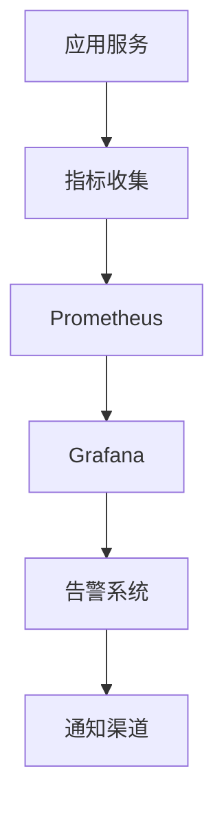

# 9. 监控与可观测

## 9.1 业务指标

### 核心业务指标

智能营销系统的核心业务指标用于评估营销效果和业务价值：

#### 内容指标

**1. 内容生成量（Content Generation Volume）**
- **定义**：单位时间内生成的内容数量
- **计算公式**：内容生成量 = 生成内容总数 / 时间周期
- **目标值**：≥1000篇/天
- **监控频率**：实时监控，每小时统计

**2. 内容质量评分（Content Quality Score）**
- **定义**：生成内容的平均质量评分
- **计算公式**：质量评分 = 总质量评分 / 内容数量
- **目标值**：≥4.5/5.0
- **监控频率**：实时监控，每天统计

**3. 内容使用率（Content Usage Rate）**
- **定义**：生成内容被使用的比例
- **计算公式**：使用率 = (使用内容数 / 生成内容数) × 100%
- **目标值**：≥80%
- **监控频率**：每天统计

#### 用户画像指标

**4. 用户画像完整度（User Profile Completeness）**
- **定义**：用户画像信息的完整程度
- **计算公式**：完整度 = (已填充字段数 / 总字段数) × 100%
- **目标值**：≥90%
- **监控频率**：每天统计

**5. 用户分群准确度（User Segmentation Accuracy）**
- **定义**：用户分群的准确程度
- **计算公式**：准确度 = (正确分群数 / 总用户数) × 100%
- **目标值**：≥85%
- **监控频率**：每周统计

#### 营销效果指标

**6. 营销转化率（Marketing Conversion Rate）**
- **定义**：营销活动带来的转化比例
- **计算公式**：转化率 = (转化数 / 触达数) × 100%
- **目标值**：≥5%
- **监控频率**：实时监控，每小时统计

**7. 营销ROI（Marketing ROI）**
- **定义**：营销投入产出比
- **计算公式**：ROI = (营销收入 - 营销成本) / 营销成本 × 100%
- **目标值**：≥300%
- **监控频率**：每天统计

**8. 获客成本（Customer Acquisition Cost, CAC）**
- **定义**：获得一个新客户的成本
- **计算公式**：CAC = 营销总成本 / 新客户数
- **目标值**：≤200元/人
- **监控频率**：每天统计

#### 广告效果指标

**9. 广告ROI（Ad ROI）**
- **定义**：广告投入产出比
- **计算公式**：ROI = (广告收入 - 广告成本) / 广告成本 × 100%
- **目标值**：≥400%
- **监控频率**：实时监控，每小时统计

**10. 广告点击率（Click-Through Rate, CTR）**
- **定义**：广告点击比例
- **计算公式**：CTR = (点击数 / 展示数) × 100%
- **目标值**：≥3%
- **监控频率**：实时监控，每小时统计

### 指标监控

#### 监控架构



#### 监控实现

**Prometheus配置**：
```yaml
global:
  scrape_interval: 15s
  evaluation_interval: 15s

scrape_configs:
  - job_name: 'marketing-service'
    static_configs:
      - targets: ['localhost:8000']
    metrics_path: '/metrics'
```

**指标收集示例**：
```python
from prometheus_client import Counter, Histogram, Gauge

# 定义指标
content_generation_counter = Counter(
    'marketing_content_generated_total',
    'Total number of content generated'
)

content_quality_gauge = Gauge(
    'marketing_content_quality_score',
    'Average content quality score'
)

conversion_rate_gauge = Gauge(
    'marketing_conversion_rate',
    'Marketing conversion rate'
)

# 记录指标
content_generation_counter.inc()
content_quality_gauge.set(4.5)
conversion_rate_gauge.set(0.05)
```

### 告警机制

**告警规则**：
- 内容质量评分&lt;4.0 → 告警
- 营销转化率&lt;3% → 告警
- 营销ROI&lt;200% → 告警
- 系统可用性&lt;99% → 告警

**告警实现**：
```yaml
# Prometheus告警规则
groups:
  - name: marketing_alerts
    rules:
      - alert: LowContentQuality
        expr: marketing_content_quality_score < 4.0
        for: 5m
        annotations:
          summary: "内容质量评分过低"
      
      - alert: LowConversionRate
        expr: marketing_conversion_rate < 0.03
        for: 10m
        annotations:
          summary: "营销转化率过低"
```

## 9.2 模型指标

### 模型性能指标

**1. 内容生成准确率（Content Generation Accuracy）**
- **定义**：生成内容符合要求的比例
- **计算公式**：准确率 = (符合要求内容数 / 总内容数) × 100%
- **目标值**：≥90%
- **监控频率**：每天统计

**2. 用户画像准确率（User Profile Accuracy）**
- **定义**：用户画像准确的 proportion
- **计算公式**：准确率 = (准确画像数 / 总画像数) × 100%
- **目标值**：≥85%
- **监控频率**：每周统计

**3. 推荐准确率（Recommendation Accuracy）**
- **定义**：推荐内容被用户接受的比例
- **计算公式**：准确率 = (接受推荐数 / 总推荐数) × 100%
- **目标值**：≥80%
- **监控频率**：每天统计

### 模型监控

**模型性能监控**：
- 监控模型响应时间
- 监控模型错误率
- 监控模型资源使用

**模型退化检测**：
- 检测模型性能下降
- 检测模型输出异常
- 自动触发模型重训练

**实现示例**：
```python
class ModelMonitor:
    def __init__(self):
        self.performance_history = []
        self.degradation_threshold = 0.1
    
    def record_performance(self, metric_name, value):
        """
        记录模型性能指标
        """
        self.performance_history.append({
            "metric": metric_name,
            "value": value,
            "timestamp": time.time()
        })
    
    def detect_degradation(self, metric_name):
        """
        检测模型退化
        """
        recent_values = [
            h["value"] for h in self.performance_history
            if h["metric"] == metric_name
            and h["timestamp"] > time.time() - 86400  # 最近24小时
        ]
        
        if len(recent_values) < 2:
            return False
        
        avg_recent = sum(recent_values) / len(recent_values)
        avg_historical = self.get_historical_average(metric_name)
        
        degradation = (avg_historical - avg_recent) / avg_historical
        
        return degradation > self.degradation_threshold
```

## 9.3 链路追踪

### 追踪系统

**分布式追踪**：
- 使用Jaeger或Zipkin进行分布式追踪
- 追踪请求在系统中的完整路径
- 识别性能瓶颈和异常

**实现示例**：
```python
from opentelemetry import trace
from opentelemetry.sdk.trace import TracerProvider
from opentelemetry.sdk.trace.export import ConsoleSpanExporter

# 初始化追踪
trace.set_tracer_provider(TracerProvider())
tracer = trace.get_tracer(__name__)

# 创建Span
with tracer.start_as_current_span("generate_content") as span:
    span.set_attribute("content_type", "marketing_copy")
    span.set_attribute("product_name", "护肤品")
    
    # 执行内容生成
    content = generate_content(...)
    
    span.set_attribute("content_length", len(content))
    span.set_status(trace.Status(trace.StatusCode.OK))
```

### 日志管理

**日志级别**：
- **DEBUG**：详细调试信息
- **INFO**：一般信息
- **WARNING**：警告信息
- **ERROR**：错误信息
- **CRITICAL**：严重错误

**日志格式**：
```python
import logging
import json

# 配置日志
logging.basicConfig(
    level=logging.INFO,
    format='%(asctime)s - %(name)s - %(levelname)s - %(message)s'
)

# 结构化日志
logger = logging.getLogger(__name__)

def log_content_generation(content_id, content_type, quality_score):
    logger.info(json.dumps({
        "event": "content_generated",
        "content_id": content_id,
        "content_type": content_type,
        "quality_score": quality_score,
        "timestamp": time.time()
    }))
```

### 问题定位

**问题定位流程**：
1. 查看告警信息，识别问题
2. 查看监控指标，定位异常
3. 查看日志信息，分析原因
4. 查看链路追踪，追踪请求路径
5. 定位问题根因，制定解决方案

**问题定位工具**：
- **日志聚合**：ELK Stack（Elasticsearch、Logstash、Kibana）
- **分布式追踪**：Jaeger、Zipkin
- **监控可视化**：Grafana
- **错误追踪**：Sentry
