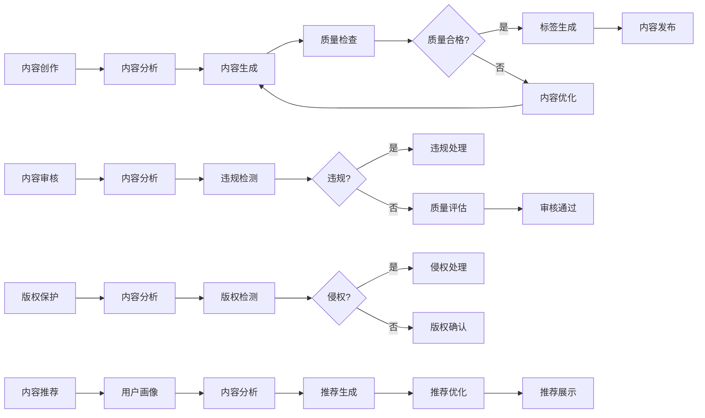
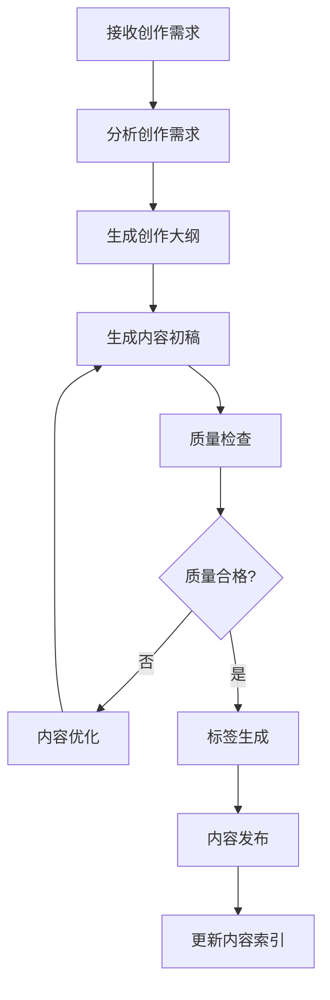
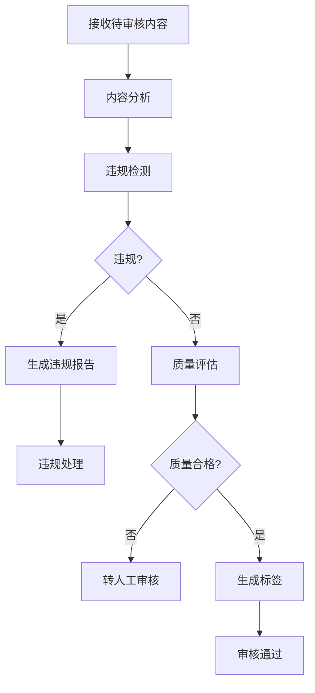
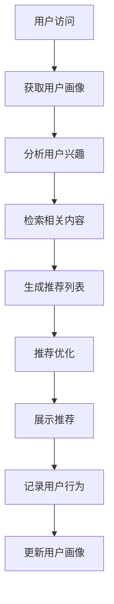

# 5. 智能体与业务编排

## 5.1 Agent技能链

### 技能定义

智能媒体/内容Agent需要具备多种技能，通过技能链组合完成复杂任务：

#### 核心技能

**1. 内容分析技能（Content Analysis）**
- **功能**：分析内容主题、风格、质量等
- **输入**：内容文本、图像、视频
- **输出**：内容分析结果（主题、风格、质量评分等）
- **实现**：基于NLP模型（BERT、GPT等）和计算机视觉模型
- **应用场景**：内容理解、内容分类、质量评估

**2. 内容生成技能（Content Generation）**
- **功能**：生成文章、视频脚本等内容
- **输入**：创作需求（主题、风格、长度等）
- **输出**：生成的内容
- **实现**：基于大语言模型（GPT-4、Claude等）
- **应用场景**：内容创作、内容辅助

**3. 内容审核技能（Content Moderation）**
- **功能**：检测违规内容、评估内容质量
- **输入**：待审核内容
- **输出**：审核结果（通过/不通过、违规类型、质量评分等）
- **实现**：基于分类模型（BERT、RoBERTa等）
- **应用场景**：内容审核、质量评估

**4. 标签生成技能（Tag Generation）**
- **功能**：生成内容标签和分类
- **输入**：内容文本、图像、视频
- **输出**：标签列表和分类
- **实现**：基于关键词提取模型（TextRank、BERT等）和分类模型
- **应用场景**：标签生成、内容分类

**5. 推荐生成技能（Recommendation Generation）**
- **功能**：生成个性化内容推荐
- **输入**：用户画像、历史行为、内容库
- **输出**：推荐内容列表
- **实现**：基于推荐模型（Wide&Deep、DeepFM等）
- **应用场景**：内容推荐、个性化推送

**6. 版权检测技能（Copyright Detection）**
- **功能**：检测内容侵权和相似度
- **输入**：待检测内容、版权库
- **输出**：检测结果（相似度、侵权概率、相似内容链接等）
- **实现**：基于相似度模型（BERT、SimCSE、CLIP等）
- **应用场景**：版权保护、侵权检测

**7. 用户画像技能（User Profiling）**
- **功能**：构建和更新用户画像
- **输入**：用户行为数据、用户信息
- **输出**：用户画像（兴趣、偏好、行为特征等）
- **实现**：基于用户行为分析和机器学习模型
- **应用场景**：用户画像构建、个性化推荐

**8. 内容检索技能（Content Retrieval）**
- **功能**：检索相关内容
- **输入**：查询文本、图像、视频
- **输出**：相关内容列表
- **实现**：基于向量检索（Milvus、Qdrant等）和语义检索
- **应用场景**：内容检索、相似内容查找

**9. 报告生成技能（Report Generation）**
- **功能**：生成分析报告和统计报表
- **输入**：分析结果、报告模板
- **输出**：格式化的报告文档
- **实现**：基于模板引擎和大语言模型
- **应用场景**：数据分析、报告生成

### 技能链设计

技能链按照业务流程组织，形成完整的处理流程：



## 5.2 业务流程编排

### 内容创作流程

#### 流程设计



#### n8n工作流配置

```yaml
workflow:
  name: 智能内容创作
  triggers:
    - type: webhook
      path: /api/content-creation
  nodes:
    - id: receive-request
      type: webhook
      parameters:
        path: /api/content-creation
        method: POST
    
    - id: analyze-requirement
      type: function
      parameters:
        function: |
          function analyzeRequirement(data) {
            return {
              topic: data.topic,
              style: data.style,
              length: data.length,
              audience: data.audience
            };
          }
    
    - id: generate-outline
      type: http-request
      parameters:
        method: POST
        url: ${AI_API}/generate-outline
        body: {
          requirement: "{{ $json.requirement }}"
        }
    
    - id: generate-content
      type: http-request
      parameters:
        method: POST
        url: ${AI_API}/generate-content
        body: {
          outline: "{{ $json.outline }}",
          requirement: "{{ $json.requirement }}"
        }
    
    - id: quality-check
      type: http-request
      parameters:
        method: POST
        url: ${AI_API}/quality-check
        body: {
          content: "{{ $json.content }}"
        }
    
    - id: check-quality-result
      type: if
      conditions:
        - value1: "{{ $json.quality_score }}"
          operation: gte
          value2: 4.0
    
    - id: generate-tags
      type: http-request
      parameters:
        method: POST
        url: ${AI_API}/generate-tags
        body: {
          content: "{{ $json.content }}"
        }
    
    - id: publish-content
      type: http-request
      parameters:
        method: POST
        url: ${CMS_API}/publish
        body: {
          content: "{{ $json.content }}",
          tags: "{{ $json.tags }}"
        }
    
    - id: update-index
      type: http-request
      parameters:
        method: POST
        url: ${SEARCH_API}/index
        body: {
          content_id: "{{ $json.content_id }}",
          content: "{{ $json.content }}",
          tags: "{{ $json.tags }}"
        }
```

### 内容审核流程

#### 流程设计



#### n8n工作流配置

```yaml
workflow:
  name: 智能内容审核
  triggers:
    - type: webhook
      path: /api/content-moderation
  nodes:
    - id: receive-content
      type: webhook
      parameters:
        path: /api/content-moderation
        method: POST
    
    - id: analyze-content
      type: http-request
      parameters:
        method: POST
        url: ${AI_API}/analyze-content
        body: {
          content: "{{ $json.content }}"
        }
    
    - id: check-violation
      type: http-request
      parameters:
        method: POST
        url: ${AI_API}/check-violation
        body: {
          content: "{{ $json.content }}"
        }
    
    - id: check-violation-result
      type: if
      conditions:
        - value1: "{{ $json.is_violation }}"
          operation: equals
          value2: true
    
    - id: generate-violation-report
      type: http-request
      parameters:
        method: POST
        url: ${AI_API}/generate-report
        body: {
          content: "{{ $json.content }}",
          violation_type: "{{ $json.violation_type }}"
        }
    
    - id: handle-violation
      type: http-request
      parameters:
        method: POST
        url: ${CMS_API}/handle-violation
        body: {
          content_id: "{{ $json.content_id }}",
          violation_report: "{{ $json.violation_report }}"
        }
    
    - id: quality-assessment
      type: http-request
      parameters:
        method: POST
        url: ${AI_API}/quality-assessment
        body: {
          content: "{{ $json.content }}"
        }
    
    - id: check-quality-result
      type: if
      conditions:
        - value1: "{{ $json.quality_score }}"
          operation: gte
          value2: 3.5
    
    - id: generate-tags
      type: http-request
      parameters:
        method: POST
        url: ${AI_API}/generate-tags
        body: {
          content: "{{ $json.content }}"
        }
    
    - id: approve-content
      type: http-request
      parameters:
        method: POST
        url: ${CMS_API}/approve
        body: {
          content_id: "{{ $json.content_id }}",
          tags: "{{ $json.tags }}"
        }
```

### 内容推荐流程

#### 流程设计



#### n8n工作流配置

```yaml
workflow:
  name: 智能内容推荐
  triggers:
    - type: webhook
      path: /api/content-recommendation
  nodes:
    - id: receive-request
      type: webhook
      parameters:
        path: /api/content-recommendation
        method: POST
    
    - id: get-user-profile
      type: http-request
      parameters:
        method: GET
        url: ${USER_API}/profile/{{ $json.user_id }}
    
    - id: analyze-user-interest
      type: http-request
      parameters:
        method: POST
        url: ${AI_API}/analyze-interest
        body: {
          user_profile: "{{ $json.user_profile }}",
          user_behavior: "{{ $json.user_behavior }}"
        }
    
    - id: retrieve-content
      type: http-request
      parameters:
        method: POST
        url: ${SEARCH_API}/retrieve
        body: {
          query: "{{ $json.user_interest }}",
          limit: 100
        }
    
    - id: generate-recommendations
      type: http-request
      parameters:
        method: POST
        url: ${AI_API}/generate-recommendations
        body: {
          user_profile: "{{ $json.user_profile }}",
          candidate_content: "{{ $json.candidate_content }}"
        }
    
    - id: optimize-recommendations
      type: http-request
      parameters:
        method: POST
        url: ${AI_API}/optimize-recommendations
        body: {
          recommendations: "{{ $json.recommendations }}",
          diversity_weight: 0.3,
          novelty_weight: 0.2
        }
    
    - id: return-recommendations
      type: respond-to-webhook
      parameters:
        responseBody: {
          recommendations: "{{ $json.recommendations }}"
        }
    
    - id: log-user-behavior
      type: http-request
      parameters:
        method: POST
        url: ${ANALYTICS_API}/log-behavior
        body: {
          user_id: "{{ $json.user_id }}",
          recommendations: "{{ $json.recommendations }}",
          timestamp: "{{ $now }}"
        }
    
    - id: update-user-profile
      type: http-request
      parameters:
        method: POST
        url: ${USER_API}/update-profile
        body: {
          user_id: "{{ $json.user_id }}",
          behavior: "{{ $json.user_behavior }}"
        }
```

## 5.3 智能体协作

### 多智能体架构

智能媒体/内容解决方案采用多智能体协作架构，不同智能体负责不同任务：

- **内容创作智能体**：负责内容创作相关任务
- **内容审核智能体**：负责内容审核相关任务
- **推荐智能体**：负责内容推荐相关任务
- **标签智能体**：负责标签生成相关任务
- **版权智能体**：负责版权保护相关任务

### 智能体通信

智能体之间通过消息队列和API进行通信：

- **消息队列**：使用Kafka、RabbitMQ进行异步通信
- **API调用**：使用RESTful API进行同步通信
- **事件驱动**：使用事件驱动架构进行解耦

### 智能体协调

使用Dify进行智能体协调：

- **任务分配**：根据任务类型分配给合适的智能体
- **结果聚合**：聚合多个智能体的结果
- **错误处理**：处理智能体执行错误
- **重试机制**：智能体执行失败时自动重试

