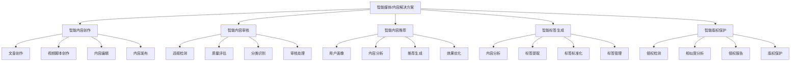

# 2. 总体架构

## 2.1 业务架构

### 角色定义

智能媒体/内容解决方案涉及多个角色，每个角色有不同的职责和权限：

- **内容创作者**：
  - 职责：使用智能内容创作工具进行内容创作，管理内容资产，优化内容质量
  - 权限：创建和编辑内容，使用AI辅助创作工具，查看内容数据
  - 使用场景：文章创作、视频脚本创作、内容编辑、内容发布

- **内容审核员**：
  - 职责：使用智能内容审核系统进行内容审核，处理违规内容，维护内容安全
  - 权限：审核内容，处理违规内容，配置审核规则，查看审核数据
  - 使用场景：内容审核、违规处理、审核规则配置

- **内容运营人员**：
  - 职责：使用智能推荐系统进行内容推荐，分析用户行为，优化推荐策略
  - 权限：配置推荐策略，查看推荐数据，分析用户行为，管理内容标签
  - 使用场景：推荐策略配置、用户行为分析、内容标签管理

- **内容管理员**：
  - 职责：管理内容资产，维护内容分类和标签，优化内容检索
  - 权限：管理内容分类，配置标签规则，查看内容统计，管理内容权限
  - 使用场景：内容分类管理、标签管理、内容检索优化

- **版权管理员**：
  - 职责：使用智能版权保护系统进行侵权检测，处理版权纠纷，保护内容版权
  - 权限：检测侵权内容，处理版权纠纷，配置版权保护规则，查看版权数据
  - 使用场景：侵权检测、版权纠纷处理、版权保护配置

- **系统管理员**：
  - 职责：管理系统配置，监控系统运行，处理系统故障
  - 权限：系统配置，用户管理，监控告警，数据管理
  - 使用场景：系统维护，用户管理，故障处理

### 用例分析

#### 用例1：智能内容创作

**参与者**：内容创作者、内容创作系统、AI模型服务

**前置条件**：
- 内容创作系统正常运行
- AI模型服务已部署
- 用户已登录并具有创作权限

**主流程**：
1. 内容创作者输入创作需求（主题、类型、风格等）
2. 系统分析创作需求，生成创作大纲
3. AI模型根据大纲生成内容初稿
4. 内容创作者审核和编辑内容，优化内容质量
5. 系统进行内容质量检测，提供优化建议
6. 内容创作者确认内容，发布内容
7. 系统自动生成内容标签和分类

**异常流程**：
- 如果AI生成内容质量不达标，系统提示并建议人工创作
- 如果内容涉及敏感话题，系统提示并建议修改
- 如果AI模型服务不可用，使用模板和规则引擎作为备用方案

**后置条件**：
- 内容已生成并发布
- 内容标签和分类已自动生成
- 内容数据已记录

#### 用例2：智能内容审核

**参与者**：内容审核员、内容审核系统、AI模型服务

**前置条件**：
- 内容审核系统正常运行
- AI审核模型已部署
- 待审核内容已提交

**主流程**：
1. 系统接收待审核内容（文本、图像、视频等）
2. AI模型进行多维度审核（违规检测、质量评估、分类识别等）
3. 系统生成审核结果（通过/不通过、违规类型、风险等级等）
4. 如果内容通过审核，自动发布
5. 如果内容未通过审核，转人工审核
6. 内容审核员审核不通过内容，确认或修正审核结果
7. 审核结果记录到审核数据库

**异常流程**：
- 如果AI模型置信度低，转人工审核
- 如果内容涉及紧急违规，立即告警并处理
- 如果审核结果异常，触发人工复核

**后置条件**：
- 审核完成
- 审核结果已记录
- 违规内容已处理

#### 用例3：智能内容推荐

**参与者**：用户、推荐系统、AI模型服务

**前置条件**：
- 推荐系统正常运行
- 推荐模型已部署
- 用户已登录

**主流程**：
1. 用户访问内容平台
2. 系统获取用户画像和历史行为数据
3. AI模型分析用户兴趣，生成个性化推荐列表
4. 系统根据推荐策略（多样性、新颖性等）优化推荐列表
5. 用户浏览推荐内容，产生交互行为（点击、点赞、评论等）
6. 系统记录用户行为，更新用户画像
7. 系统根据用户反馈优化推荐模型

**异常流程**：
- 如果用户为新用户，使用冷启动策略
- 如果推荐内容不足，使用热门内容补充
- 如果推荐模型不可用，使用规则引擎作为备用方案

**后置条件**：
- 推荐列表已生成
- 用户行为已记录
- 用户画像已更新

#### 用例4：智能标签生成

**参与者**：内容管理员、标签系统、AI模型服务

**前置条件**：
- 标签系统正常运行
- AI标签模型已部署
- 待处理内容已提交

**主流程**：
1. 内容管理员提交待处理内容
2. AI模型分析内容（文本、图像、视频等），提取关键信息
3. 系统生成内容标签（主题、类别、关键词等）
4. 系统进行标签标准化和去重
5. 内容管理员审核标签，确认或调整
6. 标签保存到标签数据库
7. 系统更新内容索引，支持标签检索

**异常流程**：
- 如果AI模型无法识别内容，使用规则引擎生成基础标签
- 如果标签冲突，系统提示并建议人工处理
- 如果标签系统不可用，使用人工标签

**后置条件**：
- 标签已生成并保存
- 内容索引已更新
- 标签检索功能可用

#### 用例5：智能版权保护

**参与者**：版权管理员、版权保护系统、AI模型服务

**前置条件**：
- 版权保护系统正常运行
- AI版权检测模型已部署
- 待检测内容已提交

**主流程**：
1. 版权管理员提交待检测内容
2. AI模型进行版权检测（文本相似度、图像相似度、视频相似度等）
3. 系统生成检测结果（相似度、侵权概率、相似内容链接等）
4. 如果检测到侵权，系统生成侵权报告
5. 版权管理员审核侵权报告，确认或处理
6. 系统自动发送侵权通知或采取保护措施
7. 检测结果记录到版权数据库

**异常流程**：
- 如果AI模型置信度低，转人工审核
- 如果检测到紧急侵权，立即告警并处理
- 如果版权系统不可用，使用人工检测

**后置条件**：
- 版权检测已完成
- 检测结果已记录
- 侵权内容已处理

### 故事地图

智能媒体/内容解决方案的用户故事地图如下：



## 2.2 技术架构

### AI-Native四层架构

智能媒体/内容解决方案采用AI-Native四层架构，从下到上包括基础设施层、模型层、编排层和应用层。

#### 应用层

应用层提供面向业务用户的应用界面和API接口：

**核心应用**：

- **内容创作平台**：
  - 文章创作界面
  - 视频脚本创作界面
  - 内容编辑工具
  - 内容预览和发布
  - 内容管理界面

- **内容审核平台**：
  - 实时审核界面
  - 审核结果展示
  - 违规内容处理
  - 审核数据统计报表
  - 审核规则配置

- **内容推荐平台**：
  - 推荐策略配置
  - 用户画像分析
  - 推荐效果分析
  - A/B测试管理
  - 推荐数据报表

- **内容管理平台**：
  - 内容分类管理
  - 标签管理界面
  - 内容检索界面
  - 内容统计分析
  - 内容权限管理

- **版权保护平台**：
  - 侵权检测界面
  - 侵权报告展示
  - 版权纠纷处理
  - 版权数据统计
  - 版权保护配置

**技术栈**：
- 前端：Vue 3 + TypeScript + Vite + TailwindCSS
- 后端API：FastAPI + Python 3.11
- 状态管理：Pinia
- UI组件库：Element Plus
- 数据可视化：ECharts、D3.js
- 富文本编辑器：Quill、TinyMCE
- 视频播放器：Video.js、DPlayer

#### 编排层

编排层负责业务流程编排和智能体协调：

**核心组件**：

- **工作流引擎（n8n）**：
  - 内容创作流程编排
  - 内容审核流程编排
  - 内容推荐流程编排
  - 标签生成流程编排
  - 版权保护流程编排
  - 任务调度和执行
  - 异常处理和重试
  - 工作流监控

- **智能体编排（Dify）**：
  - 多智能体协调
  - 工具调用管理
  - 上下文管理
  - 对话管理
  - 内容生成管理

- **MCP服务器**：
  - 工具注册中心
  - 工具调用接口
  - 数据源接入（内容数据库、用户数据库等）
  - 外部系统集成（CDN、存储、第三方API等）

**编排示例**：

```yaml
# 智能内容创作工作流
workflow:
  name: 智能内容创作
  triggers:
    - type: webhook
      path: /api/content-creation
  nodes:
    - id: receive-request
      type: webhook
    - id: analyze-requirement
      type: ai-agent
      agent: content-analysis-agent
      tools:
        - content-template-tool
        - style-analysis-tool
    - id: generate-outline
      type: ai-agent
      agent: outline-generation-agent
      model: gpt-4
      tools:
        - knowledge-base-tool
    - id: generate-content
      type: ai-agent
      agent: content-generation-agent
      model: gpt-4
      tools:
        - content-template-tool
        - style-guide-tool
    - id: quality-check
      type: ai-agent
      agent: quality-check-agent
      tools:
        - grammar-check-tool
        - plagiarism-check-tool
    - id: generate-tags
      type: ai-agent
      agent: tag-generation-agent
      tools:
        - tag-database-tool
    - id: save-content
      type: database
      operation: insert
      table: contents
    - id: notify-user
      type: notification
      channel: email
```

#### 模型层

模型层提供AI模型服务和推理能力：

**核心模型**：

- **内容生成模型**：
  - 文本生成模型（GPT-4、Claude、通义千问）
  - 图像生成模型（DALL-E、Midjourney、Stable Diffusion）
  - 视频生成模型（Runway、Pika）
  - 多模态生成模型（GPT-4V、Claude 3）

- **内容理解模型**：
  - 文本理解模型（BERT、RoBERTa、GPT）
  - 图像理解模型（ResNet、Vision Transformer）
  - 视频理解模型（3D CNN、Video Transformer）
  - 多模态理解模型（CLIP、ALIGN）

- **内容审核模型**：
  - 违规检测模型（文本分类、图像分类）
  - 质量评估模型（内容质量评分）
  - 情感分析模型（情感识别、情感分类）
  - 内容分类模型（主题分类、类别分类）

- **推荐模型**：
  - 协同过滤模型（用户协同、物品协同）
  - 深度学习推荐模型（Wide&Deep、DeepFM、DCN）
  - 序列推荐模型（GRU4Rec、SASRec）
  - 多模态推荐模型（多模态特征融合）

- **标签生成模型**：
  - 关键词提取模型（TextRank、TF-IDF、BERT）
  - 主题模型（LDA、BERTopic）
  - 分类模型（文本分类、图像分类）
  - 实体识别模型（NER、关系抽取）

- **版权保护模型**：
  - 文本相似度模型（BERT、SimCSE）
  - 图像相似度模型（ResNet、CLIP）
  - 视频相似度模型（3D CNN、Video Transformer）
  - 多模态相似度模型（多模态特征匹配）

**模型服务**：

- **模型推理服务**：
  - 实时推理API（内容生成、内容审核、推荐）
  - 批量推理服务（标签生成、版权检测）
  - 边缘推理服务（移动端、客户端）
  - 模型版本管理
  - A/B测试支持

- **模型训练服务**：
  - 数据预处理
  - 模型训练
  - 模型评估
  - 模型部署
  - 模型监控和优化

#### 基础设施层

基础设施层提供计算、存储、网络等基础能力：

**核心组件**：

- **计算资源**：
  - Kubernetes集群（容器编排）
  - GPU服务器（模型训练和推理）
  - CPU服务器（业务逻辑处理）
  - 边缘节点（CDN、边缘计算）

- **存储资源**：
  - 对象存储（OSS、S3，存储内容文件）
  - 关系数据库（MySQL、PostgreSQL，存储结构化数据）
  - 向量数据库（Milvus、Qdrant，存储内容向量）
  - 缓存（Redis、Memcached，缓存热点数据）
  - 消息队列（Kafka、RabbitMQ，异步任务处理）

- **网络资源**：
  - CDN（内容分发网络）
  - 负载均衡（Nginx、HAProxy）
  - API网关（Kong、Traefik）
  - 服务网格（Istio，服务间通信）

- **监控和日志**：
  - 监控系统（Prometheus、Grafana）
  - 日志系统（ELK Stack、Loki）
  - 链路追踪（Jaeger、Zipkin）
  - 告警系统（AlertManager）

## 2.3 部署架构

### 部署模式

智能媒体/内容解决方案支持多种部署模式：

- **公有云部署**：部署在公有云平台（阿里云、腾讯云、AWS等），适合中小型内容平台
- **私有云部署**：部署在企业私有云，适合大型媒体机构
- **混合云部署**：核心系统部署在私有云，CDN和存储使用公有云，适合对数据安全有要求的企业
- **边缘部署**：部分服务部署在边缘节点，降低延迟，提升用户体验

### 高可用设计

- **服务高可用**：关键服务采用多副本部署，支持自动故障转移
- **数据高可用**：数据库采用主从复制，支持自动切换
- **存储高可用**：对象存储采用多副本和纠删码，保证数据可靠性
- **网络高可用**：采用多线路和CDN，保证网络可用性

### 扩展性设计

- **水平扩展**：服务支持水平扩展，根据负载自动扩容
- **垂直扩展**：支持增加服务器配置，提升单机性能
- **存储扩展**：支持存储容量动态扩展
- **模型扩展**：支持模型版本管理和灰度发布

