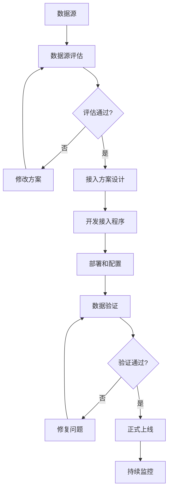
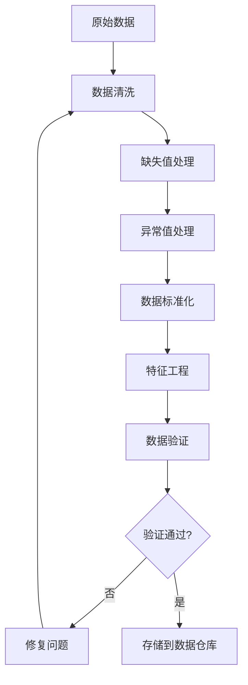
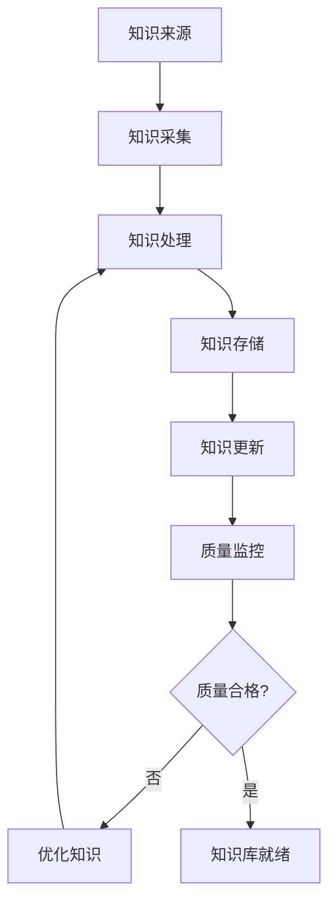

# 3. 数据与知识治理

## 3.1 私有数据接入

### 数据源类型

智能媒体/内容解决方案需要接入多种数据源，包括：

#### 内部数据源

- **内容数据**：
  - 数据描述：文章、视频、图片、音频等多媒体内容
  - 数据格式：文本、JSON、图像文件、视频文件、音频文件
  - 数据量：日均百万级内容记录
  - 更新频率：实时/准实时
  - 接入方式：内容管理系统API、文件上传、数据库直连

- **用户数据**：
  - 数据描述：用户信息、用户行为、用户画像、用户偏好等
  - 数据格式：JSON、数据库表、日志文件
  - 数据量：日均千万级用户行为记录
  - 更新频率：实时
  - 接入方式：用户系统API、数据库直连、消息队列

- **标签数据**：
  - 数据描述：内容标签、分类标签、关键词标签等
  - 数据格式：JSON、数据库表
  - 数据量：百万级标签记录
  - 更新频率：准实时
  - 接入方式：标签系统API、数据库直连

- **审核数据**：
  - 数据描述：审核记录、违规内容、审核规则等
  - 数据格式：JSON、数据库表、图像文件
  - 数据量：日均百万级审核记录
  - 更新频率：实时
  - 接入方式：审核系统API、数据库直连

- **版权数据**：
  - 数据描述：版权信息、侵权记录、版权保护规则等
  - 数据格式：JSON、数据库表
  - 数据量：百万级版权记录
  - 更新频率：准实时
  - 接入方式：版权系统API、数据库直连

#### 外部数据源

- **第三方内容数据**：
  - 数据描述：新闻、社交媒体、视频平台等第三方内容
  - 数据来源：新闻API、社交媒体API、视频平台API
  - 数据格式：API接口、JSON、RSS
  - 更新频率：实时/小时级
  - 接入方式：API接口、爬虫

- **市场数据**：
  - 数据描述：行业趋势、用户需求、竞品分析等
  - 数据来源：市场调研机构、行业报告、公开数据
  - 数据格式：API接口、CSV文件、PDF报告
  - 更新频率：每日/每周
  - 接入方式：API接口、文件下载

- **知识库数据**：
  - 数据描述：百科知识、专业知识、行业知识等
  - 数据来源：知识库API、知识图谱、文档库
  - 数据格式：API接口、JSON、RDF
  - 更新频率：定期更新
  - 接入方式：API接口、文件导入

### 数据接入流程

数据接入采用标准化的流程，确保数据质量和安全：

#### 1. 数据源评估

- **数据质量评估**：
  - 数据完整性：检查数据是否完整，缺失值比例
  - 数据准确性：抽样验证数据准确性
  - 数据一致性：检查数据格式和标准是否一致
  - 数据时效性：评估数据更新频率和延迟

- **数据安全评估**：
  - 数据敏感性：评估数据敏感级别（用户隐私、版权信息等）
  - 数据合规性：检查是否符合数据保护法规（《个人信息保护法》等）
  - 数据来源可靠性：评估数据来源的可信度

#### 2. 接入方案设计

- **技术方案**：
  - 选择接入方式（API、数据库、文件上传等）
  - 设计数据同步机制（实时、准实时、批量）
  - 设计数据转换和清洗规则
  - 设计错误处理和重试机制

- **安全方案**：
  - 数据传输加密（TLS 1.3）
  - 数据存储加密（AES-256）
  - 访问控制（RBAC、IP白名单）
  - 数据脱敏规则（用户隐私保护）

#### 3. 接入实施

- **开发接入程序**：
  - 编写数据接入脚本或服务
  - 实现数据转换和清洗逻辑
  - 实现错误处理和日志记录
  - 编写单元测试和集成测试

- **部署和配置**：
  - 部署接入服务到生产环境
  - 配置数据源连接信息
  - 配置数据同步规则
  - 配置监控和告警

#### 4. 验证和上线

- **数据验证**：
  - 验证数据完整性
  - 验证数据准确性
  - 验证数据时效性
  - 验证数据格式

- **性能测试**：
  - 测试数据接入性能
  - 测试系统负载能力
  - 测试错误处理能力

- **上线和监控**：
  - 正式上线数据接入
  - 持续监控数据质量
  - 持续监控系统性能

**数据接入流程图**：

## 3.2 数据清洗与预处理

### 数据清洗规则

#### 缺失值处理

- **内容数据缺失**：
  - 策略：删除记录、使用默认值、人工补录
  - 规则：关键字段缺失（标题、正文等），标记为异常
  - 实现：数据验证规则引擎

- **用户数据缺失**：
  - 策略：使用默认值、删除记录、从其他数据源补充
  - 规则：用户ID缺失，标记为异常
  - 实现：数据验证规则引擎

#### 异常值处理

- **内容数据异常**：
  - 检测方法：统计方法、规则引擎、异常检测模型
  - 处理策略：标记异常、删除异常、转人工审核
  - 规则：内容长度异常、格式异常，转人工审核

- **用户行为数据异常**：
  - 检测方法：统计方法、规则引擎
  - 处理策略：标记异常、删除异常
  - 规则：行为频率异常，标记为异常用户

#### 数据标准化

- **文本标准化**：
  - 编码格式：统一为UTF-8
  - 格式清理：去除HTML标签、特殊字符
  - 长度限制：文本长度限制和截断

- **时间标准化**：
  - 时间格式：统一为ISO 8601格式
  - 时区处理：统一为UTC时间
  - 时间精度：统一时间精度

- **标签标准化**：
  - 标签格式：统一标签命名规范
  - 标签去重：合并相似标签
  - 标签分类：统一标签分类体系

### 数据预处理流程

**预处理流程图**：

## 3.3 知识库构建

### 知识来源

#### 内部知识

- **内容知识**：
  - 内容模板库
  - 内容风格指南
  - 内容质量标准
  - 格式：PDF、Word、JSON、数据库

- **审核知识**：
  - 审核规则库
  - 违规案例库
  - 审核标准文档
  - 格式：PDF、Word、JSON、数据库

- **推荐知识**：
  - 推荐策略文档
  - 用户画像模板
  - 推荐效果案例
  - 格式：PDF、Word、JSON、数据库

- **标签知识**：
  - 标签体系文档
  - 标签规则库
  - 标签分类标准
  - 格式：PDF、Word、JSON、数据库

#### 外部知识

- **行业知识**：
  - 行业报告
  - 行业标准
  - 行业最佳实践
  - 格式：PDF、网站、API

- **通用知识**：
  - 百科知识库
  - 新闻知识库
  - 专业知识库
  - 格式：API、JSON、RDF

### 知识库构建流程

#### 1. 知识采集

- **文档采集**：
  - 从内部系统采集文档
  - 从外部来源采集文档
  - 文档格式转换和标准化

- **数据采集**：
  - 从数据库采集结构化数据
  - 从API采集数据
  - 数据清洗和预处理

#### 2. 知识处理

- **文本处理**：
  - 文本分词和词性标注
  - 实体识别和关系抽取
  - 文本向量化

- **图像处理**：
  - 图像特征提取
  - 图像分类和标注
  - 图像向量化

- **视频处理**：
  - 视频帧提取
  - 视频特征提取
  - 视频分类和标注

#### 3. 知识存储

- **向量存储**：
  - 使用向量数据库（Milvus、Qdrant）存储知识向量
  - 支持语义检索和相似度搜索
  - 支持多模态向量存储

- **结构化存储**：
  - 使用关系数据库存储结构化知识
  - 使用图数据库存储知识图谱
  - 使用文档数据库存储非结构化知识

#### 4. 知识更新

- **增量更新**：
  - 定期更新知识库
  - 增量添加新知识
  - 更新过期知识

- **质量监控**：
  - 监控知识质量
  - 检测知识冲突
  - 优化知识结构

**知识库构建流程图**：

## 3.4 数据安全与隐私保护

### 数据安全措施

- **数据加密**：
  - 传输加密：使用TLS 1.3加密数据传输
  - 存储加密：使用AES-256加密存储数据
  - 密钥管理：使用密钥管理系统（KMS）管理密钥

- **访问控制**：
  - 身份认证：多因素认证（MFA）
  - 权限控制：基于角色的访问控制（RBAC）
  - 审计日志：记录所有数据访问操作

- **数据脱敏**：
  - 用户隐私脱敏：脱敏用户敏感信息
  - 内容脱敏：脱敏敏感内容
  - 标签脱敏：脱敏敏感标签

### 隐私保护措施

- **用户隐私保护**：
  - 最小化原则：只收集必要的数据
  - 匿名化处理：对用户数据进行匿名化
  - 用户授权：获得用户明确授权

- **内容隐私保护**：
  - 内容加密：对敏感内容进行加密
  - 访问控制：限制内容访问权限
  - 水印保护：添加数字水印保护版权

### 合规要求

- **数据保护法规**：
  - 《个人信息保护法》：保护用户个人信息
  - 《数据安全法》：保护数据安全
  - 《网络安全法》：保护网络安全

- **内容合规**：
  - 内容审核：确保内容符合法律法规
  - 版权保护：保护内容版权
  - 内容标识：标识内容来源和版权信息

