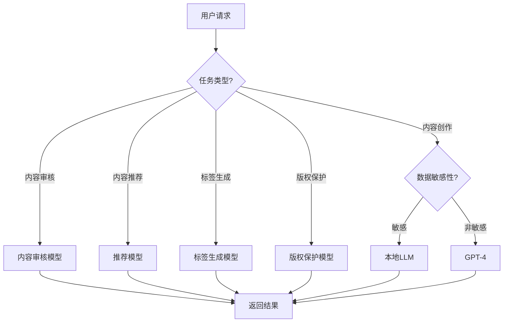
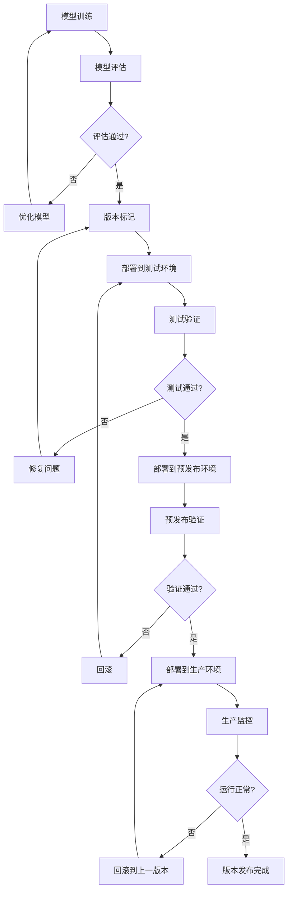

# 4. 模型与提示词管理

## 4.1 多模型路由

### 模型选择策略

智能媒体/内容解决方案使用多个AI模型，根据不同的业务场景和需求，智能选择最合适的模型：

#### 模型类型

- **大语言模型（LLM）**：
  - **GPT-4**：通用能力强，适合复杂内容生成任务
  - **Claude 3**：安全性高，适合内容审核和合规检查
  - **通义千问**：中文优化，适合中文内容生成
  - **本地部署模型**：数据不出域，适合敏感内容处理

- **专用模型**：
  - **内容生成模型**：GPT-4、Claude、通义千问，用于内容创作
  - **内容审核模型**：BERT、RoBERTa、GPT，用于违规检测和质量评估
  - **推荐模型**：Wide&Deep、DeepFM、SASRec，用于内容推荐
  - **标签生成模型**：BERT、TextRank、BERTopic，用于标签生成
  - **版权保护模型**：BERT、SimCSE、CLIP，用于侵权检测

#### 路由策略

- **基于任务类型路由**：
  - 内容创作任务 → 内容生成模型（GPT-4）
  - 内容审核任务 → 内容审核模型（BERT）
  - 内容推荐任务 → 推荐模型（Wide&Deep）
  - 标签生成任务 → 标签生成模型（BERT）
  - 版权保护任务 → 版权保护模型（SimCSE）

- **基于数据敏感性路由**：
  - 敏感数据 → 本地部署模型
  - 非敏感数据 → 云端大模型

- **基于性能要求路由**：
  - 实时任务 → 轻量级模型或边缘模型
  - 批量任务 → 高性能模型

- **基于成本考虑路由**：
  - 简单任务 → 低成本模型
  - 复杂任务 → 高性能模型

**路由决策流程图**：



## 4.2 模型版本管理

### 版本控制策略

#### 版本命名规则

- **语义化版本号**：
  - 格式：主版本号.次版本号.修订号（如v1.2.3）
  - 主版本号：重大架构变更
  - 次版本号：新功能添加
  - 修订号：Bug修复

- **版本标签**：
  - production：生产版本
  - staging：预发布版本
  - testing：测试版本
  - development：开发版本

#### 版本管理流程

**版本管理流程图**：



### 模型部署策略

#### 灰度发布

- **发布策略**：
  - 第一阶段：10%流量使用新模型
  - 第二阶段：50%流量使用新模型
  - 第三阶段：100%流量使用新模型

- **回滚机制**：
  - 监控关键指标（准确率、响应时间等）
  - 如果指标异常，自动回滚到上一版本
  - 支持手动回滚

#### A/B测试

- **测试设计**：
  - 对照组：使用旧模型
  - 实验组：使用新模型
  - 测试指标：准确率、响应时间、用户满意度等

- **测试分析**：
  - 统计显著性检验
  - 效果评估
  - 决策是否全量发布

## 4.3 提示词管理

### 提示词模板库

#### 内容创作提示词

- **文章创作提示词**：
  ```
  你是一位专业的内容创作者。请根据以下要求创作一篇文章：
  
  主题：{topic}
  风格：{style}
  长度：{length}
  目标受众：{audience}
  
  要求：
  1. 内容要有深度和见解
  2. 语言要流畅自然
  3. 结构要清晰合理
  4. 要有吸引人的标题和开头
  ```

- **视频脚本创作提示词**：
  ```
  你是一位专业的视频脚本创作者。请根据以下要求创作一个视频脚本：
  
  主题：{topic}
  时长：{duration}
  风格：{style}
  目标受众：{audience}
  
  要求：
  1. 脚本要有清晰的逻辑结构
  2. 语言要生动有趣
  3. 要有吸引人的开头和结尾
  4. 要包含视觉元素描述
  ```

#### 内容审核提示词

- **违规检测提示词**：
  ```
  请分析以下内容是否违规：
  
  内容：{content}
  
  请从以下维度进行分析：
  1. 是否包含违法违规内容
  2. 是否包含低俗、色情内容
  3. 是否包含暴力、恐怖内容
  4. 是否包含虚假信息
  5. 是否包含侵权内容
  
  请给出审核结果和理由。
  ```

- **质量评估提示词**：
  ```
  请评估以下内容的质量：
  
  内容：{content}
  
  请从以下维度进行评估：
  1. 内容深度和见解
  2. 语言流畅度
  3. 结构合理性
  4. 可读性
  5. 原创性
  
  请给出质量评分（1-5分）和评价。
  ```

#### 标签生成提示词

- **标签提取提示词**：
  ```
  请从以下内容中提取标签：
  
  内容：{content}
  
  要求：
  1. 提取5-10个关键词标签
  2. 标签要准确反映内容主题
  3. 标签要符合标签规范
  4. 标签要避免重复和冗余
  
  请以JSON格式返回标签列表。
  ```

### 提示词优化

#### 提示词工程

- **Few-shot学习**：
  - 提供示例，引导模型理解任务
  - 提高模型输出质量

- **Chain-of-Thought**：
  - 引导模型逐步思考
  - 提高推理能力

- **角色设定**：
  - 设定模型角色，提高专业性
  - 提高输出质量

#### 提示词版本管理

- **版本控制**：
  - 使用Git管理提示词版本
  - 记录提示词变更历史

- **效果评估**：
  - 定期评估提示词效果
  - 优化提示词内容

## 4.4 模型监控与优化

### 模型性能监控

#### 关键指标

- **准确率指标**：
  - 内容生成质量评分
  - 内容审核准确率
  - 推荐点击率
  - 标签准确率
  - 版权检测准确率

- **性能指标**：
  - 响应时间（P50、P95、P99）
  - 吞吐量（QPS）
  - 错误率
  - 资源使用率

#### 监控告警

- **告警规则**：
  - 准确率下降超过5%
  - 响应时间超过阈值
  - 错误率超过阈值
  - 资源使用率超过阈值

- **告警通知**：
  - 邮件通知
  - 短信通知
  - 钉钉/企业微信通知

### 模型优化策略

#### 数据优化

- **数据增强**：
  - 数据扩充
  - 数据平衡
  - 数据清洗

- **特征工程**：
  - 特征选择
  - 特征变换
  - 特征组合

#### 模型优化

- **超参数调优**：
  - 网格搜索
  - 随机搜索
  - 贝叶斯优化

- **模型结构优化**：
  - 模型压缩
  - 模型蒸馏
  - 模型剪枝

#### 持续学习

- **在线学习**：
  - 增量学习
  - 持续优化
  - 模型更新

- **反馈循环**：
  - 收集用户反馈
  - 分析模型表现
  - 优化模型参数

