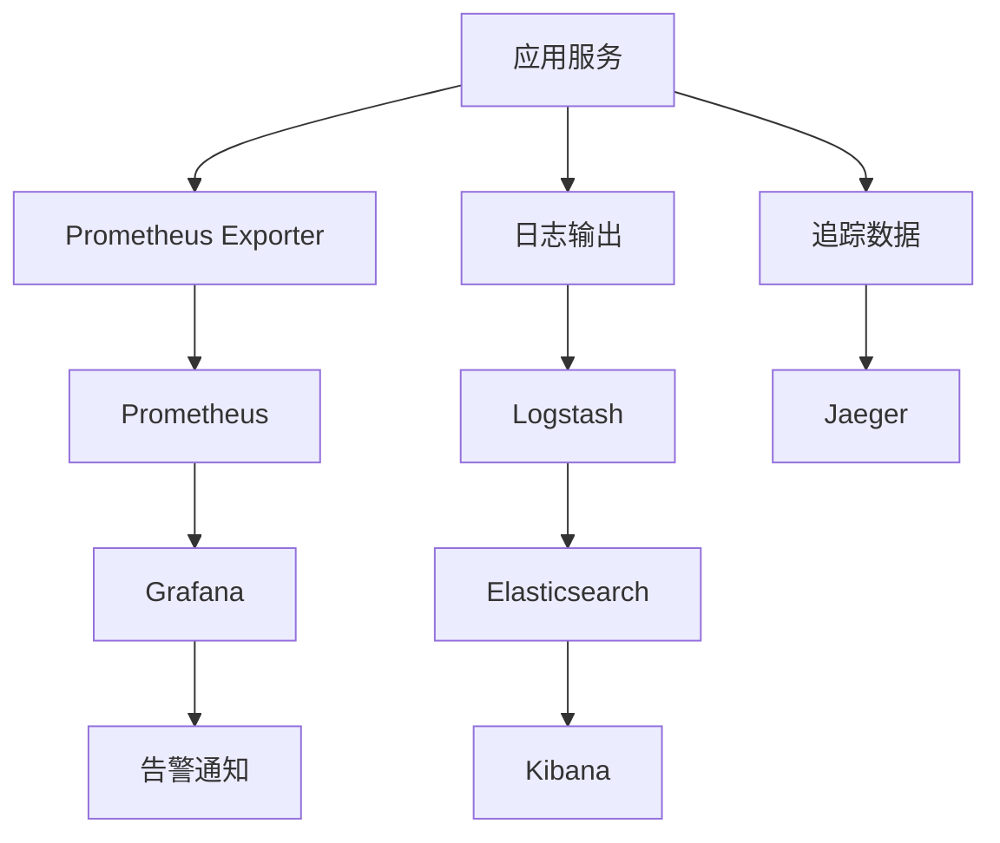

# 9. 监控与可观测

## 9.1 业务指标

### 核心业务指标

智能媒体/内容解决方案的核心业务指标包括：

#### 内容创作业务指标

- **内容创作任务数**：
  - 定义：每日/每小时创建的内容创作任务数量
  - 计算方法：统计内容创作API调用次数
  - 目标值：日均5000+个任务
  - 监控频率：实时

- **内容创作成功率**：
  - 定义：成功生成内容的比率
  - 计算方法：成功创作数 / 总创作数
  - 目标值：≥ 95%
  - 监控频率：实时

- **内容质量评分**：
  - 定义：AI生成内容的质量评分
  - 计算方法：平均质量评分
  - 目标值：≥ 4.0/5.0
  - 监控频率：实时

- **内容创作时间**：
  - 定义：内容创作的平均时间
  - 计算方法：平均创作时间
  - 目标值：≤ 60秒
  - 监控频率：实时

#### 内容审核业务指标

- **审核任务数**：
  - 定义：每日/每小时执行的审核任务数量
  - 计算方法：统计审核API调用次数
  - 目标值：日均50000+个任务
  - 监控频率：实时

- **审核准确率**：
  - 定义：审核结果正确的比率
  - 计算方法：正确审核数 / 总审核数
  - 目标值：≥ 99.5%
  - 监控频率：每日

- **审核漏检率**：
  - 定义：漏检的违规内容占所有违规内容的比率
  - 计算方法：漏检违规数 / 总违规数
  - 目标值：≤ 0.5%
  - 监控频率：每日

- **审核效率**：
  - 定义：审核任务的处理速度
  - 计算方法：审核任务数 / 时间
  - 目标值：≥ 1000篇/小时
  - 监控频率：实时

#### 内容推荐业务指标

- **推荐任务数**：
  - 定义：每日/每小时生成的推荐任务数量
  - 计算方法：统计推荐API调用次数
  - 目标值：日均100000+个任务
  - 监控频率：实时

- **推荐点击率**：
  - 定义：用户点击推荐内容的比率
  - 计算方法：点击数 / 推荐数
  - 目标值：≥ 10%
  - 监控频率：实时

- **用户停留时间**：
  - 定义：用户浏览推荐内容的平均停留时间
  - 计算方法：平均停留时间
  - 目标值：≥ 5分钟
  - 监控频率：实时

- **用户留存率**：
  - 定义：用户回访的比率
  - 计算方法：回访用户数 / 总用户数
  - 目标值：≥ 70%
  - 监控频率：每日

#### 标签生成业务指标

- **标签生成任务数**：
  - 定义：每日/每小时生成的标签任务数量
  - 计算方法：统计标签生成API调用次数
  - 目标值：日均10000+个任务
  - 监控频率：实时

- **标签准确率**：
  - 定义：标签生成准确的比率
  - 计算方法：准确标签数 / 总标签数
  - 目标值：≥ 95%
  - 监控频率：每日

- **标签覆盖率**：
  - 定义：有标签的内容占所有内容的比率
  - 计算方法：有标签内容数 / 总内容数
  - 目标值：≥ 95%
  - 监控频率：每日

#### 版权保护业务指标

- **版权检测任务数**：
  - 定义：每日/每小时执行的版权检测任务数量
  - 计算方法：统计版权检测API调用次数
  - 目标值：日均5000+个任务
  - 监控频率：实时

- **侵权检测准确率**：
  - 定义：侵权检测准确的比率
  - 计算方法：准确检测数 / 总检测数
  - 目标值：≥ 95%
  - 监控频率：每日

- **侵权检测效率**：
  - 定义：版权检测任务的处理速度
  - 计算方法：检测任务数 / 时间
  - 目标值：≥ 10000篇/小时
  - 监控频率：实时

## 9.2 技术指标

### 系统性能指标

#### API性能指标

- **响应时间**：
  - P50响应时间：< 200ms
  - P95响应时间：< 1s
  - P99响应时间：< 3s

- **吞吐量**：
  - 内容创作API：≥ 100 QPS
  - 内容审核API：≥ 500 QPS
  - 内容推荐API：≥ 1000 QPS
  - 标签生成API：≥ 200 QPS
  - 版权检测API：≥ 100 QPS

- **错误率**：
  - API错误率：< 0.1%
  - 5xx错误率：< 0.01%

#### 模型性能指标

- **模型推理时间**：
  - 内容生成模型：< 10s
  - 内容审核模型：< 100ms
  - 推荐模型：< 50ms
  - 标签生成模型：< 200ms
  - 版权检测模型：< 500ms

- **模型准确率**：
  - 内容生成质量评分：≥ 4.0/5.0
  - 内容审核准确率：≥ 99.5%
  - 推荐点击率：≥ 10%
  - 标签准确率：≥ 95%
  - 版权检测准确率：≥ 95%

#### 资源使用指标

- **CPU使用率**：
  - 平均CPU使用率：< 70%
  - 峰值CPU使用率：< 90%

- **内存使用率**：
  - 平均内存使用率：< 80%
  - 峰值内存使用率：< 95%

- **GPU使用率**：
  - 平均GPU使用率：> 50%
  - 峰值GPU使用率：> 80%

- **存储使用率**：
  - 数据库存储使用率：< 80%
  - 对象存储使用率：< 90%

## 9.3 监控系统

### 监控架构

#### 监控组件

- **Prometheus**：指标收集和存储
- **Grafana**：指标可视化和告警
- **ELK Stack**：日志收集和分析
- **Jaeger**：分布式追踪

#### 监控数据流



### 监控指标采集

#### 业务指标采集

```python
from prometheus_client import Counter, Histogram, Gauge

# 内容创作指标
content_creation_total = Counter(
    'content_creation_total',
    'Total number of content creation requests',
    ['status']
)

content_creation_duration = Histogram(
    'content_creation_duration_seconds',
    'Content creation duration in seconds'
)

content_quality_score = Gauge(
    'content_quality_score',
    'Average content quality score'
)

# 内容审核指标
content_moderation_total = Counter(
    'content_moderation_total',
    'Total number of content moderation requests',
    ['result']
)

content_moderation_accuracy = Gauge(
    'content_moderation_accuracy',
    'Content moderation accuracy'
)

# 内容推荐指标
recommendation_click_rate = Gauge(
    'recommendation_click_rate',
    'Recommendation click rate'
)

user_retention_rate = Gauge(
    'user_retention_rate',
    'User retention rate'
)
```

#### 技术指标采集

```python
# API性能指标
api_request_duration = Histogram(
    'api_request_duration_seconds',
    'API request duration in seconds',
    ['endpoint', 'method']
)

api_request_total = Counter(
    'api_request_total',
    'Total number of API requests',
    ['endpoint', 'method', 'status']
)

# 模型性能指标
model_inference_duration = Histogram(
    'model_inference_duration_seconds',
    'Model inference duration in seconds',
    ['model_name']
)

model_accuracy = Gauge(
    'model_accuracy',
    'Model accuracy',
    ['model_name']
)

# 资源使用指标
cpu_usage = Gauge(
    'cpu_usage_percent',
    'CPU usage percentage'
)

memory_usage = Gauge(
    'memory_usage_bytes',
    'Memory usage in bytes'
)

gpu_usage = Gauge(
    'gpu_usage_percent',
    'GPU usage percentage',
    ['gpu_id']
)
```

## 9.4 告警规则

### 业务告警

#### 内容创作告警

- **创作成功率下降**：
  - 条件：创作成功率 < 90% 持续5分钟
  - 级别：警告
  - 通知：邮件、短信

- **内容质量下降**：
  - 条件：平均质量评分 < 3.5 持续10分钟
  - 级别：警告
  - 通知：邮件

#### 内容审核告警

- **审核准确率下降**：
  - 条件：审核准确率 < 99% 持续10分钟
  - 级别：严重
  - 通知：邮件、短信、电话

- **审核漏检率上升**：
  - 条件：审核漏检率 > 1% 持续10分钟
  - 级别：严重
  - 通知：邮件、短信、电话

#### 内容推荐告警

- **推荐点击率下降**：
  - 条件：推荐点击率 < 8% 持续30分钟
  - 级别：警告
  - 通知：邮件

- **用户留存率下降**：
  - 条件：用户留存率 < 60% 持续1小时
  - 级别：警告
  - 通知：邮件

### 技术告警

#### API性能告警

- **响应时间过长**：
  - 条件：P95响应时间 > 2s 持续5分钟
  - 级别：警告
  - 通知：邮件

- **错误率过高**：
  - 条件：错误率 > 1% 持续5分钟
  - 级别：严重
  - 通知：邮件、短信

#### 资源使用告警

- **CPU使用率过高**：
  - 条件：CPU使用率 > 90% 持续10分钟
  - 级别：警告
  - 通知：邮件

- **内存使用率过高**：
  - 条件：内存使用率 > 95% 持续5分钟
  - 级别：严重
  - 通知：邮件、短信

- **存储使用率过高**：
  - 条件：存储使用率 > 90% 持续1小时
  - 级别：警告
  - 通知：邮件

## 9.5 日志管理

### 日志级别

- **DEBUG**：调试信息
- **INFO**：一般信息
- **WARNING**：警告信息
- **ERROR**：错误信息
- **CRITICAL**：严重错误

### 日志格式

```json
{
  "timestamp": "2024-01-15T10:00:00Z",
  "level": "INFO",
  "service": "content-creation-api",
  "request_id": "req-123456",
  "user_id": "user-789",
  "message": "Content created successfully",
  "content_id": "CONT123456",
  "duration_ms": 5000,
  "status_code": 200
}
```

### 日志分析

#### 错误日志分析

- **错误类型统计**：统计各类错误的数量
- **错误趋势分析**：分析错误趋势
- **错误根因分析**：分析错误根本原因

#### 性能日志分析

- **慢查询分析**：分析慢查询日志
- **API性能分析**：分析API性能日志
- **资源使用分析**：分析资源使用日志

