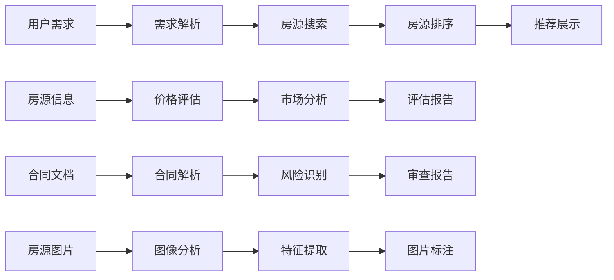
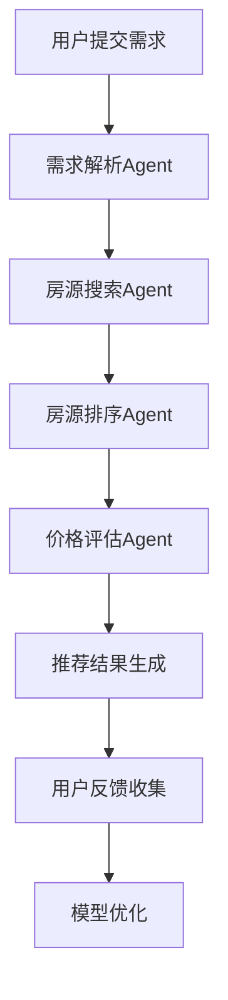
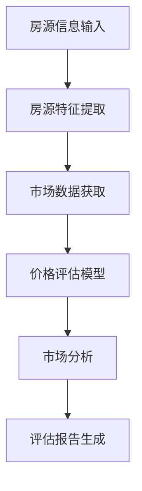
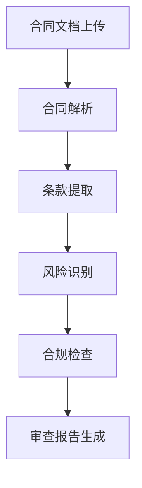
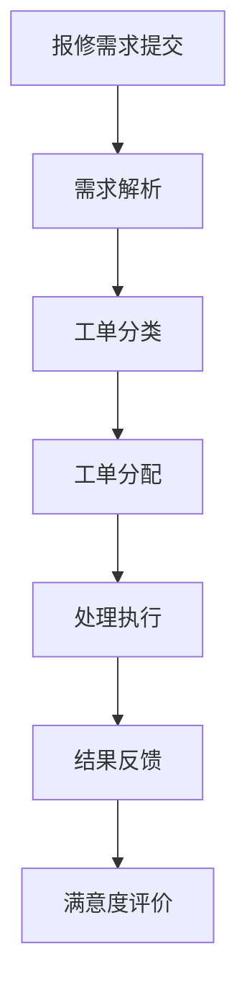

# 5. 智能体与业务编排

## 5.1 Agent技能链

### 技能定义

智能房地产Agent需要具备多种技能，通过技能链组合完成复杂任务：

#### 核心技能

**1. 需求解析技能（Requirement Parsing）**
- **功能**：解析用户需求，提取关键字段
- **输入**：用户需求文本（位置、价格、面积、户型等）
- **输出**：结构化的需求信息
- **实现**：基于NLP模型（BERT）进行意图识别和实体抽取
- **应用场景**：房源搜索、需求收集

**2. 房源搜索技能（Property Search）**
- **功能**：根据需求搜索匹配的房源
- **输入**：需求信息（位置、价格、面积等）
- **输出**：匹配的房源列表
- **实现**：基于向量检索（Milvus）和规则过滤
- **应用场景**：房源推荐、房源搜索

**3. 房源排序技能（Property Ranking）**
- **功能**：对房源进行排序和评分
- **输入**：房源列表、用户画像
- **输出**：排序后的房源列表和评分
- **实现**：基于推荐模型（协同过滤、深度学习）
- **应用场景**：房源推荐、个性化排序

**4. 价格评估技能（Price Evaluation）**
- **功能**：评估房源价格
- **输入**：房源信息、市场数据
- **输出**：评估价格和价格区间
- **实现**：基于价格评估模型（XGBoost、LSTM）
- **应用场景**：价格评估、市场分析

**5. 市场分析技能（Market Analysis）**
- **功能**：分析市场趋势和价格走势
- **输入**：市场数据、历史数据
- **输出**：市场分析报告
- **实现**：基于时序分析模型和统计分析
- **应用场景**：市场分析、价格预测

**6. 合同解析技能（Contract Parsing）**
- **功能**：解析合同内容，提取关键条款
- **输入**：合同文档（PDF、Word）
- **输出**：结构化的合同信息
- **实现**：基于OCR和NLP模型（BERT）
- **应用场景**：合同审查、合同分析

**7. 风险识别技能（Risk Identification）**
- **功能**：识别合同中的风险点
- **输入**：合同内容、法律知识库
- **输出**：风险识别结果（风险点、风险等级、建议）
- **实现**：基于法律知识图谱和LLM模型
- **应用场景**：合同审查、风险评估

**8. 图像分析技能（Image Analysis）**
- **功能**：分析房源图片，提取特征
- **输入**：房源图片
- **输出**：图片特征（户型、装修、缺陷等）
- **实现**：基于图像识别模型（ResNet、EfficientNet）
- **应用场景**：房源图片分析、缺陷检测

**9. 智能问答技能（Intelligent Q&A）**
- **功能**：回答用户关于房源的问题
- **输入**：用户问题、房源信息、知识库
- **输出**：回答内容
- **实现**：基于RAG技术和LLM模型
- **应用场景**：智能客服、智能问答

**10. 报告生成技能（Report Generation）**
- **功能**：生成分析报告
- **输入**：分析结果、报告模板
- **输出**：格式化的报告文档
- **实现**：基于模板引擎和LLM模型
- **应用场景**：评估报告、分析报告

### 技能链设计

技能链按照业务流程组织，形成完整的处理流程：



## 5.2 业务流程编排

### 房源推荐流程

#### 流程设计



#### 流程步骤

1. **需求解析**：
   - 解析用户需求文本
   - 提取关键字段（位置、价格、面积、户型等）
   - 识别用户意图

2. **房源搜索**：
   - 根据需求搜索匹配的房源
   - 使用向量检索和规则过滤
   - 返回候选房源列表

3. **房源排序**：
   - 基于用户画像和房源特征
   - 使用推荐模型进行排序
   - 计算推荐分数

4. **价格评估**：
   - 评估推荐房源的价格
   - 对比市场价格
   - 提供价格建议

5. **推荐结果生成**：
   - 生成推荐列表
   - 生成推荐理由
   - 展示推荐结果

6. **用户反馈收集**：
   - 收集用户浏览、收藏、咨询等行为
   - 收集用户满意度反馈
   - 更新用户画像

7. **模型优化**：
   - 使用用户反馈优化推荐模型
   - 更新用户画像
   - 提升推荐准确率

### 价格评估流程

#### 流程设计



#### 流程步骤

1. **房源特征提取**：
   - 提取房源基本信息（位置、面积、户型等）
   - 提取房源图片特征
   - 提取周边环境特征

2. **市场数据获取**：
   - 获取同区域成交价数据
   - 获取同区域挂牌价数据
   - 获取市场趋势数据

3. **价格评估**：
   - 使用价格评估模型评估价格
   - 考虑市场因素和房源特征
   - 生成评估价格和价格区间

4. **市场分析**：
   - 分析市场趋势
   - 分析价格走势
   - 分析影响因素

5. **评估报告生成**：
   - 生成评估报告
   - 包含价格、依据、风险等
   - 提供决策建议

### 合同审查流程

#### 流程设计



#### 流程步骤

1. **合同解析**：
   - 使用OCR识别合同文本
   - 解析合同结构
   - 提取关键条款

2. **条款提取**：
   - 识别合同条款类型
   - 提取条款内容
   - 建立条款关联关系

3. **风险识别**：
   - 使用法律知识图谱识别风险
   - 使用LLM模型分析风险
   - 评估风险等级

4. **合规检查**：
   - 检查合同合规性
   - 对照法律法规
   - 识别不合规条款

5. **审查报告生成**：
   - 生成审查报告
   - 包含风险点、问题、建议等
   - 提供修改建议

### 物业管理流程

#### 流程设计



#### 流程步骤

1. **需求解析**：
   - 解析报修需求文本
   - 提取关键信息（问题类型、位置、紧急程度等）
   - 识别报修类型

2. **工单分类**：
   - 根据报修类型分类
   - 设置优先级
   - 分配处理人员

3. **工单分配**：
   - 根据工单类型和优先级
   - 分配给合适的处理人员
   - 通知处理人员

4. **处理执行**：
   - 处理人员处理报修
   - 更新工单状态
   - 记录处理过程

5. **结果反馈**：
   - 通知业主处理结果
   - 收集业主反馈
   - 更新工单状态

6. **满意度评价**：
   - 收集业主满意度评价
   - 分析评价结果
   - 优化处理流程

## 5.3 工作流配置

### n8n工作流配置

#### 房源推荐工作流

```json
{
  "name": "房源推荐工作流",
  "nodes": [
    {
      "id": "webhook",
      "type": "n8n-nodes-base.webhook",
      "parameters": {
        "path": "property-recommend",
        "httpMethod": "POST"
      }
    },
    {
      "id": "parse-requirement",
      "type": "n8n-nodes-base.httpRequest",
      "parameters": {
        "url": "http://ai-service/api/parse-requirement",
        "method": "POST"
      }
    },
    {
      "id": "search-properties",
      "type": "n8n-nodes-base.httpRequest",
      "parameters": {
        "url": "http://property-service/api/search",
        "method": "POST"
      }
    },
    {
      "id": "rank-properties",
      "type": "n8n-nodes-base.httpRequest",
      "parameters": {
        "url": "http://ai-service/api/rank-properties",
        "method": "POST"
      }
    },
    {
      "id": "evaluate-price",
      "type": "n8n-nodes-base.httpRequest",
      "parameters": {
        "url": "http://ai-service/api/evaluate-price",
        "method": "POST"
      }
    },
    {
      "id": "respond",
      "type": "n8n-nodes-base.respondToWebhook",
      "parameters": {
        "responseBody": "={{ $json }}"
      }
    }
  ],
  "connections": {
    "webhook": {
      "main": [[{"node": "parse-requirement"}]]
    },
    "parse-requirement": {
      "main": [[{"node": "search-properties"}]]
    },
    "search-properties": {
      "main": [[{"node": "rank-properties"}]]
    },
    "rank-properties": {
      "main": [[{"node": "evaluate-price"}]]
    },
    "evaluate-price": {
      "main": [[{"node": "respond"}]]
    }
  }
}
```

#### 合同审查工作流

```json
{
  "name": "合同审查工作流",
  "nodes": [
    {
      "id": "webhook",
      "type": "n8n-nodes-base.webhook",
      "parameters": {
        "path": "contract-review",
        "httpMethod": "POST"
      }
    },
    {
      "id": "parse-contract",
      "type": "n8n-nodes-base.httpRequest",
      "parameters": {
        "url": "http://ai-service/api/parse-contract",
        "method": "POST"
      }
    },
    {
      "id": "identify-risks",
      "type": "n8n-nodes-base.httpRequest",
      "parameters": {
        "url": "http://ai-service/api/identify-risks",
        "method": "POST"
      }
    },
    {
      "id": "compliance-check",
      "type": "n8n-nodes-base.httpRequest",
      "parameters": {
        "url": "http://ai-service/api/compliance-check",
        "method": "POST"
      }
    },
    {
      "id": "generate-report",
      "type": "n8n-nodes-base.httpRequest",
      "parameters": {
        "url": "http://ai-service/api/generate-report",
        "method": "POST"
      }
    },
    {
      "id": "respond",
      "type": "n8n-nodes-base.respondToWebhook",
      "parameters": {
        "responseBody": "={{ $json }}"
      }
    }
  ],
  "connections": {
    "webhook": {
      "main": [[{"node": "parse-contract"}]]
    },
    "parse-contract": {
      "main": [[{"node": "identify-risks"}]]
    },
    "identify-risks": {
      "main": [[{"node": "compliance-check"}]]
    },
    "compliance-check": {
      "main": [[{"node": "generate-report"}]]
    },
    "generate-report": {
      "main": [[{"node": "respond"}]]
    }
  }
}
```

## 5.4 异常处理与重试

### 异常处理策略

#### 异常类型

- **网络异常**：API调用失败、超时等
- **数据异常**：数据格式错误、数据缺失等
- **模型异常**：模型推理失败、模型超时等
- **业务异常**：业务规则不满足、权限不足等

#### 异常处理机制

- **重试机制**：
  - 网络异常：自动重试3次，指数退避
  - 模型异常：自动重试2次，降级到备用模型
  - 业务异常：不重试，返回错误信息

- **降级策略**：
  - 模型服务不可用时，降级到规则引擎
  - 实时服务不可用时，降级到批量处理
  - 高级功能不可用时，降级到基础功能

- **告警机制**：
  - 异常率超过阈值时告警
  - 关键服务异常时立即告警
  - 通知相关人员处理

### 重试配置

#### n8n重试配置

```json
{
  "retry": {
    "maxRetries": 3,
    "retryDelay": 1000,
    "retryStrategy": "exponential",
    "retryOn": ["network", "timeout", "5xx"]
  }
}
```

#### 工作流重试配置

- **重试次数**：3次
- **重试延迟**：1秒、2秒、4秒（指数退避）
- **重试条件**：网络错误、超时、5xx错误
- **重试后处理**：记录重试日志，通知相关人员

