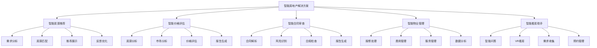
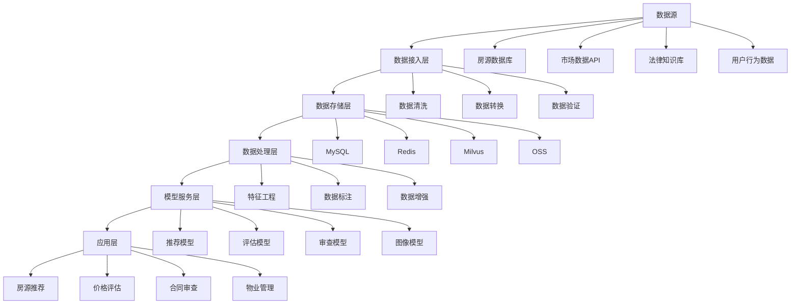

# 2. 总体架构

## 2.1 业务架构

### 角色定义

智能房地产解决方案涉及多个角色，每个角色有不同的职责和权限：

- **房产经纪人**：
  - 职责：使用智能房源推荐系统进行房源推荐，管理客户关系，促成交易
  - 权限：查看房源数据，配置推荐规则，管理客户信息
  - 使用场景：房源推荐，客户管理，交易促成

- **价格评估师**：
  - 职责：使用智能价格评估系统进行房价评估，审核评估结果，生成评估报告
  - 权限：查看市场数据，配置评估模型，审核评估结果
  - 使用场景：房价评估，市场分析，评估报告生成

- **法务人员**：
  - 职责：使用智能合同审查系统进行合同审查，审核审查结果，处理法律问题
  - 权限：查看合同数据，配置审查规则，审核审查结果
  - 使用场景：合同审查，法律风险评估，合规审查

- **物业管理员**：
  - 职责：使用智能物业管理系统处理报修，管理费用，提供物业服务
  - 权限：查看物业数据，处理报修，管理费用
  - 使用场景：报修处理，费用管理，物业服务

- **购房者/租户**：
  - 职责：使用智能看房助手查看房源，咨询问题，提交需求
  - 权限：查看房源信息，提交需求，评价服务
  - 使用场景：房源搜索，看房预约，需求提交

- **系统管理员**：
  - 职责：管理系统配置，监控系统运行，处理系统故障
  - 权限：系统配置，用户管理，监控告警
  - 使用场景：系统维护，用户管理，故障处理

### 用例分析

#### 用例1：智能房源推荐

**参与者**：房产经纪人、购房者、房源推荐系统、房源数据库

**前置条件**：
- 房源推荐系统正常运行
- 推荐模型已部署
- 房源数据已同步
- 用户画像数据已获取

**主流程**：
1. 购房者输入需求（位置、价格、面积、户型等）
2. 系统获取用户画像数据（历史浏览、偏好、预算等）
3. AI模型分析用户需求和房源特征，生成推荐列表
4. 房产经纪人审核推荐结果，确认或调整
5. 系统向购房者展示推荐房源
6. 购房者查看房源详情，预约看房
7. 系统记录用户反馈，优化推荐模型

**异常流程**：
- 如果房源数据不完整，系统提示并建议补充
- 如果推荐结果不满意，人工调整并反馈优化模型
- 如果用户需求变化，系统重新推荐

**后置条件**：
- 推荐列表已生成
- 用户已查看推荐房源
- 推荐效果已记录

#### 用例2：智能价格评估

**参与者**：价格评估师、价格评估系统、市场数据库

**前置条件**：
- 价格评估系统正常运行
- 评估模型已部署
- 市场数据已同步

**主流程**：
1. 价格评估师输入房源信息（位置、面积、户型、楼层等）
2. 系统获取市场数据（成交价、挂牌价、市场趋势等）
3. AI模型分析房源特征和市场数据，生成评估价格
4. 价格评估师审核评估结果，确认或调整
5. 系统生成评估报告（价格、依据、风险等）
6. 评估报告提交给客户或系统
7. 系统记录评估结果，优化评估模型

**异常流程**：
- 如果市场数据不足，系统提示并建议人工评估
- 如果评估结果异常，人工审核并调整
- 如果市场变化快，系统重新评估

**后置条件**：
- 评估价格已生成
- 评估报告已生成
- 评估结果已记录

#### 用例3：智能合同审查

**参与者**：法务人员、合同审查系统、法律知识库

**前置条件**：
- 合同审查系统正常运行
- 审查模型已部署
- 法律知识库已同步

**主流程**：
1. 法务人员上传合同文档（租赁合同、买卖合同等）
2. 系统解析合同内容，提取关键条款
3. AI模型分析合同条款，识别风险和问题
4. 系统生成审查报告（风险点、问题、建议等）
5. 法务人员审核审查结果，确认或修正
6. 审查报告提交给相关人员
7. 系统记录审查结果，优化审查模型

**异常流程**：
- 如果合同格式不规范，系统提示并建议人工审查
- 如果审查结果置信度低，转人工审查
- 如果法律条款更新，系统更新知识库

**后置条件**：
- 合同已审查
- 审查报告已生成
- 审查结果已记录

#### 用例4：智能物业管理

**参与者**：物业管理员、业主、物业管理系统、工单系统

**前置条件**：
- 物业管理系统正常运行
- 工单系统已集成
- 业主信息已同步

**主流程**：
1. 业主提交报修需求（问题描述、位置、图片等）
2. 系统解析报修需求，分类和优先级判断
3. AI模型分析报修内容，生成处理建议
4. 系统自动分配工单给物业管理员
5. 物业管理员处理报修，更新工单状态
6. 系统通知业主处理结果
7. 系统记录处理结果，优化处理流程

**异常流程**：
- 如果报修需求不清晰，系统提示并建议补充
- 如果工单分配不合理，人工调整
- 如果处理超时，系统告警并升级

**后置条件**：
- 报修已处理
- 工单状态已更新
- 处理结果已记录

### 故事地图

智能房地产解决方案的用户故事地图如下：



## 2.2 技术架构

### AI-Native四层架构

智能房地产解决方案采用AI-Native四层架构，从下到上包括基础设施层、模型层、编排层和应用层。

#### 应用层

应用层提供面向业务用户的应用界面和API接口：

**核心应用**：

- **房源推荐平台**：
  - 房源搜索界面
  - 推荐结果展示
  - 用户画像管理
  - 推荐效果分析报表

- **价格评估平台**：
  - 房源信息录入界面
  - 评估结果展示
  - 市场数据分析报表
  - 评估历史查询

- **合同审查平台**：
  - 合同上传界面
  - 审查结果展示
  - 风险分析报表
  - 审查历史查询

- **物业管理平台**：
  - 报修处理界面
  - 费用管理界面
  - 服务管理界面
  - 数据分析报表

- **智能看房助手**：
  - 智能问答界面
  - VR/AR看房界面
  - 需求收集界面
  - 预约管理界面

**技术栈**：
- 前端：Vue 3 + TypeScript + Vite + TailwindCSS
- 后端API：FastAPI + Python 3.11
- 状态管理：Pinia
- UI组件库：Element Plus
- 数据可视化：ECharts、D3.js
- VR/AR：Three.js、A-Frame

#### 编排层

编排层负责业务流程编排和智能体协调：

**核心组件**：

- **工作流引擎（n8n）**：
  - 房源推荐流程编排
  - 价格评估流程编排
  - 合同审查流程编排
  - 物业管理流程编排
  - 任务调度和执行
  - 异常处理和重试
  - 工作流监控

- **智能体编排（Dify）**：
  - 多智能体协调
  - 工具调用管理
  - 上下文管理
  - 对话管理

- **MCP服务器**：
  - 工具注册中心
  - 工具调用接口
  - 数据源接入（房源数据库、市场数据、法律知识库等）
  - 外部系统集成（地图API、支付系统等）

**编排示例**：

```yaml
# 智能房源推荐工作流
workflow:
  name: 智能房源推荐
  triggers:
    - type: webhook
      path: /api/property/recommend
  nodes:
    - id: receive-request
      type: webhook
    - id: fetch-user-profile
      type: http-request
      url: ${USER_API}/profile/{user_id}
    - id: fetch-properties
      type: http-request
      url: ${PROPERTY_API}/properties/search
    - id: ai-recommendation
      type: ai-agent
      agent: recommendation-agent
      tools:
        - user-profile-tool
        - property-search-tool
        - market-analysis-tool
    - id: rank-properties
      type: ranking-engine
      algorithm: collaborative-filtering
    - id: filter-properties
      type: rule-engine
      rules: ${RECOMMENDATION_RULES}
    - id: return-results
      type: respond-to-webhook
```

#### 模型层

模型层提供AI模型服务和推理能力：

**核心模型**：

- **房源推荐模型**：
  - 协同过滤模型（基于用户行为）
  - 内容推荐模型（基于房源特征）
  - 深度学习模型（BERT、Transformer）
  - 多模型融合

- **价格评估模型**：
  - 回归模型（XGBoost、LightGBM）
  - 深度学习模型（LSTM、Transformer）
  - 特征工程（位置、面积、户型、楼层等）
  - 市场趋势分析

- **合同审查模型**：
  - 文本分类模型（BERT）
  - 命名实体识别（NER）
  - 关系抽取模型
  - 法律知识图谱

- **图像识别模型**：
  - 房源图片分析（ResNet、EfficientNet）
  - 户型图识别
  - 缺陷检测模型

**模型服务**：

- **模型推理服务**：
  - 实时推理（&lt;100ms）
  - 批量推理（异步处理）
  - 模型版本管理
  - A/B测试支持

- **模型训练服务**：
  - 数据预处理
  - 模型训练
  - 模型评估
  - 模型部署

#### 基础设施层

基础设施层提供计算、存储、网络等基础能力：

**核心组件**：

- **计算资源**：
  - Kubernetes集群（容器编排）
  - GPU节点（模型训练和推理）
  - CPU节点（业务应用）
  - 边缘节点（实时推理）

- **存储资源**：
  - 对象存储（OSS，房源图片、文档等）
  - 关系数据库（MySQL，业务数据）
  - 向量数据库（Milvus，房源特征向量）
  - 时序数据库（InfluxDB，市场数据）
  - 缓存（Redis，热点数据）

- **网络资源**：
  - 负载均衡（Nginx、ALB）
  - CDN（静态资源加速）
  - 专线（数据同步）

- **监控和日志**：
  - 监控系统（Prometheus、Grafana）
  - 日志系统（ELK Stack）
  - 链路追踪（Jaeger）
  - 告警系统（AlertManager）

### 数据流架构

智能房地产解决方案的数据流架构如下：



## 2.3 部署架构

### 部署模式

智能房地产解决方案支持多种部署模式：

#### 模式1：公有云部署（推荐）

- **优势**：
  - 快速上线，无需自建基础设施
  - 弹性扩展，按需付费
  - 高可用性，自动故障恢复
  - 安全可靠，专业安全防护

- **适用场景**：
  - 中小型房地产企业
  - 快速上线需求
  - 成本敏感场景

#### 模式2：私有云部署

- **优势**：
  - 数据不出域，安全性高
  - 完全控制，自主管理
  - 合规性好，满足监管要求

- **适用场景**：
  - 大型房地产企业
  - 数据敏感场景
  - 合规要求高场景

#### 模式3：混合云部署

- **优势**：
  - 兼顾公有云和私有云优势
  - 灵活部署，按需选择
  - 成本优化，平衡成本和性能

- **适用场景**：
  - 大型房地产企业
  - 多地域部署
  - 成本优化需求

### 高可用架构

智能房地产解决方案采用高可用架构设计：

#### 应用层高可用

- **负载均衡**：多实例部署，负载均衡分发请求
- **健康检查**：自动检测实例健康状态，自动剔除故障实例
- **故障转移**：自动故障转移，保证服务可用性

#### 数据层高可用

- **主从复制**：MySQL主从复制，读写分离
- **数据备份**：定期数据备份，支持快速恢复
- **数据冗余**：多副本存储，防止数据丢失

#### 模型层高可用

- **模型副本**：多副本部署，负载均衡
- **模型缓存**：模型结果缓存，减少推理压力
- **降级策略**：模型故障时降级到规则引擎

### 安全架构

智能房地产解决方案采用多层安全防护：

#### 网络安全

- **防火墙**：网络防火墙，限制访问
- **WAF**：Web应用防火墙，防护Web攻击
- **DDoS防护**：DDoS攻击防护

#### 应用安全

- **身份认证**：OAuth 2.0、JWT认证
- **权限控制**：RBAC权限控制
- **数据加密**：传输加密（TLS）、存储加密（AES）

#### 数据安全

- **数据脱敏**：敏感数据脱敏处理
- **访问控制**：细粒度访问控制
- **审计日志**：操作审计日志，可追溯

