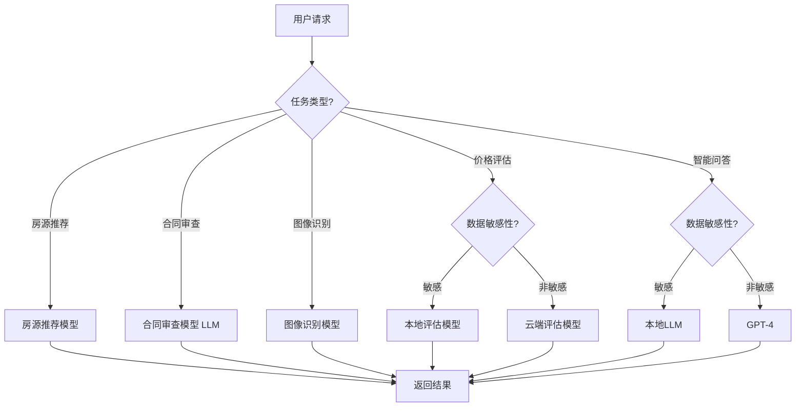

# 4. 模型与提示词管理

## 4.1 多模型路由

### 模型选择策略

智能房地产解决方案使用多个AI模型，根据不同的业务场景和需求，智能选择最合适的模型：

#### 模型类型

- **大语言模型（LLM）**：
  - **GPT-4**：通用能力强，适合复杂推理任务（合同审查、智能问答）
  - **Claude 3**：安全性高，适合合规审查
  - **通义千问**：中文优化，适合中文场景
  - **本地部署模型**：数据不出域，适合敏感场景

- **专用模型**：
  - **房源推荐模型**：协同过滤、内容推荐、深度学习（BERT、Transformer），用于房源推荐
  - **价格评估模型**：回归模型（XGBoost、LightGBM）、深度学习（LSTM、Transformer），用于房价评估
  - **合同审查模型**：文本分类（BERT）、命名实体识别（NER）、关系抽取，用于合同审查
  - **图像识别模型**：ResNet、EfficientNet、YOLO，用于房源图片分析

#### 路由策略

- **基于任务类型路由**：
  - 房源推荐任务 → 房源推荐模型
  - 价格评估任务 → 价格评估模型
  - 合同审查任务 → 合同审查模型（LLM）
  - 图像识别任务 → 图像识别模型
  - 智能问答 → 大语言模型（GPT-4）

- **基于数据敏感性路由**：
  - 敏感数据 → 本地部署模型
  - 非敏感数据 → 云端大模型

- **基于性能要求路由**：
  - 实时任务 → 轻量级模型或边缘模型
  - 批量任务 → 高性能模型

- **基于成本考虑路由**：
  - 简单任务 → 低成本模型
  - 复杂任务 → 高性能模型

**路由决策流程图**：



## 4.2 模型版本管理

### 版本控制策略

#### 版本命名规则

- **语义化版本号**：
  - 格式：主版本号.次版本号.修订号（如v1.2.3）
  - 主版本号：重大架构变更
  - 次版本号：新功能添加
  - 修订号：Bug修复

- **模型版本标签**：
  - stable：稳定版本，用于生产环境
  - beta：测试版本，用于测试环境
  - dev：开发版本，用于开发环境

#### 版本管理流程

- **模型开发**：
  1. 创建开发分支
  2. 模型训练和评估
  3. 代码审查
  4. 合并到主分支

- **模型测试**：
  1. 部署到测试环境
  2. 运行测试用例
  3. 性能测试
  4. 测试通过后标记为beta版本

- **模型发布**：
  1. 部署到生产环境
  2. A/B测试验证
  3. 监控模型效果
  4. 效果达标后标记为stable版本

### 模型回滚

#### 回滚策略

- **自动回滚**：
  - 模型效果下降超过阈值（如准确率下降5%）
  - 系统错误率超过阈值（如错误率&gt;5%）
  - 自动回滚到上一个稳定版本

- **手动回滚**：
  - 发现严重Bug
  - 业务需求变更
  - 手动触发回滚

#### 回滚流程

1. 停止新版本模型服务
2. 恢复旧版本模型服务
3. 验证旧版本模型效果
4. 通知相关人员
5. 记录回滚原因和时间

## 4.3 提示词管理

### 提示词版本控制

#### 提示词存储

- **提示词仓库**：
  - 使用Git管理提示词版本
  - 提示词文件存储在代码仓库
  - 支持提示词版本对比和回滚

- **提示词格式**：
  - 使用YAML或JSON格式存储
  - 包含提示词内容、版本号、创建时间等信息

#### 提示词模板

**房源推荐提示词模板**：

```yaml
name: 房源推荐提示词
version: v1.0
description: 基于用户需求推荐房源
template: |
  你是一位专业的房产经纪人，请根据以下用户需求推荐合适的房源：
  
  用户需求：
  - 位置：{location}
  - 价格范围：{price_range}
  - 面积范围：{area_range}
  - 户型：{house_type}
  - 其他要求：{other_requirements}
  
  可用房源：
  {properties_list}
  
  请推荐3-5套最合适的房源，并说明推荐理由。
  
  输出格式：
  {
    "recommendations": [
      {
        "property_id": "房源ID",
        "score": 推荐分数,
        "reason": "推荐理由"
      }
    ]
  }
```

**价格评估提示词模板**：

```yaml
name: 价格评估提示词
version: v1.0
description: 评估房源价格
template: |
  你是一位专业的房地产评估师，请根据以下信息评估房源价格：
  
  房源信息：
  - 位置：{location}
  - 面积：{area}
  - 户型：{house_type}
  - 楼层：{floor}
  - 装修：{decoration}
  - 朝向：{orientation}
  
  市场数据：
  - 同区域成交价：{market_price}
  - 同区域挂牌价：{listing_price}
  - 市场趋势：{market_trend}
  
  请评估该房源的价格，并说明评估依据。
  
  输出格式：
  {
    "estimated_price": 评估价格,
    "price_range": {
      "min": 最低价,
      "max": 最高价
    },
    "confidence": 置信度,
    "factors": [
      {
        "factor": "影响因素",
        "impact": "影响程度"
      }
    ]
  }
```

**合同审查提示词模板**：

```yaml
name: 合同审查提示词
version: v1.0
description: 审查合同风险
template: |
  你是一位专业的法务人员，请审查以下合同，识别潜在风险和问题：
  
  合同内容：
  {contract_content}
  
  请审查合同，识别以下方面的问题：
  1. 法律合规性
  2. 条款完整性
  3. 风险条款
  4. 不公平条款
  
  输出格式：
  {
    "risk_level": "风险等级（低/中/高）",
    "issues": [
      {
        "type": "问题类型",
        "description": "问题描述",
        "suggestion": "修改建议",
        "severity": "严重程度（低/中/高）"
      }
    ],
    "summary": "审查总结"
  }
```

### 提示词优化

#### 提示词测试

- **单元测试**：
  - 测试提示词在不同输入下的输出
  - 验证输出格式和内容
  - 评估输出质量

- **A/B测试**：
  - 对比不同版本的提示词效果
  - 选择效果更好的版本
  - 持续优化提示词

#### 提示词优化策略

- **增加上下文信息**：
  - 提供更多背景信息
  - 明确任务要求
  - 提供示例

- **优化输出格式**：
  - 使用结构化输出格式（JSON、XML）
  - 明确字段定义
  - 提供输出示例

- **减少歧义**：
  - 使用明确的语言
  - 避免模糊表达
  - 提供具体指导

## 4.4 模型训练与更新

### 训练数据管理

#### 数据收集

- **房源数据**：
  - 收集房源基本信息、图片、视频等
  - 收集用户浏览、收藏、咨询等行为数据
  - 收集成交数据、价格变动数据

- **市场数据**：
  - 收集市场成交价、挂牌价数据
  - 收集市场趋势数据
  - 收集区域价格数据

- **合同数据**：
  - 收集合同文档
  - 收集合同审查结果
  - 收集法律风险标注

#### 数据标注

- **房源标注**：
  - 标注房源特征（位置、面积、户型等）
  - 标注房源质量（图片质量、信息完整性等）
  - 标注用户偏好（用户对房源的偏好程度）

- **价格标注**：
  - 标注真实成交价
  - 标注价格合理性
  - 标注价格影响因素

- **合同标注**：
  - 标注合同风险点
  - 标注问题条款
  - 标注修改建议

### 模型训练流程

#### 训练流程

1. **数据准备**：
   - 数据清洗和预处理
   - 特征工程
   - 数据划分（训练集、验证集、测试集）

2. **模型训练**：
   - 选择模型架构
   - 设置超参数
   - 训练模型
   - 验证模型效果

3. **模型评估**：
   - 在测试集上评估模型
   - 评估准确率、召回率等指标
   - 分析模型错误

4. **模型优化**：
   - 调整超参数
   - 增加训练数据
   - 优化模型架构

5. **模型部署**：
   - 部署到测试环境
   - A/B测试验证
   - 部署到生产环境

#### 训练监控

- **训练指标监控**：
  - 损失函数值
  - 准确率、召回率等指标
  - 训练时间

- **资源监控**：
  - GPU使用率
  - 内存使用率
  - 存储使用率

### 模型更新策略

#### 更新触发条件

- **定期更新**：
  - 每月更新一次模型
  - 使用最新数据重新训练

- **效果下降触发**：
  - 模型效果下降超过阈值（如准确率下降5%）
  - 自动触发模型更新

- **数据积累触发**：
  - 新数据积累到一定量（如10万条）
  - 触发模型增量训练

#### 更新流程

1. **数据收集**：收集最新数据
2. **模型训练**：使用新数据训练模型
3. **模型评估**：评估新模型效果
4. **A/B测试**：对比新旧模型效果
5. **模型部署**：效果达标后部署新模型
6. **监控验证**：监控新模型运行效果

