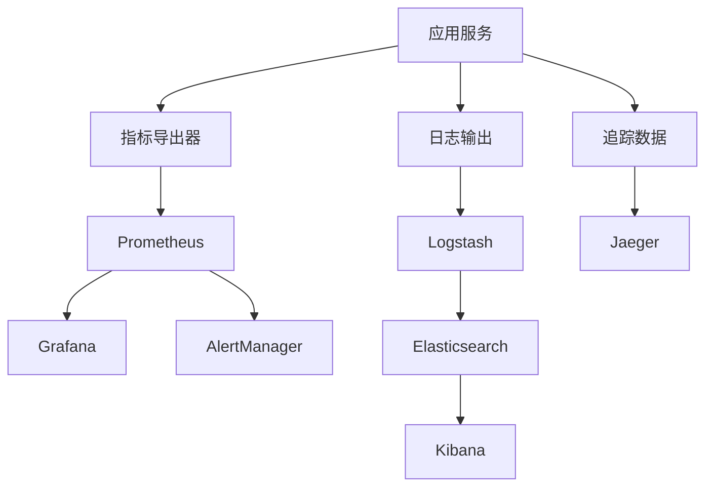

# 9. 监控与可观测

## 9.1 业务指标

### 核心业务指标

智能房地产解决方案的核心业务指标包括：

#### 房源推荐业务指标

- **推荐任务数**：
  - 定义：每日/每小时创建的推荐任务数量
  - 计算方法：统计推荐API调用次数
  - 目标值：日均10000+个任务
  - 监控频率：实时

- **推荐成功率**：
  - 定义：成功生成推荐结果的比率
  - 计算方法：成功推荐数 / 总推荐数
  - 目标值：≥ 95%
  - 监控频率：实时

- **推荐准确率**：
  - 定义：推荐结果符合用户需求的比率
  - 计算方法：需要人工评估或用户反馈
  - 目标值：≥ 80%
  - 监控频率：每日

- **用户点击率**：
  - 定义：用户点击推荐房源的比率
  - 计算方法：点击次数 / 推荐展示次数
  - 目标值：≥ 10%
  - 监控频率：实时

- **成交转化率**：
  - 定义：推荐房源最终成交的比率
  - 计算方法：成交数 / 推荐数
  - 目标值：≥ 5%
  - 监控频率：每日

#### 价格评估业务指标

- **评估任务数**：
  - 定义：每日/每小时执行的评估任务数量
  - 计算方法：统计评估API调用次数
  - 目标值：日均5000+个任务
  - 监控频率：实时

- **评估准确率**：
  - 定义：评估结果准确的比率（误差率 ≤ 5%）
  - 计算方法：需要人工评估或回测验证
  - 目标值：≥ 95%
  - 监控频率：每日

- **评估响应时间**：
  - 定义：评估任务的平均响应时间
  - 计算方法：平均响应时间
  - 目标值：≤ 1秒
  - 监控频率：实时

- **评估置信度**：
  - 定义：评估结果的置信度
  - 计算方法：模型输出的置信度
  - 目标值：≥ 0.8
  - 监控频率：实时

#### 合同审查业务指标

- **审查任务数**：
  - 定义：每日/每小时执行的审查任务数量
  - 计算方法：统计审查API调用次数
  - 目标值：日均1000+个任务
  - 监控频率：实时

- **审查准确率**：
  - 定义：审查结果正确的比率
  - 计算方法：需要人工评估
  - 目标值：≥ 98%
  - 监控频率：每日

- **风险识别准确率**：
  - 定义：风险识别正确的比率
  - 计算方法：需要人工评估
  - 目标值：≥ 95%
  - 监控频率：每日

- **审查响应时间**：
  - 定义：审查任务的平均响应时间
  - 计算方法：平均响应时间
  - 目标值：≤ 5分钟
  - 监控频率：实时

#### 物业管理业务指标

- **报修处理数**：
  - 定义：每日/每小时处理的报修数量
  - 计算方法：统计报修处理次数
  - 目标值：日均500+个任务
  - 监控频率：实时

- **报修处理响应时间**：
  - 定义：报修处理的平均响应时间
  - 计算方法：平均响应时间
  - 目标值：≤ 2小时
  - 监控频率：实时

- **用户满意度**：
  - 定义：用户对服务的满意度评分
  - 计算方法：用户评分平均值
  - 目标值：≥ 4.0/5.0
  - 监控频率：每日

- **投诉率**：
  - 定义：投诉数占服务数的比率
  - 计算方法：投诉数 / 服务数
  - 目标值：≤ 5%
  - 监控频率：每日

## 9.2 技术指标

### 系统性能指标

#### API性能指标

- **响应时间**：
  - P50响应时间：≤ 100ms
  - P95响应时间：≤ 500ms
  - P99响应时间：≤ 1s
  - 监控频率：实时

- **吞吐量**：
  - QPS：≥ 1000
  - TPS：≥ 500
  - 监控频率：实时

- **错误率**：
  - API错误率：≤ 0.1%
  - 5xx错误率：≤ 0.01%
  - 超时率：≤ 0.1%
  - 监控频率：实时

#### 系统资源指标

- **CPU使用率**：
  - 平均CPU使用率：≤ 70%
  - 峰值CPU使用率：≤ 90%
  - 监控频率：实时

- **内存使用率**：
  - 平均内存使用率：≤ 80%
  - 峰值内存使用率：≤ 90%
  - 监控频率：实时

- **磁盘使用率**：
  - 磁盘使用率：≤ 80%
  - 磁盘IO：≤ 80%
  - 监控频率：实时

- **网络使用率**：
  - 网络带宽使用率：≤ 80%
  - 网络延迟：≤ 50ms
  - 监控频率：实时

### 模型性能指标

#### 模型推理性能

- **推理延迟**：
  - 推荐模型：≤ 100ms
  - 评估模型：≤ 200ms
  - 审查模型：≤ 5分钟
  - 监控频率：实时

- **推理吞吐量**：
  - 推荐模型：≥ 1000 QPS
  - 评估模型：≥ 500 QPS
  - 审查模型：≥ 100 QPS
  - 监控频率：实时

- **GPU使用率**：
  - GPU使用率：≥ 70%
  - GPU内存使用率：≤ 90%
  - 监控频率：实时

#### 模型效果指标

- **模型准确率**：
  - 推荐模型：≥ 80%
  - 评估模型：≥ 95%
  - 审查模型：≥ 98%
  - 监控频率：每日

- **模型稳定性**：
  - 模型效果波动：≤ 5%
  - 模型错误率：≤ 1%
  - 监控频率：每日

## 9.3 监控系统

### 监控架构

#### 监控组件

- **Prometheus**：指标收集和存储
- **Grafana**：指标可视化和告警
- **ELK Stack**：日志收集和分析
- **Jaeger**：分布式链路追踪
- **AlertManager**：告警管理

#### 监控数据流

### 监控仪表盘

#### 业务监控仪表盘

- **房源推荐监控**：
  - 推荐任务数趋势
  - 推荐成功率
  - 推荐准确率
  - 用户点击率
  - 成交转化率

- **价格评估监控**：
  - 评估任务数趋势
  - 评估准确率
  - 评估响应时间
  - 评估置信度

- **合同审查监控**：
  - 审查任务数趋势
  - 审查准确率
  - 风险识别准确率
  - 审查响应时间

#### 技术监控仪表盘

- **系统性能监控**：
  - API响应时间分布
  - API吞吐量趋势
  - API错误率趋势
  - 系统资源使用率

- **模型性能监控**：
  - 模型推理延迟
  - 模型推理吞吐量
  - 模型准确率趋势
  - GPU使用率

## 9.4 告警机制

### 告警规则

#### 业务告警

- **推荐成功率下降**：
  - 条件：推荐成功率 < 90% 持续5分钟
  - 级别：警告
  - 通知：业务团队

- **评估准确率下降**：
  - 条件：评估准确率 < 90% 持续1小时
  - 级别：警告
  - 通知：业务团队

- **审查准确率下降**：
  - 条件：审查准确率 < 95% 持续1小时
  - 级别：严重
  - 通知：业务团队和技术团队

#### 技术告警

- **API错误率过高**：
  - 条件：API错误率 > 1% 持续5分钟
  - 级别：警告
  - 通知：技术团队

- **响应时间过长**：
  - 条件：P95响应时间 > 1s 持续5分钟
  - 级别：警告
  - 通知：技术团队

- **系统资源不足**：
  - 条件：CPU使用率 > 90% 或 内存使用率 > 90% 持续5分钟
  - 级别：严重
  - 通知：运维团队

- **服务不可用**：
  - 条件：服务可用性 < 99% 持续1分钟
  - 级别：严重
  - 通知：运维团队和技术团队

### 告警通知

#### 通知渠道

- **邮件通知**：发送告警邮件
- **短信通知**：发送告警短信（严重告警）
- **钉钉/企业微信通知**：发送告警消息
- **电话通知**：严重告警电话通知

#### 告警升级

- **一级告警**：通知值班人员
- **二级告警**：通知技术负责人（1小时内未处理）
- **三级告警**：通知管理层（2小时内未处理）

## 9.5 日志管理

### 日志收集

#### 日志类型

- **应用日志**：
  - 业务日志
  - 错误日志
  - 访问日志

- **系统日志**：
  - 系统事件日志
  - 安全日志
  - 审计日志

#### 日志格式

- **结构化日志**：使用JSON格式
- **日志级别**：DEBUG、INFO、WARN、ERROR
- **日志字段**：时间戳、级别、服务名、请求ID、消息等

### 日志分析

#### 日志查询

- **全文搜索**：支持全文搜索
- **字段过滤**：支持字段过滤
- **时间范围**：支持时间范围查询

#### 日志分析

- **错误分析**：分析错误日志，识别问题
- **性能分析**：分析性能日志，优化性能
- **安全分析**：分析安全日志，识别威胁

## 9.6 链路追踪

### 分布式追踪

#### 追踪范围

- **API调用链**：追踪API调用链路
- **数据库调用**：追踪数据库调用
- **外部服务调用**：追踪外部服务调用

#### 追踪信息

- **请求ID**：唯一请求标识
- **服务名称**：服务名称
- **调用时间**：调用时间
- **调用结果**：调用结果（成功/失败）
- **调用耗时**：调用耗时

### 性能分析

#### 性能瓶颈识别

- **慢查询识别**：识别慢查询
- **服务瓶颈识别**：识别服务瓶颈
- **外部依赖瓶颈识别**：识别外部依赖瓶颈

#### 性能优化建议

- **基于追踪数据**：分析性能数据
- **提供优化建议**：提供性能优化建议
- **验证优化效果**：验证优化效果

