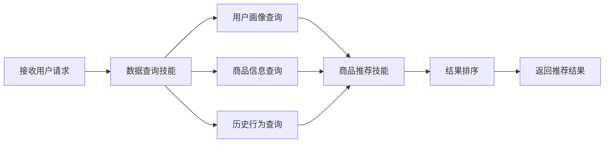
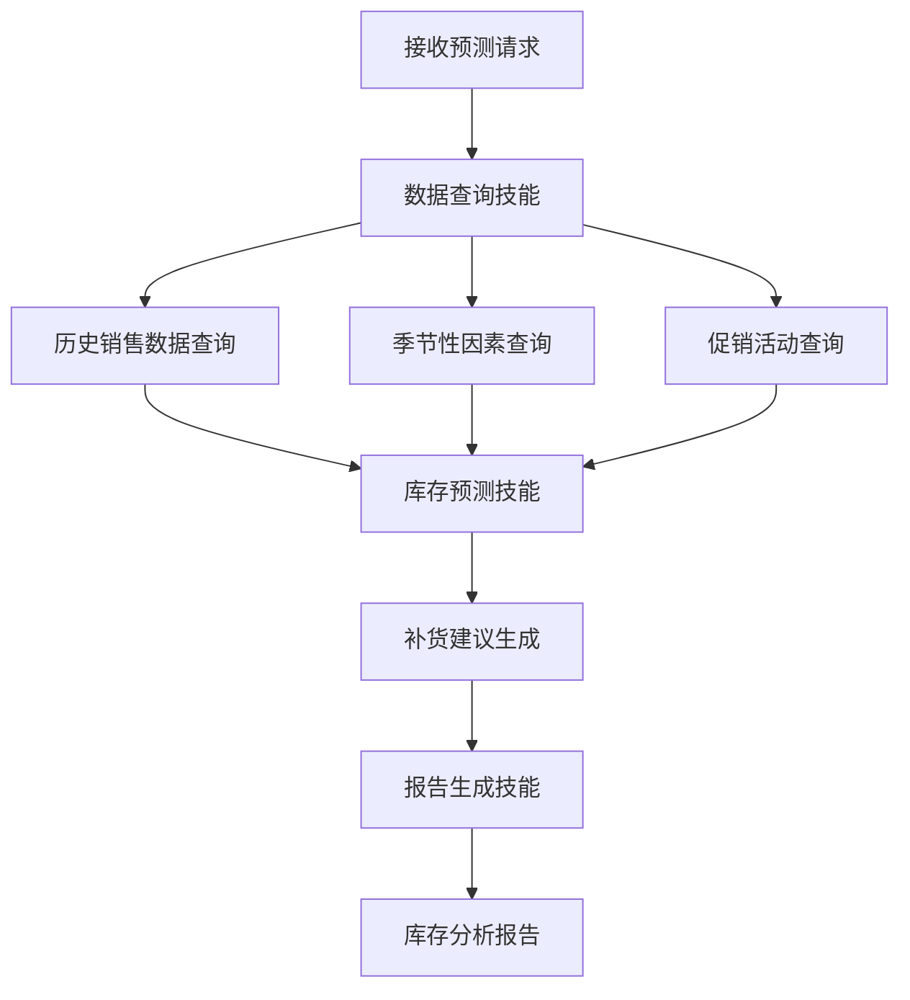

# 5. 智能体与业务编排

## 5.1 Agent技能链

### 技能定义

智能零售/电商解决方案中的Agent具备多种技能，每个技能对应一个特定的业务能力：

#### 核心技能

- **商品推荐技能（ProductRecommendationSkill）**：
  - 功能：根据用户偏好推荐商品，计算推荐分数
  - 输入：用户画像、历史行为、商品信息
  - 输出：推荐商品列表、推荐分数、推荐理由
  - 使用模型：协同过滤模型 + 内容推荐模型 + 大语言模型

- **库存预测技能（InventoryForecastSkill）**：
  - 功能：预测商品需求，计算补货建议
  - 输入：历史销售数据、季节性因素、促销活动
  - 输出：需求预测、补货建议、库存优化方案
  - 使用模型：时序预测模型（LSTM、Transformer）

- **智能客服技能（CustomerServiceSkill）**：
  - 功能：回答用户咨询，处理用户问题
  - 输入：用户问题、订单信息、商品信息
  - 输出：回答内容、操作建议、是否需要人工客服
  - 使用模型：大语言模型（GPT-4、通义千问）+ RAG知识库

- **营销策划技能（MarketingPlanningSkill）**：
  - 功能：策划营销活动，生成营销方案
  - 输入：营销目标、用户群体、商品信息
  - 输出：营销方案、推送内容、效果预测
  - 使用模型：大语言模型（GPT-4）+ 营销知识库

- **数据查询技能（DataQuerySkill）**：
  - 功能：查询各类数据，包括商品数据、用户数据、订单数据
  - 输入：查询条件、数据源标识
  - 输出：查询结果、数据统计
  - 使用工具：数据库查询工具、API调用工具

- **报告生成技能（ReportGenerationSkill）**：
  - 功能：生成各类报告，包括推荐效果报告、库存分析报告、营销效果报告
  - 输入：分析结果、报告模板
  - 输出：格式化报告（Markdown、PDF、Word）
  - 使用工具：报告模板工具、格式化工具

### 技能链设计

技能链是将多个技能组合起来，完成复杂业务流程：

#### 商品推荐技能链



**技能链配置**：

```yaml
skill_chain:
  name: product_recommendation_chain
  skills:
    - name: user_profile_query
      skill: DataQuerySkill
      inputs:
        - user_id
      outputs:
        - user_profile
        - preference_tags
    
    - name: product_catalog_query
      skill: DataQuerySkill
      inputs:
        - category
        - filters
      outputs:
        - product_catalog
    
    - name: user_behavior_query
      skill: DataQuerySkill
      inputs:
        - user_id
        - date_range
      outputs:
        - browse_history
        - purchase_history
    
    - name: product_recommendation
      skill: ProductRecommendationSkill
      inputs:
        - user_profile
        - product_catalog
        - browse_history
        - purchase_history
      outputs:
        - recommended_products
        - recommendation_scores
        - recommendation_reasons
    
    - name: result_ranking
      skill: RankingSkill
      inputs:
        - recommended_products
        - ranking_factors
      outputs:
        - ranked_products
```

#### 库存预测技能链



**技能链配置**：

```yaml
skill_chain:
  name: inventory_forecast_chain
  skills:
    - name: sales_history_query
      skill: DataQuerySkill
      inputs:
        - product_id
        - date_range
      outputs:
        - sales_history
    
    - name: seasonal_factors_query
      skill: DataQuerySkill
      inputs:
        - product_id
        - date_range
      outputs:
        - seasonal_factors
    
    - name: promotion_query
      skill: DataQuerySkill
      inputs:
        - product_id
        - date_range
      outputs:
        - promotion_activities
    
    - name: inventory_forecast
      skill: InventoryForecastSkill
      inputs:
        - sales_history
        - seasonal_factors
        - promotion_activities
      outputs:
        - demand_forecast
        - reorder_suggestion
        - inventory_optimization
    
    - name: report_generation
      skill: ReportGenerationSkill
      inputs:
        - demand_forecast
        - reorder_suggestion
        - template: inventory_report_template
      outputs:
        - inventory_report
```

### 执行流程

#### 技能链执行引擎

技能链执行引擎负责协调各个技能的执行：

```python
class SkillChainExecutor:
    def __init__(self, skill_registry, tool_registry):
        self.skill_registry = skill_registry
        self.tool_registry = tool_registry
    
    def execute(self, chain_config, inputs):
        """
        执行技能链
        
        Args:
            chain_config: 技能链配置
            inputs: 输入数据
        
        Returns:
            最终输出结果
        """
        context = inputs.copy()
        
        for skill_config in chain_config['skills']:
            # 检查条件
            if 'condition' in skill_config:
                if not self._evaluate_condition(skill_config['condition'], context):
                    continue
            
            # 获取技能
            skill = self.skill_registry.get_skill(skill_config['skill'])
            
            # 准备输入
            skill_inputs = self._prepare_inputs(skill_config['inputs'], context)
            
            # 执行技能
            skill_outputs = skill.execute(skill_inputs, self.tool_registry)
            
            # 更新上下文
            context.update(skill_outputs)
        
        return context
```

#### 错误处理和重试

- **错误处理**：
  - 技能执行失败时，记录错误信息
  - 根据错误类型决定是否重试
  - 关键技能失败时，终止技能链执行

- **重试策略**：
  - 网络错误：自动重试3次，指数退避
  - 模型错误：重试1次，如果仍失败则使用备用模型
  - 数据错误：不重试，记录错误并终止

## 5.2 工具注册中心

### 工具类型

智能零售/电商解决方案中的工具分为以下几类：

#### 数据查询工具

- **数据库查询工具（DatabaseQueryTool）**：
  - 功能：查询MySQL、PostgreSQL等关系数据库
  - 参数：SQL查询语句、数据库连接信息
  - 返回：查询结果（JSON格式）
  - 安全：SQL注入防护、权限控制

- **向量数据库查询工具（VectorDBQueryTool）**：
  - 功能：查询向量数据库，进行相似度搜索
  - 参数：查询向量、Top-K、过滤条件
  - 返回：相似商品列表
  - 用途：商品推荐、商品搜索

- **API调用工具（APICallTool）**：
  - 功能：调用外部API接口
  - 参数：API URL、请求方法、请求参数、认证信息
  - 返回：API响应（JSON格式）
  - 安全：API密钥管理、请求签名

#### 数据处理工具

- **数据清洗工具（DataCleaningTool）**：
  - 功能：清洗和预处理数据
  - 参数：原始数据、清洗规则
  - 返回：清洗后的数据

- **特征工程工具（FeatureEngineeringTool）**：
  - 功能：提取和构造特征
  - 参数：原始数据、特征定义
  - 返回：特征向量

- **数据统计工具（DataStatisticsTool）**：
  - 功能：计算数据统计指标
  - 参数：数据、统计指标类型
  - 返回：统计结果

#### 模型调用工具

- **LLM调用工具（LLMCallTool）**：
  - 功能：调用大语言模型API
  - 参数：Prompt、模型名称、温度参数
  - 返回：模型生成结果
  - 支持：OpenAI、Anthropic、本地模型

- **推荐模型调用工具（RecommendationModelCallTool）**：
  - 功能：调用推荐模型进行商品推荐
  - 参数：用户特征、商品特征
  - 返回：推荐商品列表、推荐分数

- **时序预测模型调用工具（ForecastModelCallTool）**：
  - 功能：调用时序预测模型进行需求预测
  - 参数：历史数据、预测参数
  - 返回：预测结果、置信区间

#### 业务工具

- **报告生成工具（ReportGenerationTool）**：
  - 功能：生成格式化报告
  - 参数：报告内容、报告模板、输出格式
  - 返回：报告文件（PDF/Word/Markdown）

- **通知工具（NotificationTool）**：
  - 功能：发送通知（邮件、短信、企业微信）
  - 参数：通知内容、接收人、通知方式
  - 返回：发送结果

- **订单查询工具（OrderQueryTool）**：
  - 功能：查询订单信息
  - 参数：订单ID、用户ID
  - 返回：订单详情

## 5.3 工作流编排

### 工作流引擎（n8n）

使用n8n工作流引擎进行业务流程编排：

#### 推荐工作流

```yaml
workflow:
  name: 智能商品推荐工作流
  triggers:
    - type: webhook
      path: /api/recommend
  nodes:
    - id: receive-request
      type: webhook
      parameters:
        path: recommend
        httpMethod: POST
    
    - id: fetch-user-profile
      type: http-request
      parameters:
        url: ${USER_API}/user/${userId}/profile
        method: GET
    
    - id: fetch-product-catalog
      type: http-request
      parameters:
        url: ${PRODUCT_API}/products
        method: GET
        qs:
          category: ${category}
    
    - id: ai-recommendation
      type: ai-agent
      parameters:
        agent: recommendation-agent
        tools:
          - user-profile-tool
          - product-catalog-tool
          - vector-search-tool
        inputs:
          user_profile: ${user_profile}
          product_catalog: ${product_catalog}
    
    - id: rank-products
      type: function
      parameters:
        functionCode: |
          // 排序逻辑
          const ranked = products.sort((a, b) => b.score - a.score);
          return ranked.slice(0, 10);
    
    - id: response
      type: respond-to-webhook
      parameters:
        respondWith: json
        responseBody: ${ranked_products}
```

#### 库存预测工作流

```yaml
workflow:
  name: 智能库存预测工作流
  triggers:
    - type: schedule
      cron: 0 2 * * *  # 每天凌晨2点执行
  nodes:
    - id: fetch-products
      type: http-request
      parameters:
        url: ${PRODUCT_API}/products
        method: GET
    
    - id: forecast-loop
      type: loop
      parameters:
        items: ${products}
        mode: parallel
    
    - id: fetch-sales-history
      type: http-request
      parameters:
        url: ${SALES_API}/sales/${item.id}
        method: GET
        qs:
          date_range: 90
    
    - id: ai-forecast
      type: ai-agent
      parameters:
        agent: forecast-agent
        tools:
          - sales-history-tool
          - forecast-model-tool
        inputs:
          sales_history: ${sales_history}
    
    - id: generate-reorder-suggestion
      type: function
      parameters:
        functionCode: |
          // 生成补货建议
          if (forecast.demand > current_inventory) {
            return {
              action: 'reorder',
              quantity: forecast.demand - current_inventory
            };
          }
    
    - id: send-notification
      type: http-request
      parameters:
        url: ${NOTIFICATION_API}/send
        method: POST
        body:
          type: inventory_alert
          message: ${reorder_suggestion}
```

### 智能体编排（Dify）

使用Dify进行智能体编排和对话管理：

#### 智能客服Agent

```yaml
agent:
  name: 智能客服Agent
  model: qwen-plus
  tools:
    - order_query_tool
    - product_query_tool
    - knowledge_base_tool
  prompt: |
    你是一位专业的电商客服，擅长回答用户关于商品、订单、售后等问题。
    
    你可以使用以下工具：
    - order_query_tool: 查询订单信息
    - product_query_tool: 查询商品信息
    - knowledge_base_tool: 查询知识库
    
    请根据用户问题，使用合适的工具查询信息，然后给出准确、友好的回答。
  
  conversation_memory:
    type: summary
    max_turns: 10
```

#### 营销策划Agent

```yaml
agent:
  name: 营销策划Agent
  model: gpt-4
  tools:
    - user_segment_tool
    - product_catalog_tool
    - marketing_knowledge_tool
  prompt: |
    你是一位资深的营销专家，擅长策划营销活动和生成营销方案。
    
    你可以使用以下工具：
    - user_segment_tool: 查询用户分群信息
    - product_catalog_tool: 查询商品信息
    - marketing_knowledge_tool: 查询营销知识库
    
    请根据营销目标，分析用户群体和商品特点，生成个性化的营销方案。
```

