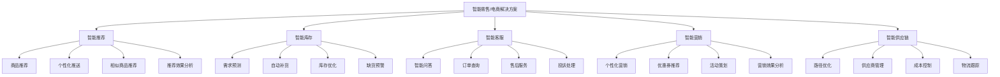
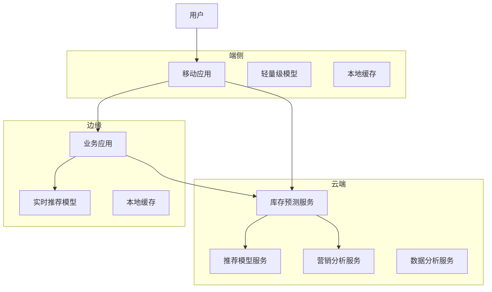
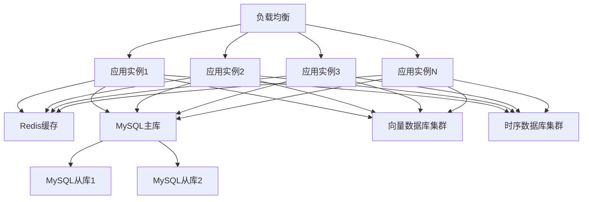

# 2. 总体架构

## 2.1 业务架构

### 角色定义

智能零售/电商解决方案涉及多个角色，每个角色有不同的职责和权限：

- **商品运营**：
  - 职责：管理商品信息，配置推荐策略，分析推荐效果
  - 权限：查看商品数据，配置推荐规则，分析推荐效果
  - 使用场景：商品管理，推荐策略优化，效果分析

- **库存管理员**：
  - 职责：管理库存，配置补货策略，分析库存效果
  - 权限：查看库存数据，配置补货规则，分析库存效果
  - 使用场景：库存管理，补货策略优化，缺货预警

- **客服主管**：
  - 职责：管理客服团队，配置智能客服策略，分析客服效果
  - 权限：查看客服数据，配置客服规则，分析客服效果
  - 使用场景：客服管理，智能客服优化，客服效果分析

- **营销经理**：
  - 职责：策划营销活动，配置营销策略，分析营销效果
  - 权限：查看营销数据，配置营销规则，分析营销效果
  - 使用场景：营销活动策划，营销策略优化，营销效果分析

- **供应链经理**：
  - 职责：管理供应链，优化物流路径，分析供应链效果
  - 权限：查看供应链数据，配置供应链规则，分析供应链效果
  - 使用场景：供应链管理，物流优化，成本控制

- **系统管理员**：
  - 职责：管理系统配置，监控系统运行，处理系统故障
  - 权限：系统配置，用户管理，监控告警
  - 使用场景：系统维护，用户管理，故障处理

### 用例分析

#### 用例1：智能商品推荐

**参与者**：用户、推荐系统、商品运营

**前置条件**：
- 用户已登录系统
- 推荐模型已部署
- 推荐策略已配置

**主流程**：
1. 用户访问商品页面或搜索商品
2. 推荐系统接收用户请求，获取用户画像和历史行为
3. AI模型分析用户偏好和商品特征，计算推荐分数
4. 根据推荐分数和策略，生成个性化推荐列表
5. 返回推荐结果给用户
6. 用户点击推荐商品，记录反馈数据
7. 系统根据反馈数据优化推荐模型

**异常流程**：
- 如果AI模型不可用，使用规则引擎作为备用方案
- 如果系统故障，启用降级模式，仅使用基础推荐

**后置条件**：
- 推荐结果已返回
- 用户行为已记录
- 推荐效果已统计

#### 用例2：智能库存管理

**参与者**：库存管理员、库存系统

**前置条件**：
- 库存管理员已登录系统
- 库存预测模型已部署
- 补货策略已配置

**主流程**：
1. 库存管理员查看库存状态和预测报告
2. 系统自动分析历史销售数据、季节性因素、促销活动等
3. AI模型预测未来需求，计算补货建议
4. 根据补货建议和策略，生成补货计划
5. 库存管理员审核补货计划，确认或调整
6. 系统自动生成采购订单或补货指令
7. 跟踪补货执行情况，更新库存状态

**异常流程**：
- 如果预测不准确，库存管理员可以手动调整
- 如果供应商不可用，系统自动选择备用供应商

**后置条件**：
- 补货计划已生成
- 采购订单已创建
- 库存状态已更新

#### 用例3：智能客服

**参与者**：用户、智能客服系统、客服主管

**前置条件**：
- 用户已登录系统
- 智能客服模型已部署
- 客服知识库已配置

**主流程**：
1. 用户发起咨询请求
2. 智能客服系统接收请求，理解用户意图
3. AI模型分析用户问题，检索知识库
4. 生成回答内容，返回给用户
5. 如果用户不满意，转人工客服
6. 人工客服处理复杂问题，记录解决方案
7. 系统学习人工客服的解决方案，优化知识库

**异常流程**：
- 如果AI无法理解问题，立即转人工客服
- 如果系统故障，启用人工客服模式

**后置条件**：
- 用户问题已解决
- 客服记录已保存
- 知识库已更新

### 故事地图

智能零售/电商解决方案的用户故事地图如下：



## 2.2 技术架构

### AI-Native四层架构

智能零售/电商解决方案采用AI-Native四层架构，从下到上包括基础设施层、模型层、编排层和应用层。

#### 应用层

应用层提供面向业务用户的应用界面和API接口：

**核心应用**：

- **推荐管理平台**：
  - 推荐策略配置界面
  - 推荐效果分析报表
  - 用户画像展示
  - A/B测试管理

- **库存管理平台**：
  - 库存状态监控大屏
  - 需求预测报告
  - 补货策略配置界面
  - 库存优化分析报表

- **客服管理平台**：
  - 智能客服配置界面
  - 客服效果分析报表
  - 知识库管理工具
  - 客服质量监控

- **营销管理平台**：
  - 营销活动策划工具
  - 个性化推送配置界面
  - 营销效果分析报表
  - 优惠券管理工具

- **供应链管理平台**：
  - 供应链状态监控大屏
  - 路径优化工具
  - 供应商管理界面
  - 成本分析报表

**技术栈**：
- 前端：Vue 3 + TypeScript + Vite + TailwindCSS
- 后端API：FastAPI + Python 3.11
- 状态管理：Pinia
- UI组件库：Element Plus

#### 编排层

编排层负责业务流程编排和智能体协调：

**核心组件**：

- **工作流引擎（n8n）**：
  - 业务流程编排
  - 任务调度和执行
  - 异常处理和重试
  - 工作流监控

- **智能体编排（Dify）**：
  - 多智能体协调
  - 工具调用管理
  - 上下文管理
  - 对话管理

- **MCP服务器**：
  - 工具注册中心
  - 工具调用接口
  - 数据源接入
  - 外部系统集成

**编排示例**：

```yaml
# 商品推荐工作流
workflow:
  name: 智能商品推荐
  triggers:
    - type: webhook
      path: /api/recommend
  nodes:
    - id: receive-request
      type: webhook
    - id: fetch-user-profile
      type: http-request
      url: ${USER_API}/user/${userId}/profile
    - id: fetch-user-behavior
      type: http-request
      url: ${USER_API}/user/${userId}/behavior
    - id: ai-recommendation
      type: ai-agent
      agent: recommendation-agent
      tools:
        - user-profile-tool
        - product-catalog-tool
        - vector-search-tool
        - collaborative-filtering-tool
    - id: rank-products
      type: ranking
      algorithm: learning-to-rank
    - id: filter-products
      type: filter
      rules: ${FILTER_RULES}
    - id: response
      type: response
      products: ${recommended_products}
```

#### 模型层

模型层提供AI模型服务和推理能力：

**核心模型**：

- **推荐模型**：
  - 协同过滤模型（矩阵分解、深度学习）
  - 内容推荐模型（向量检索、语义匹配）
  - 深度学习推荐模型（Wide & Deep、DeepFM）
  - 实时推荐模型（在线学习）

- **时序预测模型**：
  - 需求预测模型（LSTM、Transformer、Prophet）
  - 销量预测模型（ARIMA、XGBoost）
  - 库存优化模型（强化学习）

- **NLP模型**：
  - 文本分类模型（BERT）
  - 命名实体识别模型（BERT + CRF）
  - 情感分析模型（RoBERTa）
  - 文本摘要模型（T5）

- **多模态模型**：
  - 商品图像识别模型（ResNet、EfficientNet）
  - 商品图像检索模型（CLIP）
  - 商品描述生成模型（GPT）

- **大语言模型**：
  - 通用大模型（GPT-4、Claude、通义千问）
  - 电商领域微调模型
  - RAG增强模型

**模型服务**：

- **模型推理服务**：
  - 实时推理API（推荐、客服）
  - 批量推理服务（库存预测、营销分析）
  - 模型版本管理
  - A/B测试支持

- **模型训练服务**：
  - 数据预处理
  - 模型训练
  - 模型评估
  - 模型部署

**技术栈**：
- 模型框架：PyTorch、TensorFlow、XGBoost
- 模型服务：TorchServe、TensorFlow Serving、Triton
- 大模型：OpenAI API、Anthropic API、本地部署模型
- 向量数据库：Milvus、Qdrant（用于商品相似度搜索）

#### 基础设施层

基础设施层提供计算、存储、网络等基础能力：

**核心组件**：

- **计算资源**：
  - Kubernetes集群（GPU节点 + CPU节点）
  - 容器编排和管理
  - 自动扩缩容
  - 资源调度

- **存储系统**：
  - 关系数据库（MySQL 8.0）：业务数据存储（用户、订单、商品）
  - 向量数据库（Milvus、Qdrant）：商品向量、用户向量、相似度搜索
  - 时序数据库（InfluxDB、TimescaleDB）：用户行为、销售数据
  - 对象存储（MinIO、阿里云OSS）：商品图片、视频
  - 缓存系统（Redis）：热点数据缓存、推荐结果缓存
  - 消息队列（RabbitMQ、Kafka）：异步消息处理、事件流

- **网络和安全**：
  - 负载均衡（Nginx、HAProxy）
  - API网关（Kong、Traefik）
  - 防火墙和安全组
  - VPN和专线

- **监控和日志**：
  - 监控系统（Prometheus + Grafana）
  - 日志系统（ELK Stack）
  - 链路追踪（Jaeger）
  - 告警系统（AlertManager）

**技术栈**：
- 容器化：Docker、Kubernetes
- 数据库：MySQL 8.0、Redis、Milvus、InfluxDB
- 消息队列：RabbitMQ、Kafka
- 监控：Prometheus、Grafana、ELK

### 技术栈

#### 前端技术栈

- **Vue 3**：渐进式JavaScript框架，用于构建用户界面
- **TypeScript**：类型安全的JavaScript超集，提高代码质量
- **Vite**：快速的前端构建工具，提供极速的开发体验
- **TailwindCSS**：实用优先的CSS框架，快速构建美观界面
- **Pinia**：Vue的状态管理库，管理应用状态
- **Element Plus**：基于Vue 3的组件库，提供丰富的UI组件
- **Axios**：HTTP客户端，用于API调用
- **ECharts**：数据可视化库，用于图表展示

#### 后端技术栈

- **FastAPI**：现代、快速的Python Web框架，用于构建API
- **Python 3.11**：编程语言，提供丰富的AI库支持
- **SQLAlchemy**：Python ORM框架，用于数据库操作
- **Pydantic**：数据验证库，用于API数据验证
- **Celery**：分布式任务队列，用于异步任务处理
- **Redis**：内存数据库，用于缓存和消息队列
- **MySQL 8.0**：关系数据库，用于业务数据存储

#### AI技术栈

- **PyTorch**：深度学习框架，用于模型训练和推理
- **Transformers**：Hugging Face的Transformer模型库
- **LangChain**：LLM应用开发框架，用于构建AI应用
- **RAG技术**：检索增强生成，提升AI回答准确性
- **向量数据库**：Milvus、Qdrant，用于商品相似度搜索和推荐
- **模型服务**：TorchServe、Triton，用于模型部署和推理
- **推荐算法**：协同过滤、内容推荐、深度学习推荐

#### 基础设施技术栈

- **Docker**：容器化技术，用于应用打包和部署
- **Kubernetes**：容器编排平台，用于容器管理和调度
- **Nginx**：Web服务器和反向代理
- **Prometheus**：监控系统，用于指标收集
- **Grafana**：可视化平台，用于监控数据展示
- **ELK Stack**：日志系统，用于日志收集和分析

## 2.3 部署架构

### 云/边/端混合部署

智能零售/电商解决方案采用云/边/端混合部署架构，根据业务需求和数据敏感性，灵活选择部署位置：

**云端部署**：

- **适用场景**：
  - 大规模模型训练和推理
  - 商品推荐服务
  - 库存预测分析
  - 营销活动分析

- **部署内容**：
  - 大语言模型服务
  - 推荐模型服务
  - 时序预测模型服务
  - 数据分析服务

- **优势**：
  - 弹性扩展，按需付费
  - 无需维护基础设施
  - 全球部署，低延迟

**边缘部署**：

- **适用场景**：
  - 实时推荐服务
  - 低延迟要求的业务
  - 数据不出域的合规要求

- **部署内容**：
  - 实时推荐模型
  - 本地缓存
  - 业务应用服务

- **优势**：
  - 低延迟，快速响应
  - 数据不出域，满足合规要求
  - 降低网络带宽成本

**端侧部署**：

- **适用场景**：
  - 移动端应用
  - 离线场景
  - 隐私保护要求高的场景

- **部署内容**：
  - 轻量级推荐模型
  - 本地缓存
  - 离线功能

- **优势**：
  - 完全离线，保护隐私
  - 快速响应，无需网络
  - 降低服务器负载

**部署架构图**：



### 高可用设计

**多机房部署**：

- **主备机房**：
  - 主机房：承担主要业务流量
  - 备机房：实时同步数据，主备切换时间&lt;5分钟

- **异地容灾**：
  - 同城双活：两个机房同时提供服务，负载均衡
  - 异地灾备：异地机房作为灾备，定期同步数据

**服务高可用**：

- **多实例部署**：
  - 每个服务至少部署3个实例
  - 使用负载均衡分发请求
  - 自动故障检测和切换

- **数据库高可用**：
  - MySQL主从复制
  - Redis Sentinel集群
  - 向量数据库多副本
  - 时序数据库集群

**故障恢复**：

- **自动故障检测**：
  - 健康检查：每30秒检查一次服务健康状态
  - 故障告警：故障时立即告警
  - 自动切换：检测到故障后自动切换到备用实例

- **数据备份**：
  - 数据库每日全量备份
  - 增量备份每6小时一次
  - 备份保留30天

### 扩展性设计

**水平扩展**：

- **无状态服务**：
  - 应用服务设计为无状态，可以水平扩展
  - 使用负载均衡分发请求
  - 支持动态扩缩容

- **数据库扩展**：
  - 读写分离：读请求分发到从库
  - 分库分表：按业务维度分库分表（用户、订单、商品）
  - 缓存层：热点数据缓存到Redis

**垂直扩展**：

- **资源升级**：
  - CPU和内存可以根据负载动态调整
  - GPU资源可以根据模型推理需求调整
  - 存储容量可以动态扩容

**弹性伸缩**：

- **自动扩缩容**：
  - 基于CPU、内存、请求量等指标自动扩缩容
  - 扩容阈值：CPU使用率&gt;70%或请求量&gt;80%
  - 缩容阈值：CPU使用率&lt;30%且请求量&lt;40%

- **预测性扩缩容**：
  - 基于历史数据预测未来负载（如促销活动）
  - 提前扩容，避免突发流量导致服务不可用

**扩展性架构图**：



