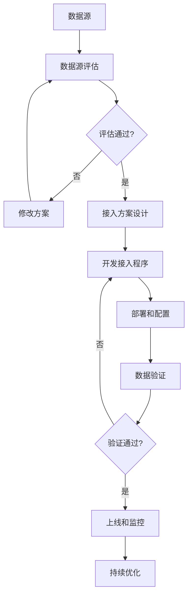

# 3. 数据与知识治理

## 3.1 私有数据接入

### 数据源类型

智能零售/电商解决方案需要接入多种数据源，包括：

#### 内部数据源

- **商品数据**：
  - 数据描述：商品基本信息、价格、库存、分类、属性等
  - 数据格式：JSON、CSV、数据库表
  - 数据量：百万级商品
  - 更新频率：实时/准实时
  - 接入方式：数据库直连、消息队列、API接口

- **用户数据**：
  - 数据描述：用户基本信息、注册信息、会员等级、偏好标签等
  - 数据格式：数据库表、JSON
  - 数据量：千万级用户
  - 更新频率：准实时（延迟&lt;1分钟）
  - 接入方式：数据库直连、API接口

- **订单数据**：
  - 数据描述：订单信息、订单商品、订单状态、支付信息等
  - 数据格式：数据库表、JSON
  - 数据量：亿级订单
  - 更新频率：实时
  - 接入方式：数据库直连、消息队列

- **用户行为数据**：
  - 数据描述：浏览记录、点击记录、搜索记录、购买记录等
  - 数据格式：日志文件、数据库表、消息队列
  - 数据量：百亿级行为记录
  - 更新频率：实时
  - 接入方式：日志采集、消息队列、数据库同步

- **库存数据**：
  - 数据描述：库存数量、库存位置、补货记录、缺货记录等
  - 数据格式：数据库表、JSON
  - 数据量：千万级库存记录
  - 更新频率：实时
  - 接入方式：数据库直连、消息队列

- **营销数据**：
  - 数据描述：营销活动、优惠券、推送记录、营销效果等
  - 数据格式：数据库表、JSON
  - 数据量：千万级营销记录
  - 更新频率：实时
  - 接入方式：数据库直连、API接口

#### 外部数据源

- **市场数据**：
  - 数据描述：商品价格、销量、评价、竞品信息等
  - 数据来源：第三方数据提供商、爬虫
  - 数据格式：API接口、CSV文件、JSON
  - 更新频率：每日/实时
  - 接入方式：API接口、数据文件下载、爬虫

- **天气数据**：
  - 数据描述：天气信息、温度、湿度、降雨量等
  - 数据来源：气象局、第三方天气API
  - 数据格式：API接口、JSON
  - 更新频率：实时/小时级
  - 接入方式：API接口

- **物流数据**：
  - 数据描述：物流信息、配送状态、物流轨迹等
  - 数据来源：物流公司API、第三方物流平台
  - 数据格式：API接口、JSON
  - 更新频率：实时
  - 接入方式：API接口、Webhook

- **社交媒体数据**：
  - 数据描述：商品评价、用户反馈、社交媒体讨论等
  - 数据来源：社交媒体平台、第三方数据提供商
  - 数据格式：API接口、JSON、HTML
  - 更新频率：实时
  - 接入方式：API接口、爬虫、RSS订阅

#### 第三方数据源

- **用户画像数据**：
  - 数据描述：用户标签、用户画像、用户分群等
  - 数据来源：第三方数据服务商
  - 数据格式：API接口、JSON
  - 更新频率：按需查询/定期更新
  - 接入方式：API接口

- **商品数据**：
  - 数据描述：商品信息、商品分类、商品属性等
  - 数据来源：商品数据服务商、品牌商
  - 数据格式：API接口、Excel、CSV
  - 更新频率：每日/按需
  - 接入方式：API接口、文件上传

### 数据接入流程

数据接入采用标准化的流程，确保数据质量和安全：

#### 1. 数据源评估

- **数据质量评估**：
  - 数据完整性：检查数据是否完整，缺失值比例
  - 数据准确性：抽样验证数据准确性
  - 数据一致性：检查数据格式和标准是否一致
  - 数据时效性：评估数据更新频率和延迟

- **数据安全评估**：
  - 数据敏感性：评估数据敏感级别
  - 数据合规性：检查是否符合数据保护法规
  - 数据来源可靠性：评估数据来源的可信度

#### 2. 接入方案设计

- **技术方案**：
  - 选择接入方式（API、数据库、文件等）
  - 设计数据同步机制（实时、准实时、批量）
  - 设计数据转换和清洗规则
  - 设计错误处理和重试机制

- **安全方案**：
  - 数据传输加密（TLS 1.3）
  - 数据存储加密（AES-256）
  - 访问控制（RBAC、IP白名单）
  - 数据脱敏规则

#### 3. 接入实施

- **开发接入程序**：
  - 编写数据接入脚本或服务
  - 实现数据转换和清洗逻辑
  - 实现错误处理和日志记录
  - 编写单元测试和集成测试

- **部署和配置**：
  - 部署接入服务到生产环境
  - 配置数据源连接信息
  - 配置数据同步规则
  - 配置监控和告警

#### 4. 验证和上线

- **数据验证**：
  - 验证数据完整性
  - 验证数据准确性
  - 验证数据时效性
  - 验证数据格式

- **性能测试**：
  - 测试数据接入性能
  - 测试系统负载能力
  - 测试错误处理能力

- **上线和监控**：
  - 正式上线数据接入
  - 持续监控数据质量
  - 持续监控系统性能

**数据接入流程图**：

### 数据质量保证

#### 数据质量监控

- **实时监控**：
  - 数据接入量监控：监控每日/每小时数据接入量
  - 数据延迟监控：监控数据更新延迟
  - 数据错误监控：监控数据接入错误率
  - 数据质量监控：监控数据质量指标

- **质量指标**：
  - **完整性**：数据完整率 ≥ 99%
  - **准确性**：数据准确率 ≥ 95%
  - **一致性**：数据一致性 ≥ 98%
  - **时效性**：数据延迟 ≤ 1分钟（实时数据）

#### 数据清洗规则

- **缺失值处理**：
  - 关键字段缺失：标记为异常，不进入后续处理
  - 非关键字段缺失：使用默认值或插值填充

- **异常值处理**：
  - 数值异常：超出合理范围的值标记为异常（如商品价格为负数）
  - 格式异常：不符合格式要求的值进行格式转换或标记为异常
  - 逻辑异常：不符合业务逻辑的值标记为异常（如订单金额为0）

- **重复数据处理**：
  - 基于主键去重：保留最新记录
  - 基于业务规则去重：根据业务规则判断是否重复

#### 数据质量报告

- **日报**：
  - 数据接入量统计
  - 数据质量指标统计
  - 数据异常情况统计
  - 数据质量趋势分析

- **周报**：
  - 数据质量趋势分析
  - 数据质量问题分析
  - 数据质量改进建议

## 3.2 向量知识库

### 知识库构建

智能零售/电商解决方案构建多个专业向量知识库，支持不同业务场景：

#### 知识库分类

- **商品知识库**：
  - 内容：商品信息、商品描述、商品属性、商品分类
  - 用途：商品推荐、商品搜索、商品理解
  - 数据量：百万级商品
  - 更新频率：实时/每日

- **用户知识库**：
  - 内容：用户画像、用户偏好、用户行为模式
  - 用途：个性化推荐、用户分群、精准营销
  - 数据量：千万级用户
  - 更新频率：实时/每日

- **客服知识库**：
  - 内容：常见问题、产品说明、售后服务政策、操作指南
  - 用途：智能客服、自动问答
  - 数据量：10万+条知识
  - 更新频率：每周

- **营销知识库**：
  - 内容：营销策略、优惠规则、活动方案、营销案例
  - 用途：营销策划、个性化推送
  - 数据量：5万+条知识
  - 更新频率：每周

- **供应链知识库**：
  - 内容：供应商信息、物流规则、成本数据、路径优化方案
  - 用途：供应链优化、物流规划
  - 数据量：10万+条知识
  - 更新频率：每周

#### 知识库构建流程

1. **数据收集**：
   - 从内部系统收集结构化数据
   - 从外部来源收集非结构化数据
   - 人工整理和标注数据

2. **数据预处理**：
   - 数据清洗和去重
   - 数据格式标准化
   - 数据质量检查

3. **向量化**：
   - 使用embedding模型将文本转换为向量
   - 商品信息使用多模态模型（文本+图像）
   - 用户行为使用序列模型

4. **存储**：
   - 存储到向量数据库（Milvus、Qdrant）
   - 建立索引，支持快速检索
   - 设置数据更新策略

5. **验证和优化**：
   - 验证检索效果
   - 优化embedding模型
   - 持续更新知识库

### 向量检索

#### 检索策略

- **相似度检索**：
  - 使用余弦相似度计算向量相似度
  - 支持Top-K检索
  - 支持相似度阈值过滤

- **混合检索**：
  - 结合向量检索和关键词检索
  - 使用BM25进行关键词检索
  - 融合两种检索结果

- **过滤检索**：
  - 支持多维度过滤（价格、分类、品牌等）
  - 先过滤后检索，提高效率
  - 支持复杂过滤条件

#### 检索优化

- **索引优化**：
  - 使用HNSW索引提高检索速度
  - 根据数据特点选择合适的索引算法
  - 定期优化索引

- **缓存策略**：
  - 缓存热门查询结果
  - 使用Redis缓存检索结果
  - 设置合理的缓存过期时间

- **批量检索**：
  - 支持批量查询，提高吞吐量
  - 使用异步处理，提高响应速度

## 3.3 数据安全与隐私保护

### 数据分类分级

- **敏感数据**：
  - 用户个人信息（姓名、手机号、身份证号）
  - 支付信息（银行卡号、支付密码）
  - 订单信息（详细地址、购买记录）

- **一般数据**：
  - 商品信息
  - 用户行为数据（脱敏后）
  - 营销数据

- **公开数据**：
  - 商品公开信息
  - 公开评价
  - 公开营销活动

### 数据保护措施

- **数据加密**：
  - 传输加密：TLS 1.3
  - 存储加密：AES-256
  - 密钥管理：使用密钥管理服务

- **数据脱敏**：
  - 敏感字段脱敏处理
  - 测试环境使用脱敏数据
  - 日志中不记录敏感信息

- **访问控制**：
  - 基于角色的访问控制（RBAC）
  - 最小权限原则
  - 多因素认证（MFA）

- **数据审计**：
  - 完整的操作日志记录
  - 定期安全审计
  - 异常行为检测

