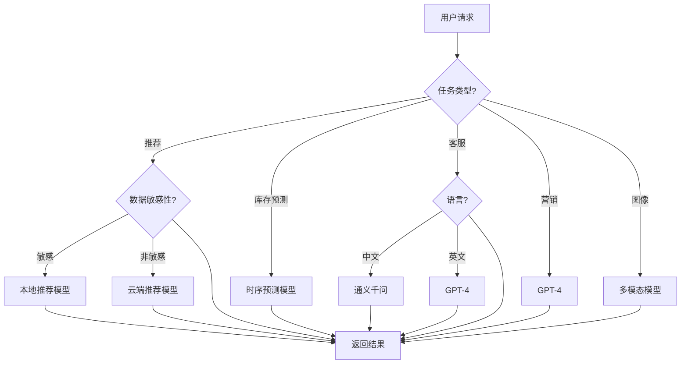

# 4. 模型与提示词管理

## 4.1 多模型路由

### 模型选择策略

智能零售/电商解决方案使用多个AI模型，根据不同的业务场景和需求，智能选择最合适的模型：

#### 模型类型

- **大语言模型（LLM）**：
  - **GPT-4**：通用能力强，适合复杂推理任务（营销策划、客服）
  - **Claude 3**：安全性高，适合客服场景
  - **通义千问**：中文优化，适合中文场景
  - **本地部署模型**：数据不出域，适合敏感场景

- **推荐模型**：
  - **协同过滤模型**：基于用户行为的推荐
  - **内容推荐模型**：基于商品特征的推荐
  - **深度学习推荐模型**：Wide & Deep、DeepFM
  - **实时推荐模型**：在线学习，快速更新

- **时序预测模型**：
  - **LSTM**：长短期记忆网络，适合时序预测
  - **Transformer**：注意力机制，适合长序列预测
  - **Prophet**：Facebook开源的时间序列预测工具
  - **XGBoost**：梯度提升树，适合特征工程

- **多模态模型**：
  - **CLIP**：图像-文本匹配，用于商品图像检索
  - **ResNet**：图像分类，用于商品分类
  - **GPT-Vision**：图像理解，用于商品描述生成

#### 路由策略

- **基于任务类型路由**：
  - 商品推荐 → 推荐模型（协同过滤 + 内容推荐）
  - 库存预测 → 时序预测模型（LSTM、Transformer）
  - 智能客服 → 大语言模型（GPT-4、通义千问）
  - 营销策划 → 大语言模型（GPT-4）
  - 商品图像理解 → 多模态模型（CLIP、ResNet）

- **基于数据敏感性路由**：
  - 敏感数据 → 本地部署模型
  - 非敏感数据 → 云端大模型

- **基于性能要求路由**：
  - 实时任务 → 轻量级模型或缓存
  - 批量任务 → 高性能模型

- **基于成本考虑路由**：
  - 简单任务 → 低成本模型
  - 复杂任务 → 高性能模型

**路由决策流程图**：



### 路由规则

#### 规则配置

路由规则通过配置文件定义，支持灵活配置：

```yaml
# 模型路由规则配置
routing_rules:
  # 商品推荐
  - name: product_recommendation
    condition:
      task_type: recommendation
      data_sensitivity: low
    model: collaborative_filtering_v2
    fallback: content_based_v1
    
  # 库存预测
  - name: inventory_forecast
    condition:
      task_type: forecast
      forecast_horizon: long_term
    model: transformer_forecast
    fallback: lstm_forecast
    
  # 智能客服
  - name: customer_service
    condition:
      task_type: customer_service
      language: zh
    model: qwen-plus
    fallback: qwen-turbo
    
  # 营销策划
  - name: marketing_planning
    condition:
      task_type: marketing
      complexity: high
    model: gpt-4
    fallback: gpt-3.5-turbo
    
  # 敏感数据
  - name: sensitive_data
    condition:
      data_sensitivity: high
    model: local_model
    fallback: reject
```

#### 动态路由

- **基于负载路由**：
  - 监控各模型的负载情况
  - 自动将请求路由到负载较低的模型
  - 避免单个模型过载

- **基于性能路由**：
  - 监控各模型的响应时间和准确率
  - 自动路由到性能更好的模型
  - 持续优化路由策略

- **基于成本路由**：
  - 监控各模型的调用成本
  - 在满足性能要求的前提下，优先使用低成本模型
  - 平衡性能和成本

### 负载均衡

#### 负载均衡策略

- **轮询（Round Robin）**：
  - 依次将请求分配给各个模型实例
  - 简单易实现
  - 适用于实例性能相近的场景

- **加权轮询（Weighted Round Robin）**：
  - 根据模型实例的性能分配权重
  - 性能好的实例分配更多请求
  - 适用于实例性能差异较大的场景

- **最少连接（Least Connections）**：
  - 将请求分配给连接数最少的实例
  - 适用于长连接场景

- **响应时间（Response Time）**：
  - 将请求分配给响应时间最短的实例
  - 适用于对响应时间敏感的场景

## 4.2 Prompt工程化

### Prompt模板设计

#### Prompt模板结构

Prompt模板采用结构化设计，包含以下部分：

- **系统角色（System Role）**：定义AI的角色和职责
- **上下文（Context）**：提供相关背景信息
- **任务描述（Task Description）**：明确任务要求
- **输出格式（Output Format）**：定义输出格式要求
- **示例（Examples）**：提供few-shot示例

#### 模板示例

**商品推荐Prompt模板**：

```python
RECOMMENDATION_PROMPT = """
你是一位资深的电商推荐专家，擅长根据用户偏好推荐合适的商品。

## 任务
根据用户的浏览历史、购买历史和偏好，推荐10个最合适的商品。

## 用户信息
- 用户ID：{user_id}
- 用户画像：{user_profile}
- 浏览历史：{browse_history}
- 购买历史：{purchase_history}
- 偏好标签：{preference_tags}

## 推荐要求
1. 推荐的商品应该符合用户的偏好和需求
2. 推荐的商品应该多样化，避免过于相似
3. 推荐的商品应该考虑价格、评价、销量等因素
4. 推荐的商品应该避免用户已经购买过的

## 输出格式
请按照以下JSON格式输出：
{{
    "recommendations": [
        {{
            "product_id": "商品ID",
            "product_name": "商品名称",
            "reason": "推荐理由",
            "score": 0.0-1.0
        }}
    ],
    "explanation": "推荐说明"
}}

## 示例
{examples}
"""
```

**智能客服Prompt模板**：

```python
CUSTOMER_SERVICE_PROMPT = """
你是一位专业的电商客服，擅长回答用户关于商品、订单、售后等问题。

## 任务
回答用户的问题，提供准确、友好的服务。

## 用户问题
{user_question}

## 上下文信息
- 用户订单信息：{order_info}
- 商品信息：{product_info}
- 售后服务政策：{service_policy}

## 回答要求
1. 回答应该准确、清晰、友好
2. 如果问题涉及订单，需要查询订单信息
3. 如果问题涉及商品，需要查询商品信息
4. 如果无法回答，应该引导用户联系人工客服

## 输出格式
请按照以下JSON格式输出：
{{
    "answer": "回答内容",
    "confidence": 0.0-1.0,
    "suggested_actions": ["建议操作"],
    "need_human": true/false
}}
"""
```

**库存预测Prompt模板**：

```python
INVENTORY_FORECAST_PROMPT = """
你是一位资深的库存管理专家，擅长预测商品需求。

## 任务
根据历史销售数据、季节性因素、促销活动等，预测未来30天的商品需求。

## 商品信息
- 商品ID：{product_id}
- 商品名称：{product_name}
- 历史销售数据：{sales_history}
- 季节性因素：{seasonal_factors}
- 促销活动：{promotion_activities}

## 预测要求
1. 考虑历史销售趋势
2. 考虑季节性因素
3. 考虑促销活动的影响
4. 考虑市场变化

## 输出格式
请按照以下JSON格式输出：
{{
    "forecast": [
        {{
            "date": "日期",
            "predicted_demand": 预测需求量,
            "confidence_interval": [下限, 上限]
        }}
    ],
    "total_forecast": 总预测需求量,
    "recommendation": "补货建议"
}}
"""
```

### Prompt版本管理

- **版本控制**：
  - 使用Git管理Prompt版本
  - 记录每次修改的原因和效果
  - 支持版本回滚

- **A/B测试**：
  - 同时测试多个Prompt版本
  - 对比不同版本的效果
  - 选择效果最好的版本

- **持续优化**：
  - 根据效果反馈持续优化Prompt
  - 定期评估Prompt效果
  - 建立Prompt优化流程

## 4.3 模型版本管理

### 模型版本策略

- **版本命名**：
  - 主版本号：重大功能变更
  - 次版本号：功能增加或改进
  - 修订版本号：Bug修复

- **版本发布**：
  - 开发版本：用于开发和测试
  - 测试版本：用于A/B测试
  - 生产版本：正式上线使用

### 模型部署

- **灰度发布**：
  - 先在小范围用户中测试
  - 逐步扩大范围
  - 监控效果和性能

- **回滚机制**：
  - 支持快速回滚到上一版本
  - 保留历史版本
  - 自动回滚机制

### 模型监控

- **性能监控**：
  - 监控模型响应时间
  - 监控模型准确率
  - 监控模型错误率

- **效果监控**：
  - 监控推荐点击率
  - 监控转化率
  - 监控用户满意度

- **告警机制**：
  - 性能下降告警
  - 错误率上升告警
  - 效果下降告警

