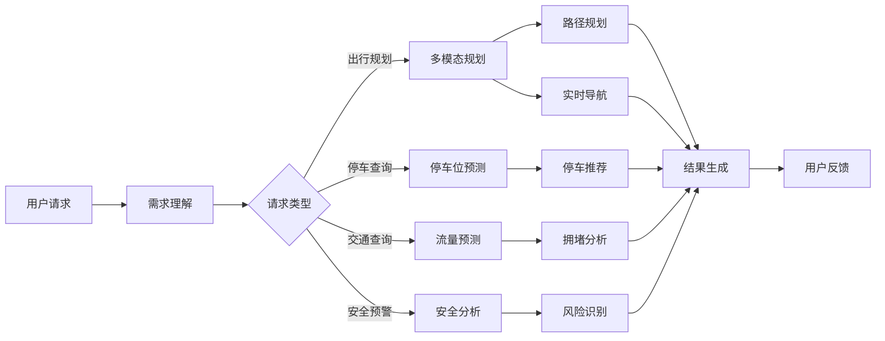
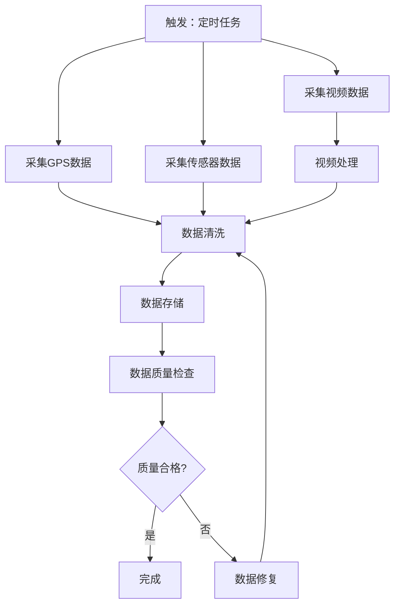
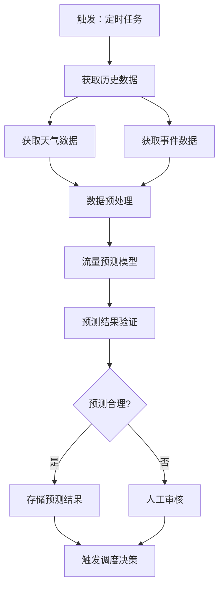
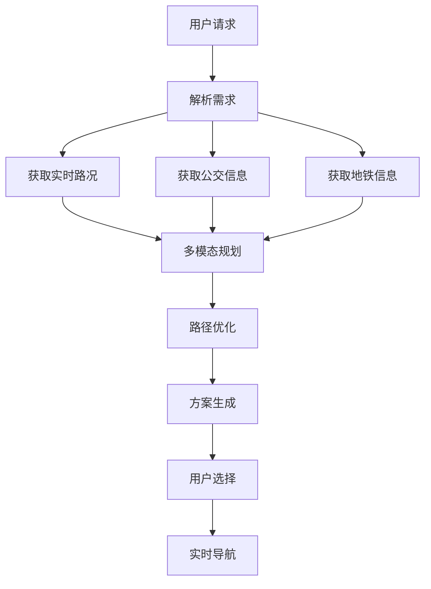
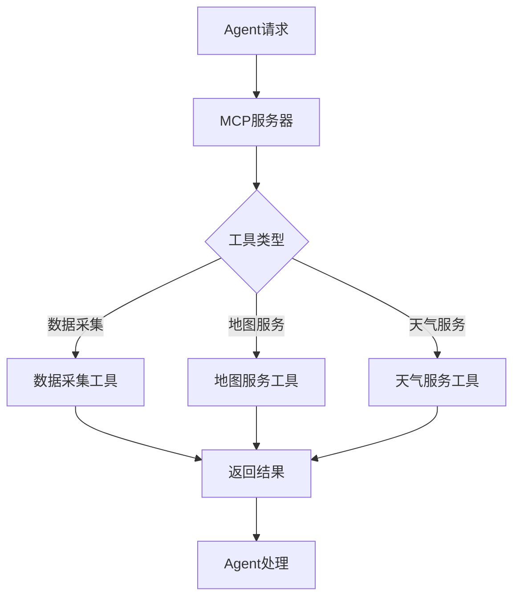

# 5. 智能体与业务编排

## 5.1 Agent技能链

### 技能定义

智能交通Agent需要具备多种技能，通过技能链组合完成复杂任务：

#### 核心技能

**1. 交通数据采集技能（Traffic Data Collection）**
- **功能**：采集各类交通数据（GPS、传感器、视频等）
- **输入**：数据源配置
- **输出**：采集的交通数据
- **实现**：基于Kafka、消息队列等工具
- **应用场景**：实时交通数据采集、历史数据导入

**2. 交通流量预测技能（Traffic Flow Prediction）**
- **功能**：预测未来交通流量和拥堵情况
- **输入**：历史交通数据、天气数据、事件数据
- **输出**：交通流量预测结果（时间序列）
- **实现**：基于LSTM、Transformer等时序预测模型
- **应用场景**：交通调度、拥堵预警、出行规划

**3. 路径规划技能（Route Planning）**
- **功能**：规划最优出行路径
- **输入**：起点、终点、优化目标、约束条件
- **输出**：最优路径规划结果
- **实现**：基于Dijkstra、A*、遗传算法等图算法
- **应用场景**：导航规划、物流配送、车辆调度

**4. 信号优化技能（Signal Optimization）**
- **功能**：优化交通信号配时方案
- **输入**：实时交通流量、历史配时方案
- **输出**：优化的信号配时方案
- **实现**：基于强化学习、优化算法
- **应用场景**：交通信号控制、路口优化

**5. 停车位预测技能（Parking Space Prediction）**
- **功能**：预测未来停车位可用情况
- **输入**：历史停车数据、实时交通数据、天气数据
- **输出**：停车位预测结果
- **实现**：基于时序预测模型、机器学习模型
- **应用场景**：停车位推荐、停车导航、停车管理

**6. 多模态出行规划技能（Multimodal Trip Planning）**
- **功能**：规划多模态出行方案（驾车、公交、地铁、共享单车等）
- **输入**：起点、终点、出行偏好、实时交通信息
- **输出**：多模态出行方案
- **实现**：基于多目标优化算法、推荐算法
- **应用场景**：出行规划、个性化推荐、出行服务

**7. 安全预警技能（Safety Warning）**
- **功能**：识别交通安全风险，提前预警
- **输入**：视频数据、传感器数据、历史事故数据
- **输出**：安全预警结果（风险等级、预警信息）
- **实现**：基于计算机视觉模型、异常检测算法
- **应用场景**：事故预警、风险识别、应急响应

**8. 车辆识别技能（Vehicle Recognition）**
- **功能**：识别车辆类型、车牌号、车辆行为
- **输入**：视频图像、图像数据
- **输出**：车辆识别结果（车辆类型、车牌号、行为分析）
- **实现**：基于YOLO、DeepSORT等计算机视觉模型
- **应用场景**：交通监控、车辆管理、违法检测

**9. 交通分析技能（Traffic Analysis）**
- **功能**：分析交通状况，生成分析报告
- **输入**：交通数据、分析需求
- **输出**：交通分析报告
- **实现**：基于大语言模型、数据分析工具
- **应用场景**：交通分析、决策支持、报告生成

**10. 实时导航技能（Real-time Navigation）**
- **功能**：提供实时导航服务，动态调整路线
- **输入**：当前位置、目的地、实时路况
- **输出**：实时导航指令
- **实现**：基于路径规划算法、实时路况更新
- **应用场景**：导航服务、路线调整、出行引导

### 技能链设计

技能链按照业务流程组织，形成完整的处理流程：



#### 标准技能链

**交通调度链**：
1. 数据采集 → 2. 流量预测 → 3. 拥堵分析 → 4. 信号优化 → 5. 调度决策 → 6. 执行调度 → 7. 效果监控

**出行规划链**：
1. 需求输入 → 2. 数据收集 → 3. 多模态规划 → 4. 路径优化 → 5. 方案生成 → 6. 实时导航 → 7. 动态调整

**停车管理链**：
1. 停车查询 → 2. 车位预测 → 3. 停车推荐 → 4. 导航引导 → 5. 停车确认 → 6. 费用结算

**安全预警链**：
1. 数据采集 → 2. 异常检测 → 3. 风险识别 → 4. 预警生成 → 5. 应急响应 → 6. 效果评估

**实现示例**：
```python
from langchain.agents import AgentExecutor, create_react_agent
from langchain.tools import Tool

# 定义工具
tools = [
    Tool(
        name="traffic_data_collection",
        func=traffic_data_collection_skill,
        description="采集交通数据（GPS、传感器、视频等）"
    ),
    Tool(
        name="traffic_flow_prediction",
        func=traffic_flow_prediction_skill,
        description="预测未来交通流量和拥堵情况"
    ),
    Tool(
        name="route_planning",
        func=route_planning_skill,
        description="规划最优出行路径"
    ),
    Tool(
        name="signal_optimization",
        func=signal_optimization_skill,
        description="优化交通信号配时方案"
    ),
    Tool(
        name="parking_space_prediction",
        func=parking_space_prediction_skill,
        description="预测未来停车位可用情况"
    ),
    Tool(
        name="multimodal_trip_planning",
        func=multimodal_trip_planning_skill,
        description="规划多模态出行方案"
    ),
    Tool(
        name="safety_warning",
        func=safety_warning_skill,
        description="识别交通安全风险，提前预警"
    ),
]
```

## 5.2 n8n工作流编排

### 工作流设计

#### 交通数据采集工作流

**流程设计**：


**n8n配置**：
```json
{
  "name": "交通数据采集工作流",
  "nodes": [
    {
      "name": "定时触发",
      "type": "n8n-nodes-base.cron",
      "parameters": {
        "rule": {
          "interval": [{"field": "minutes", "minutesInterval": 1}]
        }
      }
    },
    {
      "name": "采集GPS数据",
      "type": "n8n-nodes-base.httpRequest",
      "parameters": {
        "url": "http://gps-api/traffic-data",
        "method": "GET"
      }
    },
    {
      "name": "数据清洗",
      "type": "n8n-nodes-base.function",
      "parameters": {
        "functionCode": "// 数据清洗逻辑"
      }
    },
    {
      "name": "数据存储",
      "type": "n8n-nodes-base.postgres",
      "parameters": {
        "operation": "insert",
        "table": "traffic_data"
      }
    }
  ],
  "connections": {
    "定时触发": {
      "main": [[{"node": "采集GPS数据"}]]
    }
  }
}
```

#### 交通流量预测工作流

**流程设计**：


#### 出行规划工作流

**流程设计**：


## 5.3 Dify智能体编排

### 智能体定义

#### 交通流量预测智能体

**智能体配置**：
```yaml
agent_name: "交通流量预测智能体"
description: "预测未来交通流量和拥堵情况"
model: "gpt-4"
tools:
  - traffic_data_collection
  - weather_data_collection
  - traffic_flow_prediction
  - result_validation
prompt_template: |
  你是一个交通流量预测专家。
  
  任务：预测未来{time_horizon}的交通流量
  
  步骤：
  1. 收集历史交通数据
  2. 收集天气数据
  3. 收集特殊事件数据
  4. 使用预测模型进行预测
  5. 验证预测结果的合理性
  6. 生成预测报告
```

#### 路径规划智能体

**智能体配置**：
```yaml
agent_name: "路径规划智能体"
description: "规划最优出行路径"
model: "gpt-4"
tools:
  - route_planning
  - real_time_traffic
  - traffic_analysis
  - navigation_guidance
prompt_template: |
  你是一个路径规划专家。
  
  任务：规划从{origin}到{destination}的最优路径
  
  步骤：
  1. 获取实时路况信息
  2. 分析交通状况
  3. 规划最优路径
  4. 提供实时导航指引
  5. 根据路况变化动态调整路线
```

#### 停车管理智能体

**智能体配置**：
```yaml
agent_name: "停车管理智能体"
description: "预测停车位可用情况，推荐最优停车位"
model: "gpt-4"
tools:
  - parking_space_prediction
  - parking_data_collection
  - navigation_guidance
  - payment_processing
prompt_template: |
  你是一个停车管理专家。
  
  任务：为用户推荐最优停车位
  
  步骤：
  1. 预测目标区域停车位可用情况
  2. 分析用户需求和偏好
  3. 推荐最优停车位
  4. 提供导航指引
  5. 处理停车费用结算
```

## 5.4 MCP工具集成

### MCP服务器配置

#### 交通数据采集MCP服务器

**服务器配置**：
```python
from mcp.server import MCPServer
from mcp.tools import Tool

server = MCPServer("traffic-data-collection-server")

@server.tool()
def collect_gps_data(vehicle_id: str, time_range: dict) -> dict:
    """采集GPS数据"""
    # 实现GPS数据采集逻辑
    pass

@server.tool()
def collect_sensor_data(sensor_id: str, time_range: dict) -> dict:
    """采集传感器数据"""
    # 实现传感器数据采集逻辑
    pass

@server.tool()
def collect_video_data(camera_id: str, time_range: dict) -> dict:
    """采集视频数据"""
    # 实现视频数据采集逻辑
    pass
```

#### 地图服务MCP服务器

**服务器配置**：
```python
from mcp.server import MCPServer

server = MCPServer("map-service-server")

@server.tool()
def get_route(origin: str, destination: str, options: dict) -> dict:
    """获取路径规划"""
    # 调用地图API获取路径
    pass

@server.tool()
def get_real_time_traffic(road_id: str) -> dict:
    """获取实时路况"""
    # 调用地图API获取实时路况
    pass

@server.tool()
def geocode(address: str) -> dict:
    """地理编码"""
    # 调用地图API进行地理编码
    pass
```

#### 天气服务MCP服务器

**服务器配置**：
```python
from mcp.server import MCPServer

server = MCPServer("weather-service-server")

@server.tool()
def get_weather(location: str, date: str = None) -> dict:
    """获取天气信息"""
    # 调用天气API获取天气信息
    pass

@server.tool()
def get_weather_forecast(location: str, days: int = 7) -> dict:
    """获取天气预报"""
    # 调用天气API获取天气预报
    pass
```

### 工具调用流程



## 5.5 业务流程自动化

### 自动化场景

#### 场景1：自动交通调度

**触发条件**：交通流量超过阈值或拥堵指数超过阈值

**自动化流程**：
1. 检测到交通异常
2. 自动触发流量预测
3. 自动生成调度方案
4. 自动执行信号调整
5. 自动监控调度效果
6. 根据效果自动优化

#### 场景2：自动停车管理

**触发条件**：用户查询停车位或到达目标区域

**自动化流程**：
1. 用户查询停车位
2. 自动预测停车位可用情况
3. 自动推荐最优停车位
4. 自动提供导航指引
5. 用户到达后自动确认
6. 用户离开后自动结算

#### 场景3：自动安全预警

**触发条件**：检测到异常行为或风险事件

**自动化流程**：
1. 检测到异常行为
2. 自动分析风险等级
3. 自动生成预警信息
4. 自动通知相关人员
5. 自动启动应急响应
6. 自动记录处理结果

