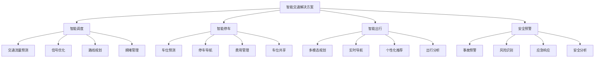
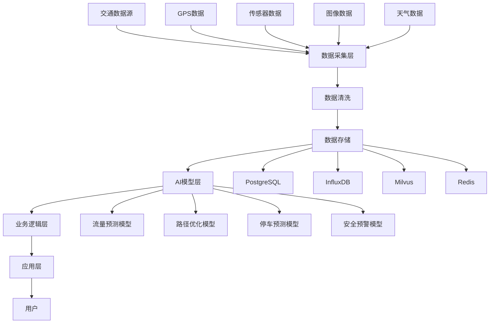

# 2. 总体架构

## 2.1 业务架构

### 角色定义

智能交通解决方案涉及多个角色，每个角色有不同的职责和权限：

- **交通调度员**：
  - 职责：使用智能调度系统进行交通流量管理、信号控制、路线优化
  - 权限：访问交通数据，使用调度工具，配置调度规则
  - 使用场景：日常交通调度，高峰期管理，应急响应

- **停车管理员**：
  - 职责：使用智能停车系统进行车位管理、收费管理、用户服务
  - 权限：访问停车数据，使用管理工具，配置停车规则
  - 使用场景：车位管理，收费管理，用户服务

- **出行规划师**：
  - 职责：使用智能出行系统进行路线规划、多模态融合、个性化推荐
  - 权限：访问出行数据，使用规划工具，配置规划规则
  - 使用场景：路线规划，出行推荐，服务优化

- **安全监控员**：
  - 职责：使用智能安全系统进行事故预警、风险识别、应急响应
  - 权限：访问安全数据，使用监控工具，配置预警规则
  - 使用场景：安全监控，事故预警，应急响应

- **系统管理员**：
  - 职责：管理系统配置，监控系统运行，处理系统故障
  - 权限：系统配置，用户管理，监控告警
  - 使用场景：系统维护，用户管理，故障处理

### 用例分析

#### 用例1：智能交通调度

**参与者**：交通调度员、调度系统、AI调度引擎

**前置条件**：
- 交通调度员已登录系统
- 交通数据已接入
- 调度规则已配置

**主流程**：
1. 交通调度员查看实时交通流量和拥堵情况
2. AI模型分析交通流量，预测未来15-30分钟交通状况
3. 系统根据预测结果，自动优化信号配时方案
4. 系统生成调度建议（包括信号调整、路线推荐等）
5. 交通调度员审核建议，确认或调整调度方案
6. 系统执行调度方案，实时监控效果
7. 根据效果反馈，持续优化调度方案

**异常流程**：
- 如果AI预测置信度低，转人工决策
- 如果发现异常交通状况，立即告警
- 如果系统故障，启用降级模式，使用固定配时方案

**后置条件**：
- 调度方案已执行
- 交通流量已优化
- 调度效果已记录

#### 用例2：智能停车管理

**参与者**：停车管理员、停车系统、用户

**前置条件**：
- 停车管理员已登录系统
- 停车位数据已接入
- 用户已注册

**主流程**：
1. 用户查询目的地附近可用停车位
2. 系统预测未来30分钟停车位可用情况
3. 系统推荐最优停车位和导航路线
4. 用户选择停车位，系统锁定车位
5. 用户到达停车场，系统自动识别车辆
6. 用户停车，系统开始计时计费
7. 用户离开，系统自动结算费用

**异常流程**：
- 如果预测不准确，用户找不到车位，系统推荐备选方案
- 如果系统故障，启用人工管理模式
- 如果用户未按时到达，系统自动释放车位

**后置条件**：
- 停车位已分配
- 费用已结算
- 停车记录已保存

#### 用例3：智能出行规划

**参与者**：出行规划师、出行系统、用户

**前置条件**：
- 出行规划师已登录系统
- 实时路况数据已接入
- 用户已注册

**主流程**：
1. 用户输入出发地和目的地
2. 系统收集实时路况、公交信息、地铁信息等
3. AI模型分析多模态出行方案（驾车、公交、地铁、共享单车等）
4. 系统生成个性化出行方案（考虑时间、成本、舒适度等）
5. 用户选择出行方案，系统提供实时导航
6. 系统实时监控路况变化，动态调整路线
7. 用户到达目的地，系统记录出行数据

**异常流程**：
- 如果路况变化，系统自动调整路线
- 如果公交延误，系统推荐备选方案
- 如果用户偏离路线，系统重新规划

**后置条件**：
- 出行方案已生成
- 用户已到达目的地
- 出行数据已记录

### 故事地图

智能交通解决方案的用户故事地图如下：

## 2.2 技术架构

### AI-Native四层架构

智能交通解决方案采用AI-Native四层架构，从下到上包括基础设施层、模型层、编排层和应用层。

#### 应用层

**1. Web管理平台**
- **功能**：交通调度管理、停车管理、出行服务管理、安全监控
- **技术栈**：Vue 3 + TypeScript + Vite + TailwindCSS
- **用户**：交通调度员、停车管理员、出行规划师、安全监控员

**2. 移动端应用**
- **功能**：出行规划、停车查询、实时导航、安全预警
- **技术栈**：React Native / Flutter
- **用户**：普通用户、司机、乘客

**3. API网关**
- **功能**：API路由、认证授权、限流熔断、日志记录
- **技术栈**：Kong / Nginx + Lua
- **特点**：支持RESTful API和GraphQL

#### 编排层

**1. n8n工作流引擎**
- **功能**：业务流程编排、数据流转、任务调度
- **应用场景**：
  - 交通数据采集和处理流程
  - 停车位预测和分配流程
  - 出行规划生成流程
  - 安全预警触发流程

**2. Dify智能体编排**
- **功能**：AI Agent编排、多模型路由、工具调用
- **应用场景**：
  - 交通流量预测Agent
  - 路径优化Agent
  - 停车位预测Agent
  - 安全预警Agent

**3. MCP服务器**
- **功能**：工具集成、数据访问、外部服务调用
- **集成工具**：
  - 交通数据采集工具
  - 地图服务工具（高德、百度）
  - 天气服务工具
  - 支付服务工具

#### 模型层

**1. 大语言模型（LLM）**
- **GPT-4**：复杂交通分析和决策
- **Claude 3**：长文本交通报告生成
- **通义千问**：中文交通场景理解
- **本地模型**：数据安全要求高的场景

**2. 时序预测模型**
- **LSTM/GRU**：交通流量预测
- **Transformer**：长期交通趋势预测
- **Prophet**：节假日和特殊事件预测

**3. 图算法模型**
- **Dijkstra算法**：最短路径规划
- **A*算法**：启发式路径搜索
- **遗传算法**：多目标路径优化
- **强化学习**：动态路径规划

**4. 计算机视觉模型**
- **目标检测**：车辆识别、行人识别
- **语义分割**：道路分割、车道识别
- **行为分析**：异常行为识别、事故检测

**5. Embedding模型**
- **OpenAI text-embedding-3-large**：高质量向量检索
- **交通领域微调模型**：交通场景语义理解

#### 基础设施层

**1. 计算资源**
- **CPU服务器**：API服务、业务逻辑处理
- **GPU服务器**：AI模型推理、图像处理
- **边缘计算节点**：实时数据处理、低延迟响应

**2. 存储资源**
- **关系数据库（PostgreSQL）**：结构化数据存储
- **时序数据库（InfluxDB）**：交通流量数据存储
- **向量数据库（Milvus/Qdrant）**：交通场景向量检索
- **对象存储（MinIO/S3）**：图像和视频存储
- **缓存（Redis）**：热点数据缓存

**3. 消息队列**
- **Kafka**：大规模数据流处理
- **RabbitMQ**：任务队列和消息传递

**4. 监控和日志**
- **Prometheus**：指标监控
- **Grafana**：可视化展示
- **ELK Stack**：日志收集和分析

### 数据流架构

### 部署架构

#### 部署模式

**1. 云端部署**
- **优势**：弹性扩展、成本可控、维护方便
- **适用场景**：大部分业务场景
- **部署方式**：Kubernetes集群部署

**2. 边缘部署**
- **优势**：低延迟、数据本地化
- **适用场景**：实时性要求高的场景（信号控制、安全预警）
- **部署方式**：边缘计算节点部署

**3. 混合部署**
- **优势**：兼顾云端和边缘优势
- **适用场景**：复杂业务场景
- **部署方式**：云端+边缘协同部署

#### 高可用架构

**1. 服务高可用**
- **负载均衡**：Nginx/Kong负载均衡
- **服务冗余**：多实例部署，自动故障转移
- **健康检查**：定期健康检查，自动剔除故障节点

**2. 数据高可用**
- **主从复制**：数据库主从复制，读写分离
- **数据备份**：定期数据备份，支持快速恢复
- **分布式存储**：数据分片存储，提高可用性

**3. 容灾备份**
- **异地备份**：数据异地备份，防止单点故障
- **故障切换**：自动故障切换，保证服务连续性
- **数据恢复**：快速数据恢复，最小化业务影响

