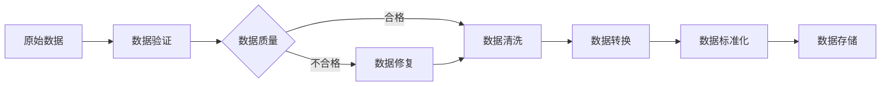
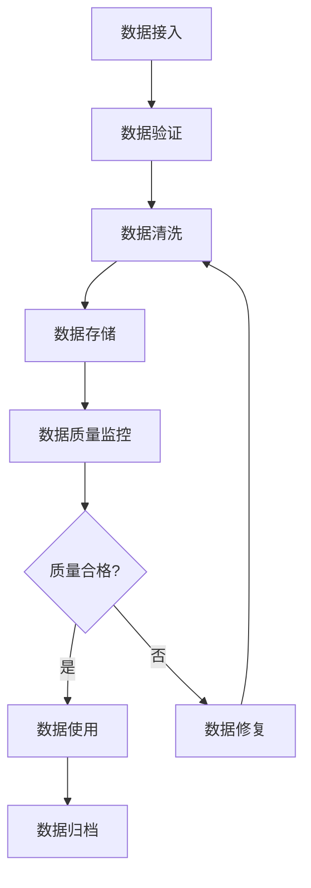

# 3. 数据与知识治理

## 3.1 私有数据接入

### 数据源类型

智能交通解决方案需要接入多种类型的交通数据源：

#### 交通流量数据

**1. GPS轨迹数据**
- **数据来源**：车辆GPS设备、手机定位、导航应用
- **数据格式**：JSON格式（经纬度、时间戳、速度、方向）
- **更新频率**：实时更新（1-5秒间隔）
- **数据量**：每天数千万条轨迹数据
- **关键字段**：vehicle_id、timestamp、latitude、longitude、speed、direction、road_id

**2. 交通传感器数据**
- **数据来源**：地磁传感器、微波传感器、视频检测器
- **数据格式**：结构化数据（车辆数、速度、占有率）
- **更新频率**：实时更新（30秒-1分钟间隔）
- **数据量**：每天数百万条传感器数据
- **关键字段**：sensor_id、timestamp、vehicle_count、speed、occupancy、lane_id

**3. 卡口数据**
- **数据来源**：电子警察、卡口系统
- **数据格式**：结构化数据（车牌号、通过时间、车型）
- **更新频率**：实时更新
- **数据量**：每天数千万条卡口数据
- **关键字段**：plate_number、timestamp、vehicle_type、location、direction

#### 停车数据

**4. 停车位数据**
- **数据来源**：地磁传感器、视频识别、人工上报
- **数据格式**：结构化数据（车位ID、状态、位置）
- **更新频率**：实时更新（车位状态变化时）
- **数据量**：每天数百万条停车位状态数据
- **关键字段**：parking_space_id、status、location、parking_lot_id、timestamp

**5. 停车交易数据**
- **数据来源**：停车收费系统、移动支付
- **数据格式**：结构化数据（交易记录）
- **更新频率**：实时更新
- **数据量**：每天数十万条交易数据
- **关键字段**：transaction_id、parking_space_id、start_time、end_time、fee、payment_method

#### 出行数据

**6. 公交数据**
- **数据来源**：公交GPS系统、IC卡系统
- **数据格式**：结构化数据（车辆位置、到站时间、乘客数）
- **更新频率**：实时更新（10-30秒间隔）
- **数据量**：每天数百万条公交数据
- **关键字段**：bus_id、route_id、timestamp、latitude、longitude、passenger_count、next_stop

**7. 地铁数据**
- **数据来源**：地铁AFC系统、车辆定位系统
- **数据格式**：结构化数据（进出站记录、车辆位置）
- **更新频率**：实时更新
- **数据量**：每天数千万条地铁数据
- **关键字段**：transaction_id、station_id、timestamp、line_id、direction、passenger_count

**8. 共享单车数据**
- **数据来源**：共享单车GPS系统、APP数据
- **数据格式**：结构化数据（车辆位置、使用状态）
- **更新频率**：实时更新（30秒-1分钟间隔）
- **数据量**：每天数千万条共享单车数据
- **关键字段**：bike_id、timestamp、latitude、longitude、status、user_id

#### 安全数据

**9. 视频监控数据**
- **数据来源**：交通摄像头、监控系统
- **数据格式**：视频流、图像文件
- **更新频率**：实时流式传输
- **数据量**：每天数TB视频数据
- **关键字段**：camera_id、timestamp、video_url、image_url、location、direction

**10. 事故数据**
- **数据来源**：交警部门、保险公司、用户上报
- **数据格式**：结构化数据（事故记录）
- **更新频率**：按需更新
- **数据量**：每天数千条事故数据
- **关键字段**：accident_id、timestamp、location、accident_type、severity、description

#### 环境数据

**11. 天气数据**
- **数据来源**：气象局API、天气服务商
- **数据格式**：结构化数据（天气状况、温度、降水）
- **更新频率**：每小时更新
- **数据量**：每天数千条天气数据
- **关键字段**：location、timestamp、weather、temperature、precipitation、wind_speed

**12. 路况数据**
- **数据来源**：地图服务商、交通管理部门
- **数据格式**：结构化数据（路况等级、拥堵指数）
- **更新频率**：实时更新（5-10分钟间隔）
- **数据量**：每天数百万条路况数据
- **关键字段**：road_id、timestamp、traffic_level、congestion_index、speed_limit

### 数据接入流程

#### 数据接入步骤

**步骤1：数据源识别和评估**
- 识别数据源类型和格式
- 评估数据质量和完整性
- 评估数据更新频率和延迟
- 评估数据安全性和合规性

**步骤2：数据接入方案设计**
- 设计数据接入架构
- 选择数据接入技术（API、消息队列、文件传输等）
- 设计数据格式转换方案
- 设计数据验证和清洗方案

**步骤3：数据接入开发**
- 开发数据接入接口
- 实现数据格式转换
- 实现数据验证和清洗
- 实现错误处理和重试机制

**步骤4：数据接入测试**
- 测试数据接入功能
- 测试数据质量和完整性
- 测试数据更新频率和延迟
- 测试错误处理和恢复机制

**步骤5：数据接入上线**
- 部署数据接入服务
- 配置监控和告警
- 进行数据接入验证
- 持续监控和优化

### 数据接入技术

#### API接入

**RESTful API**
- **适用场景**：实时数据查询、小批量数据获取
- **技术实现**：HTTP/HTTPS协议，JSON格式
- **优势**：简单易用、标准化、支持实时查询
- **劣势**：不适合大批量数据传输

**GraphQL API**
- **适用场景**：复杂数据查询、多数据源聚合
- **技术实现**：GraphQL协议，支持灵活查询
- **优势**：灵活查询、减少数据传输
- **劣势**：复杂度较高、需要额外开发

#### 消息队列接入

**Kafka**
- **适用场景**：大规模实时数据流、高吞吐量场景
- **技术实现**：Kafka消息队列，支持流式处理
- **优势**：高吞吐量、低延迟、支持流式处理
- **劣势**：运维复杂度较高

**RabbitMQ**
- **适用场景**：中小规模数据流、任务队列
- **技术实现**：RabbitMQ消息队列，支持多种消息模式
- **优势**：易用性好、功能丰富、可靠性高
- **劣势**：吞吐量相对较低

#### 文件传输接入

**FTP/SFTP**
- **适用场景**：批量数据传输、历史数据导入
- **技术实现**：FTP/SFTP协议，文件传输
- **优势**：简单可靠、支持大文件传输
- **劣势**：实时性较差、需要定时任务

**对象存储**
- **适用场景**：大规模文件存储、数据归档
- **技术实现**：S3/MinIO对象存储，支持批量上传
- **优势**：可扩展性好、成本低、支持批量操作
- **劣势**：实时性较差

## 3.2 数据清洗与预处理

### 数据清洗规则

#### GPS数据清洗

**1. 异常值过滤**
- **漂移点过滤**：过滤速度异常的点（速度&gt;200km/h）
- **位置异常过滤**：过滤位置明显异常的点（超出城市范围）
- **时间异常过滤**：过滤时间戳异常的点（时间倒流、时间跳跃）

**2. 数据补全**
- **缺失值补全**：使用插值方法补全缺失的GPS点
- **轨迹平滑**：使用卡尔曼滤波等方法平滑轨迹数据

**3. 数据标准化**
- **坐标系转换**：统一坐标系（WGS84、GCJ02、BD09）
- **时间标准化**：统一时区（UTC、本地时间）

#### 传感器数据清洗

**1. 异常值处理**
- **数值范围检查**：检查传感器数值是否在合理范围内
- **突变检测**：检测传感器数值的异常突变
- **缺失值处理**：处理传感器数据缺失的情况

**2. 数据校准**
- **传感器校准**：校准传感器偏差
- **数据归一化**：归一化传感器数据，便于后续处理

#### 图像数据清洗

**1. 图像质量检查**
- **清晰度检查**：检查图像清晰度，过滤模糊图像
- **亮度检查**：检查图像亮度，过滤过暗或过亮的图像
- **遮挡检查**：检查图像是否被遮挡

**2. 图像预处理**
- **去噪处理**：去除图像噪声
- **增强处理**：增强图像对比度和清晰度
- **格式转换**：统一图像格式（JPEG、PNG）

### 数据预处理流程

## 3.3 知识库构建

### 交通知识库

#### 道路网络知识库

**1. 道路基础信息**
- **道路ID**：唯一标识
- **道路名称**：道路名称
- **道路等级**：高速公路、城市快速路、主干道、次干道、支路
- **道路长度**：道路长度（米）
- **车道数**：车道数量
- **限速**：限速值（km/h）

**2. 道路拓扑关系**
- **起点和终点**：道路起点和终点坐标
- **连接关系**：与其他道路的连接关系
- **路口信息**：路口位置和类型

**3. 道路属性**
- **道路类型**：城市道路、高速公路、国道、省道
- **道路状态**：正常、施工、封闭
- **收费信息**：是否收费、收费标准

#### 交通规则知识库

**1. 交通信号规则**
- **信号灯类型**：红绿灯、黄灯、左转灯、右转灯
- **信号配时**：各信号灯的配时方案
- **信号规则**：不同信号下的通行规则

**2. 交通标志规则**
- **标志类型**：禁令标志、指示标志、警告标志
- **标志含义**：各标志的具体含义
- **标志位置**：标志所在位置

**3. 交通法规**
- **交通法规条文**：相关交通法规条文
- **违法处罚**：违法行为的处罚标准
- **特殊规定**：特殊路段和时间的规定

#### 历史交通知识库

**1. 历史交通流量**
- **时间序列数据**：历史交通流量时间序列
- **周期性规律**：工作日、周末、节假日的交通规律
- **特殊事件影响**：大型活动、恶劣天气等对交通的影响

**2. 历史事故数据**
- **事故记录**：历史事故记录
- **事故原因**：事故原因分析
- **事故高发路段**：事故高发路段和时间

**3. 历史停车数据**
- **停车位使用情况**：历史停车位使用情况
- **停车规律**：不同时间段和地点的停车规律
- **停车热点**：停车热点区域和时间

### 知识库构建流程

**步骤1：知识抽取**
- 从交通数据中抽取知识
- 从交通规则文档中抽取知识
- 从专家经验中抽取知识

**步骤2：知识表示**
- 使用知识图谱表示交通知识
- 使用向量表示交通场景
- 使用规则表示交通规则

**步骤3：知识存储**
- 存储到图数据库（Neo4j）
- 存储到向量数据库（Milvus）
- 存储到关系数据库（PostgreSQL）

**步骤4：知识更新**
- 定期更新知识库
- 根据新数据更新知识
- 根据专家反馈更新知识

## 3.4 数据质量保障

### 数据质量指标

#### 完整性指标

- **数据完整率**：目标≥95%，实际数据完整率
- **字段完整率**：各字段的完整率
- **时间序列完整率**：时间序列数据的完整率

#### 准确性指标

- **数据准确率**：目标≥95%，实际数据准确率
- **GPS定位准确率**：GPS定位准确率（误差&lt;10米）
- **传感器数据准确率**：传感器数据准确率

#### 及时性指标

- **数据延迟**：目标≤30秒，实际数据延迟
- **数据更新频率**：数据更新频率是否符合要求
- **实时性**：实时数据的及时性

#### 一致性指标

- **数据格式一致性**：数据格式是否一致
- **数据标准一致性**：数据标准是否一致
- **数据来源一致性**：数据来源是否一致

### 数据质量监控

#### 实时监控

- **数据质量仪表盘**：实时展示数据质量指标
- **异常告警**：数据质量异常时自动告警
- **质量报告**：定期生成数据质量报告

#### 质量评估

- **质量评分**：对数据源进行质量评分
- **质量排名**：对数据源进行质量排名
- **质量改进**：根据质量评估结果改进数据质量

### 数据治理流程

